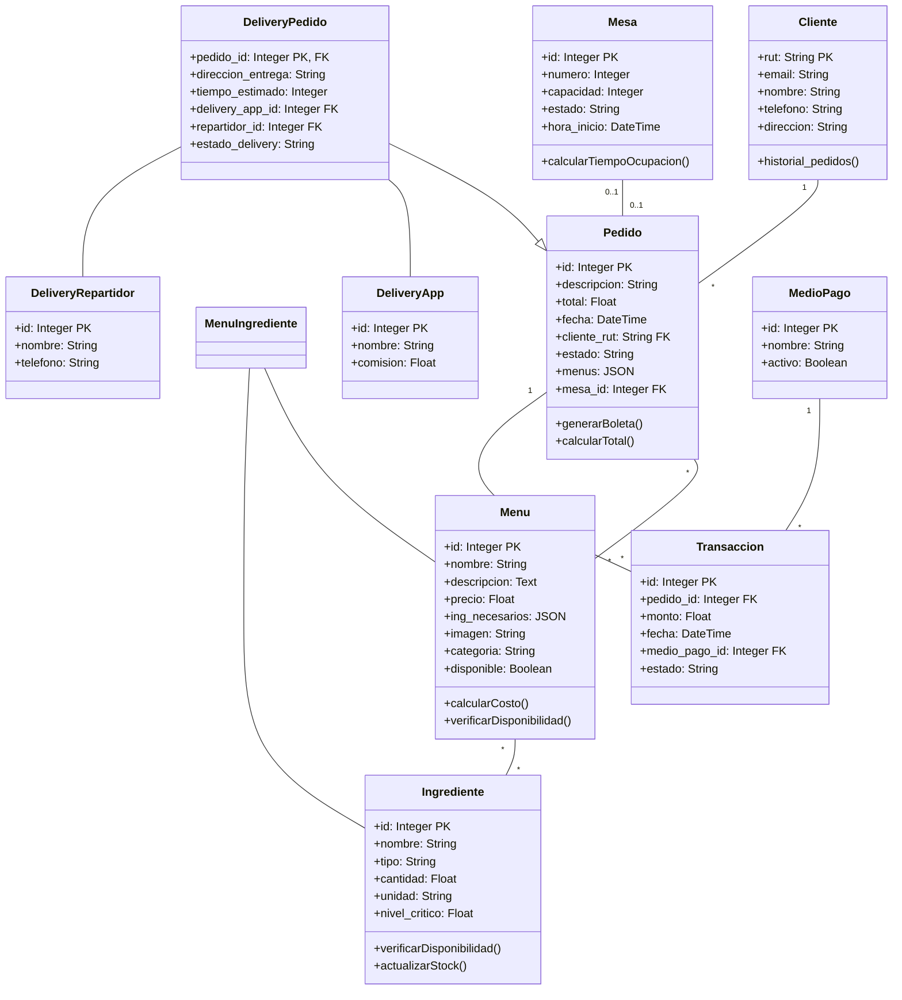
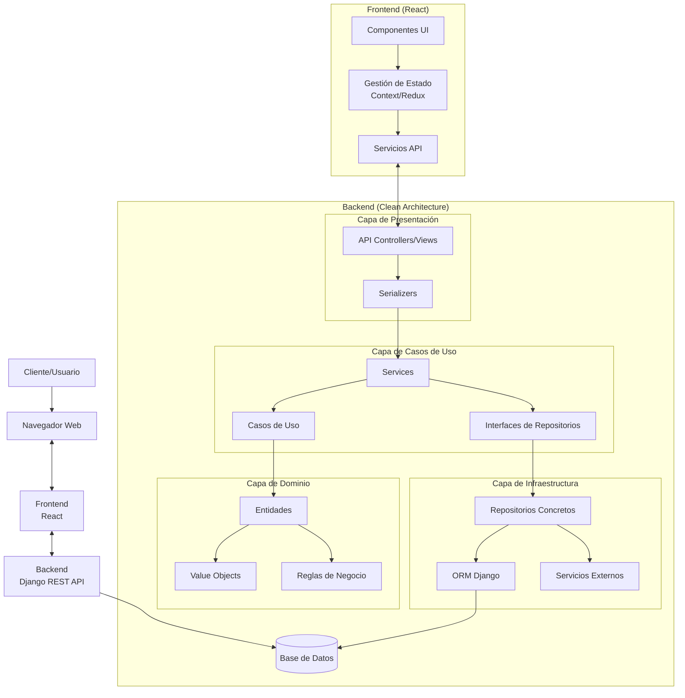

# Especificación de Requisitos de Software (SRS)

**Proyecto:** Sistema de Gestión de Clientes y Pedidos en un Restaurante  
**Versión:** 1.0  
**Fecha:** Octubre 2023  
**Autor:** Equipo de Desarrollo

---

## 1. Introducción

### 1.1 Propósito

Este documento tiene como objetivo definir y documentar de forma clara y detallada los requisitos del Sistema de Gestión de Clientes y Pedidos en un Restaurante. Servirá como base para la planificación, diseño, desarrollo, validación y mantenimiento del sistema, dirigido a desarrolladores, evaluadores y stakeholders del proyecto.

### 1.2 Alcance

El sistema es una aplicación web destinada a modernizar la gestión operativa de restaurantes, migrando de una solución actual de escritorio (Python + customtkinter) a una plataforma web moderna (React + Django). El sistema permitirá:

* Gestionar clientes y sus pedidos.
* Administrar inventario de ingredientes.
* Crear y actualizar menús vinculados a los ingredientes disponibles.
* Gestionar mesas y tiempos de ocupación.
* Generar reportes analíticos para la toma de decisiones.

---

## 2. Descripción General

### 2.1 Perspectiva del Producto

El sistema es una aplicación cliente-servidor distribuida que se integrará a la infraestructura existente del restaurante. Permitirá acceso desde múltiples dispositivos y ubicaciones, optimizando la operación diaria y mejorando la experiencia del cliente.

### 2.2 Funcionalidad del Producto

El sistema permitirá:

* Registro y actualización de clientes, ingredientes, menús y pedidos.
* Gestión visual de mesas y tiempos de ocupación.
* Generación de reportes analíticos en tiempo real.
* Integración con servicios externos como plataformas de delivery y sistemas de pago.

### 2.3 Características de los Usuarios

* **Administradores:** Configuración y supervisión general del sistema.
* **Meseros:** Gestión de pedidos y asignación de mesas.
* **Cocina:** Visualización de pedidos en preparación.
* **Gerentes:** Análisis de datos y toma de decisiones estratégicas.

---

## 3. Requisitos Específicos

### 3.1 Requisitos Funcionales (RF)

**RF-1: Gestión de Clientes**  
* **Descripción:** Permitir el registro, edición y eliminación de clientes.  
* **Entrada:** Datos del cliente (nombre, email, teléfono, dirección).  
* **Salida:** Confirmación de la acción o mensaje de error.

**RF-2: Gestión de Inventario**  
* **Descripción:** Registrar y actualizar el stock de ingredientes.  
* **Entrada:** Datos del ingrediente (nombre, tipo, cantidad, unidad).  
* **Salida:** Confirmación de la acción o alerta de stock crítico.

**RF-3: Gestión de Pedidos**  
* **Descripción:** Crear y gestionar pedidos asociados a clientes y mesas.  
* **Entrada:** Selección de menús, cliente y mesa.  
* **Salida:** Confirmación del pedido y generación de boleta.

**RF-4: Gestión de Mesas**  
* **Descripción:** Visualizar y actualizar el estado de las mesas.  
* **Entrada:** Número de mesa, capacidad, estado.  
* **Salida:** Confirmación de la acción o mensaje de error.

**RF-5: Reportes Analíticos**  
* **Descripción:** Generar reportes de ventas, uso de ingredientes y popularidad de menús.  
* **Entrada:** Parámetros de filtro (fecha, categoría, etc.).  
* **Salida:** Reportes en formatos PDF y gráficos interactivos.

### 3.2 Requisitos No Funcionales (RNF)

**RNF-1: Rendimiento**  
El sistema debe ser capaz de procesar un considerable volúmen de datos o de complejidades altas en un tiempo no mayor a 3 segundos.

**RNF-2: Seguridad**  
* Autenticación mediante credenciales y tokens JWT.  
* Encriptación de datos sensibles en la base de datos.  
* Protección contra ataques comunes como SQL Injection.

**RNF-3: Escalabilidad**  
El sistema debe soportar múltiples usuarios simultáneamente sin degradación del rendimiento.  
Debe ser capaz de escalar horizontalmente mediante la adición de servidores.

**RNF-4: Mantenibilidad**  
La arquitectura debe permitir actualizaciones sin afectar la disponibilidad del servicio.  
El código debe estar documentado y seguir estándares de calidad.

**RNF-5: Disponibilidad**  
El sistema debe garantizar una disponibilidad en equipos modernos y antiguo, siendo capaz de ejecutarse en entornos con menores recursos.

**RNF-6: Compatibilidad**  
El sistema debe ser accesible desde navegadores modernos (Chrome, Firefox, Edge, Safari) y dispositivos móviles.  

**RNF-7: Usabilidad**  
La interfaz debe ser intuitiva y accesible para usuarios con conocimientos básicos de tecnología.  

---

## 4. Modelo de Datos

### 4.1 Diagrama Entidad-Relación (MER)

---

## 5. Arquitectura del Sistema

### 5.1 Arquitectura Refactorizada

---

## 6. Planificación del Proyecto

### 6.1 Metodología

El proyecto seguirá la metodología Scrum con un Sprint 0 de 2 semanas y 3 sprints adicionales de 4 semanas cada uno. Las tareas se priorizarán según el backlog proporcionado.

### 6.2 Cronograma

| Sprint   | Objetivo Principal                     | Duración   |
|----------|----------------------------------------|------------|
| Sprint 0 | Análisis y diseño inicial              | 2 semanas  |
| Sprint 1 | Configuración de entornos y desarrollo inicial | 4 semanas  |
| Sprint 2 | Desarrollo de funcionalidades principales | 4 semanas  |
| Sprint 3 | Integración, pruebas y despliegue      | 4 semanas  |

#### Tareas del Sprint 0

1. **Inventariar funcionalidades actuales**  
   - Documentar operaciones CRUD y flujos relacionados con clientes, ingredientes, menús y pedidos.  
   - Identificar los tipos de informes y visualizaciones generados por el sistema actual.

2. **Mapear flujos de trabajo**  
   - Crear diagramas detallados del proceso actual de toma de pedidos y gestión de inventario.

3. **Identificar puntos débiles**  
   - Documentar limitaciones de la interfaz de usuario y problemas de la arquitectura actual.

4. **Definir arquitectura Clean Architecture**  
   - Establecer la estructura de capas (presentación, casos de uso, dominio, infraestructura) para el nuevo sistema.

5. **Diseñar modelos ER**  
   - Crear diagramas entidad-relación para los módulos de delivery y pagos.

6. **Especificar patrones de diseño**  
   - Documentar qué patrones de diseño se implementarán en cada componente del sistema.

7. **Definir herramientas y convenciones**  
   - Seleccionar versiones específicas de Django, React y otras bibliotecas.  
   - Establecer reglas de nomenclatura, estructura y formateo de código.

8. **Planificar migración de datos**  
   - Diseñar una estrategia para migrar los datos del sistema actual al nuevo.

---

## 7. Resultados Esperados

1. Sistema web completo con frontend en React y backend en Django.
2. Gestión automatizada de inventario y mesas.
3. Dashboard analítico con métricas clave.
4. Reducción de errores en pedidos y tiempos de servicio.
5. Incremento en la satisfacción del cliente y la eficiencia operativa.

---

## 8. Límites del Sistema

1. **Alcance del Sistema**  
   - El sistema gestionará únicamente las operaciones internas del restaurante, como inventario, pedidos, menús y mesas.  
   - No incluye funcionalidades de marketing o gestión de redes sociales.

2. **Integración con Servicios Externos**  
   - El sistema se integrará con plataformas de delivery y sistemas de pago, pero no funcionará realmente ni con dinero real ni con las aplicaciones reales.

3. **Acceso de Usuarios**  
   - Solo usuarios autorizados (administradores, meseros, cocina) tendrán acceso al sistema.  
   - No se incluye un portal para clientes finales.

4. **Capacidad de Escalabilidad**  
   - El sistema está diseñado para restaurantes medianos con un máximo de 50 mesas y 200 pedidos diarios.  
   - Para volúmenes mayores, se requerirán ajustes en la infraestructura.

5. **Compatibilidad de Dispositivos**  
   - El sistema será accesible desde navegadores modernos y dispositivos móviles, pero no incluye una aplicación nativa para iOS o Android.

6. **Soporte Multilenguaje**  
   - La primera versión del sistema estará disponible únicamente en español.  
   - La implementación de otros idiomas se considerará en futuras actualizaciones.

7. **Respaldo y Recuperación**  
   - El sistema realizará respaldos automáticos semanales de la base de datos, pero la recuperación de datos deberá ser manual y supervisada por un administrador.

---
