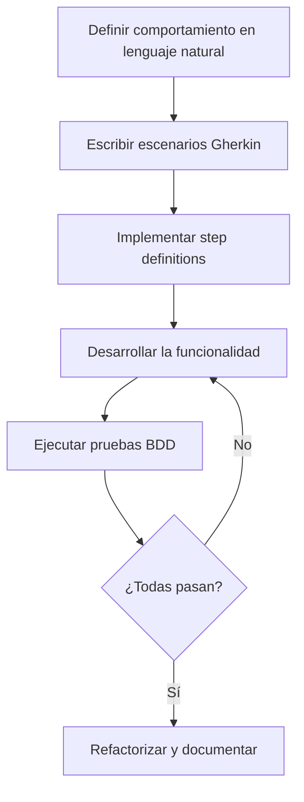
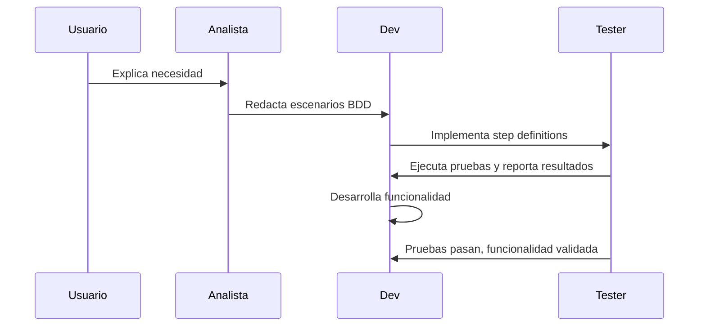

# Desarrollo Guiado por Comportamiento (BDD) en el Sistema de Gestión de Restaurante

## ¿Qué es BDD?
Behavior Driven Development (BDD) es una metodología de desarrollo de software que extiende TDD (Test Driven Development) y se centra en la colaboración entre desarrolladores, testers y stakeholders. BDD utiliza un lenguaje ubicuo y escenarios escritos en lenguaje natural para definir el comportamiento esperado del sistema.

## Características principales de BDD
- **Escenarios en lenguaje natural:** Los requisitos se describen como historias o escenarios comprensibles para todos los involucrados.
- **Colaboración:** Facilita la comunicación entre negocio y desarrollo.
- **Automatización:** Los escenarios se pueden automatizar como pruebas ejecutables.
- **Documentación viva:** Los escenarios sirven como documentación funcional siempre actualizada.
- **Validación de comportamiento:** Se enfoca en el "qué" debe hacer el sistema, no en el "cómo".

## Diagrama de flujo BDD


## ¿Por qué se escogió BDD para este proyecto?
- Permite validar que el sistema cumple los requisitos reales del restaurante.
- Mejora la comunicación entre desarrolladores y usuarios clave.
- Facilita la mantenibilidad y escalabilidad del sistema.
- Los escenarios BDD sirven como documentación funcional y base para futuras expansiones.

## Implementación de BDD en el proyecto

### 1. Definición de escenarios
Los escenarios se escriben en archivos `.feature` usando Gherkin (español):
```gherkin
Escenario: Crear un ingrediente
  Dado que no existe un ingrediente llamado "Tomate"
  Cuando creo un ingrediente con nombre "Tomate", cantidad 10, unidad "kg", categoría "Verdura", nivel crítico 2
  Entonces el ingrediente "Tomate" debe existir en el sistema con cantidad 10 y unidad "kg"
```

### 2. Step definitions en Python
Cada paso del escenario se implementa en Python usando `pytest-bdd`:
```python
@given(parsers.parse('que no existe un ingrediente llamado "{nombre}"'))
def no_existe_ingrediente(nombre, db):
    assert not IngredienteModelo.objects.filter(nombre=nombre).exists()

@when(parsers.parse('creo un ingrediente con nombre "{nombre}", cantidad {cantidad:d}, unidad "{unidad}", categoría "{categoria}", nivel crítico {nivel_critico:d}'))
def crear_ingrediente(nombre, cantidad, unidad, categoria, nivel_critico, db):
    IngredienteModelo.objects.create(nombre=nombre, cantidad=cantidad, unidad_medida=unidad, categoria=categoria, nivel_critico=nivel_critico)

@then(parsers.parse('el ingrediente "{nombre}" debe existir en el sistema con cantidad {cantidad:d} y unidad "{unidad}"'))
def verificar_ingrediente(nombre, cantidad, unidad, db):
    ingrediente = IngredienteModelo.objects.get(nombre=nombre)
    assert ingrediente.cantidad == cantidad
    assert ingrediente.unidad_medida == unidad
```

### 3. Ejecución de pruebas
Las pruebas se ejecutan automáticamente y validan el comportamiento real del sistema.

## Diagrama de integración BDD en el ciclo de desarrollo


---

**Resumen:**
BDD garantiza que el sistema cumple los requisitos funcionales, mejora la comunicación y asegura calidad y mantenibilidad en el tiempo.
