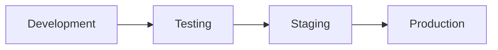

# Documentación CI/CD - Sistema de Gestión de Restaurante

## 📋 Visión General

Este documento describe la implementación de CI/CD (Integración Continua y Despliegue Continuo) para el Sistema de Gestión de Restaurante. **NOTA: Esta funcionalidad está documentada pero NO implementada según las instrucciones del proyecto.**

## 🏗️ Arquitectura CI/CD Propuesta

### Pipeline de Integración Continua (CI)

#### 1. Triggers
- **Push a rama principal**: Ejecuta pipeline completo
- **Pull Requests**: Ejecuta tests y validaciones
- **Push a ramas de feature**: Ejecuta tests básicos
- **Scheduled**: Ejecución nocturna para tests completos

#### 2. Etapas del Pipeline CI

```yaml
# .github/workflows/ci.yml (Ejemplo para GitHub Actions)
name: CI Pipeline
on:
  push:
    branches: [main, backend, frontend]
  pull_request:
    branches: [main]

jobs:
  test-backend:
    runs-on: ubuntu-latest
    services:
      postgres:
        image: postgres:13
        env:
          POSTGRES_PASSWORD: postgres
        options: >-
          --health-cmd pg_isready
          --health-interval 10s
          --health-timeout 5s
          --health-retries 5

    steps:
    - uses: actions/checkout@v2
    
    - name: Setup Python
      uses: actions/setup-python@v2
      with:
        python-version: 3.12
    
    - name: Install Dependencies
      run: |
        cd Sistema_Restaurante
        pip install -r requirements.txt
    
    - name: Run Django Tests
      run: |
        cd Sistema_Restaurante
        python manage.py test
    
    - name: Run BDD Tests
      run: |
        cd Sistema_Restaurante
        python ejecutar_bdd_simple.py
    
    - name: Run Integration Tests
      run: |
        cd Sistema_Restaurante
        python test_integration.py
    
    - name: Lint Code
      run: |
        flake8 Sistema_Restaurante/Backend/
        black --check Sistema_Restaurante/Backend/
    
    - name: Security Scan
      run: |
        bandit -r Sistema_Restaurante/Backend/

  test-frontend:
    runs-on: ubuntu-latest
    steps:
    - uses: actions/checkout@v2
    
    - name: Setup Node.js
      uses: actions/setup-node@v2
      with:
        node-version: '18'
    
    - name: Install Dependencies
      run: |
        cd Sistema_Restaurante/Frontend
        npm install
    
    - name: Build Frontend
      run: |
        cd Sistema_Restaurante/Frontend
        npm run build
    
    - name: Run Frontend Tests
      run: |
        cd Sistema_Restaurante/Frontend
        npm test

  quality-gates:
    needs: [test-backend, test-frontend]
    runs-on: ubuntu-latest
    steps:
    - name: SonarQube Analysis
      # Análisis de calidad de código
      run: echo "SonarQube analysis would run here"
    
    - name: Coverage Report
      # Reporte de cobertura de tests
      run: echo "Coverage analysis would run here"
```

### Pipeline de Despliegue Continuo (CD)

#### 1. Ambientes



**Desarrollo (Development)**
- Despliegue automático en cada commit a rama `develop`
- Base de datos SQLite local
- Configuración de debug habilitada

**Pruebas (Testing)**
- Despliegue automático después de CI exitoso
- Base de datos PostgreSQL de testing
- Ejecución de tests E2E automatizados

**Staging (Preprod)**
- Despliegue manual después de aprobación
- Replica exacta del ambiente de producción
- Datos de producción anonimizados
- Tests de carga y performance

**Producción (Production)**
- Despliegue manual con múltiples aprobaciones
- Estrategia Blue-Green o Rolling deployment
- Monitoreo avanzado y alertas
- Rollback automático en caso de fallos

#### 2. Estrategias de Despliegue

##### Blue-Green Deployment
```yaml
deploy-production:
  runs-on: ubuntu-latest
  environment: production
  steps:
  - name: Deploy to Green Environment
    run: |
      # Desplegar nueva versión en ambiente verde
      kubectl apply -f k8s/green-deployment.yaml
  
  - name: Health Check Green
    run: |
      # Verificar salud del ambiente verde
      ./scripts/health-check.sh green
  
  - name: Switch Traffic to Green
    run: |
      # Cambiar tráfico al ambiente verde
      kubectl patch service restaurant-service -p '{"spec":{"selector":{"version":"green"}}}'
  
  - name: Cleanup Blue Environment
    run: |
      # Limpiar ambiente azul después del éxito
      kubectl delete deployment restaurant-blue
```

## 🔧 Herramientas y Tecnologías

### 1. Control de Versiones
- **Git**: Control de versiones distribuido
- **GitHub/GitLab**: Repositorio remoto y gestión de colaboración
- **Git Flow**: Estrategia de branching

### 2. CI/CD Platform
- **GitHub Actions** (Recomendado para proyectos en GitHub)
- **GitLab CI/CD** (Si se usa GitLab)
- **Jenkins** (Para on-premise)
- **Azure DevOps** (Para ecosistema Microsoft)

### 3. Contenedores y Orquestación
```dockerfile
# Dockerfile para Backend
FROM python:3.12-slim

WORKDIR /app

COPY requirements.txt .
RUN pip install --no-cache-dir -r requirements.txt

COPY . .

EXPOSE 8000

CMD ["python", "manage.py", "runserver", "0.0.0.0:8000"]
```

```dockerfile
# Dockerfile para Frontend
FROM node:18-alpine as build

WORKDIR /app
COPY package*.json ./
RUN npm install

COPY . .
RUN npm run build

FROM nginx:alpine
COPY --from=build /app/dist /usr/share/nginx/html
EXPOSE 80
CMD ["nginx", "-g", "daemon off;"]
```

### 4. Infraestructura como Código
```yaml
# docker-compose.yml para desarrollo
version: '3.8'
services:
  db:
    image: postgres:13
    environment:
      POSTGRES_DB: restaurante
      POSTGRES_USER: postgres
      POSTGRES_PASSWORD: postgres
    volumes:
      - postgres_data:/var/lib/postgresql/data

  backend:
    build: ./Sistema_Restaurante
    ports:
      - "8000:8000"
    depends_on:
      - db
    environment:
      - DATABASE_URL=postgresql://postgres:postgres@db:5432/restaurante

  frontend:
    build: ./Sistema_Restaurante/Frontend
    ports:
      - "3000:80"
    depends_on:
      - backend

volumes:
  postgres_data:
```

## 📊 Métricas y Monitoreo

### 1. Métricas de Pipeline
- **Lead Time**: Tiempo desde commit hasta producción
- **Deployment Frequency**: Frecuencia de despliegues
- **Mean Time to Recovery**: Tiempo promedio de recuperación
- **Change Failure Rate**: Tasa de fallos en cambios

### 2. Monitoring y Alertas
```yaml
# Ejemplo de configuración de alertas
alerts:
  - name: High Error Rate
    condition: error_rate > 5%
    duration: 5m
    actions:
      - slack_notification
      - email_team
      - auto_rollback

  - name: Performance Degradation
    condition: response_time > 2s
    duration: 3m
    actions:
      - slack_notification
      - scale_up_instances

  - name: Database Connection Issues
    condition: db_connections > 80%
    duration: 2m
    actions:
      - email_dba
      - create_incident
```

## 🔒 Seguridad en CI/CD

### 1. Secrets Management
- Variables de entorno encriptadas
- Rotación automática de secrets
- Acceso basado en roles (RBAC)
- Auditoría de accesos

### 2. Security Scanning
```yaml
security-scan:
  steps:
  - name: SAST Scan
    run: bandit -r Backend/
  
  - name: Dependency Scan
    run: safety check -r requirements.txt
  
  - name: Container Scan
    run: docker scan restaurant-backend:latest
  
  - name: DAST Scan
    run: zap-baseline.py -t http://staging.restaurant.com
```

## 📈 Beneficios de la Implementación

### 1. Beneficios Técnicos
- **Detección temprana de errores**: Tests automatizados en cada cambio
- **Calidad de código consistente**: Linting y análisis automático
- **Despliegues confiables**: Proceso automatizado y repetible
- **Recuperación rápida**: Rollback automático en fallos

### 2. Beneficios de Negocio
- **Time-to-Market reducido**: Entregas más frecuentes y rápidas
- **Menor riesgo**: Validación automática antes de producción
- **Mayor confiabilidad**: Menos errores en producción
- **Productividad aumentada**: Menos tiempo en tareas manuales

## 🚀 Plan de Implementación

### Fase 1: Fundamentos (Semana 1-2)
1. Configurar repositorio Git con branching strategy
2. Implementar pipeline básico de CI
3. Configurar tests automatizados
4. Establecer quality gates

### Fase 2: Automatización (Semana 3-4)
1. Implementar pipeline de CD para desarrollo
2. Configurar contenedores Docker
3. Automatizar despliegue a testing
4. Implementar monitoreo básico

### Fase 3: Producción (Semana 5-6)
1. Configurar ambiente de staging
2. Implementar estrategia Blue-Green
3. Configurar monitoreo avanzado
4. Entrenar al equipo en nuevos procesos

### Fase 4: Optimización (Semana 7-8)
1. Optimizar tiempos de pipeline
2. Implementar tests de performance automatizados
3. Configurar alertas inteligentes
4. Documentar procesos y runbooks

## 📚 Recursos y Referencias

### Documentación
- [GitHub Actions Documentation](https://docs.github.com/en/actions)
- [Docker Documentation](https://docs.docker.com/)
- [Kubernetes Documentation](https://kubernetes.io/docs/)

### Mejores Prácticas
- [The Twelve-Factor App](https://12factor.net/)
- [GitOps Principles](https://www.gitops.tech/)
- [DevOps Research and Assessment (DORA)](https://www.devops-research.com/)

### Herramientas
- **Monitoreo**: Prometheus, Grafana, New Relic
- **Logging**: ELK Stack, Fluentd
- **Security**: SonarQube, Snyk, OWASP ZAP
- **Testing**: Selenium, JMeter, k6

---

**Nota Importante**: Esta documentación describe la implementación ideal de CI/CD para el proyecto. La implementación real requeriría configuración adicional de infraestructura, herramientas y procesos que están fuera del alcance del proyecto actual, pero proporciona una guía completa para futuras implementaciones.
