# Diagramas del Sistema de Gestión de Restaurante

Este documento presenta diversos diagramas que ilustran la arquitectura, diseño y componentes tanto del sistema actual como del sistema refactorizado, permitiendo una comparación visual de los cambios y mejoras implementadas.

## Glosario de Referencias

Para facilitar la referencia a diagramas específicos en la documentación y en futuras implementaciones, utilizamos el siguiente sistema de codificación:

| Código | Descripción |
|--------|-------------|
| **DAA** | Diagrama de Arquitectura Actual |
| **DAR** | Diagrama de Arquitectura Refactorizado |
| **DPA** | Diagrama de Patrones Actual |
| **DPR** | Diagrama de Patrones Refactorizado |
| **DCA** | Diagrama de Clases Actual |
| **DCR** | Diagrama de Clases Refactorizado |
| **MERA** | Modelo Entidad-Relación Actual |
| **MERR** | Modelo Entidad-Relación Refactorizado |
| **DOA** | Diagrama de Objetos Actual |
| **DOR** | Diagrama de Objetos Refactorizado |
| **DCOA** | Diagrama de Componentes Actual |
| **DCOR** | Diagrama de Componentes Refactorizado |

## Índice
1. [Diagramas de Arquitectura](#diagramas-de-arquitectura)
2. [Diagramas de Patrones de Diseño](#diagramas-de-patrones-de-diseño)
3. [Diagramas de Clases](#diagramas-de-clases)
4. [Diagramas MER (Modelo Entidad-Relación)](#diagramas-mer)
5. [Diagramas de Objetos](#diagramas-de-objetos)
6. [Diagramas de Componentes](#diagramas-de-componentes)

## Diagramas de Arquitectura

### Sistema Actual: Arquitectura Monolítica de Escritorio (DAA)

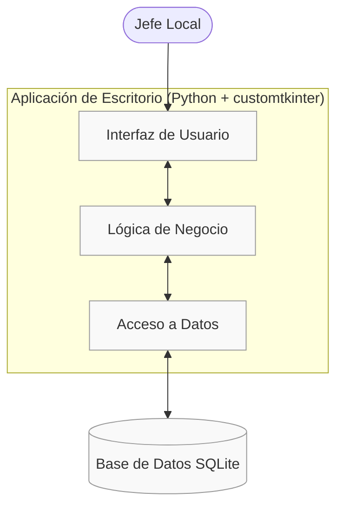

**Características principales:**
- Aplicación monolítica de escritorio desarrollada en Python con customtkinter
- Acceso limitado desde un único punto (computadora con la aplicación instalada)
- Toda la lógica y presentación centralizada en un único componente
- Base de datos local SQLite sin capacidad de acceso simultáneo
- Único actor con acceso al sistema (Jefe de Local)

### Sistema Refactorizado: Arquitectura de Aplicación Web Distribuida (DAR)

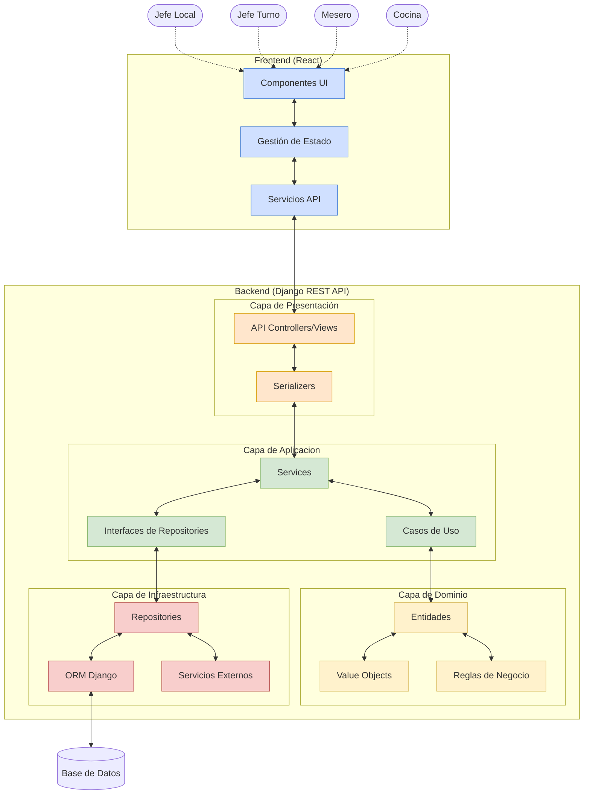

**Características principales:**
- Arquitectura cliente-servidor con separación clara de responsabilidades
- Frontend en React con componentes reutilizables
- Backend en Django siguiendo principios de Clean Architecture
- API RESTful para la comunicación entre frontend y backend
- Acceso desde múltiples dispositivos y ubicaciones
- Base de datos centralizada con acceso concurrente
- Múltiples actores con diferentes niveles de acceso (Jefe de Local, Jefe de Turno, Mesero, Cocina)

## Diagramas de Patrones de Diseño

### Sistema Actual: Patrones Limitados (DPA)

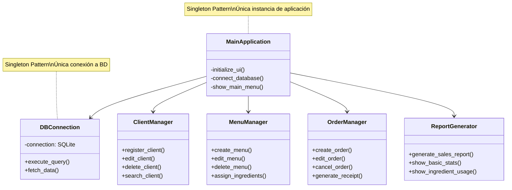

### Sistema Refactorizado: Implementación de Múltiples Patrones (DPR)

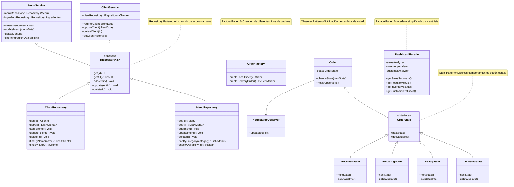

**Patrones implementados en el sistema refactorizado:**
1. **Repository Pattern**: Abstracción del acceso a datos con interfaces genéricas
2. **Dependency Injection**: Inyección de repositorios en servicios
3. **Factory Method**: Creación de diferentes tipos de pedidos
4. **Observer**: Notificaciones de cambios de estado en pedidos
5. **State**: Manejo de diferentes estados de pedidos
6. **Facade**: Simplificación de subsistemas complejos para el dashboard
7. **Strategy**: Diferentes estrategias para cálculos de precios, impuestos, etc.
8. **Template Method**: Para procesos estándar con variaciones (como diferentes tipos de reportes)

## Diagramas de Clases

### Sistema Actual: Modelo Simplificado (DCA)

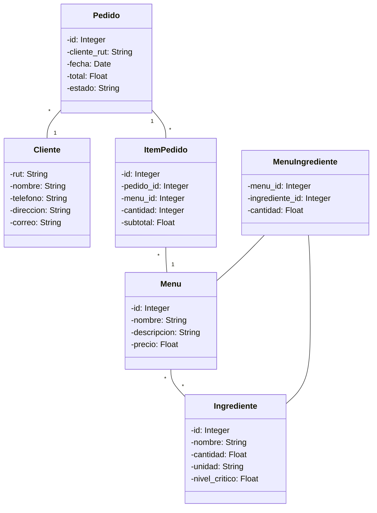

### Sistema Refactorizado: Modelo Expandido (DCR)

```mermaid
classDiagram
    %% Aplicación de principio de inversión de dependencia (D)
    %% Interfaces base para repositorios
    class IRepository~T~ {
        <<interface>>
        +findById(id: string): T
        +findAll(): List~T~
        +save(entity: T): T
        +update(entity: T): T
        +delete(id: string): void
    }

    %% Interfaces específicas para cada dominio (Principio I - Segregación de interfaces)
    class IClienteRepository {
        <<interface>>
        +findByRut(rut: string): Cliente
        +findByNombre(nombre: string): List~Cliente~
        +obtenerHistorialPedidos(clienteId: string): List~Pedido~
    }

    class IIngredienteRepository {
        <<interface>>
        +findByCategoria(categoria: string): List~Ingrediente~
        +actualizarStock(id: string, cantidad: number): void
        +obtenerIngredientesBajoCritico(): List~Ingrediente~
    }

    class IMenuRepository {
        <<interface>>
        +findByCategoria(categoria: string): List~Menu~
        +verificarDisponibilidad(id: string): boolean
        +obtenerConIngredientes(id: string): Menu
        +buscarPorIngrediente(ingredienteId: string): List~Menu~
    }

    class IPedidoRepository {
        <<interface>>
        +findByCliente(clienteId: string): List~Pedido~
        +findByEstado(estado: string): List~Pedido~
        +findByFecha(inicio: Date, fin: Date): List~Pedido~
        +actualizarEstado(id: string, estado: string): void
    }

    class IMesaRepository {
        <<interface>>
        +findByEstado(estado: string): List~Mesa~
        +asignarCliente(mesaId: string, clienteId: string): void
        +actualizarEstado(id: string, estado: string): void
    }

    %% Implementaciones concretas
    class ClienteRepositoryImpl {
        -clienteDAO: ClienteDAO
        +findById(id: string): Cliente
        +findAll(): List~Cliente~
        +save(cliente: Cliente): Cliente
        +update(cliente: Cliente): Cliente
        +delete(id: string): void
        +findByRut(rut: string): Cliente
        +findByNombre(nombre: string): List~Cliente~
        +obtenerHistorialPedidos(clienteId: string): List~Pedido~
    }

    class IngredienteRepositoryImpl {
        -ingredienteDAO: IngredienteDAO
        +findById(id: string): Ingrediente
        +findAll(): List~Ingrediente~
        +save(ingrediente: Ingrediente): Ingrediente
        +update(ingrediente: Ingrediente): Ingrediente
        +delete(id: string): void
        +findByCategoria(categoria: string): List~Ingrediente~
        +actualizarStock(id: string, cantidad: number): void
        +obtenerIngredientesBajoCritico(): List~Ingrediente~
    }

    %% Clases de servicio (Principio S - Responsabilidad única)
    class ClienteService {
        -clienteRepository: IClienteRepository
        -pedidoRepository: IPedidoRepository
        -notificationService: INotificationService
        +registrarCliente(cliente: ClienteDTO): Cliente
        +actualizarCliente(cliente: ClienteDTO): Cliente
        +eliminarCliente(id: string): void
        +buscarCliente(criterio: string): List~Cliente~
        +obtenerHistorialCliente(id: string): HistorialClienteDTO
    }

    class InventarioService {
        -ingredienteRepository: IIngredienteRepository
        -menuRepository: IMenuRepository
        -notificationService: INotificationService
        +registrarIngrediente(ingrediente: IngredienteDTO): Ingrediente
        +actualizarStock(id: string, cantidad: number, motivo: string): void
        +verificarDisponibilidadIngredientes(): List~EstadoIngredienteDTO~
        +obtenerIngredientesBajoCritico(): List~Ingrediente~
    }

    class MenuService {
        -menuRepository: IMenuRepository
        -ingredienteRepository: IIngredienteRepository
        +crearMenu(menu: MenuDTO): Menu
        +actualizarMenu(id: string, menu: MenuDTO): Menu
        +eliminarMenu(id: string): void
        +verificarDisponibilidadMenu(id: string): DisponibilidadMenuDTO
        +asignarIngredientesAMenu(menuId: string, ingredientes: List~MenuIngredienteDTO~): void
    }

    %% Patrón State para estados de pedido
    class PedidoState {
        <<interface>>
        +procesarSiguienteEstado(pedido: Pedido): void
        +getNombre(): string
        +puedeTransicionarA(estadoObjetivo: string): boolean
    }

    class RecibidoState {
        +procesarSiguienteEstado(pedido: Pedido): void
        +getNombre(): string
        +puedeTransicionarA(estadoObjetivo: string): boolean
    }

    class PreparacionState {
        +procesarSiguienteEstado(pedido: Pedido): void
        +getNombre(): string
        +puedeTransicionarA(estadoObjetivo: string): boolean
    }

    class ListoState {
        +procesarSiguienteEstado(pedido: Pedido): void
        +getNombre(): string
        +puedeTransicionarA(estadoObjetivo: string): boolean
    }

    class EntregadoState {
        +procesarSiguienteEstado(pedido: Pedido): void
        +getNombre(): string
        +puedeTransicionarA(estadoObjetivo: string): boolean
    }

    class CanceladoState {
        +procesarSiguienteEstado(pedido: Pedido): void
        +getNombre(): string
        +puedeTransicionarA(estadoObjetivo: string): boolean
    }

    %% Patrón Factory para creación de pedidos
    class PedidoFactory {
        +crearPedidoLocal(datos: PedidoDTO): Pedido
        +crearPedidoDelivery(datos: DeliveryPedidoDTO): DeliveryPedido
    }
    
    %% Patrón Observer para notificaciones
    class INotificationObserver {
        <<interface>>
        +update(subject: any, data: any): void
    }
    
    class CocinaNotificationObserver {
        +update(subject: any, data: any): void
    }
    
    class MeseroNotificationObserver {
        +update(subject: any, data: any): void
    }
    
    class ClienteNotificationObserver {
        +update(subject: any, data: any): void
    }

    %% Patrón Strategy para diferentes lógicas de procesamiento
    class IPagoProcesador {
        <<interface>>
        +procesarPago(transaccion: TransaccionDTO): ResultadoPagoDTO
    }
    
    class EfectivoProcesador {
        +procesarPago(transaccion: TransaccionDTO): ResultadoPagoDTO
    }
    
    class TarjetaProcesador {
        +procesarPago(transaccion: TransaccionDTO): ResultadoPagoDTO
    }
    
    class TransferenciaProcesador {
        +procesarPago(transaccion: TransaccionDTO): ResultadoPagoDTO
    }

    %% Patrón Facade para simplificar subsistemas complejos
    class DashboardFacade {
        -ventasAnalyzer: VentasAnalyzer
        -inventarioAnalyzer: InventarioAnalyzer
        -clienteAnalyzer: ClienteAnalyzer
        +obtenerResumenVentas(periodo: string): ResumenVentasDTO
        +obtenerMenusPopulares(): List~MenuPopularDTO~
        +obtenerEstadoInventario(): EstadoInventarioDTO
        +obtenerEstadisticasClientes(): EstadisticasClientesDTO
    }

    %% Entidad base aplicando herencia (Principio L - Sustitución de Liskov)
    class EntidadBase {
        #id: string
        #fechaCreacion: Date
        #fechaActualizacion: Date
        #estado: string
    }

    %% Entidades del dominio
    class Cliente {
        -rut: string
        -nombre: string
        -telefono: string
        -direccion: string
        -correo: string
        -preferencias: Map
        -fechaRegistro: Date
        -ultimaVisita: Date
    }

    class Ingrediente {
        -nombre: string
        -categoria: string
        -cantidad: number
        -unidad: string
        -nivelCritico: number
        -codigoBarras: string
        -imagen: string
        -proveedorId: string
    }

    class Menu {
        -nombre: string
        -descripcion: string
        -precio: number
        -costo: number
        -tiempoPreparacion: number
        -categoria: string
        -imagen: string
        -disponible: boolean
        -disponibleDelivery: boolean
        -ingredientes: List~MenuIngrediente~
    }

    class MenuIngrediente {
        -menuId: string
        -ingredienteId: string
        -cantidad: number
    }

    class Pedido {
        -clienteId: string
        -mesaId: string
        -fecha: Date
        -total: number
        -estado: PedidoState
        -notas: string
        -creadoPor: string
        -tipo: string
        -items: List~ItemPedido~
        +cambiarEstado(nuevoEstado: PedidoState): void
        +calcularTotal(): number
        +agregarItem(item: ItemPedido): void
        +eliminarItem(itemId: string): void
        +notificarObservadores(): void
    }
    
    class DeliveryPedido {
        -pedidoId: string
        -direccionEntrega: string
        -tiempoEstimado: number
        -repartidorId: string
        -estadoDelivery: string
        -appId: string
        -codigoExterno: string
        -costoEnvio: number
    }

    class ItemPedido {
        -pedidoId: string
        -menuId: string
        -cantidad: number
        -precioUnitario: number
        -subtotal: number
        -personalizaciones: Map
        -estado: string
    }

    class Mesa {
        -numero: number
        -capacidad: number
        -estado: string
        -ubicacion: string
        -caracteristicas: string
        -horaInicio: Date
    }

    %% Relaciones de herencia
    EntidadBase <|-- Cliente
    EntidadBase <|-- Ingrediente
    EntidadBase <|-- Menu
    EntidadBase <|-- Pedido
    EntidadBase <|-- Mesa

    %% Implementación de interfaces
    IClienteRepository <|.. ClienteRepositoryImpl
    IIngredienteRepository <|.. IngredienteRepositoryImpl
    IRepository <|-- IClienteRepository
    IRepository <|-- IIngredienteRepository
    IRepository <|-- IMenuRepository
    IRepository <|-- IPedidoRepository
    IRepository <|-- IMesaRepository
    PedidoState <|.. RecibidoState
    PedidoState <|.. PreparacionState
    PedidoState <|.. ListoState
    PedidoState <|.. EntregadoState
    PedidoState <|.. CanceladoState
    INotificationObserver <|.. CocinaNotificationObserver
    INotificationObserver <|.. MeseroNotificationObserver
    INotificationObserver <|.. ClienteNotificationObserver
    IPagoProcesador <|.. EfectivoProcesador
    IPagoProcesador <|.. TarjetaProcesador
    IPagoProcesador <|.. TransferenciaProcesador

    %% Composición y asociaciones
    ClienteService o-- IClienteRepository : usa
    ClienteService o-- IPedidoRepository : usa
    InventarioService o-- IIngredienteRepository : usa
    InventarioService o-- IMenuRepository : usa
    MenuService o-- IMenuRepository : usa
    MenuService o-- IIngredienteRepository : usa
    Pedido o-- PedidoState : tiene
    Pedido *-- ItemPedido : contiene
    Menu *-- MenuIngrediente : contiene
    DeliveryPedido -- Pedido : extiende

    %% Notas para patrones de diseño
    class IRepository~T~ {
        <<Interface>>
        Repository Pattern - Abstracción para acceso a datos
    }

    class PedidoFactory {
        <<Factory Method Pattern>>
        Crea diferentes tipos de pedidos
    }

    class DashboardFacade {
        <<Facade Pattern>>
        Simplifica interacción con subsistemas analíticos
    }

    class PedidoState {
        <<State Pattern>>
        Cambia comportamiento según estado
    }

    class IPagoProcesador {
        <<Strategy Pattern>>
        Algoritmos intercambiables para procesar pagos
    }

    class INotificationObserver {
        <<Observer Pattern>>
        Notificación de eventos a múltiples observadores
    }
```

## Diagramas MER

### Sistema Actual: Modelo Entidad-Relación Básico (MERA)

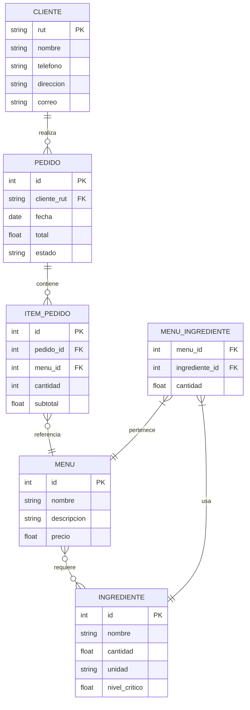

### Sistema Refactorizado: Modelo Entidad-Relación Completo (MERR)

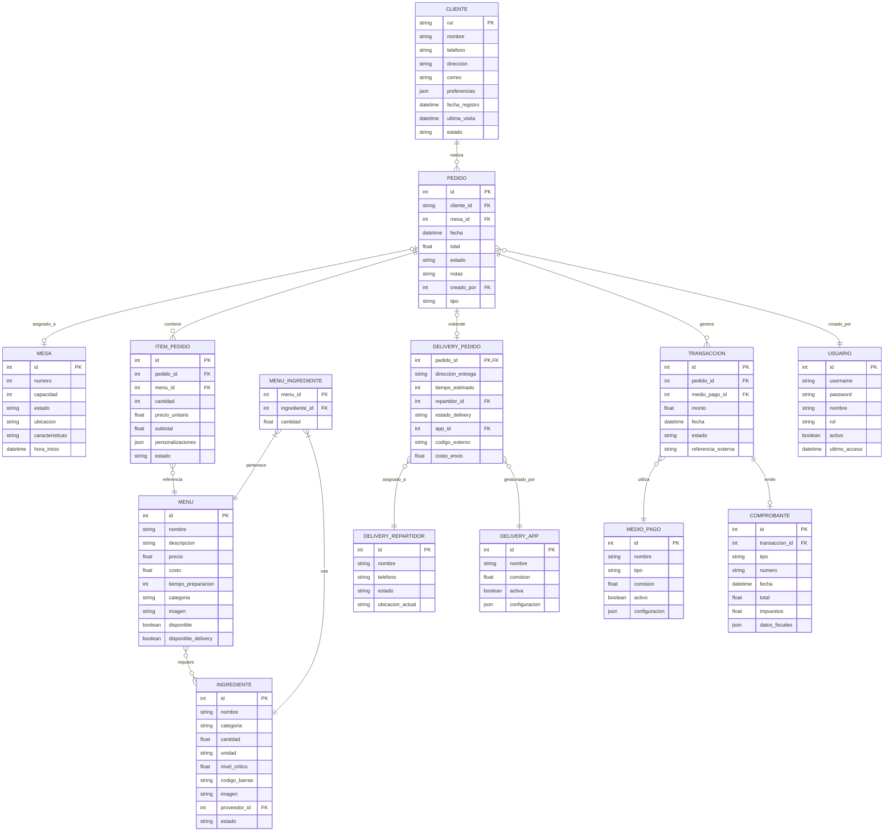

## Diagramas de Objetos

### Sistema Actual: Instancias Básicas (DOA)

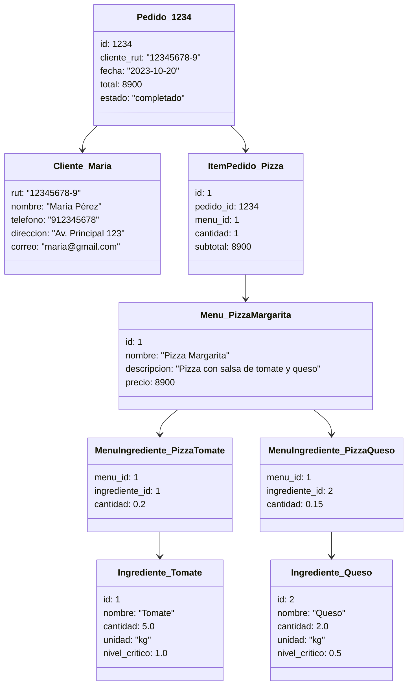

### Sistema Refactorizado: Instancias Avanzadas (DOR)

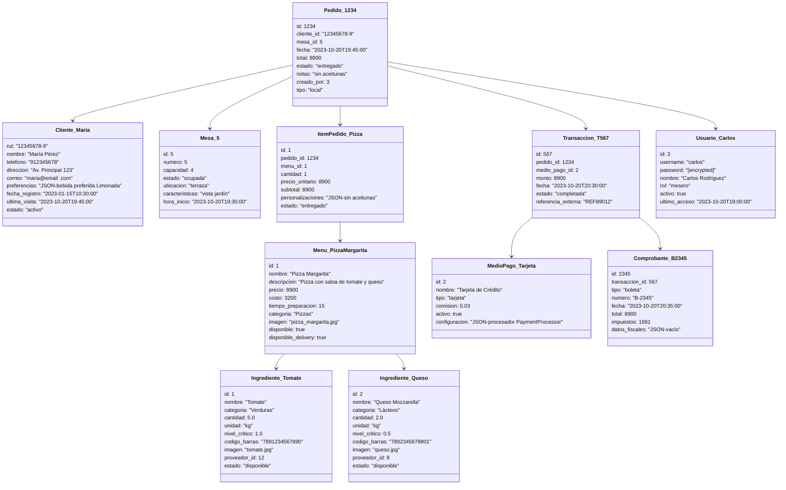

## Diagramas de Componentes

### Sistema Actual: Componentes Básicos (DCOA)

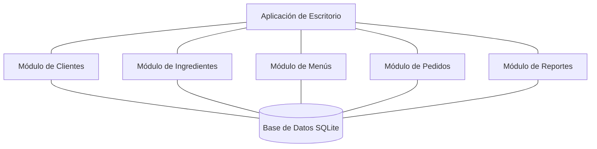

### Sistema Refactorizado: Componentes Distribuidos (DCOR)

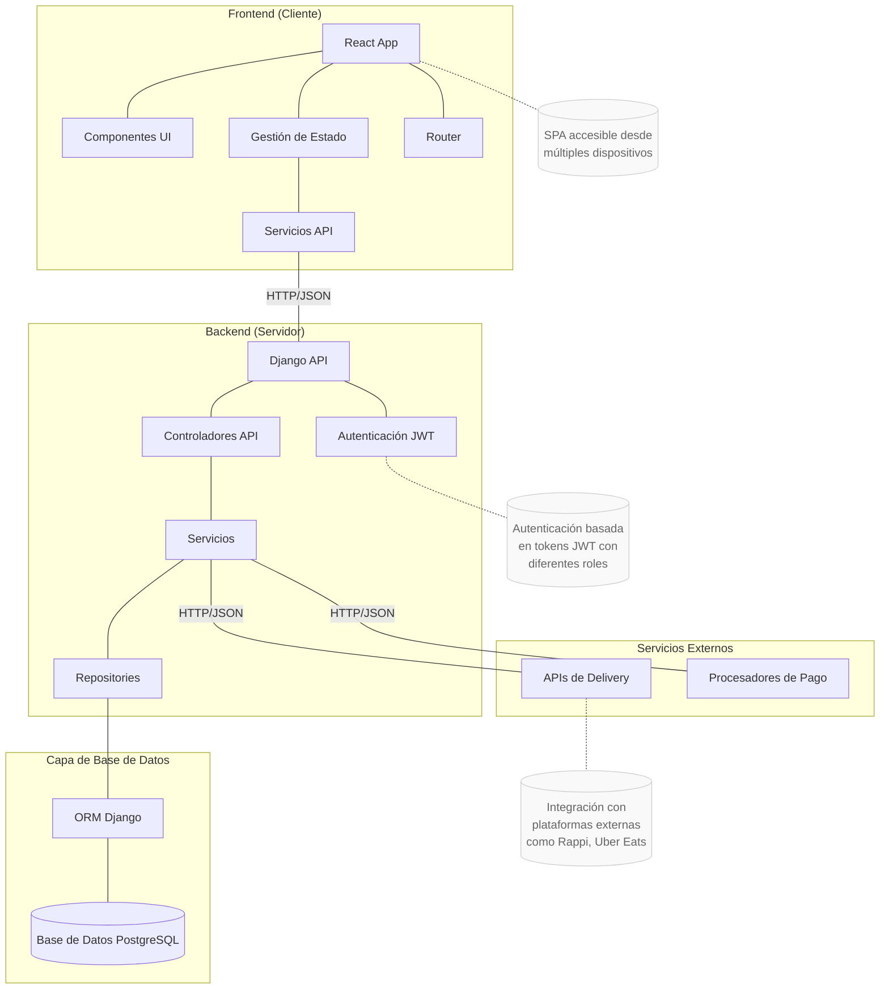

## Resumen de Mejoras

La refactorización del sistema incluye las siguientes mejoras significativas:

1. **Arquitectura (DAA → DAR)**: Migración de una aplicación monolítica de escritorio a una arquitectura web cliente-servidor con separación de responsabilidades.

2. **Patrones de Diseño (DPA → DPR)**: Implementación de múltiples patrones como Repository, Factory, Observer, State y Facade para mejorar la mantenibilidad y escalabilidad.

3. **Modelo de Datos (DCA → DCR, MERA → MERR)**: Expansión del modelo con nuevas entidades como Mesa, DeliveryPedido, Transaccion y Usuario, habilitando nuevas funcionalidades de negocio.

4. **Componentes (DCOA → DCOR)**: Distribución en componentes independientes y especializados que pueden evolucionar de manera separada.

5. **Acceso**: Transformación de un sistema de acceso único a uno multiusuario con diferentes roles y permisos.

6. **Tecnología**: Actualización tecnológica de Python con customtkinter a una stack moderna con React para frontend y Django para backend.

Estos cambios no solo modernizan la infraestructura tecnológica sino que transforman fundamentalmente la manera en que opera el restaurante, proporcionando nuevas capacidades y mejorando la experiencia de todos los involucrados.
