# Diagramas de Secuencia - Sistema de Gestión de Restaurante

Este documento presenta los diagramas de secuencia para cada caso de uso, tanto del sistema actual como del sistema refactorizado. Estos diagramas muestran la interacción entre actores, componentes y objetos a través del tiempo, ilustrando el flujo de mensajes y operaciones.

## SISTEMA ACTUAL

El sistema actual opera como una aplicación de escritorio monolítica con una arquitectura simple de tres capas:
- **Interfaz de Usuario**: Implementada con Python y customtkinter
- **Lógica de Negocio**: Módulos funcionales en Python
- **Acceso a Datos**: Conexión directa a SQLite

### Gestión de Clientes

#### CU-A01: Registrar Cliente

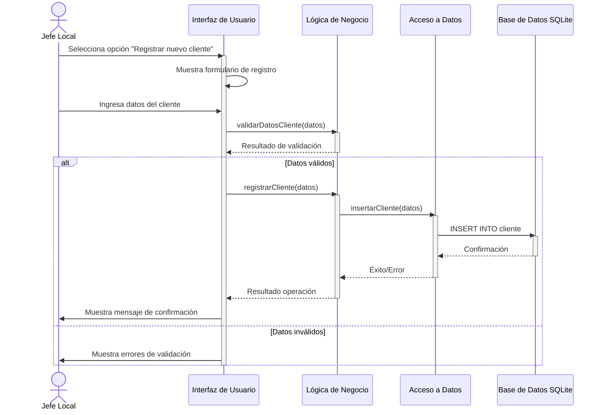
```mermaid
sequenceDiagram
    actor JL as Jefe Local
    participant UI as Interfaz de Usuario
    participant LN as Lógica de Negocio
    participant DA as Acceso a Datos
    participant DB as Base de Datos SQLite
    
    JL->>UI: Selecciona opción "Registrar nuevo cliente"
    activate UI
    UI->>UI: Muestra formulario de registro
    JL->>UI: Ingresa datos del cliente
    UI->>LN: validarDatosCliente(datos)
    activate LN
    LN-->>UI: Resultado de validación
    deactivate LN
    
    alt Datos válidos
        UI->>LN: registrarCliente(datos)
        activate LN
        LN->>DA: insertarCliente(datos)
        activate DA
        DA->>DB: INSERT INTO cliente
        activate DB
        DB-->>DA: Confirmación
        deactivate DB
        DA-->>LN: Éxito/Error
        deactivate DA
        LN-->>UI: Resultado operación
        deactivate LN
        UI->>JL: Muestra mensaje de confirmación
    else Datos inválidos
        UI->>JL: Muestra errores de validación
    end
    deactivate UI
```

#### CU-A02: Editar Cliente

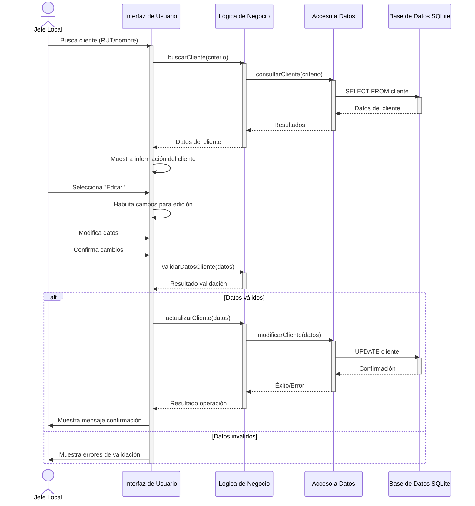
```mermaid
sequenceDiagram
    actor JL as Jefe Local
    participant UI as Interfaz de Usuario
    participant LN as Lógica de Negocio
    participant DA as Acceso a Datos
    participant DB as Base de Datos SQLite
    
    JL->>UI: Busca cliente (RUT/nombre)
    activate UI
    UI->>LN: buscarCliente(criterio)
    activate LN
    LN->>DA: consultarCliente(criterio)
    activate DA
    DA->>DB: SELECT FROM cliente
    activate DB
    DB-->>DA: Datos del cliente
    deactivate DB
    DA-->>LN: Resultados
    deactivate DA
    LN-->>UI: Datos del cliente
    deactivate LN
    
    UI->>UI: Muestra información del cliente
    JL->>UI: Selecciona "Editar"
    UI->>UI: Habilita campos para edición
    JL->>UI: Modifica datos
    JL->>UI: Confirma cambios
    
    UI->>LN: validarDatosCliente(datos)
    activate LN
    LN-->>UI: Resultado validación
    deactivate LN
    
    alt Datos válidos
        UI->>LN: actualizarCliente(datos)
        activate LN
        LN->>DA: modificarCliente(datos)
        activate DA
        DA->>DB: UPDATE cliente
        activate DB
        DB-->>DA: Confirmación
        deactivate DB
        DA-->>LN: Éxito/Error
        deactivate DA
        LN-->>UI: Resultado operación
        deactivate LN
        UI->>JL: Muestra mensaje confirmación
    else Datos inválidos
        UI->>JL: Muestra errores de validación
    end
    deactivate UI
```

#### CU-A03: Eliminar Cliente

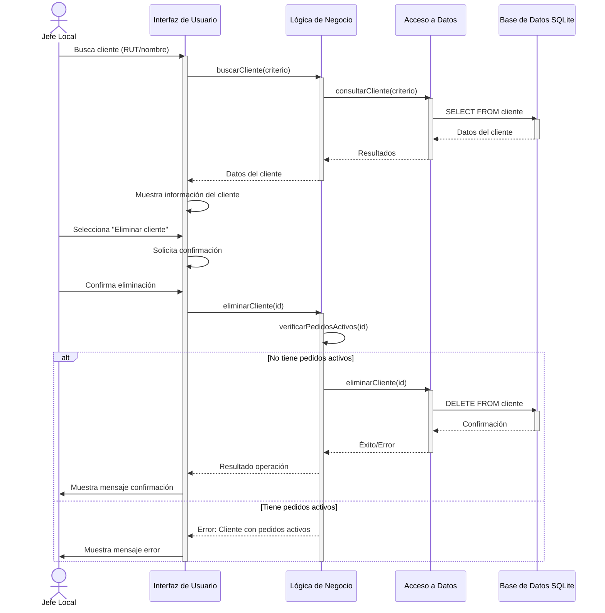
```mermaid
sequenceDiagram
    actor JL as Jefe Local
    participant UI as Interfaz de Usuario
    participant LN as Lógica de Negocio
    participant DA as Acceso a Datos
    participant DB as Base de Datos SQLite
    
    JL->>UI: Busca cliente (RUT/nombre)
    activate UI
    UI->>LN: buscarCliente(criterio)
    activate LN
    LN->>DA: consultarCliente(criterio)
    activate DA
    DA->>DB: SELECT FROM cliente
    activate DB
    DB-->>DA: Datos del cliente
    deactivate DB
    DA-->>LN: Resultados
    deactivate DA
    LN-->>UI: Datos del cliente
    deactivate LN
    
    UI->>UI: Muestra información del cliente
    JL->>UI: Selecciona "Eliminar cliente"
    UI->>UI: Solicita confirmación
    JL->>UI: Confirma eliminación
    
    UI->>LN: eliminarCliente(id)
    activate LN
    LN->>LN: verificarPedidosActivos(id)
    
    alt No tiene pedidos activos
        LN->>DA: eliminarCliente(id)
        activate DA
        DA->>DB: DELETE FROM cliente
        activate DB
        DB-->>DA: Confirmación
        deactivate DB
        DA-->>LN: Éxito/Error
        deactivate DA
        LN-->>UI: Resultado operación
        UI->>JL: Muestra mensaje confirmación
    else Tiene pedidos activos
        LN-->>UI: Error: Cliente con pedidos activos
        UI->>JL: Muestra mensaje error
    end
    deactivate LN
    deactivate UI
```

#### CU-A04: Buscar Cliente

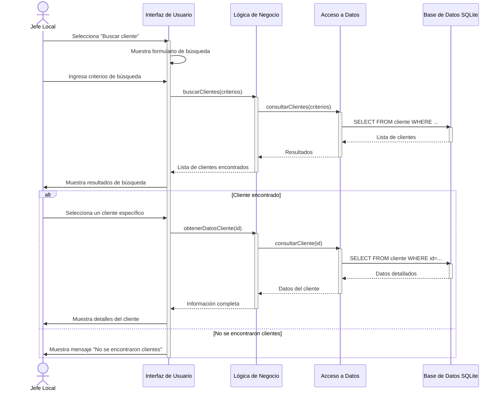
```mermaid
sequenceDiagram
    actor JL as Jefe Local
    participant UI as Interfaz de Usuario
    participant LN as Lógica de Negocio
    participant DA as Acceso a Datos
    participant DB as Base de Datos SQLite
    
    JL->>UI: Selecciona "Buscar cliente"
    activate UI
    UI->>UI: Muestra formulario de búsqueda
    JL->>UI: Ingresa criterios de búsqueda
    UI->>LN: buscarClientes(criterios)
    activate LN
    LN->>DA: consultarClientes(criterios)
    activate DA
    DA->>DB: SELECT FROM cliente WHERE ...
    activate DB
    DB-->>DA: Lista de clientes
    deactivate DB
    DA-->>LN: Resultados
    deactivate DA
    LN-->>UI: Lista de clientes encontrados
    deactivate LN
    
    UI->>JL: Muestra resultados de búsqueda
    
    alt Cliente encontrado
        JL->>UI: Selecciona un cliente específico
        UI->>LN: obtenerDatosCliente(id)
        activate LN
        LN->>DA: consultarCliente(id)
        activate DA
        DA->>DB: SELECT FROM cliente WHERE id=...
        activate DB
        DB-->>DA: Datos detallados
        deactivate DB
        DA-->>LN: Datos del cliente
        deactivate DA
        LN-->>UI: Información completa
        deactivate LN
        UI->>JL: Muestra detalles del cliente
    else No se encontraron clientes
        UI->>JL: Muestra mensaje "No se encontraron clientes"
    end
    deactivate UI
```

#### CU-A05: Ver Historial de Pedidos

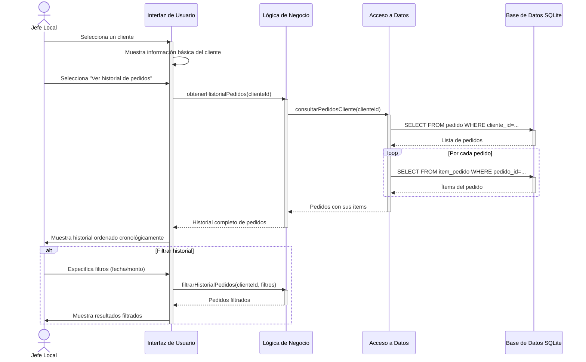
```mermaid
sequenceDiagram
    actor JL as Jefe Local
    participant UI as Interfaz de Usuario
    participant LN as Lógica de Negocio
    participant DA as Acceso a Datos
    participant DB as Base de Datos SQLite
    
    JL->>UI: Selecciona un cliente
    activate UI
    UI->>UI: Muestra información básica del cliente
    JL->>UI: Selecciona "Ver historial de pedidos"
    
    UI->>LN: obtenerHistorialPedidos(clienteId)
    activate LN
    LN->>DA: consultarPedidosCliente(clienteId)
    activate DA
    DA->>DB: SELECT FROM pedido WHERE cliente_id=...
    activate DB
    DB-->>DA: Lista de pedidos
    deactivate DB
    
    loop Por cada pedido
        DA->>DB: SELECT FROM item_pedido WHERE pedido_id=...
        activate DB
        DB-->>DA: Ítems del pedido
        deactivate DB
    end
    
    DA-->>LN: Pedidos con sus ítems
    deactivate DA
    LN-->>UI: Historial completo de pedidos
    deactivate LN
    
    UI->>JL: Muestra historial ordenado cronológicamente
    
    alt Filtrar historial
        JL->>UI: Especifica filtros (fecha/monto)
        UI->>LN: filtrarHistorialPedidos(clienteId, filtros)
        activate LN
        LN-->>UI: Pedidos filtrados
        deactivate LN
        UI->>JL: Muestra resultados filtrados
    end
    deactivate UI
```

### Gestión de Ingredientes

#### CU-A06: Agregar Ingrediente

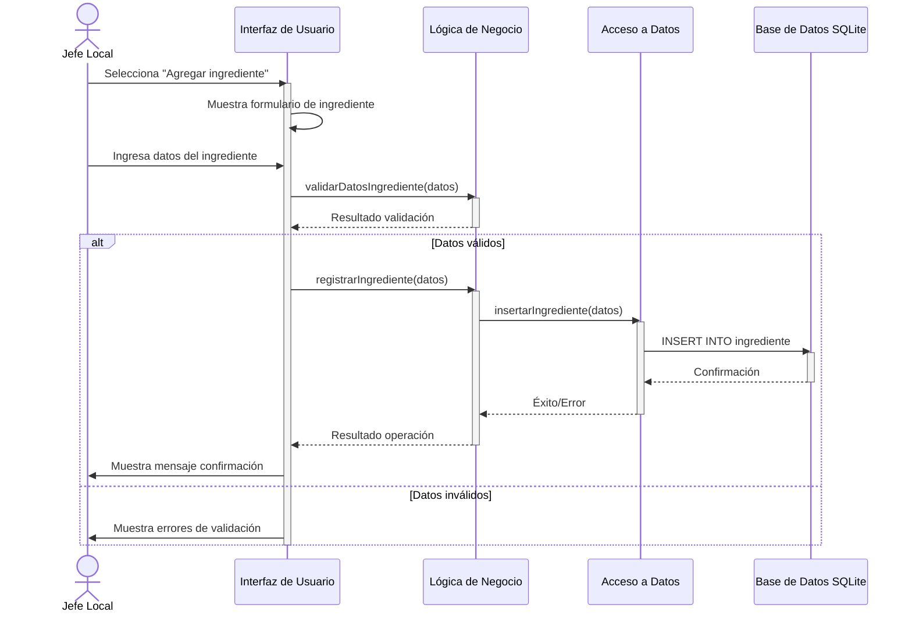
```mermaid
sequenceDiagram
    actor JL as Jefe Local
    participant UI as Interfaz de Usuario
    participant LN as Lógica de Negocio
    participant DA as Acceso a Datos
    participant DB as Base de Datos SQLite
    
    JL->>UI: Selecciona "Agregar ingrediente"
    activate UI
    UI->>UI: Muestra formulario de ingrediente
    JL->>UI: Ingresa datos del ingrediente
    
    UI->>LN: validarDatosIngrediente(datos)
    activate LN
    LN-->>UI: Resultado validación
    deactivate LN
    
    alt Datos válidos
        UI->>LN: registrarIngrediente(datos)
        activate LN
        LN->>DA: insertarIngrediente(datos)
        activate DA
        DA->>DB: INSERT INTO ingrediente
        activate DB
        DB-->>DA: Confirmación
        deactivate DB
        DA-->>LN: Éxito/Error
        deactivate DA
        LN-->>UI: Resultado operación
        deactivate LN
        UI->>JL: Muestra mensaje confirmación
    else Datos inválidos
        UI->>JL: Muestra errores de validación
    end
    deactivate UI
```

#### CU-A07: Editar Ingrediente

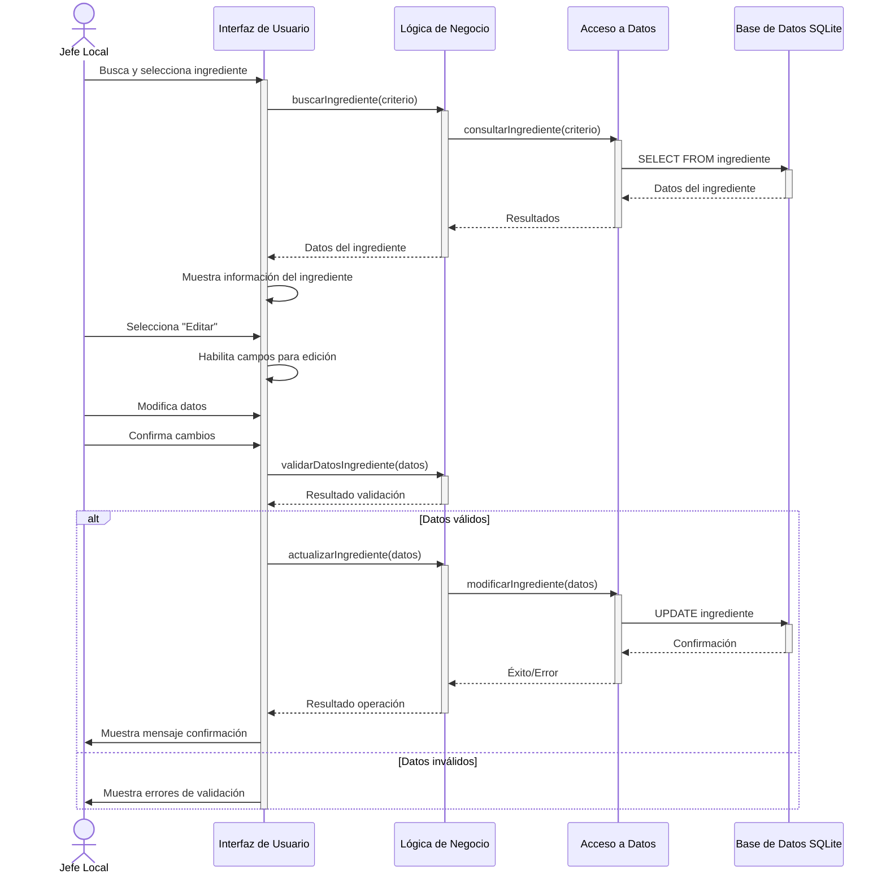
```mermaid
sequenceDiagram
    actor JL as Jefe Local
    participant UI as Interfaz de Usuario
    participant LN as Lógica de Negocio
    participant DA as Acceso a Datos
    participant DB as Base de Datos SQLite
    
    JL->>UI: Busca y selecciona ingrediente
    activate UI
    UI->>LN: buscarIngrediente(criterio)
    activate LN
    LN->>DA: consultarIngrediente(criterio)
    activate DA
    DA->>DB: SELECT FROM ingrediente
    activate DB
    DB-->>DA: Datos del ingrediente
    deactivate DB
    DA-->>LN: Resultados
    deactivate DA
    LN-->>UI: Datos del ingrediente
    deactivate LN
    
    UI->>UI: Muestra información del ingrediente
    JL->>UI: Selecciona "Editar"
    UI->>UI: Habilita campos para edición
    JL->>UI: Modifica datos
    JL->>UI: Confirma cambios
    
    UI->>LN: validarDatosIngrediente(datos)
    activate LN
    LN-->>UI: Resultado validación
    deactivate LN
    
    alt Datos válidos
        UI->>LN: actualizarIngrediente(datos)
        activate LN
        LN->>DA: modificarIngrediente(datos)
        activate DA
        DA->>DB: UPDATE ingrediente
        activate DB
        DB-->>DA: Confirmación
        deactivate DB
        DA-->>LN: Éxito/Error
        deactivate DA
        LN-->>UI: Resultado operación
        deactivate LN
        UI->>JL: Muestra mensaje confirmación
    else Datos inválidos
        UI->>JL: Muestra errores de validación
    end
    deactivate UI
```

#### CU-A08: Eliminar Ingrediente

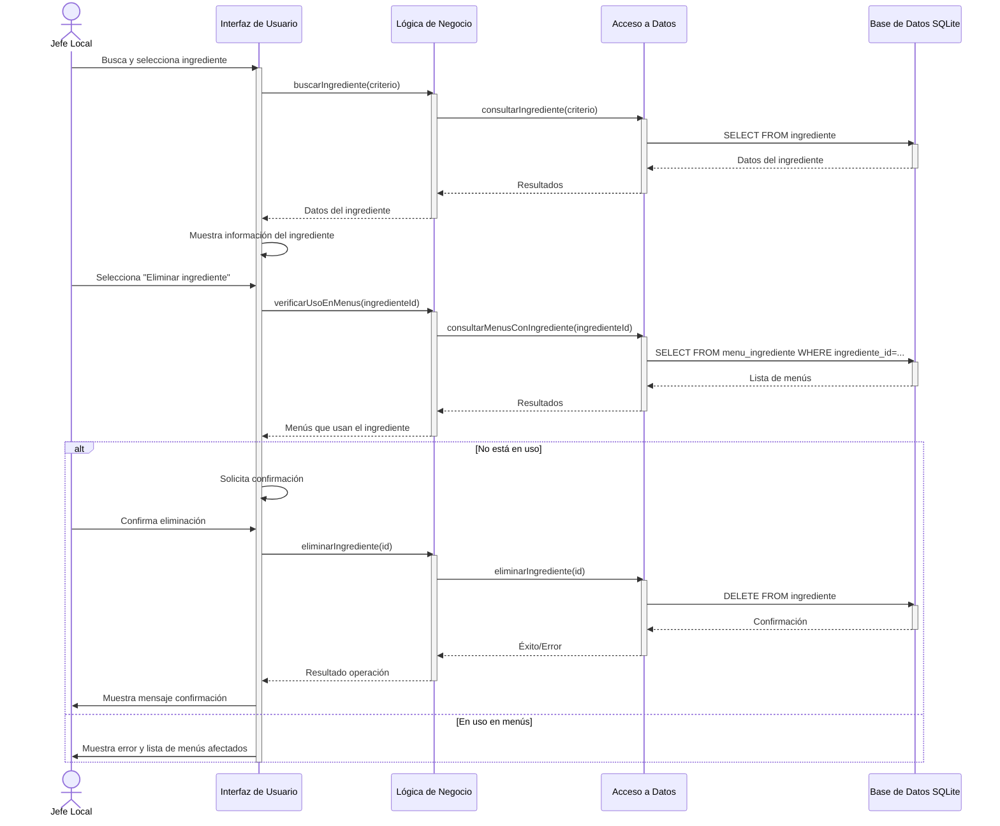
```mermaid
sequenceDiagram
    actor JL as Jefe Local
    participant UI as Interfaz de Usuario
    participant LN as Lógica de Negocio
    participant DA as Acceso a Datos
    participant DB as Base de Datos SQLite
    
    JL->>UI: Busca y selecciona ingrediente
    activate UI
    UI->>LN: buscarIngrediente(criterio)
    activate LN
    LN->>DA: consultarIngrediente(criterio)
    activate DA
    DA->>DB: SELECT FROM ingrediente
    activate DB
    DB-->>DA: Datos del ingrediente
    deactivate DB
    DA-->>LN: Resultados
    deactivate DA
    LN-->>UI: Datos del ingrediente
    deactivate LN
    
    UI->>UI: Muestra información del ingrediente
    JL->>UI: Selecciona "Eliminar ingrediente"
    
    UI->>LN: verificarUsoEnMenus(ingredienteId)
    activate LN
    LN->>DA: consultarMenusConIngrediente(ingredienteId)
    activate DA
    DA->>DB: SELECT FROM menu_ingrediente WHERE ingrediente_id=...
    activate DB
    DB-->>DA: Lista de menús
    deactivate DB
    DA-->>LN: Resultados
    deactivate DA
    LN-->>UI: Menús que usan el ingrediente
    deactivate LN
    
    alt No está en uso
        UI->>UI: Solicita confirmación
        JL->>UI: Confirma eliminación
        UI->>LN: eliminarIngrediente(id)
        activate LN
        LN->>DA: eliminarIngrediente(id)
        activate DA
        DA->>DB: DELETE FROM ingrediente
        activate DB
        DB-->>DA: Confirmación
        deactivate DB
        DA-->>LN: Éxito/Error
        deactivate DA
        LN-->>UI: Resultado operación
        deactivate LN
        UI->>JL: Muestra mensaje confirmación
    else En uso en menús
        UI->>JL: Muestra error y lista de menús afectados
    end
    deactivate UI
```

#### CU-A09: Actualizar Stock

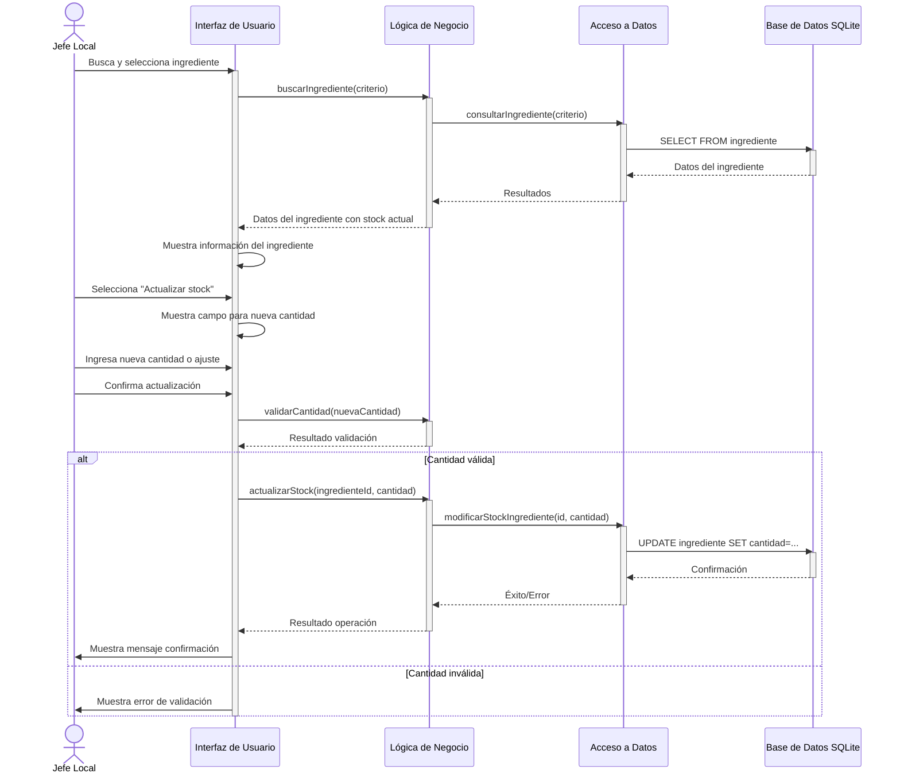
```mermaid
sequenceDiagram
    actor JL as Jefe Local
    participant UI as Interfaz de Usuario
    participant LN as Lógica de Negocio
    participant DA as Acceso a Datos
    participant DB as Base de Datos SQLite
    
    JL->>UI: Busca y selecciona ingrediente
    activate UI
    UI->>LN: buscarIngrediente(criterio)
    activate LN
    LN->>DA: consultarIngrediente(criterio)
    activate DA
    DA->>DB: SELECT FROM ingrediente
    activate DB
    DB-->>DA: Datos del ingrediente
    deactivate DB
    DA-->>LN: Resultados
    deactivate DA
    LN-->>UI: Datos del ingrediente con stock actual
    deactivate LN
    
    UI->>UI: Muestra información del ingrediente
    JL->>UI: Selecciona "Actualizar stock"
    UI->>UI: Muestra campo para nueva cantidad
    JL->>UI: Ingresa nueva cantidad o ajuste
    JL->>UI: Confirma actualización
    
    UI->>LN: validarCantidad(nuevaCantidad)
    activate LN
    LN-->>UI: Resultado validación
    deactivate LN
    
    alt Cantidad válida
        UI->>LN: actualizarStock(ingredienteId, cantidad)
        activate LN
        LN->>DA: modificarStockIngrediente(id, cantidad)
        activate DA
        DA->>DB: UPDATE ingrediente SET cantidad=...
        activate DB
        DB-->>DA: Confirmación
        deactivate DB
        DA-->>LN: Éxito/Error
        deactivate DA
        LN-->>UI: Resultado operación
        deactivate LN
        UI->>JL: Muestra mensaje confirmación
    else Cantidad inválida
        UI->>JL: Muestra error de validación
    end
    deactivate UI
```

#### CU-A10: Verificar Disponibilidad de Ingredientes

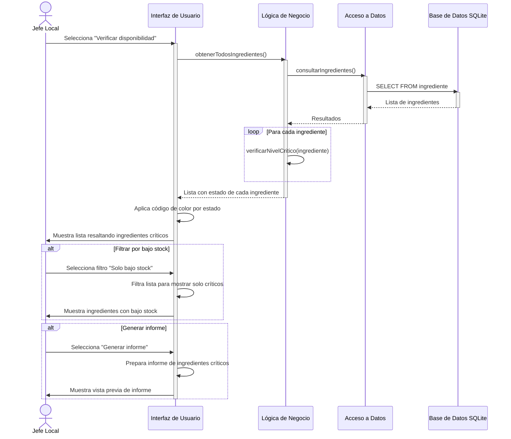
```mermaid
sequenceDiagram
    actor JL as Jefe Local
    participant UI as Interfaz de Usuario
    participant LN as Lógica de Negocio
    participant DA as Acceso a Datos
    participant DB as Base de Datos SQLite
    
    JL->>UI: Selecciona "Verificar disponibilidad"
    activate UI
    
    UI->>LN: obtenerTodosIngredientes()
    activate LN
    LN->>DA: consultarIngredientes()
    activate DA
    DA->>DB: SELECT FROM ingrediente
    activate DB
    DB-->>DA: Lista de ingredientes
    deactivate DB
    DA-->>LN: Resultados
    deactivate DA
    
    loop Para cada ingrediente
        LN->>LN: verificarNivelCritico(ingrediente)
    end
    
    LN-->>UI: Lista con estado de cada ingrediente
    deactivate LN
    
    UI->>UI: Aplica código de color por estado
    UI->>JL: Muestra lista resaltando ingredientes críticos
    
    alt Filtrar por bajo stock
        JL->>UI: Selecciona filtro "Solo bajo stock"
        UI->>UI: Filtra lista para mostrar solo críticos
        UI->>JL: Muestra ingredientes con bajo stock
    end
    
    alt Generar informe
        JL->>UI: Selecciona "Generar informe"
        UI->>UI: Prepara informe de ingredientes críticos
        UI->>JL: Muestra vista previa de informe
    end
    deactivate UI
```

### Gestión de Menús

#### CU-A11: Crear Menú

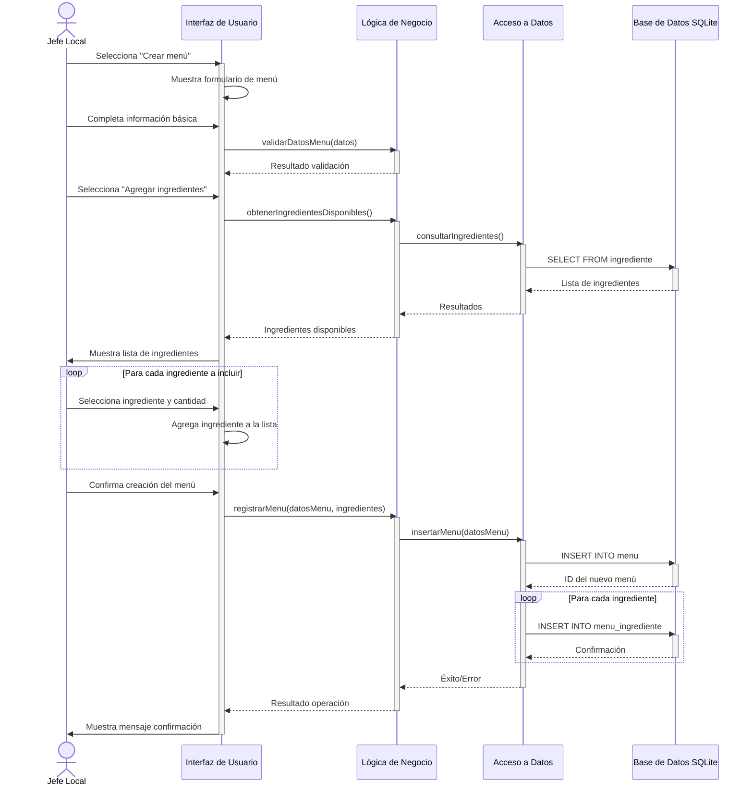
```mermaid
sequenceDiagram
    actor JL as Jefe Local
    participant UI as Interfaz de Usuario
    participant LN as Lógica de Negocio
    participant DA as Acceso a Datos
    participant DB as Base de Datos SQLite
    
    JL->>UI: Selecciona "Crear menú"
    activate UI
    UI->>UI: Muestra formulario de menú
    JL->>UI: Completa información básica
    
    UI->>LN: validarDatosMenu(datos)
    activate LN
    LN-->>UI: Resultado validación
    deactivate LN
    
    JL->>UI: Selecciona "Agregar ingredientes"
    
    UI->>LN: obtenerIngredientesDisponibles()
    activate LN
    LN->>DA: consultarIngredientes()
    activate DA
    DA->>DB: SELECT FROM ingrediente
    activate DB
    DB-->>DA: Lista de ingredientes
    deactivate DB
    DA-->>LN: Resultados
    deactivate DA
    LN-->>UI: Ingredientes disponibles
    deactivate LN
    
    UI->>JL: Muestra lista de ingredientes
    
    loop Para cada ingrediente a incluir
        JL->>UI: Selecciona ingrediente y cantidad
        UI->>UI: Agrega ingrediente a la lista
    end
    
    JL->>UI: Confirma creación del menú
    
    UI->>LN: registrarMenu(datosMenu, ingredientes)
    activate LN
    LN->>DA: insertarMenu(datosMenu)
    activate DA
    DA->>DB: INSERT INTO menu
    activate DB
    DB-->>DA: ID del nuevo menú
    deactivate DB
    
    loop Para cada ingrediente
        DA->>DB: INSERT INTO menu_ingrediente
        activate DB
        DB-->>DA: Confirmación
        deactivate DB
    end
    
    DA-->>LN: Éxito/Error
    deactivate DA
    LN-->>UI: Resultado operación
    deactivate LN
    UI->>JL: Muestra mensaje confirmación
    deactivate UI
```

#### CU-A12: Editar Menú

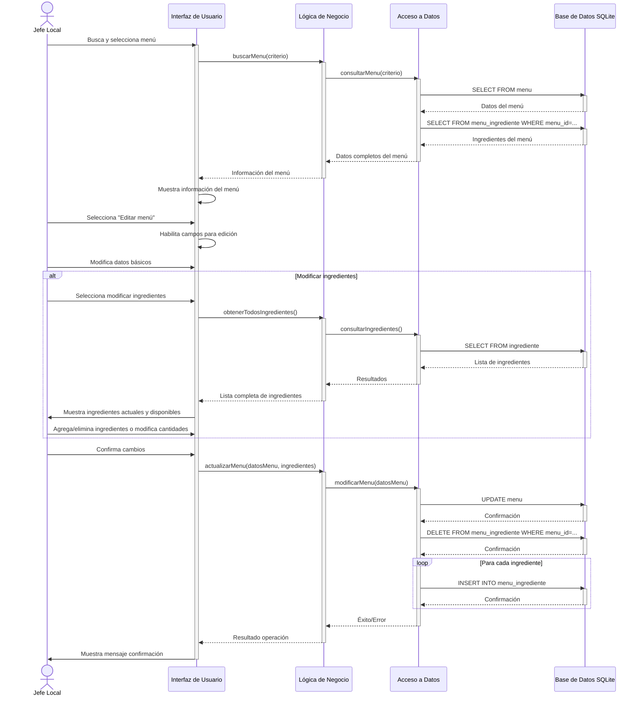
```mermaid
sequenceDiagram
    actor JL as Jefe Local
    participant UI as Interfaz de Usuario
    participant LN as Lógica de Negocio
    participant DA as Acceso a Datos
    participant DB as Base de Datos SQLite
    
    JL->>UI: Busca y selecciona menú
    activate UI
    UI->>LN: buscarMenu(criterio)
    activate LN
    LN->>DA: consultarMenu(criterio)
    activate DA
    DA->>DB: SELECT FROM menu
    activate DB
    DB-->>DA: Datos del menú
    deactivate DB
    
    DA->>DB: SELECT FROM menu_ingrediente WHERE menu_id=...
    activate DB
    DB-->>DA: Ingredientes del menú
    deactivate DB
    
    DA-->>LN: Datos completos del menú
    deactivate DA
    LN-->>UI: Información del menú
    deactivate LN
    
    UI->>UI: Muestra información del menú
    JL->>UI: Selecciona "Editar menú"
    UI->>UI: Habilita campos para edición
    JL->>UI: Modifica datos básicos
    
    alt Modificar ingredientes
        JL->>UI: Selecciona modificar ingredientes
        UI->>LN: obtenerTodosIngredientes()
        activate LN
        LN->>DA: consultarIngredientes()
        activate DA
        DA->>DB: SELECT FROM ingrediente
        activate DB
        DB-->>DA: Lista de ingredientes
        deactivate DB
        DA-->>LN: Resultados
        deactivate DA
        LN-->>UI: Lista completa de ingredientes
        deactivate LN
        
        UI->>JL: Muestra ingredientes actuales y disponibles
        JL->>UI: Agrega/elimina ingredientes o modifica cantidades
    end
    
    JL->>UI: Confirma cambios
    
    UI->>LN: actualizarMenu(datosMenu, ingredientes)
    activate LN
    LN->>DA: modificarMenu(datosMenu)
    activate DA
    DA->>DB: UPDATE menu
    activate DB
    DB-->>DA: Confirmación
    deactivate DB
    
    DA->>DB: DELETE FROM menu_ingrediente WHERE menu_id=...
    activate DB
    DB-->>DA: Confirmación
    deactivate DB
    
    loop Para cada ingrediente
        DA->>DB: INSERT INTO menu_ingrediente
        activate DB
        DB-->>DA: Confirmación
        deactivate DB
    end
    
    DA-->>LN: Éxito/Error
    deactivate DA
    LN-->>UI: Resultado operación
    deactivate LN
    UI->>JL: Muestra mensaje confirmación
    deactivate UI
```

#### CU-A13: Eliminar Menú

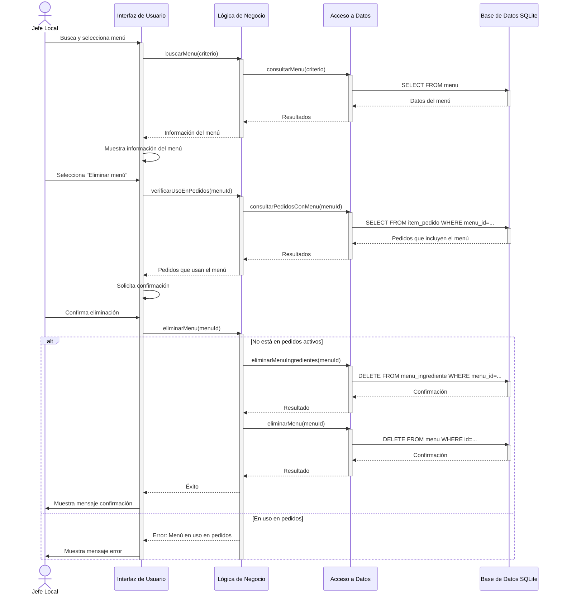
```mermaid
sequenceDiagram
    actor JL as Jefe Local
    participant UI as Interfaz de Usuario
    participant LN as Lógica de Negocio
    participant DA as Acceso a Datos
    participant DB as Base de Datos SQLite
    
    JL->>UI: Busca y selecciona menú
    activate UI
    UI->>LN: buscarMenu(criterio)
    activate LN
    LN->>DA: consultarMenu(criterio)
    activate DA
    DA->>DB: SELECT FROM menu
    activate DB
    DB-->>DA: Datos del menú
    deactivate DB
    DA-->>LN: Resultados
    deactivate DA
    LN-->>UI: Información del menú
    deactivate LN
    
    UI->>UI: Muestra información del menú
    JL->>UI: Selecciona "Eliminar menú"
    
    UI->>LN: verificarUsoEnPedidos(menuId)
    activate LN
    LN->>DA: consultarPedidosConMenu(menuId)
    activate DA
    DA->>DB: SELECT FROM item_pedido WHERE menu_id=...
    activate DB
    DB-->>DA: Pedidos que incluyen el menú
    deactivate DB
    DA-->>LN: Resultados
    deactivate DA
    LN-->>UI: Pedidos que usan el menú
    deactivate LN
    
    UI->>UI: Solicita confirmación
    JL->>UI: Confirma eliminación
    
    UI->>LN: eliminarMenu(menuId)
    activate LN
    
    alt No está en pedidos activos
        LN->>DA: eliminarMenuIngredientes(menuId)
        activate DA
        DA->>DB: DELETE FROM menu_ingrediente WHERE menu_id=...
        activate DB
        DB-->>DA: Confirmación
        deactivate DB
        DA-->>LN: Resultado
        deactivate DA
        
        LN->>DA: eliminarMenu(menuId)
        activate DA
        DA->>DB: DELETE FROM menu WHERE id=...
        activate DB
        DB-->>DA: Confirmación
        deactivate DB
        DA-->>LN: Resultado
        deactivate DA
        
        LN-->>UI: Éxito
        UI->>JL: Muestra mensaje confirmación
    else En uso en pedidos
        LN-->>UI: Error: Menú en uso en pedidos
        UI->>JL: Muestra mensaje error
    end
    deactivate LN
    deactivate UI
```

#### CU-A14: Asignar Ingredientes a Menú

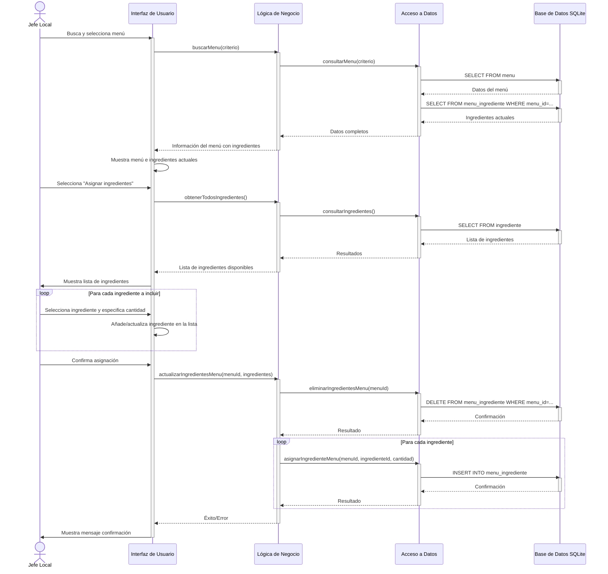
```mermaid
sequenceDiagram
    actor JL as Jefe Local
    participant UI as Interfaz de Usuario
    participant LN as Lógica de Negocio
    participant DA as Acceso a Datos
    participant DB as Base de Datos SQLite
    
    JL->>UI: Busca y selecciona menú
    activate UI
    UI->>LN: buscarMenu(criterio)
    activate LN
    LN->>DA: consultarMenu(criterio)
    activate DA
    DA->>DB: SELECT FROM menu
    activate DB
    DB-->>DA: Datos del menú
    deactivate DB
    
    DA->>DB: SELECT FROM menu_ingrediente WHERE menu_id=...
    activate DB
    DB-->>DA: Ingredientes actuales
    deactivate DB
    
    DA-->>LN: Datos completos
    deactivate DA
    LN-->>UI: Información del menú con ingredientes
    deactivate LN
    
    UI->>UI: Muestra menú e ingredientes actuales
    JL->>UI: Selecciona "Asignar ingredientes"
    
    UI->>LN: obtenerTodosIngredientes()
    activate LN
    LN->>DA: consultarIngredientes()
    activate DA
    DA->>DB: SELECT FROM ingrediente
    activate DB
    DB-->>DA: Lista de ingredientes
    deactivate DB
    DA-->>LN: Resultados
    deactivate DA
    LN-->>UI: Lista de ingredientes disponibles
    deactivate LN
    
    UI->>JL: Muestra lista de ingredientes
    
    loop Para cada ingrediente a incluir
        JL->>UI: Selecciona ingrediente y especifica cantidad
        UI->>UI: Añade/actualiza ingrediente en la lista
    end
    
    JL->>UI: Confirma asignación
    
    UI->>LN: actualizarIngredientesMenu(menuId, ingredientes)
    activate LN
    
    LN->>DA: eliminarIngredientesMenu(menuId)
    activate DA
    DA->>DB: DELETE FROM menu_ingrediente WHERE menu_id=...
    activate DB
    DB-->>DA: Confirmación
    deactivate DB
    DA-->>LN: Resultado
    deactivate DA
    
    loop Para cada ingrediente
        LN->>DA: asignarIngredienteMenu(menuId, ingredienteId, cantidad)
        activate DA
        DA->>DB: INSERT INTO menu_ingrediente
        activate DB
        DB-->>DA: Confirmación
        deactivate DB
        DA-->>LN: Resultado
        deactivate DA
    end
    
    LN-->>UI: Éxito/Error
    deactivate LN
    UI->>JL: Muestra mensaje confirmación
    deactivate UI
```

#### CU-A15: Verificar Disponibilidad de Menú

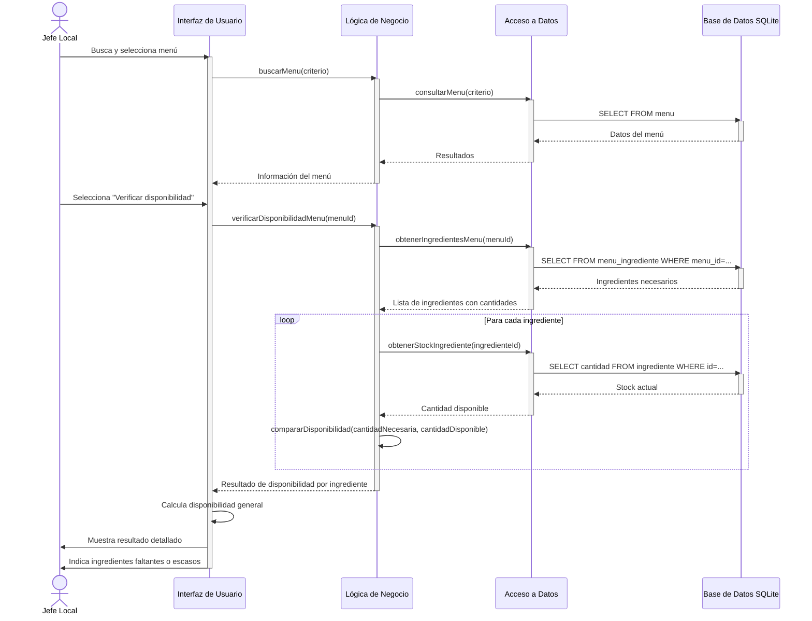
```mermaid
sequenceDiagram
    actor JL as Jefe Local
    participant UI as Interfaz de Usuario
    participant LN as Lógica de Negocio
    participant DA as Acceso a Datos
    participant DB as Base de Datos SQLite
    
    JL->>UI: Busca y selecciona menú
    activate UI
    UI->>LN: buscarMenu(criterio)
    activate LN
    LN->>DA: consultarMenu(criterio)
    activate DA
    DA->>DB: SELECT FROM menu
    activate DB
    DB-->>DA: Datos del menú
    deactivate DB
    DA-->>LN: Resultados
    deactivate DA
    LN-->>UI: Información del menú
    deactivate LN
    
    JL->>UI: Selecciona "Verificar disponibilidad"
    
    UI->>LN: verificarDisponibilidadMenu(menuId)
    activate LN
    
    LN->>DA: obtenerIngredientesMenu(menuId)
    activate DA
    DA->>DB: SELECT FROM menu_ingrediente WHERE menu_id=...
    activate DB
    DB-->>DA: Ingredientes necesarios
    deactivate DB
    DA-->>LN: Lista de ingredientes con cantidades
    deactivate DA
    
    loop Para cada ingrediente
        LN->>DA: obtenerStockIngrediente(ingredienteId)
        activate DA
        DA->>DB: SELECT cantidad FROM ingrediente WHERE id=...
        activate DB
        DB-->>DA: Stock actual
        deactivate DB
        DA-->>LN: Cantidad disponible
        deactivate DA
        LN->>LN: compararDisponibilidad(cantidadNecesaria, cantidadDisponible)
    end
    
    LN-->>UI: Resultado de disponibilidad por ingrediente
    deactivate LN
    
    UI->>UI: Calcula disponibilidad general
    UI->>JL: Muestra resultado detallado
    UI->>JL: Indica ingredientes faltantes o escasos
    deactivate UI
```

### Gestión de Pedidos

#### CU-A16: Crear Pedido

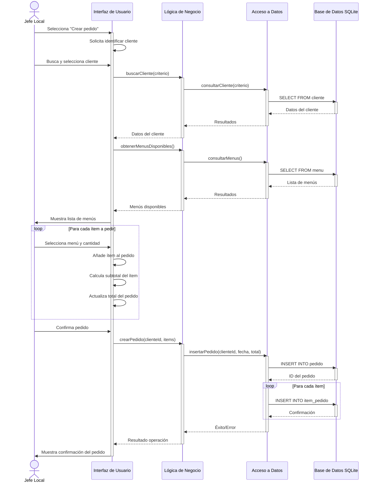
```mermaid
sequenceDiagram
    actor JL as Jefe Local
    participant UI as Interfaz de Usuario
    participant LN as Lógica de Negocio
    participant DA as Acceso a Datos
    participant DB as Base de Datos SQLite
    
    JL->>UI: Selecciona "Crear pedido"
    activate UI
    UI->>UI: Solicita identificar cliente
    
    JL->>UI: Busca y selecciona cliente
    UI->>LN: buscarCliente(criterio)
    activate LN
    LN->>DA: consultarCliente(criterio)
    activate DA
    DA->>DB: SELECT FROM cliente
    activate DB
    DB-->>DA: Datos del cliente
    deactivate DB
    DA-->>LN: Resultados
    deactivate DA
    LN-->>UI: Datos del cliente
    deactivate LN
    
    UI->>LN: obtenerMenusDisponibles()
    activate LN
    LN->>DA: consultarMenus()
    activate DA
    DA->>DB: SELECT FROM menu
    activate DB
    DB-->>DA: Lista de menús
    deactivate DB
    DA-->>LN: Resultados
    deactivate DA
    LN-->>UI: Menús disponibles
    deactivate LN
    
    UI->>JL: Muestra lista de menús
    
    loop Para cada ítem a pedir
        JL->>UI: Selecciona menú y cantidad
        UI->>UI: Añade ítem al pedido
        UI->>UI: Calcula subtotal del ítem
        UI->>UI: Actualiza total del pedido
    end
    
    JL->>UI: Confirma pedido
    
    UI->>LN: crearPedido(clienteId, items)
    activate LN
    LN->>DA: insertarPedido(clienteId, fecha, total)
    activate DA
    DA->>DB: INSERT INTO pedido
    activate DB
    DB-->>DA: ID del pedido
    deactivate DB
    
    loop Para cada ítem
        DA->>DB: INSERT INTO item_pedido
        activate DB
        DB-->>DA: Confirmación
        deactivate DB
    end
    
    DA-->>LN: Éxito/Error
    deactivate DA
    LN-->>UI: Resultado operación
    deactivate LN
    
    UI->>JL: Muestra confirmación del pedido
    deactivate UI
```

#### CU:A17: Editar Pedido

```mermaid
sequenceDiagram
    actor JL as Jefe Local
    participant UI as Interfaz de Usuario
    participant LN as Lógica de Negocio
    participant DA as Acceso a Datos
    participant DB as Base de Datos SQLite
    
    JL->>UI: Busca y selecciona pedido
    activate UI
    UI->>LN: buscarPedido(criterio)
    activate LN
    LN->>DA: consultarPedido(criterio)
    activate DA
    DA->>DB: SELECT FROM pedido
    activate DB
    DB-->>DA: Datos del pedido
    deactivate DB
    
    DA->>DB: SELECT FROM item_pedido WHERE pedido_id=...
    activate DB
    DB-->>DA: Ítems del pedido
    deactivate DB
    
    DA-->>LN: Datos completos
    deactivate DA
    LN-->>UI: Información del pedido
    deactivate LN
    
    UI->>UI: Muestra detalles del pedido
    JL->>UI: Selecciona "Editar pedido"
    UI->>UI: Habilita edición
    
    alt Modificar ítems
        UI->>LN: obtenerMenusDisponibles()
        activate LN
        LN->>DA: consultarMenus()
        activate DA
        DA->>DB: SELECT FROM menu
        activate DB
        DB-->>DA: Lista de menús
        deactivate DB
        DA-->>LN: Resultados
        deactivate DA
        LN-->>UI: Menús disponibles
        deactivate LN
        
        UI->>JL: Muestra menús y los ítems actuales
        
        loop Para modificaciones de ítems
            JL->>UI: Agrega/elimina ítems o modifica cantidades
            UI->>UI: Actualiza lista y recalcula total
        end
    end
    
    JL->>UI: Confirma cambios
    
    UI->>LN: actualizarPedido(pedidoId, items)
    activate LN
    LN->>DA: modificarPedido(pedidoId, total)
    activate DA
    DA->>DB: UPDATE pedido
    activate DB
    DB-->>DA: Confirmación
    deactivate DB
    
    DA->>DB: DELETE FROM item_pedido WHERE pedido_id=...
    activate DB
    DB-->>DA: Confirmación
    deactivate BD
    
    loop Para cada ítem
        DA->>DB: INSERT INTO item_pedido
        activate DB
        DB-->>DA: Confirmación
        deactivate BD
    end
    
    DA-->>LN: Éxito/Error
    deactivate DA
    LN-->>UI: Resultado operación
    deactivate LN
    
    UI->>JL: Muestra confirmación de actualización
    deactivate UI
```

#### CU-A18: Cancelar Pedido

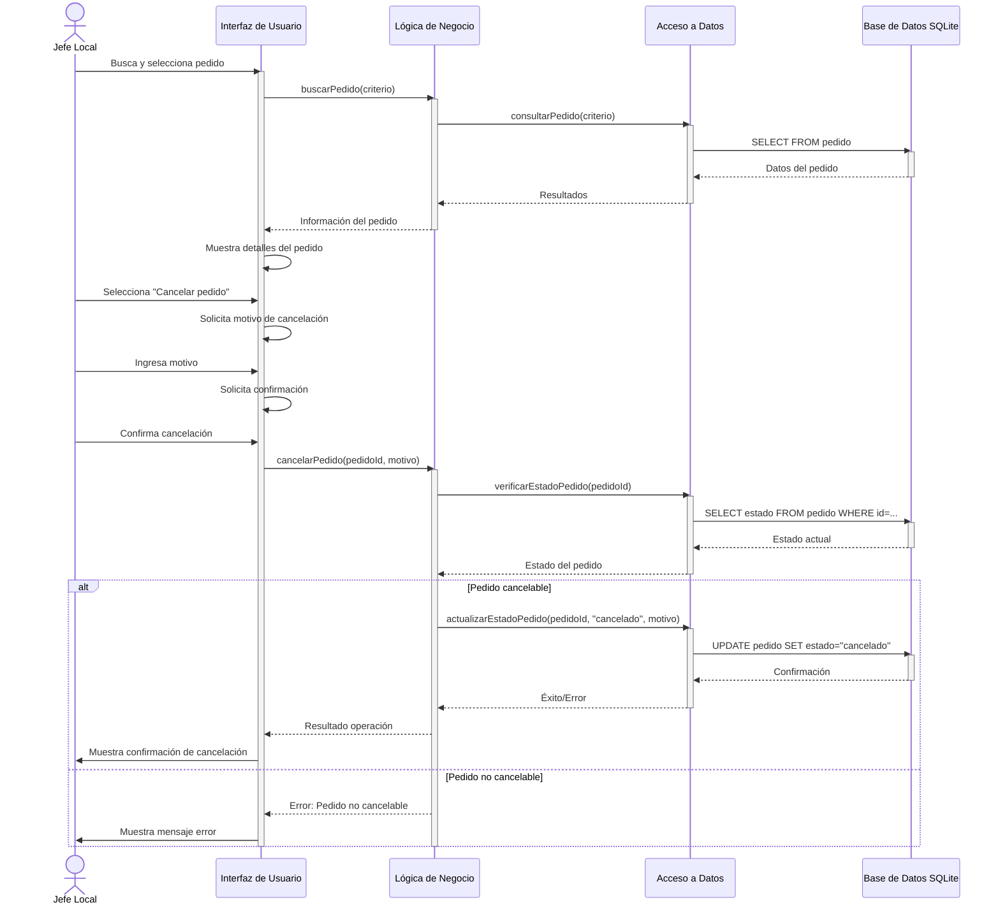
```mermaid
sequenceDiagram
    actor JL as Jefe Local
    participant UI as Interfaz de Usuario
    participant LN as Lógica de Negocio
    participant DA as Acceso a Datos
    participant DB as Base de Datos SQLite
    
    JL->>UI: Busca y selecciona pedido
    activate UI
    UI->>LN: buscarPedido(criterio)
    activate LN
    LN->>DA: consultarPedido(criterio)
    activate DA
    DA->>DB: SELECT FROM pedido
    activate DB
    DB-->>DA: Datos del pedido
    deactivate DB
    DA-->>LN: Resultados
    deactivate DA
    LN-->>UI: Información del pedido
    deactivate LN
    
    UI->>UI: Muestra detalles del pedido
    JL->>UI: Selecciona "Cancelar pedido"
    UI->>UI: Solicita motivo de cancelación
    JL->>UI: Ingresa motivo
    UI->>UI: Solicita confirmación
    JL->>UI: Confirma cancelación
    
    UI->>LN: cancelarPedido(pedidoId, motivo)
    activate LN
    
    LN->>DA: verificarEstadoPedido(pedidoId)
    activate DA
    DA->>DB: SELECT estado FROM pedido WHERE id=...
    activate DB
    DB-->>DA: Estado actual
    deactivate DB
    DA-->>LN: Estado del pedido
    deactivate DA
    
    alt Pedido cancelable
        LN->>DA: actualizarEstadoPedido(pedidoId, "cancelado", motivo)
        activate DA
        DA->>DB: UPDATE pedido SET estado="cancelado"
        activate DB
        DB-->>DA: Confirmación
        deactivate DB
        DA-->>LN: Éxito/Error
        deactivate DA
        LN-->>UI: Resultado operación
        UI->>JL: Muestra confirmación de cancelación
    else Pedido no cancelable
        LN-->>UI: Error: Pedido no cancelable
        UI->>JL: Muestra mensaje error
    end
    deactivate LN
    deactivate UI
```

#### CU-A19: Asignar Cliente a Pedido

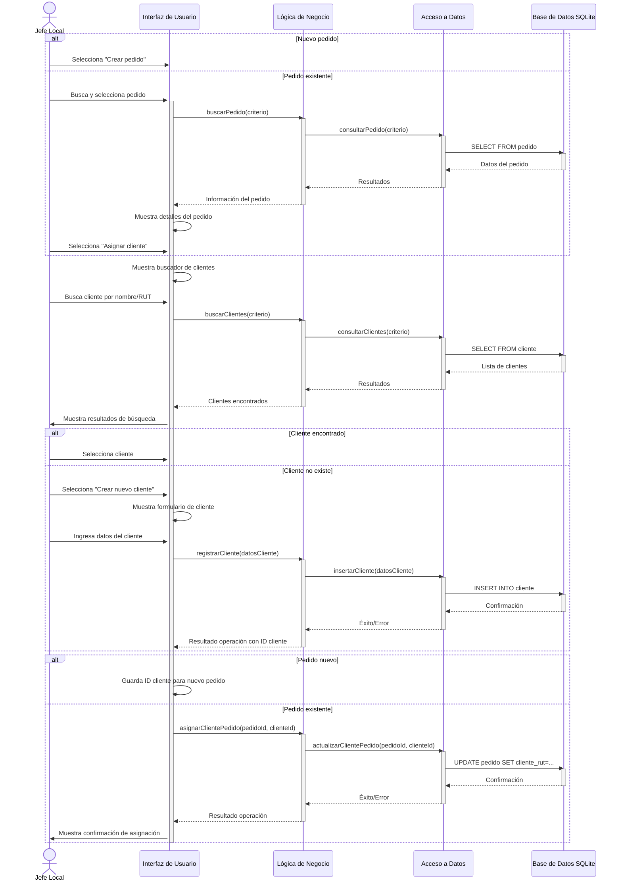
```mermaid
sequenceDiagram
    actor JL as Jefe Local
    participant UI as Interfaz de Usuario
    participant LN as Lógica de Negocio
    participant DA as Acceso a Datos
    participant DB as Base de Datos SQLite
    
    alt Nuevo pedido
        JL->>UI: Selecciona "Crear pedido"
        activate UI
    else Pedido existente
        JL->>UI: Busca y selecciona pedido
        activate UI
        UI->>LN: buscarPedido(criterio)
        activate LN
        LN->>DA: consultarPedido(criterio)
        activate DA
        DA->>DB: SELECT FROM pedido
        activate DB
        DB-->>DA: Datos del pedido
        deactivate DB
        DA-->>LN: Resultados
        deactivate DA
        LN-->>UI: Información del pedido
        deactivate LN
        UI->>UI: Muestra detalles del pedido
        JL->>UI: Selecciona "Asignar cliente"
    end
    
    UI->>UI: Muestra buscador de clientes
    JL->>UI: Busca cliente por nombre/RUT
    
    UI->>LN: buscarClientes(criterio)
    activate LN
    LN->>DA: consultarClientes(criterio)
    activate DA
    DA->>DB: SELECT FROM cliente
    activate DB
    DB-->>DA: Lista de clientes
    deactivate DB
    DA-->>LN: Resultados
    deactivate DA
    LN-->>UI: Clientes encontrados
    deactivate LN
    
    UI->>JL: Muestra resultados de búsqueda
    
    alt Cliente encontrado
        JL->>UI: Selecciona cliente
    else Cliente no existe
        JL->>UI: Selecciona "Crear nuevo cliente"
        UI->>UI: Muestra formulario de cliente
        JL->>UI: Ingresa datos del cliente
        UI->>LN: registrarCliente(datosCliente)
        activate LN
        LN->>DA: insertarCliente(datosCliente)
        activate DA
        DA->>DB: INSERT INTO cliente
        activate DB
        DB-->>DA: Confirmación
        deactivate DB
        DA-->>LN: Éxito/Error
        deactivate DA
        LN-->>UI: Resultado operación con ID cliente
        deactivate LN
    end
    
    alt Pedido nuevo
        UI->>UI: Guarda ID cliente para nuevo pedido
    else Pedido existente
        UI->>LN: asignarClientePedido(pedidoId, clienteId)
        activate LN
        LN->>DA: actualizarClientePedido(pedidoId, clienteId)
        activate DA
        DA->>DB: UPDATE pedido SET cliente_rut=...
        activate DB
        DB-->>DA: Confirmación
        deactivate DB
        DA-->>LN: Éxito/Error
        deactivate DA
        LN-->>UI: Resultado operación
        deactivate LN
        UI->>JL: Muestra confirmación de asignación
    end
    deactivate UI
```

#### CU-A20: Agregar Menús a Pedido

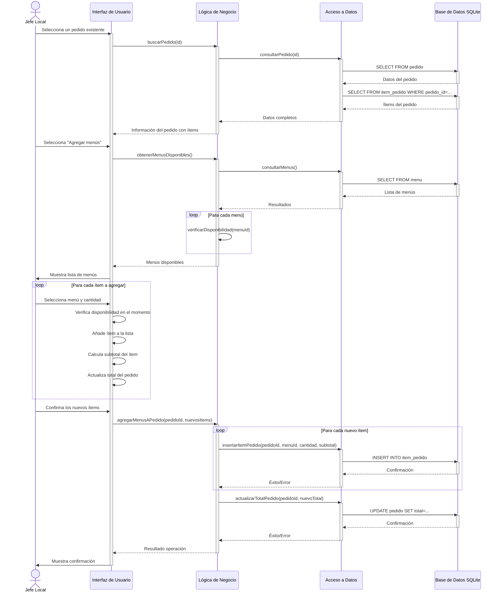
```mermaid
sequenceDiagram
    actor JL as Jefe Local
    participant UI as Interfaz de Usuario
    participant LN as Lógica de Negocio
    participant DA as Acceso a Datos
    participant DB as Base de Datos SQLite
    
    JL->>UI: Selecciona un pedido existente
    activate UI
    UI->>LN: buscarPedido(id)
    activate LN
    LN->>DA: consultarPedido(id)
    activate DA
    DA->>DB: SELECT FROM pedido
    activate DB
    DB-->>DA: Datos del pedido
    deactivate DB
    
    DA->>DB: SELECT FROM item_pedido WHERE pedido_id=...
    activate DB
    DB-->>DA: Ítems del pedido
    deactivate DB
    
    DA-->>LN: Datos completos
    deactivate DA
    LN-->>UI: Información del pedido con ítems
    deactivate LN
    
    JL->>UI: Selecciona "Agregar menús"
    
    UI->>LN: obtenerMenusDisponibles()
    activate LN
    LN->>DA: consultarMenus()
    activate DA
    DA->>DB: SELECT FROM menu
    activate DB
    DB-->>DA: Lista de menús
    deactivate DB
    DA-->>LN: Resultados
    deactivate DA
    
    loop Para cada menú
        LN->>LN: verificarDisponibilidad(menuId)
    end
    
    LN-->>UI: Menús disponibles
    deactivate LN
    
    UI->>JL: Muestra lista de menús
    
    loop Para cada ítem a agregar
        JL->>UI: Selecciona menú y cantidad
        UI->>UI: Verifica disponibilidad en el momento
        UI->>UI: Añade ítem a la lista
        UI->>UI: Calcula subtotal del ítem
        UI->>UI: Actualiza total del pedido
    end
    
    JL->>UI: Confirma los nuevos ítems
    
    UI->>LN: agregarMenusAPedido(pedidoId, nuevosItems)
    activate LN
    
    loop Para cada nuevo ítem
        LN->>DA: insertarItemPedido(pedidoId, menuId, cantidad, subtotal)
        activate DA
        DA->>DB: INSERT INTO item_pedido
        activate DB
        DB-->>DA: Confirmación
        deactivate DB
        DA-->>LN: Éxito/Error
        deactivate DA
    end
    
    LN->>DA: actualizarTotalPedido(pedidoId, nuevoTotal)
    activate DA
    DA->>DB: UPDATE pedido SET total=...
    activate DB
    DB-->>DA: Confirmación
    deactivate DB
    DA-->>LN: Éxito/Error
    deactivate DA
    
    LN-->>UI: Resultado operación
    deactivate LN
    UI->>JL: Muestra confirmación
    deactivate UI
```

#### CU-A21: Generar Boleta

```mermaid
sequenceDiagram
    actor JL as Jefe Local
    participant UI as Interfaz de Usuario
    participant LN as Lógica de Negocio
    participant DA as Acceso a Datos
    participant DB as Base de Datos SQLite
    
    JL->>UI: Selecciona un pedido completado
    activate UI
    UI->>LN: buscarPedido(id)
    activate LN
    LN->>DA: consultarPedido(id)
    activate DA
    DA->>DB: SELECT FROM pedido
    activate DB
    DB-->>DA: Datos del pedido
    deactivate DB
    
    DA->>DB: SELECT FROM cliente WHERE rut=pedido.cliente_rut
    activate DB
    DB-->>DA: Datos del cliente
    deactivate DB
    
    DA->>DB: SELECT FROM item_pedido WHERE pedido_id=...
    activate DB
    DB-->>DA: Ítems del pedido
    deactivate DB
    
    loop Para cada ítem
        DA->>DB: SELECT FROM menu WHERE id=item.menu_id
        activate DB
        DB-->>DA: Datos del menú
        deactivate DB
    end
    
    DA-->>LN: Datos completos
    deactivate DA
    LN-->>UI: Información completa
    deactivate LN
    
    JL->>UI: Selecciona "Generar boleta"
    
    UI->>LN: generarBoleta(pedidoId)
    activate LN
    LN->>LN: calcularImpuestos(totalPedido)
    LN->>LN: generarNumeroBoleta()
    
    LN->>DA: registrarBoleta(pedidoId, numeroBoleta, total, impuestos)
    activate DA
    DA->>DB: INSERT INTO boleta
    activate DB
    DB-->>DA: Confirmación
    deactivate DB
    DA-->>LN: Éxito/Error
    deactivate DA
    
    LN->>DA: actualizarEstadoPedido(pedidoId, "pagado")
    activate DA
    DA->>DB: UPDATE pedido SET estado="pagado"
    activate DB
    DB-->>DA: Confirmación
    deactivate DB
    DA-->>LN: Éxito/Error
    deactivate DA
    
    LN-->>UI: Datos de la boleta
    deactivate LN
    
    UI->>UI: Genera vista previa de boleta
    UI->>JL: Muestra boleta para impresión
    
    JL->>UI: Selecciona "Imprimir boleta"
    UI->>UI: Envía a impresora
    UI->>JL: Muestra confirmación
    deactivate UI
```

### Generación de Reportes

#### CU-A22: Generar Reporte de Ventas

```mermaid
sequenceDiagram
    actor JL as Jefe Local
    participant UI as Interfaz de Usuario
    participant LN as Lógica de Negocio
    participant DA as Acceso a Datos
    participant DB as Base de Datos SQLite
    
    JL->>UI: Selecciona "Reportes" -> "Reporte de ventas"
    activate UI
    UI->>UI: Muestra selector de fechas
    JL->>UI: Ingresa rango de fechas
    
    UI->>LN: generarReporteVentas(fechaInicio, fechaFin)
    activate LN
    LN->>DA: consultarVentasEnPeriodo(fechaInicio, fechaFin)
    activate DA
    DA->>DB: SELECT FROM pedido WHERE fecha BETWEEN...
    activate DB
    DB-->>DA: Lista de pedidos
    deactivate DB
    
    loop Para cada pedido
        DA->>DB: SELECT FROM item_pedido WHERE pedido_id=...
        activate DB
        DB-->>DA: Ítems del pedido
        deactivate DB
    end
    
    DA-->>LN: Datos completos de ventas
    deactivate DA
    
    LN->>LN: calcularTotalVentas(pedidos)
    LN->>LN: categorizarVentasPorDia(pedidos)
    LN->>LN: identificarMenusMasVendidos(pedidos)
    
    LN-->>UI: Datos procesados para reporte
    deactivate LN
    
    UI->>UI: Genera visualización del reporte
    UI->>JL: Muestra reporte de ventas
    
    alt Exportar reporte
        JL->>UI: Selecciona "Exportar"
        UI->>UI: Formatea reporte para impresión
        UI->>JL: Genera archivo PDF/Excel
    end
    deactivate UI
```

#### CU-A23: Ver Estadísticas Básicas

```mermaid
sequenceDiagram
    actor JL as Jefe Local
    participant UI as Interfaz de Usuario
    participant LN as Lógica de Negocio
    participant DA as Acceso a Datos
    participant DB as Base de Datos SQLite
    
    JL->>UI: Selecciona "Estadísticas"
    activate UI
    
    UI->>LN: obtenerEstadisticasGenerales()
    activate LN
    
    LN->>DA: contarPedidosDelDia()
    activate DA
    DA->>DB: SELECT COUNT(*) FROM pedido WHERE fecha=current_date
    activate DB
    DB-->>DA: Cantidad de pedidos
    deactivate DB
    DA-->>LN: Número de pedidos
    deactivate DA
    
    LN->>DA: calcularTotalVentasDia()
    activate DA
    DA->>DB: SELECT SUM(total) FROM pedido WHERE fecha=current_date
    activate DB
    DB-->>DA: Total ventas
    deactivate DB
    DA-->>LN: Total ventas
    deactivate DA
    
    LN->>DA: contarClientesAtendidos()
    activate DA
    DA->>DB: SELECT COUNT(DISTINCT cliente_rut) FROM pedido WHERE fecha=current_date
    activate DB
    DB-->>DA: Cantidad de clientes
    deactivate DB
    DA-->>LN: Número de clientes
    deactivate DA
    
    LN->>LN: calcularPromedioVentaPorPedido()
    
    LN-->>UI: Estadísticas básicas calculadas
    deactivate LN
    
    UI->>UI: Genera visualización de estadísticas
    UI->>JL: Muestra panel de estadísticas
    
    alt Cambiar período
        JL->>UI: Selecciona otro período de tiempo
        UI->>LN: obtenerEstadisticasPeriodo(fechaInicio, fechaFin)
        activate LN
        LN->>DA: consultarDatosPeriodo(fechaInicio, fechaFin)
        activate DA
        DA->>DB: Consultas con filtro de fechas
        activate DB
        DB-->>DA: Datos del período
        deactivate DB
        DA-->>LN: Resultados
        deactivate DA
        LN-->>UI: Estadísticas del período
        deactivate LN
        UI->>UI: Actualiza visualización
        UI->>JL: Muestra estadísticas actualizadas
    end
    deactivate UI
```

#### CU-24: Ver Uso de Ingredientes

```mermaid
sequenceDiagram
    actor JL as Jefe Local
    participant UI as Interfaz de Usuario
    participant LN as Lógica de Negocio
    participant DA as Acceso a Datos
    participant DB as Base de Datos SQLite
    
    JL->>UI: Selecciona "Uso de ingredientes"
    activate UI
    UI->>UI: Muestra selector de fechas
    JL->>UI: Ingresa rango de fechas
    
    UI->>LN: analizarUsoIngredientes(fechaInicio, fechaFin)
    activate LN
    
    LN->>DA: obtenerTodosIngredientes()
    activate DA
    DA->>DB: SELECT FROM ingrediente
    activate DB
    DB-->>DA: Lista de ingredientes
    deactivate DB
    DA-->>LN: Ingredientes disponibles
    deactivate DA
    
    LN->>DA: obtenerPedidosEnPeriodo(fechaInicio, fechaFin)
    activate DA
    DA->>DB: SELECT FROM pedido WHERE fecha BETWEEN...
    activate DB
    DB-->>DA: Pedidos en el período
    deactivate DB
    DA-->>LN: Lista de pedidos
    deactivate DA
    
    loop Para cada pedido
        LN->>DA: obtenerItemsPedido(pedidoId)
        activate DA
        DA->>DB: SELECT FROM item_pedido WHERE pedido_id=...
        activate DB
        DB-->>DA: Ítems del pedido
        deactivate DB
        DA-->>LN: Ítems
        deactivate DA
        
        loop Para cada ítem
            LN->>DA: obtenerIngredientesMenu(menuId)
            activate DA
            DA->>DB: SELECT FROM menu_ingrediente WHERE menu_id=...
            activate DB
            DB-->>DA: Ingredientes del menú
            deactivate DB
            DA-->>LN: Ingredientes y cantidades
            deactivate DA
            
            loop Para cada ingrediente
                LN->>LN: registrarUsoIngrediente(ingredienteId, cantidad * itemCantidad)
            end
        end
    end
    
    LN->>LN: calcularTotalesPorIngrediente()
    LN->>LN: identificarIngredientesMasUtilizados()
    LN->>LN: calcularCostoPorIngrediente()
    
    LN-->>UI: Análisis completo de uso de ingredientes
    deactivate LN
    
    UI->>UI: Genera visualización del análisis
    UI->>JL: Muestra reporte de uso de ingredientes
    
    alt Filtrar por categoría
        JL->>UI: Selecciona categoría de ingredientes
        UI->>UI: Filtra resultados por categoría
        UI->>JL: Muestra resultados filtrados
    end
    
    alt Ordenar resultados
        JL->>UI: Selecciona criterio de ordenamiento
        UI->>UI: Reordena resultados
        UI->>JL: Muestra resultados reordenados
    end
    deactivate UI
```

## SISTEMA REFACTORIZADO (PARTE 1)

El sistema refactorizado implementa una arquitectura web moderna siguiendo principios de Clean Architecture con las siguientes capas:

### Frontend
- **Componentes UI**: Interfaces de usuario en React
- **Gestión de Estado**: Manejo centralizado del estado con Redux/Context
- **Servicios API**: Comunicación con el backend

### Backend
- **Capa de Presentación**: API Controllers y Serializers
- **Capa de Servicios**: Services, Casos de Uso e Interfaces de Repositories
- **Capa de Dominio**: Entidades, Value Objects y Reglas de Negocio
- **Capa de Infraestructura**: Repositories, ORM y Servicios Externos

### Gestión de Clientes (Refactorizado)

#### CU-R01: Registrar Cliente

```mermaid
sequenceDiagram
    actor Usuario as Usuario (JL/JT/ME)
    participant UI as Frontend UI
    participant GE as Gestión Estado
    participant SA as Servicios API
    participant AC as API Controller
    participant SZ as Serializer
    participant SV as Service
    participant RP as Repository
    participant ORM as ORM Django
    participant BD as Base de Datos

    Usuario->>UI: Selecciona "Registrar cliente"
    activate UI
    UI->>UI: Muestra formulario
    Usuario->>UI: Ingresa datos del cliente
    UI->>UI: Validación en tiempo real

    alt Datos validados correctamente
        UI->>GE: dispatch(registerClient(datos))
        activate GE
        GE->>SA: postClient(datos)
        activate SA
        SA->>AC: POST /api/clients
        activate AC
        AC->>SZ: ClienteSerializer(data)
        activate SZ
        SZ->>SZ: Validar datos
        SZ-->>AC: Datos validados
        deactivate SZ
        
        AC->>SV: registrarCliente(datos)
        activate SV
        SV->>RP: addClient(clienteEntity)
        activate RP
        RP->>ORM: Cliente.objects.create()
        activate ORM
        ORM->>BD: INSERT INTO cliente...
        activate BD
        BD-->>ORM: Confirmación
        deactivate BD
        ORM-->>RP: Cliente creado
        deactivate ORM
        RP-->>SV: Cliente creado
        deactivate RP
        SV-->>AC: ClienteDTO
        deactivate SV
        
        AC->>SZ: ClienteSerializer(cliente)
        activate SZ
        SZ-->>AC: JSON response
        deactivate SZ
        AC-->>SA: Response 201 Created
        deactivate AC
        SA-->>GE: Cliente creado
        deactivate SA
        GE->>UI: Actualiza estado
        deactivate GE
        UI->>Usuario: Notificación de éxito
    else Datos inválidos
        UI->>Usuario: Muestra errores en tiempo real
    end
    deactivate UI
```

#### CU-R02: Editar Cliente

```mermaid
sequenceDiagram
    actor Usuario as Usuario (JL/JT/ME)
    participant UI as Frontend UI
    participant GE as Gestión Estado
    participant SA as Servicios API
    participant AC as API Controller
    participant SZ as Serializer
    participant SV as Service
    participant RP as Repository
    participant ORM as ORM Django
    participant BD as Base de Datos

    Usuario->>UI: Busca y selecciona cliente
    activate UI
    UI->>GE: dispatch(searchClient(criterio))
    activate GE
    GE->>SA: getClients(params)
    activate SA
    SA->>AC: GET /api/clients?q={criterio}
    activate AC
    AC->>SV: buscarCliente(criterio)
    activate SV
    SV->>RP: findByQuery(criterio)
    activate RP
    RP->>ORM: Cliente.objects.filter()
    activate ORM
    ORM->>BD: SELECT FROM cliente WHERE...
    activate BD
    BD-->>ORM: Resultados
    deactivate BD
    ORM-->>RP: Clientes encontrados
    deactivate ORM
    RP-->>SV: Lista ClienteDTO
    deactivate RP
    SV-->>AC: Lista ClienteDTO
    deactivate SV
    
    AC->>SZ: ClienteSerializer(clientes, many=True)
    activate SZ
    SZ-->>AC: JSON response
    deactivate SZ
    AC-->>SA: Response 200 OK
    deactivate AC
    SA-->>GE: Lista de clientes
    deactivate SA
    GE->>UI: Actualiza estado
    deactivate GE

    UI->>Usuario: Muestra resultados
    Usuario->>UI: Selecciona cliente para editar
    UI->>UI: Muestra formulario con datos existentes
    Usuario->>UI: Modifica información
    UI->>UI: Validación en tiempo real

    alt Datos validados correctamente
        UI->>GE: dispatch(updateClient(id, datos))
        activate GE
        GE->>SA: putClient(id, datos)
        activate SA
        SA->>AC: PUT /api/clients/{id}
        activate AC
        AC->>SZ: ClienteSerializer(cliente, data)
        activate SZ
        SZ->>SZ: Validar datos
        SZ-->>AC: Datos validados
        deactivate SZ
        
        AC->>SV: actualizarCliente(id, datos)
        activate SV
        SV->>RP: update(id, clienteEntity)
        activate RP
        RP->>ORM: Cliente.objects.update()
        activate ORM
        ORM->>BD: UPDATE cliente SET...
        activate BD
        BD-->>ORM: Confirmación
        deactivate BD
        ORM-->>RP: Cliente actualizado
        deactivate ORM
        RP-->>SV: ClienteDTO actualizado
        deactivate RP
        SV-->>AC: ClienteDTO
        deactivate SV
        
        AC->>SZ: ClienteSerializer(cliente)
        activate SZ
        SZ-->>AC: JSON response
        deactivate SZ
        AC-->>SA: Response 200 OK
        deactivate AC
        SA-->>GE: Cliente actualizado
        deactivate SA
        GE->>UI: Actualiza estado
        deactivate GE
        UI->>Usuario: Notificación de éxito
    else Datos inválidos
        UI->>Usuario: Muestra errores en tiempo real
    end
    deactivate UI
```

#### CU-R03: Eliminar Cliente

```mermaid
sequenceDiagram
    actor Usuario as Usuario (JL/JT)
    participant UI as Frontend UI
    participant GE as Gestión Estado
    participant SA as Servicios API
    participant AC as API Controller
    participant SV as Service
    participant RP as Repository
    participant PRP as PedidoRepository
    participant ORM as ORM Django
    participant BD as Base de Datos

    Usuario->>UI: Selecciona cliente y elige "Eliminar"
    activate UI
    UI->>UI: Solicita confirmación
    Usuario->>UI: Confirma eliminación
    
    UI->>GE: dispatch(deleteClient(id))
    activate GE
    GE->>SA: deleteClient(id)
    activate SA
    SA->>AC: DELETE /api/clients/{id}
    activate AC
    
    AC->>SV: eliminarCliente(id)
    activate SV
    
    SV->>PRP: findPendingOrdersByClient(id)
    activate PRP
    PRP->>ORM: Pedido.objects.filter(cliente_id=id, estado__in=['pendiente', 'en_proceso'])
    activate ORM
    ORM->>BD: SELECT FROM pedido WHERE cliente_id=... AND estado IN...
    activate BD
    BD-->>ORM: Pedidos activos
    deactivate BD
    ORM-->>PRP: Lista de pedidos
    deactivate ORM
    PRP-->>SV: PedidosDTO activos
    deactivate PRP
    
    alt Sin pedidos activos
        SV->>RP: delete(id)
        activate RP
        RP->>ORM: Cliente.objects.filter(id=id).update(estado='eliminado')
        activate ORM
        ORM->>BD: UPDATE cliente SET estado='eliminado' WHERE id=...
        activate BD
        BD-->>ORM: Confirmación
        deactivate BD
        ORM-->>RP: Confirmación
        deactivate ORM
        RP-->>SV: Éxito
        deactivate RP
        SV-->>AC: Éxito
        deactivate SV
        
        AC-->>SA: Response 204 No Content
        deactivate AC
        SA-->>GE: Cliente eliminado
        deactivate SA
        GE->>UI: Actualiza estado
        deactivate GE
        UI->>Usuario: Notificación de éxito
    else Con pedidos activos
        SV-->>AC: Error: Cliente con pedidos pendientes
        deactivate SV
        AC-->>SA: Response 400 Bad Request
        deactivate AC
        SA-->>GE: Error con detalles
        deactivate SA
        GE->>UI: Actualiza estado con error
        deactivate GE
        UI->>Usuario: Muestra mensaje de error
    end
    deactivate UI
```

#### CU-R04: Buscar Cliente

```mermaid
sequenceDiagram
    actor Usuario as Usuario (JL/JT/ME)
    participant UI as Frontend UI
    participant GE as Gestión Estado
    participant SA as Servicios API
    participant AC as API Controller
    participant SZ as Serializer
    participant SV as Service
    participant RP as Repository
    participant ORM as ORM Django
    participant BD as Base de Datos

    Usuario->>UI: Ingresa criterio de búsqueda
    activate UI
    
    alt Búsqueda en tiempo real
        UI->>GE: dispatch(searchClients(criterio))
        activate GE
        GE->>SA: getClients(params)
        activate SA
        SA->>AC: GET /api/clients?q={criterio}
        activate AC
        AC->>SV: buscarClientes(criterio)
        activate SV
        SV->>RP: findByQuery(criterio)
        activate RP
        RP->>ORM: Cliente.objects.filter(Q(nombre__contains=criterio) | Q(rut__contains=criterio))
        activate ORM
        ORM->>BD: SELECT FROM cliente WHERE nombre LIKE... OR rut LIKE...
        activate BD
        BD-->>ORM: Resultados
        deactivate BD
        ORM-->>RP: Lista de clientes
        deactivate ORM
        RP-->>SV: Lista ClienteDTO
        deactivate RP
        SV-->>AC: Lista ClienteDTO
        deactivate SV
        
        AC->>SZ: ClienteSerializer(clientes, many=True)
        activate SZ
        SZ-->>AC: JSON response
        deactivate SZ
        AC-->>SA: Response 200 OK
        deactivate AC
        SA-->>GE: Lista de clientes
        deactivate SA
        GE->>UI: Actualiza estado con resultados
        deactivate GE
        UI->>Usuario: Muestra resultados en tiempo real
    end
    
    Usuario->>UI: Selecciona filtros adicionales
    UI->>GE: dispatch(applyFilters(filtros))
    activate GE
    GE->>SA: getClients(params)
    activate SA
    SA->>AC: GET /api/clients?{filtros}
    activate AC
    AC->>SV: buscarClientesConFiltros(filtros)
    activate SV
    SV->>RP: findByFilters(filtros)
    activate RP
    RP->>ORM: Cliente.objects.filter(...)
    activate ORM
    ORM->>BD: SELECT FROM cliente WHERE...
    activate BD
    BD-->>ORM: Resultados filtrados
    deactivate BD
    ORM-->>RP: Lista filtrada
    deactivate ORM
    RP-->>SV: Lista ClienteDTO
    deactivate RP
    SV-->>AC: Lista ClienteDTO
    deactivate SV
    
    AC->>SZ: ClienteSerializer(clientes, many=True)
    activate SZ
    SZ-->>AC: JSON response
    deactivate SZ
    AC-->>SA: Response 200 OK
    deactivate AC
    SA-->>GE: Lista filtrada
    deactivate SA
    GE->>UI: Actualiza estado
    deactivate GE
    
    UI->>Usuario: Muestra resultados filtrados
    Usuario->>UI: Selecciona un cliente
    UI->>GE: dispatch(selectClient(id))
    activate GE
    GE->>UI: Actualiza cliente seleccionado
    deactivate GE
    UI->>Usuario: Muestra detalles del cliente
    deactivate UI
```

#### CU-R05: Ver Historial de Pedidos

```mermaid
sequenceDiagram
    actor Usuario as Usuario (JL/JT/ME)
    participant UI as Frontend UI
    participant GE as Gestión Estado
    participant SA as Servicios API
    participant AC as API Controller
    participant SZ as Serializer
    participant SV as Service
    participant RP as Repository
    participant ORM as ORM Django
    participant BD as Base de Datos

    Usuario->>UI: Selecciona cliente y "Ver historial"
    activate UI
    
    UI->>GE: dispatch(getClientHistory(clienteId))
    activate GE
    GE->>SA: getClientOrders(clienteId)
    activate SA
    SA->>AC: GET /api/clients/{clienteId}/orders
    activate AC
    AC->>SV: obtenerHistorialPedidos(clienteId)
    activate SV
    SV->>RP: findOrdersByClient(clienteId, {includeItems: true})
    activate RP
    RP->>ORM: Pedido.objects.filter(cliente_id=clienteId)
    activate ORM
    ORM->>BD: SELECT FROM pedido WHERE cliente_id=...
    activate BD
    BD-->>ORM: Pedidos del cliente
    deactivate BD
    
    loop Para cada pedido
        ORM->>BD: SELECT FROM item_pedido WHERE pedido_id=...
        activate BD
        BD-->>ORM: Ítems del pedido
        deactivate BD
    end
    
    ORM-->>RP: Pedidos con items
    deactivate ORM
    RP-->>SV: Lista PedidoDTO
    deactivate RP
    SV->>SV: Enriquecer con datos estadísticos
    SV-->>AC: Lista PedidoDTO enriquecida
    deactivate SV
    
    AC->>SZ: PedidoSerializer(pedidos, many=True)
    activate SZ
    SZ-->>AC: JSON response
    deactivate SZ
    AC-->>SA: Response 200 OK
    deactivate AC
    SA-->>GE: Historial de pedidos
    deactivate SA
    GE->>UI: Actualiza estado
    deactivate GE
    
    UI->>UI: Organiza cronológicamente y con gráficos
    UI->>Usuario: Muestra historial detallado
    
    alt Filtrar historial
        Usuario->>UI: Aplica filtros (fechas/montos)
        UI->>GE: dispatch(filterClientHistory(clienteId, filtros))
        activate GE
        GE->>SA: getClientOrders(clienteId, filtros)
        activate SA
        SA->>AC: GET /api/clients/{clienteId}/orders?{filtros}
        activate AC
        AC->>SV: filtrarHistorialPedidos(clienteId, filtros)
        activate SV
        SV->>RP: findOrdersByClientFiltered(clienteId, filtros)
        activate RP
        RP->>ORM: Pedido.objects.filter(...)
        activate ORM
        ORM->>BD: SELECT FROM pedido WHERE cliente_id=... AND ...
        activate BD
        BD-->>ORM: Pedidos filtrados
        deactivate BD
        ORM-->>RP: Pedidos filtrados
        deactivate ORM
        RP-->>SV: Lista PedidoDTO filtrada
        deactivate RP
        SV-->>AC: Lista PedidoDTO filtrada
        deactivate SV
        
        AC->>SZ: PedidoSerializer(pedidos, many=True)
        activate SZ
        SZ-->>AC: JSON response
        deactivate SZ
        AC-->>SA: Response 200 OK
        deactivate AC
        SA-->>GE: Historial filtrado
        deactivate SA
        GE->>UI: Actualiza estado
        deactivate GE
        UI->>Usuario: Muestra resultados filtrados
    end
    deactivate UI
```

### Gestión de Ingredientes (Refactorizado)

#### CU-R06: Agregar Ingrediente

```mermaid
sequenceDiagram
    actor Usuario as Usuario (JL/JT)
    participant UI as Frontend UI
    participant GE as Gestión Estado
    participant SA as Servicios API
    participant AC as API Controller
    participant SZ as Serializer
    participant SV as IngredientService
    participant RP as IngredientRepository
    participant ORM as ORM Django
    participant BD as Base de Datos
    
    Usuario->>UI: Selecciona "Agregar ingrediente"
    activate UI
    UI->>UI: Muestra formulario
    
    Usuario->>UI: Ingresa datos del ingrediente
    UI->>UI: Validación en tiempo real
    
    alt Datos válidos
        UI->>GE: dispatch(createIngredient(datos))
        activate GE
        GE->>SA: postIngredient(datos)
        activate SA
        SA->>AC: POST /api/ingredients
        activate AC
        AC->>SZ: IngredientSerializer(data)
        activate SZ
        SZ->>SZ: Validar datos
        SZ-->>AC: Datos validados
        deactivate SZ
        
        AC->>SV: crearIngrediente(datos)
        activate SV
        SV->>SV: validarDatos(datos)
        SV->>RP: add(ingredienteEntity)
        activate RP
        RP->>ORM: Ingrediente.objects.create()
        activate ORM
        ORM->>BD: INSERT INTO ingrediente...
        activate BD
        BD-->>ORM: Confirmación
        deactivate BD
        ORM-->>RP: Ingrediente creado
        deactivate ORM
        RP-->>SV: Ingrediente creado
        deactivate RP
        
        SV->>SV: registrarMovimientoStock('entrada_inicial', datos.cantidad)
        SV-->>AC: IngredienteDTO
        deactivate SV
        
        AC->>SZ: IngredientSerializer(ingrediente)
        activate SZ
        SZ-->>AC: JSON response
        deactivate SZ
        AC-->>SA: Response 201 Created
        deactivate AC
        SA-->>GE: Ingrediente creado
        deactivate SA
        GE->>UI: Actualiza estado
        deactivate GE
        UI->>Usuario: Notificación de éxito
    else Datos inválidos
        UI->>Usuario: Muestra errores en tiempo real
    end
    deactivate UI
```

#### CU-R07: Editar Ingrediente

```mermaid
sequenceDiagram
    actor Usuario as Usuario (JL/JT/Cocina)
    participant UI as Frontend UI
    participant GE as Gestión Estado
    participant SA as Servicios API
    participant AC as API Controller
    participant SZ as Serializer
    participant SV as IngredientService
    participant RP as IngredientRepository
    participant ORM as ORM Django
    participant BD as Base de Datos
    
    Usuario->>UI: Busca y selecciona ingrediente
    activate UI
    UI->>GE: dispatch(getIngredientDetails(id))
    activate GE
    GE->>SA: getIngredient(id)
    activate SA
    SA->>AC: GET /api/ingredients/{id}
    activate AC
    AC->>SV: obtenerIngrediente(id)
    activate SV
    SV->>RP: findById(id)
    activate RP
    RP->>ORM: Ingrediente.objects.get(id=id)
    activate ORM
    ORM->>BD: SELECT FROM ingrediente WHERE id=...
    activate BD
    BD-->>ORM: Datos del ingrediente
    deactivate BD
    ORM-->>RP: Ingrediente
    deactivate ORM
    RP-->>SV: IngredienteDTO
    deactivate RP
    SV-->>AC: IngredienteDTO
    deactivate SV
    
    AC->>SZ: IngredientSerializer(ingrediente)
    activate SZ
    SZ-->>AC: JSON response
    deactivate SZ
    AC-->>SA: Response 200 OK
    deactivate AC
    SA-->>GE: Detalles del ingrediente
    deactivate SA
    GE->>UI: Actualiza estado
    deactivate GE
    
    UI->>UI: Muestra formulario con datos existentes
    Usuario->>UI: Modifica información
    UI->>UI: Validación en tiempo real
    
    alt Datos válidos
        UI->>GE: dispatch(updateIngredient(id, datos))
        activate GE
        GE->>SA: putIngredient(id, datos)
        activate SA
        SA->>AC: PUT /api/ingredients/{id}
        activate AC
        AC->>SZ: IngredientSerializer(ingrediente, data)
        activate SZ
        SZ->>SZ: Validar datos
        SZ-->>AC: Datos validados
        deactivate SZ
        
        AC->>SV: actualizarIngrediente(id, datos)
        activate SV
        SV->>SV: validarDatos(datos)
        SV->>RP: update(id, ingredienteEntity)
        activate RP
        RP->>ORM: Ingrediente.objects.filter(id=id).update()
        activate ORM
        ORM->>BD: UPDATE ingrediente SET...
        activate BD
        BD-->>ORM: Confirmación
        deactivate BD
        ORM-->>RP: Confirmación
        deactivate ORM
        RP-->>SV: Éxito
        deactivate RP
        
        SV->>SV: registrarHistorialCambio(id, 'actualización', datos)
        SV-->>AC: IngredienteDTO actualizado
        deactivate SV
        
        AC->>SZ: IngredientSerializer(ingrediente)
        activate SZ
        SZ-->>AC: JSON response
        deactivate SZ
        AC-->>SA: Response 200 OK
        deactivate AC
        SA-->>GE: Ingrediente actualizado
        deactivate SA
        GE->>UI: Actualiza estado
        deactivate GE
        UI->>Usuario: Notificación de éxito
    else Datos inválidos
        UI->>Usuario: Muestra errores en tiempo real
    end
    deactivate UI
```

#### CU-R08: Actualizar Stock

```mermaid
sequenceDiagram
    actor Usuario as Usuario (JL/JT/Cocina)
    participant UI as Frontend UI
    participant GE as Gestión Estado
    participant SA as Servicios API
    participant AC as API Controller
    participant SZ as Serializer
    participant SV as InventoryService
    participant RP as IngredientRepository
    participant ORM as ORM Django
    participant BD as Base de Datos
    participant NS as NotificationService
    
    Usuario->>UI: Busca y selecciona ingrediente
    activate UI
    Usuario->>UI: Selecciona "Actualizar stock"
    UI->>UI: Muestra formulario de actualización
    
    Usuario->>UI: Ingresa cantidad y motivo
    UI->>UI: Validación en tiempo real
    
    alt Datos válidos
        UI->>GE: dispatch(updateStock(id, {cantidad, motivo}))
        activate GE
        GE->>SA: patchIngredientStock(id, {cantidad, motivo})
        activate SA
        SA->>AC: PATCH /api/ingredients/{id}/stock
        activate AC
        AC->>SZ: StockUpdateSerializer(data)
        activate SZ
        SZ->>SZ: Validar datos
        SZ-->>AC: Datos validados
        deactivate SZ
        
        AC->>SV: actualizarStock(id, cantidad, motivo)
        activate SV
        
        SV->>RP: findById(id)
        activate RP
        RP->>ORM: Ingrediente.objects.get(id=id)
        activate ORM
        ORM->>BD: SELECT FROM ingrediente WHERE id=...
        activate BD
        BD-->>ORM: Datos del ingrediente
        deactivate BD
        ORM-->>RP: Ingrediente
        deactivate ORM
        RP-->>SV: IngredienteDTO
        deactivate RP
        
        SV->>SV: validarNuevaCantidad(stockActual, cantidad)
        SV->>RP: updateStock(id, nuevaCantidad)
        activate RP
        RP->>ORM: transaction.atomic()
        activate ORM
        ORM->>BD: UPDATE ingrediente SET cantidad=... WHERE id=...
        activate BD
        BD-->>ORM: Confirmación
        deactivate BD
        
        ORM->>BD: INSERT INTO movimiento_stock (ingrediente_id, cantidad, tipo, motivo...)
        activate BD
        BD-->>ORM: Confirmación
        deactivate BD
        ORM-->>RP: Éxito
        deactivate ORM
        RP-->>SV: Éxito
        deactivate RP
        
        alt Stock bajo nivel crítico
            SV->>NS: notificarStockCritico(ingredienteDTO)
            activate NS
            NS->>NS: enviarAlertaStockCritico(ingredienteDTO)
            NS-->>SV: Alerta enviada
            deactivate NS
        end
        
        SV-->>AC: StockUpdateResultDTO
        deactivate SV
        
        AC->>SZ: StockUpdateResultSerializer(resultado)
        activate SZ
        SZ-->>AC: JSON response
        deactivate SZ
        AC-->>SA: Response 200 OK
        deactivate AC
        SA-->>GE: Stock actualizado
        deactivate SA
        GE->>UI: Actualiza estado
        deactivate GE
        
        UI->>Usuario: Notificación de éxito
    else Datos inválidos
        UI->>Usuario: Muestra errores en tiempo real
    end
    deactivate UI
```

#### CU-R09: Eliminar Ingrediente

```mermaid
sequenceDiagram
    actor Usuario as Usuario (JL/JT)
    participant UI as Frontend UI
    participant GE as Gestión Estado
    participant SA as Servicios API
    participant AC as API Controller
    participant SV as IngredientService
    participant RP as IngredientRepository
    participant MR as MenuRepository
    participant ORM as ORM Django
    participant BD as Base de Datos
    
    Usuario->>UI: Selecciona ingrediente y "Eliminar"
    activate UI
    UI->>UI: Solicita confirmación
    Usuario->>UI: Confirma eliminación
    
    UI->>GE: dispatch(deleteIngredient(id))
    activate GE
    GE->>SA: deleteIngredient(id)
    activate SA
    SA->>AC: DELETE /api/ingredients/{id}
    activate AC
    
    AC->>SV: eliminarIngrediente(id)
    activate SV
    
    SV->>MR: findMenusUsingIngredient(id)
    activate MR
    MR->>ORM: MenuIngrediente.objects.filter(ingrediente_id=id).select_related('menu')
    activate ORM
    ORM->>BD: SELECT FROM menu_ingrediente JOIN menu... WHERE ingrediente_id=...
    activate BD
    BD-->>ORM: Menús asociados
    deactivate BD
    ORM-->>MR: Lista de menús
    deactivate ORM
    MR-->>SV: Lista de menús que usan el ingrediente
    deactivate MR
    
    alt Sin menús asociados o solo en menús inactivos
        SV->>RP: logicalDelete(id)
        activate RP
        RP->>ORM: Ingrediente.objects.filter(id=id).update(estado='eliminado')
        activate ORM
        ORM->>BD: UPDATE ingrediente SET estado='eliminado' WHERE id=...
        activate BD
        BD-->>ORM: Confirmación
        deactivate BD
        ORM-->>RP: Confirmación
        deactivate ORM
        RP-->>SV: Éxito
        deactivate RP
        
        SV->>SV: registrarHistorialCambio(id, 'eliminación')
        SV-->>AC: Éxito
        deactivate SV
        
        AC-->>SA: Response 204 No Content
        deactivate AC
        SA-->>GE: Ingrediente eliminado
        deactivate SA
        GE->>UI: Actualiza estado
        deactivate GE
        UI->>Usuario: Notificación de éxito
    else Con menús activos asociados
        SV-->>AC: Error: Ingrediente en uso en menús activos
        deactivate SV
        
        AC-->>SA: Response 400 Bad Request
        deactivate AC
        SA-->>GE: Error con detalles
        deactivate SA
        GE->>UI: Actualiza estado con error
        deactivate GE
        UI->>Usuario: Muestra error y lista de menús afectados
    end
    deactivate UI
```

#### CU-R10: Verificar Disponibilidad de Ingredientes

```mermaid
sequenceDiagram
    actor Usuario as Usuario (JL/JT/Cocina)
    participant UI as Frontend UI
    participant GE as Gestión Estado
    participant SA as Servicios API
    participant AC as API Controller
    participant SZ as Serializer
    participant SV as InventoryService
    participant RP as IngredientRepository
    participant ORM as ORM Django
    participant BD as Base de Datos
    
    Usuario->>UI: Accede a "Inventario"
    activate UI
    
    UI->>GE: dispatch(loadIngredientsStatus())
    activate GE
    GE->>SA: getIngredientsStatus()
    activate SA
    SA->>AC: GET /api/ingredients/status
    activate AC
    AC->>SV: verificarDisponibilidadIngredientes()
    activate SV
    SV->>RP: findAllWithStatus()
    activate RP
    RP->>ORM: Ingrediente.objects.all()
    activate ORM
    ORM->>BD: SELECT FROM ingrediente
    activate BD
    BD-->>ORM: Lista completa de ingredientes
    deactivate BD
    ORM-->>RP: Lista de ingredientes
    deactivate ORM
    RP-->>SV: Lista IngredienteDTO
    deactivate RP
    
    loop Por cada ingrediente
        SV->>SV: calcularEstadoDisponibilidad(ingrediente)
        SV->>SV: calcularTendenciaConsumo(ingrediente)
        SV->>SV: predecirFechaAgotamiento(ingrediente)
    end
    
    SV-->>AC: IngredientesStatusDTO
    deactivate SV
    
    AC->>SZ: IngredientStatusSerializer(data)
    activate SZ
    SZ-->>AC: JSON response
    deactivate SZ
    AC-->>SA: Response 200 OK
    deactivate AC
    SA-->>GE: Estado de ingredientes
    deactivate SA
    GE->>UI: Actualiza estado
    deactivate GE
    
    UI->>UI: Aplica códigos de color por estado
    UI->>Usuario: Muestra tablero con estado de ingredientes
    
    alt Filtrar vista
        Usuario->>UI: Selecciona filtros (categoría, estado)
        UI->>UI: Aplica filtros localmente
        UI->>Usuario: Muestra ingredientes filtrados
    end
    
    alt Ver detalles de ingrediente
        Usuario->>UI: Selecciona un ingrediente específico
        UI->>GE: dispatch(getIngredientDetails(id))
        activate GE
        GE->>SA: getIngredient(id)
        activate SA
        SA->>AC: GET /api/ingredients/{id}
        activate AC
        AC->>SV: obtenerDetallesIngrediente(id)
        activate SV
        SV->>RP: findByIdWithHistory(id)
        activate RP
        RP->>ORM: Queries para obtener detalles e historial
        activate ORM
        ORM->>BD: Múltiples consultas
        activate BD
        BD-->>ORM: Datos detallados
        deactivate BD
        ORM-->>RP: Datos completos
        deactivate ORM
        RP-->>SV: DetalleIngredienteDTO
        deactivate RP
        SV-->>AC: DetalleIngredienteDTO
        deactivate SV
        
        AC->>SZ: IngredientDetailSerializer(detalle)
        activate SZ
        SZ-->>AC: JSON response
        deactivate SZ
        AC-->>SA: Response 200 OK
        deactivate AC
        SA-->>GE: Detalles completos
        deactivate SA
        GE->>UI: Actualiza estado
        deactivate GE
        UI->>Usuario: Muestra detalles y tendencias de uso
    end
    deactivate UI
```

### Gestión de Menús (Refactorizado)

#### CU-R11: Crear Menú

```mermaid
sequenceDiagram
    actor Usuario as Usuario (JL/JT)
    participant UI as Frontend UI
    participant GE as Gestión Estado
    participant SA as Servicios API
    participant AC as API Controller
    participant SZ as Serializer
    participant SV as MenuService
    participant RP as MenuRepository
    participant IRP as IngredientRepository
    participant ORM as ORM Django
    participant BD as Base de Datos

    Usuario->>UI: Selecciona "Crear nuevo menú"
    activate UI
    UI->>UI: Muestra formulario de creación
    
    Usuario->>UI: Ingresa información básica del menú
    UI->>UI: Valida información en tiempo real
    
    Usuario->>UI: Avanza a selección de ingredientes
    UI->>GE: dispatch(loadIngredients())
    activate GE
    GE->>SA: getIngredients()
    activate SA
    SA->>AC: GET /api/ingredients
    activate AC
    AC->>SV: obtenerIngredientesDisponibles()
    activate SV
    SV->>IRP: findAvailable()
    activate IRP
    IRP->>ORM: Ingrediente.objects.filter(estado='disponible')
    activate ORM
    ORM->>BD: SELECT FROM ingrediente WHERE estado='disponible'
    activate BD
    BD-->>ORM: Lista de ingredientes
    deactivate BD
    ORM-->>IRP: Ingredientes disponibles
    deactivate ORM
    IRP-->>SV: Lista IngredienteDTO
    deactivate IRP
    SV-->>AC: Lista IngredienteDTO
    deactivate SV
    
    AC->>SZ: IngredientListSerializer(ingredientes)
    activate SZ
    SZ-->>AC: JSON response
    deactivate SZ
    AC-->>SA: Response 200 OK
    deactivate AC
    SA-->>GE: Lista de ingredientes
    deactivate SA
    GE->>UI: Actualiza estado
    deactivate GE
    
    UI->>Usuario: Muestra lista de ingredientes disponibles
    
    Usuario->>UI: Selecciona ingredientes y cantidades
    UI->>UI: Calcula costos y márgenes en tiempo real
    
    Usuario->>UI: Finaliza creación del menú
    UI->>GE: dispatch(createMenu(menuData))
    activate GE
    GE->>SA: postMenu(menuData)
    activate SA
    SA->>AC: POST /api/menus
    activate AC
    AC->>SZ: MenuCreateSerializer(data)
    activate SZ
    SZ->>SZ: Validar datos
    SZ-->>AC: Datos validados
    deactivate SZ
    
    AC->>SV: crearMenu(menuData)
    activate SV
    SV->>SV: calcularCosto(ingredientes)
    SV->>SV: verificarMargen(precio, costo)
    SV->>RP: save(menuEntity)
    activate RP
    RP->>ORM: transaction.atomic()
    activate ORM
    ORM->>BD: INSERT INTO menu...
    activate BD
    BD-->>ORM: Confirmación
    deactivate BD
    
    loop Para cada ingrediente
        ORM->>BD: INSERT INTO menu_ingrediente...
        activate BD
        BD-->>ORM: Confirmación
        deactivate BD
    end
    
    ORM-->>RP: Menú creado
    deactivate ORM
    RP-->>SV: MenuDTO
    deactivate RP
    SV-->>AC: MenuDTO
    deactivate SV
    
    AC->>SZ: MenuSerializer(menu)
    activate SZ
    SZ-->>AC: JSON response
    deactivate SZ
    AC-->>SA: Response 201 Created
    deactivate AC
    SA-->>GE: Menú creado
    deactivate SA
    GE->>UI: Actualiza estado
    deactivate GE
    UI->>Usuario: Notificación de éxito
    deactivate UI
```

#### CU-R12: Editar Menú

```mermaid
sequenceDiagram
    actor Usuario as Usuario (JL/JT)
    participant UI as Frontend UI
    participant GE as Gestión Estado
    participant SA as Servicios API
    participant AC as API Controller
    participant SZ as Serializer
    participant SV as MenuService
    participant RP as MenuRepository
    participant ORM as ORM Django
    participant BD as Base de Datos

    Usuario->>UI: Busca y selecciona menú
    activate UI
    UI->>GE: dispatch(getMenuDetails(id))
    activate GE
    GE->>SA: getMenu(id)
    activate SA
    SA->>AC: GET /api/menus/{id}
    activate AC
    AC->>SV: obtenerMenu(id)
    activate SV
    SV->>RP: findById(id, {withIngredients: true})
    activate RP
    RP->>ORM: Menu.objects.get(id=id)
    activate ORM
    ORM->>BD: SELECT FROM menu WHERE id=...
    activate BD
    BD-->>ORM: Datos del menú
    deactivate BD
    
    ORM->>BD: SELECT FROM menu_ingrediente WHERE menu_id=...
    activate BD
    BD-->>ORM: Ingredientes del menú
    deactivate BD
    ORM-->>RP: Menú completo con ingredientes
    deactivate ORM
    RP-->>SV: MenuDTO
    deactivate RP
    SV-->>AC: MenuDTO
    deactivate SV
    
    AC->>SZ: MenuDetailSerializer(menu)
    activate SZ
    SZ-->>AC: JSON response
    deactivate SZ
    AC-->>SA: Response 200 OK
    deactivate AC
    SA-->>GE: Detalles del menú
    deactivate SA
    GE->>UI: Actualiza estado
    deactivate GE
    
    UI->>UI: Muestra formulario con datos actuales
    UI->>Usuario: Presenta formulario editable
    
    Usuario->>UI: Modifica información del menú
    Usuario->>UI: Actualiza lista de ingredientes
    UI->>UI: Recalcula costos y márgenes
    
    Usuario->>UI: Confirma cambios
    UI->>GE: dispatch(updateMenu(id, menuData))
    activate GE
    GE->>SA: putMenu(id, menuData)
    activate SA
    SA->>AC: PUT /api/menus/{id}
    activate AC
    AC->>SZ: MenuUpdateSerializer(menu, data)
    activate SZ
    SZ->>SZ: Validar datos
    SZ-->>AC: Datos validados
    deactivate SZ
    
    AC->>SV: actualizarMenu(id, menuData)
    activate SV
    SV->>SV: recalcularCosto(ingredientes)
    SV->>RP: update(id, menuEntity)
    activate RP
    RP->>ORM: transaction.atomic()
    activate ORM
    ORM->>BD: UPDATE menu SET... WHERE id=...
    activate BD
    BD-->>ORM: Confirmación
    deactivate BD
    
    ORM->>BD: DELETE FROM menu_ingrediente WHERE menu_id=...
    activate BD
    BD-->>ORM: Confirmación
    deactivate BD
    
    loop Para cada ingrediente
        ORM->>BD: INSERT INTO menu_ingrediente...
        activate BD
        BD-->>ORM: Confirmación
        deactivate BD
    end
    
    ORM-->>RP: Menú actualizado
    deactivate ORM
    RP-->>SV: MenuDTO
    deactivate RP
    
    SV->>SV: verificarDisponibilidadMenus()
    SV-->>AC: MenuDTO actualizado
    deactivate SV
    
    AC->>SZ: MenuSerializer(menu)
    activate SZ
    SZ-->>AC: JSON response
    deactivate SZ
    AC-->>SA: Response 200 OK
    deactivate AC
    SA-->>GE: Menú actualizado
    deactivate SA
    GE->>UI: Actualiza estado
    deactivate GE
    UI->>Usuario: Notificación de éxito
    deactivate UI
```

#### CU-R13: Eliminar Menú

```mermaid
sequenceDiagram
    actor Usuario as Usuario (JL/JT)
    participant UI as Frontend UI
    participant GE as Gestión Estado
    participant SA as Servicios API
    participant AC as API Controller
    participant SV as MenuService
    participant RP as MenuRepository
    participant PRP as PedidoRepository
    participant ORM as ORM Django
    participant BD as Base de Datos

    Usuario->>UI: Selecciona menú y elige "Eliminar"
    activate UI
    UI->>UI: Solicita confirmación
    Usuario->>UI: Confirma eliminación
    
    UI->>GE: dispatch(deleteMenu(id))
    activate GE
    GE->>SA: deleteMenu(id)
    activate SA
    SA->>AC: DELETE /api/menus/{id}
    activate AC
    
    AC->>SV: eliminarMenu(id)
    activate SV
    
    SV->>PRP: findPendingOrdersWithMenu(id)
    activate PRP
    PRP->>ORM: Queries para buscar pedidos activos con el menú
    activate ORM
    ORM->>BD: SELECT FROM pedido JOIN item_pedido ON... WHERE menu_id=... AND estado IN...
    activate BD
    BD-->>ORM: Pedidos activos
    deactivate BD
    ORM-->>PRP: Lista de pedidos
    deactivate ORM
    PRP-->>SV: PedidosDTO activos
    deactivate PRP
    
    alt Sin pedidos activos
        SV->>RP: logicalDelete(id)
        activate RP
        RP->>ORM: Menu.objects.filter(id=id).update(estado='eliminado')
        activate ORM
        ORM->>BD: UPDATE menu SET estado='eliminado' WHERE id=...
        activate BD
        BD-->>ORM: Confirmación
        deactivate BD
        ORM-->>RP: Confirmación
        deactivate ORM
        RP-->>SV: Éxito
        deactivate RP
        
        SV->>SV: registrarHistorialCambio(id, 'eliminación')
        SV-->>AC: Éxito
        deactivate SV
        
        AC-->>SA: Response 204 No Content
        deactivate AC
        SA-->>GE: Menú eliminado
        deactivate SA
        GE->>UI: Actualiza estado
        deactivate GE
        UI->>Usuario: Notificación de éxito
    else Con pedidos activos
        SV-->>AC: Error: Menú en uso en pedidos activos
        deactivate SV
        
        AC-->>SA: Response 400 Bad Request
        deactivate AC
        SA-->>GE: Error con detalles
        deactivate SA
        GE->>UI: Actualiza estado con error
        deactivate GE
        UI->>Usuario: Muestra error y lista de pedidos afectados
    end
    deactivate UI
```

#### CU-R14: Verificar Disponibilidad de Menú

```mermaid
sequenceDiagram
    actor Usuario as Usuario (JL/JT/Cocina)
    participant UI as Frontend UI
    participant GE as Gestión Estado
    participant SA as Servicios API
    participant AC as API Controller
    participant SZ as Serializer
    participant SV as MenuService
    participant RP as MenuRepository
    participant IRP as IngredientRepository
    participant ORM as ORM Django
    participant BD as Base de Datos

    Usuario->>UI: Accede a "Verificar disponibilidad"
    activate UI
    
    UI->>GE: dispatch(checkMenusAvailability())
    activate GE
    GE->>SA: getMenusAvailability()
    activate SA
    SA->>AC: GET /api/menus/availability
    activate AC
    AC->>SV: verificarDisponibilidadMenus()
    activate SV
    
    SV->>RP: findAllWithIngredients()
    activate RP
    RP->>ORM: Queries para obtener menús con ingredientes
    activate ORM
    ORM->>BD: SELECT... JOIN... (menús con ingredientes)
    activate BD
    BD-->>ORM: Menús con ingredientes
    deactivate BD
    ORM-->>RP: Lista de menús
    deactivate ORM
    RP-->>SV: Lista MenuDTO
    deactivate RP
    
    SV->>IRP: getIngredientsStock()
    activate IRP
    IRP->>ORM: Ingrediente.objects.all()
    activate ORM
    ORM->>BD: SELECT FROM ingrediente
    activate BD
    BD-->>ORM: Todos los ingredientes
    deactivate BD
    ORM-->>IRP: Lista de ingredientes
    deactivate ORM
    IRP-->>SV: Stock actual de ingredientes
    deactivate IRP
    
    loop Para cada menú
        SV->>SV: verificarIngredientesDisponibles(menu, stockActual)
        SV->>SV: calcularMaximasPorciones(menu, stockActual)
        SV->>SV: asignarEstadoDisponibilidad(menu, porciones)
    end
    
    SV-->>AC: MenusDisponibilidadDTO
    deactivate SV
    
    AC->>SZ: MenuAvailabilitySerializer(result)
    activate SZ
    SZ-->>AC: JSON response
    deactivate SZ
    AC-->>SA: Response 200 OK
    deactivate AC
    SA-->>GE: Estado de disponibilidad
    deactivate SA
    GE->>UI: Actualiza estado
    deactivate GE
    
    UI->>UI: Aplica códigos de color por disponibilidad
    UI->>Usuario: Muestra menús con indicadores visuales
    
    alt Ver detalles de un menú específico
        Usuario->>UI: Selecciona un menú
        UI->>GE: dispatch(getMenuAvailabilityDetails(id))
        activate GE
        GE->>SA: getMenuAvailabilityDetails(id)
        activate SA
        SA->>AC: GET /api/menus/{id}/availability
        activate AC
        AC->>SV: obtenerDetallesDisponibilidad(id)
        activate SV
        
        SV->>RP: findById(id)
        activate RP
        RP->>ORM: Menu.objects.get(id=id)...
        activate ORM
        ORM->>BD: Queries para menú y sus ingredientes
        activate BD
        BD-->>ORM: Datos detallados
        deactivate BD
        ORM-->>RP: Menú con ingredientes
        deactivate ORM
        RP-->>SV: MenuDTO
        deactivate RP
        
        SV->>IRP: getIngredientsForMenu(id)
        activate IRP
        IRP->>ORM: Queries para stock de ingredientes
        activate ORM
        ORM->>BD: SELECT... (stock de ingredientes del menú)
        activate BD
        BD-->>ORM: Stock de ingredientes
        deactivate BD
        ORM-->>IRP: Detalles de stock
        deactivate ORM
        IRP-->>SV: Stock actual
        deactivate IRP
        
        SV->>SV: analizarLimitacionesStock(menu, stock)
        SV-->>AC: MenuDisponibilidadDetalleDTO
        deactivate SV
        
        AC->>SZ: MenuAvailabilityDetailSerializer(data)
        activate SZ
        SZ-->>AC: JSON response
        deactivate SZ
        AC-->>SA: Response 200 OK
        deactivate AC
        SA-->>GE: Detalles de disponibilidad
        deactivate SA
        GE->>UI: Actualiza estado
        deactivate GE
        UI->>Usuario: Muestra detalles de limitaciones
    end
    
    alt Marcar como no disponible temporalmente
        Usuario->>UI: Marca menú como "no disponible temporalmente"
        UI->>GE: dispatch(setMenuTemporaryStatus(id, false))
        activate GE
        GE->>SA: patchMenuStatus(id, {disponible: false})
        activate SA
        SA->>AC: PATCH /api/menus/{id}/status
        activate AC
        AC->>SV: cambiarDisponibilidadTemporal(id, false)
        activate SV
        
        SV->>RP: updateStatus(id, false)
        activate RP
        RP->>ORM: Menu.objects.filter(id=id).update(disponible=False)
        activate ORM
        ORM->>BD: UPDATE menu SET disponible=FALSE WHERE id=...
        activate BD
        BD-->>ORM: Confirmación
        deactivate BD
        ORM-->>RP: Confirmación
        deactivate ORM
        RP-->>SV: Éxito
        deactivate RP
        
        SV->>SV: registrarCambioEstado(id, 'no disponible manual')
        SV-->>AC: Éxito
        deactivate SV
        
        AC-->>SA: Response 200 OK
        deactivate AC
        SA-->>GE: Estado actualizado
        deactivate SA
        GE->>UI: Actualiza estado
        deactivate GE
        UI->>Usuario: Muestra confirmación
    end
    deactivate UI
```

#### CU-R15: Ver Menús Disponibles

```mermaid
sequenceDiagram
    actor Usuario as Usuario (JL/JT/ME/Cocina)
    participant UI as Frontend UI
    participant GE as Gestión Estado
    participant SA as Servicios API
    participant AC as API Controller
    participant SZ as Serializer
    participant SV as MenuService
    participant RP as MenuRepository
    participant ORM as ORM Django
    participant BD as Base de Datos

    Usuario->>UI: Accede a "Menús disponibles"
    activate UI
    
    UI->>GE: dispatch(loadAvailableMenus())
    activate GE
    GE->>SA: getAvailableMenus()
    activate SA
    SA->>AC: GET /api/menus/available
    activate AC
    AC->>SV: obtenerMenusDisponibles()
    activate SV
    
    SV->>RP: findAvailableWithDetails()
    activate RP
    RP->>ORM: Queries para menús disponibles
    activate ORM
    ORM->>BD: SELECT FROM menus WHERE disponible=TRUE...
    activate BD
    BD-->>ORM: Menús disponibles
    deactivate BD
    ORM-->>RP: Lista filtrada
    deactivate ORM
    RP-->>SV: Lista MenuDTO
    deactivate RP
    
    SV->>SV: verificarDisponibilidadReal(menus)
    SV->>SV: clasificarPorDisponibilidad(menus)
    SV-->>AC: MenusDisponiblesDTO categorizado
    deactivate SV
    
    AC->>SZ: AvailableMenusSerializer(data)
    activate SZ
    SZ-->>AC: JSON response
    deactivate SZ
    AC-->>SA: Response 200 OK
    deactivate AC
    SA-->>GE: Menús categorizados
    deactivate SA
    GE->>UI: Actualiza estado
    deactivate GE
    
    UI->>UI: Organiza por categorías con códigos de colores
    UI->>Usuario: Muestra tablero de menús disponibles
    
    alt Filtrar vista
        Usuario->>UI: Selecciona filtros (categoría, popularidad)
        UI->>UI: Aplica filtros a la vista
        UI->>Usuario: Muestra resultados filtrados
    end
    
    alt Usuario es Mesero con dispositivo móvil
        Usuario->>UI: Accede desde vista móvil optimizada
        UI->>UI: Ajusta visualización para móvil
        UI->>Usuario: Muestra versión optimizada para atención en mesa
    end
    
    alt Ver alternativas para menú no disponible
        Usuario->>UI: Selecciona menú no disponible
        UI->>GE: dispatch(getMenuAlternatives(id))
        activate GE
        GE->>SA: getMenuAlternatives(id)
        activate SA
        SA->>AC: GET /api/menus/{id}/alternatives
        activate AC
        AC->>SV: buscarAlternativasSimilares(id)
        activate SV
        
        SV->>RP: findSimilarMenus(id)
        activate RP
        RP->>ORM: Queries para menús similares disponibles
        activate ORM
        ORM->>BD: Consultas complejas para similitud
        activate BD
        BD-->>ORM: Menús alternativos
        deactivate BD
        ORM-->>RP: Alternativas
        deactivate ORM
        RP-->>SV: Lista alternativas
        deactivate RP
        
        SV-->>AC: MenusAlternativosDTO
        deactivate SV
        AC->>SZ: MenuAlternativesSerializer(data)
        activate SZ
        SZ-->>AC: JSON response
        deactivate SZ
        AC-->>SA: Response 200 OK
        deactivate AC
        SA-->>GE: Alternativas disponibles
        deactivate SA
        GE->>UI: Actualiza estado
        deactivate GE
        UI->>Usuario: Muestra sugerencias alternativas
    end
    deactivate UI
```

### Gestión de Pedidos (Refactorizado)

#### CU-R16: Crear Pedido

```mermaid
sequenceDiagram
    actor Usuario as Usuario (JL/JT/ME)
    participant UI as Frontend UI
    participant GE as Gestión Estado
    participant SA as Servicios API
    participant AC as API Controller
    participant SZ as Serializer
    participant SV as OrderService
    participant MV as MenuService
    participant RP as OrderRepository
    participant MRP as MenuRepository
    participant ORM as ORM Django
    participant BD as Base de Datos
    participant NS as NotificationService

    Usuario->>UI: Inicia creación de pedido
    activate UI
    
    alt Desde mesa
        Usuario->>UI: Selecciona mesa para iniciar pedido
        UI->>GE: dispatch(selectTable(tableId))
        activate GE
        GE->>UI: Actualiza mesa seleccionada
        deactivate GE
    end
    
    UI->>GE: dispatch(loadAvailableMenus())
    activate GE
    GE->>SA: getAvailableMenus()
    activate SA
    SA->>AC: GET /api/menus/available
    activate AC
    AC->>MV: obtenerMenusDisponibles()
    activate MV
    MV->>MRP: findAvailable()
    activate MRP
    MRP->>ORM: Queries para menús disponibles
    activate ORM
    ORM->>BD: SELECT... WHERE disponible=true
    activate BD
    BD-->>ORM: Menús disponibles
    deactivate BD
    ORM-->>MRP: Lista de menús
    deactivate ORM
    MRP-->>MV: Lista MenuDTO
    deactivate MRP
    MV-->>AC: MenusDisponiblesDTO
    deactivate MV
    
    AC->>SZ: AvailableMenusSerializer(menus)
    activate SZ
    SZ-->>AC: JSON response
    deactivate SZ
    AC-->>SA: Response 200 OK
    deactivate AC
    SA-->>GE: Menús disponibles
    deactivate SA
    GE->>UI: Actualiza estado
    deactivate GE
    
    UI->>GE: dispatch(loadClients())
    activate GE
    GE->>SA: getClients()
    activate SA
    SA->>AC: GET /api/clients
    activate AC
    AC->>SV: obtenerClientes()
    activate SV
    SV->>RP: findClients()
    activate RP
    RP->>ORM: Cliente.objects.all()
    activate ORM
    ORM->>BD: SELECT FROM cliente
    activate BD
    BD-->>ORM: Lista de clientes
    deactivate BD
    ORM-->>RP: Clientes
    deactivate ORM
    RP-->>SV: Lista ClienteDTO
    deactivate RP
    SV-->>AC: Lista ClienteDTO
    deactivate SV
    
    AC->>SZ: ClientSerializer(clientes, many=true)
    activate SZ
    SZ-->>AC: JSON response
    deactivate SZ
    AC-->>SA: Response 200 OK
    deactivate AC
    SA-->>GE: Clientes disponibles
    deactivate SA
    GE->>UI: Actualiza estado
    deactivate GE
    
    UI->>Usuario: Muestra formulario de pedido
    
    Usuario->>UI: Selecciona o crea cliente
    
    alt Cliente nuevo
        Usuario->>UI: Elige "Crear nuevo cliente"
        UI->>GE: dispatch(createClient(clientData))
        activate GE
        GE->>SA: postClient(clientData)
        activate SA
        SA->>AC: POST /api/clients
        activate AC
        AC->>SZ: ClientSerializer(data)
        activate SZ
        SZ-->>AC: Datos validados
        deactivate SZ
        AC->>SV: crearCliente(clientData)
        activate SV
        SV->>RP: saveClient(clientEntity)
        activate RP
        RP->>ORM: Cliente.objects.create()
        activate ORM
        ORM->>BD: INSERT INTO cliente...
        activate BD
        BD-->>ORM: Confirmación
        deactivate BD
        ORM-->>RP: Cliente creado
        deactivate ORM
        RP-->>SV: ClienteDTO
        deactivate RP
        SV-->>AC: ClienteDTO
        deactivate SV
        AC->>SZ: ClientSerializer(cliente)
        activate SZ
        SZ-->>AC: JSON response
        deactivate SZ
        AC-->>SA: Response 201 Created
        deactivate AC
        SA-->>GE: Cliente creado
        deactivate SA
        GE->>UI: Actualiza estado
        deactivate GE
    end
    
    Usuario->>UI: Selecciona ítems para el pedido
    
    loop Para cada ítem
        Usuario->>UI: Agrega menú, cantidad y personalizaciones
        UI->>UI: Calcula subtotal en tiempo real
    end
    
    Usuario->>UI: Confirma creación del pedido
    UI->>GE: dispatch(createOrder(orderData))
    activate GE
    GE->>SA: postOrder(orderData)
    activate SA
    SA->>AC: POST /api/orders
    activate AC
    AC->>SZ: OrderCreateSerializer(data)
    activate SZ
    SZ-->>AC: Datos validados
    deactivate SZ
    
    AC->>SV: crearPedido(orderData)
    activate SV
    SV->>SV: verificarDisponibilidadItems(items)
    SV->>RP: save(orderEntity)
    activate RP
    RP->>ORM: transaction.atomic()
    activate ORM
    ORM->>BD: INSERT INTO pedido...
    activate BD
    BD-->>ORM: Confirmación
    deactivate BD
    
    loop Para cada ítem
        ORM->>BD: INSERT INTO item_pedido...
        activate BD
        BD-->>ORM: Confirmación
        deactivate BD
    end
    
    ORM->>BD: UPDATE ingrediente SET cantidad... (reducir stock)
    activate BD
    BD-->>ORM: Confirmación
    deactivate BD
    
    ORM-->>RP: Pedido creado
    deactivate ORM
    RP-->>SV: PedidoDTO
    deactivate RP
    
    SV->>NS: notificarNuevoPedido(pedidoDTO)
    activate NS
    NS->>NS: enviarNotificacionCocina()
    NS-->>SV: Notificación enviada
    deactivate NS
    
    SV-->>AC: PedidoCreadoDTO
    deactivate SV
    
    AC->>SZ: OrderSerializer(pedido)
    activate SZ
    SZ-->>AC: JSON response
    deactivate SZ
    AC-->>SA: Response 201 Created
    deactivate AC
    SA-->>GE: Pedido creado
    deactivate SA
    GE->>UI: Actualiza estado
    deactivate GE
    UI->>Usuario: Muestra confirmación y detalles del pedido
    deactivate UI
```

#### CU-R17: Editar Pedido

```mermaid
sequenceDiagram
    actor Usuario as Usuario (JL/JT/ME)
    participant UI as Frontend UI
    participant GE as Gestión Estado
    participant SA as Servicios API
    participant AC as API Controller
    participant SZ as Serializer
    participant SV as OrderService
    participant RP as OrderRepository
    participant ORM as ORM Django
    participant BD as Base de Datos
    participant NS as NotificationService

    Usuario->>UI: Busca y selecciona pedido
    activate UI
    UI->>GE: dispatch(getOrderDetails(id))
    activate GE
    GE->>SA: getOrder(id)
    activate SA
    SA->>AC: GET /api/orders/{id}
    activate AC
    AC->>SV: obtenerPedido(id)
    activate SV
    SV->>RP: findById(id, {withItems: true})
    activate RP
    RP->>ORM: Pedido.objects.get(id=id)...
    activate ORM
    ORM->>BD: SELECT FROM pedido WHERE id=...
    activate BD
    BD-->>ORM: Datos del pedido
    deactivate BD
    
    ORM->>BD: SELECT FROM item_pedido WHERE pedido_id=...
    activate BD
    BD-->>ORM: Ítems del pedido
    deactivate BD
    ORM-->>RP: Pedido completo con ítems
    deactivate ORM
    RP-->>SV: PedidoDTO
    deactivate RP
    SV-->>AC: PedidoDTO
    deactivate SV
    
    AC->>SZ: OrderDetailSerializer(pedido)
    activate SZ
    SZ-->>AC: JSON response
    deactivate SZ
    AC-->>SA: Response 200 OK
    deactivate AC
    SA-->>GE: Detalles del pedido
    deactivate SA
    GE->>UI: Actualiza estado
    deactivate GE
    
    UI->>UI: Muestra formulario con datos actuales
    UI->>Usuario: Presenta formulario editable
    
    alt Pedido en preparación
        UI->>UI: Muestra advertencia sobre modificación
        Usuario->>UI: Confirma proceder con la modificación
    end
    
    Usuario->>UI: Modifica ítems (agregar/quitar/cambiar cantidad)
    UI->>UI: Recalcula totales en tiempo real
    
    Usuario->>UI: Confirma cambios
    UI->>GE: dispatch(updateOrder(id, orderData))
    activate GE
    GE->>SA: putOrder(id, orderData)
    activate SA
    SA->>AC: PUT /api/orders/{id}
    activate AC
    AC->>SZ: OrderUpdateSerializer(pedido, data)
    activate SZ
    SZ-->>AC: Datos validados
    deactivate SZ
    
    AC->>SV: actualizarPedido(id, orderData)
    activate SV
    SV->>SV: verificarEstadoActual(id)
    SV->>SV: verificarDisponibilidadNuevosItems(nuevosItems)
    
    SV->>RP: update(id, orderEntity)
    activate RP
    RP->>ORM: transaction.atomic()
    activate ORM
    ORM->>BD: UPDATE pedido SET... WHERE id=...
    activate BD
    BD-->>ORM: Confirmación
    deactivate BD
    
    ORM->>BD: DELETE FROM item_pedido WHERE pedido_id=...
    activate BD
    BD-->>ORM: Confirmación
    deactivate BD
    
    loop Para cada ítem
        ORM->>BD: INSERT INTO item_pedido...
        activate BD
        BD-->>ORM: Confirmación
        deactivate BD
    end
    
    ORM->>BD: Ajustes en stock de ingredientes
    activate BD
    BD-->>ORM: Confirmación
    deactivate BD
    
    ORM-->>RP: Pedido actualizado
    deactivate ORM
    RP-->>SV: PedidoDTO
    deactivate RP
    
    alt Pedido en preparación
        SV->>NS: notificarModificacionPedido(pedidoDTO)
        activate NS
        NS->>NS: enviarNotificacionCocina()
        NS-->>SV: Notificación enviada
        deactivate NS
    end
    
    SV->>SV: registrarHistorialCambio(id, 'edición', cambios)
    SV-->>AC: PedidoDTO actualizado
    deactivate SV
    
    AC->>SZ: OrderSerializer(pedido)
    activate SZ
    SZ-->>AC: JSON response
    deactivate SZ
    AC-->>SA: Response 200 OK
    deactivate AC
    SA-->>GE: Pedido actualizado
    deactivate SA
    GE->>UI: Actualiza estado
    deactivate GE
    UI->>Usuario: Notificación de éxito
    deactivate UI
```

#### CU-R18: Actualizar Estado de Pedido

```mermaid
sequenceDiagram
    actor Usuario as Usuario (JL/JT/ME/Cocina)
    participant UI as Frontend UI
    participant GE as Gestión Estado
    participant SA as Servicios API
    participant AC as API Controller
    participant SZ as Serializer
    participant SV as OrderService
    participant RP as OrderRepository
    participant ORM as ORM Django
    participant BD as Base de Datos
    participant NS as NotificationService

    Usuario->>UI: Accede a lista de pedidos activos
    activate UI
    
    UI->>GE: dispatch(loadActiveOrders())
    activate GE
    GE->>SA: getActiveOrders()
    activate SA
    SA->>AC: GET /api/orders/active
    activate AC
    AC->>SV: obtenerPedidosActivos()
    activate SV
    SV->>RP: findActiveOrders()
    activate RP
    RP->>ORM: Pedido.objects.filter(estado__in=['recibido', 'preparacion', 'listo'])
    activate ORM
    ORM->>BD: SELECT FROM pedido WHERE estado IN...
    activate BD
    BD-->>ORM: Pedidos activos
    deactivate BD
    ORM-->>RP: Lista de pedidos
    deactivate ORM
    RP-->>SV: Lista PedidoDTO
    deactivate RP
    SV-->>AC: Lista PedidoDTO
    deactivate SV
    
    AC->>SZ: OrderListSerializer(pedidos, many=true)
    activate SZ
    SZ-->>AC: JSON response
    deactivate SZ
    AC-->>SA: Response 200 OK
    deactivate AC
    SA-->>GE: Pedidos activos
    deactivate SA
    GE->>UI: Actualiza estado
    deactivate GE
    
    UI->>UI: Aplica código de colores por estado
    UI->>Usuario: Muestra lista de pedidos activos
    
    Usuario->>UI: Selecciona pedido para actualizar estado
    UI->>GE: dispatch(getOrderDetails(id))
    activate GE
    GE->>SA: getOrder(id)
    activate SA
    SA->>AC: GET /api/orders/{id}
    activate AC
    AC->>SV: obtenerPedido(id)
    activate SV
    SV->>RP: findById(id)
    activate RP
    RP->>ORM: Pedido.objects.get(id=id)
    activate ORM
    ORM->>BD: SELECT FROM pedido WHERE id=...
    activate BD
    BD-->>ORM: Datos del pedido
    deactivate BD
    ORM-->>RP: Pedido
    deactivate ORM
    RP-->>SV: PedidoDTO
    deactivate RP
    SV-->>AC: PedidoDTO
    deactivate SV
    
    AC->>SZ: OrderDetailSerializer(pedido)
    activate SZ
    SZ-->>AC: JSON response
    deactivate SZ
    AC-->>SA: Response 200 OK
    deactivate AC
    SA-->>GE: Detalles del pedido
    deactivate SA
    GE->>UI: Actualiza estado
    deactivate GE
    
    UI->>UI: Obtiene estados posibles según rol y estado actual
    UI->>Usuario: Muestra opciones de estado disponibles
    
    Usuario->>UI: Selecciona nuevo estado
    Usuario->>UI: Opcionalmente agrega nota al cambio
    Usuario->>UI: Confirma cambio de estado
    
    UI->>GE: dispatch(updateOrderStatus(id, {estado: nuevoEstado, nota: nota}))
    activate GE
    GE->>SA: patchOrderStatus(id, {estado: nuevoEstado, nota: nota})
    activate SA
    SA->>AC: PATCH /api/orders/{id}/status
    activate AC
    AC->>SZ: OrderStatusUpdateSerializer(data)
    activate SZ
    SZ-->>AC: Datos validados
    deactivate SZ
    
    AC->>SV: actualizarEstadoPedido(id, nuevoEstado, nota)
    activate SV
    SV->>SV: validarTransicionEstado(estadoActual, nuevoEstado)
    SV->>RP: updateStatus(id, nuevoEstado)
    activate RP
    RP->>ORM: transaction.atomic()
    activate ORM
    ORM->>BD: UPDATE pedido SET estado=... WHERE id=...
    activate BD
    BD-->>ORM: Confirmación
    deactivate BD
    
    ORM->>BD: INSERT INTO historial_estado_pedido (pedido_id, estado, nota, usuario_id, fecha)
    activate BD
    BD-->>ORM: Confirmación
    deactivate BD
    ORM-->>RP: Estado actualizado
    deactivate ORM
    RP-->>SV: PedidoDTO
    deactivate RP
    
    SV->>NS: notificarCambioEstado(pedidoDTO)
    activate NS
    
    alt Estado "listo"
        NS->>NS: notificarMesero(pedidoDTO)
    else Estado "en preparacion"
        NS->>NS: notificarCocina(pedidoDTO)
    end
    
    NS-->>SV: Notificaciones enviadas
    deactivate NS
    
    SV-->>AC: PedidoEstadoDTO
    deactivate SV
    
    AC->>SZ: OrderStatusSerializer(pedido)
    activate SZ
    SZ-->>AC: JSON response
    deactivate SZ
    AC-->>SA: Response 200 OK
    deactivate AC
    SA-->>GE: Estado actualizado
    deactivate SA
    GE->>UI: Actualiza estado
    deactivate GE
    UI->>Usuario: Muestra confirmación del cambio
    deactivate UI
```

#### CU-R19: Cancelar Pedido

```mermaid
sequenceDiagram
    actor Usuario as Usuario (JL/JT/ME)
    participant UI as Frontend UI
    participant GE as Gestión Estado
    participant SA as Servicios API
    participant AC as API Controller
    participant SZ as Serializer
    participant SV as OrderService
    participant RP as OrderRepository
    participant ORM as ORM Django
    participant BD as Base de Datos
    participant NS as NotificationService

    Usuario->>UI: Selecciona pedido y elige "Cancelar"
    activate UI
    UI->>UI: Muestra opciones de motivo cancelación
    
    Usuario->>UI: Selecciona o ingresa motivo
    Usuario->>UI: Confirma cancelación
    
    UI->>GE: dispatch(cancelOrder(id, {motivo: motivo}))
    activate GE
    GE->>SA: postOrderCancel(id, {motivo: motivo})
    activate SA
    SA->>AC: POST /api/orders/{id}/cancel
    activate AC
    AC->>SZ: OrderCancelSerializer(data)
    activate SZ
    SZ-->>AC: Datos validados
    deactivate SZ
    
    AC->>SV: cancelarPedido(id, motivo)
    activate SV
    SV->>RP: getOrderWithStatus(id)
    activate RP
    RP->>ORM: Pedido.objects.get(id=id)
    activate ORM
    ORM->>BD: SELECT FROM pedido WHERE id=...
    activate BD
    BD-->>ORM: Datos del pedido
    deactivate BD
    ORM-->>RP: Pedido
    deactivate ORM
    RP-->>SV: PedidoDTO
    deactivate RP
    
    alt Pedido en estado avanzado
        alt Usuario es Mesero y pedido en preparación
            SV-->>AC: Error: Autorización requerida
            AC-->>SA: Response 403 Forbidden
            SA-->>GE: Error con detalles
            GE->>UI: Actualiza estado con error
            UI->>UI: Solicita autorización superior
            
            Usuario->>UI: Solicita autorización a Jefe
            UI->>UI: Muestra formulario autenticación
            Usuario->>UI: Ingresa credenciales de Jefe
            UI->>GE: dispatch(authorizeOrderCancel(id, credentials))
            activate GE
            GE->>SA: postOrderCancelAuthorization(id, credentials)
            activate SA
            SA->>AC: POST /api/orders/{id}/cancel-auth
            activate AC
            AC->>SV: autorizarCancelacion(id, credentials)
            activate SV
            SV->>SV: verificarCredenciales(credentials)
        end
    end
    
    SV->>RP: cancelOrder(id, motivo, usuario)
    activate RP
    RP->>ORM: transaction.atomic()
    activate ORM
    ORM->>BD: UPDATE pedido SET estado='cancelado' WHERE id=...
    activate BD
    BD-->>ORM: Confirmación
    deactivate BD
    
    ORM->>BD: INSERT INTO historial_estado_pedido (pedido_id, estado, nota, usuario_id, fecha)
    activate BD
    BD-->>ORM: Confirmación
    deactivate BD
    
    ORM->>BD: UPDATE ingrediente SET cantidad=cantidad+... (devolver stock)
    activate BD
    BD-->>ORM: Confirmación
    deactivate BD
    
    ORM-->>RP: Pedido cancelado
    deactivate ORM
    RP-->>SV: PedidoDTO
    deactivate RP
    
    SV->>NS: notificarCancelacionPedido(pedidoDTO)
    activate NS
    NS->>NS: notificarCocina(pedidoDTO)
    NS-->>SV: Notificación enviada
    deactivate NS
    
    SV-->>AC: PedidoCanceladoDTO
    deactivate SV
    
    AC->>SZ: OrderCancelledSerializer(pedido)
    activate SZ
    SZ-->>AC: JSON response
    deactivate SZ
    AC-->>SA: Response 200 OK
    deactivate AC
    SA-->>GE: Pedido cancelado
    deactivate SA
    GE->>UI: Actualiza estado
    deactivate GE
    UI->>Usuario: Muestra confirmación
    deactivate UI
```

#### CU-R20: Ver Pedidos Pendientes

```mermaid
sequenceDiagram
    actor Usuario as Usuario (JL/JT/Cocina)
    participant UI as Frontend UI
    participant GE as Gestión Estado
    participant SA as Servicios API
    participant AC as API Controller
    participant SZ as Serializer
    participant SV as OrderService
    participant RP as OrderRepository
    participant ORM as ORM Django
    participant BD as Base de Datos
    participant WS as WebSocket Service

    Usuario->>UI: Accede a "Pedidos pendientes"
    activate UI
    
    UI->>GE: dispatch(loadPendingOrders())
    activate GE
    GE->>SA: getPendingOrders()
    activate SA
    SA->>AC: GET /api/orders/pending
    activate AC
    AC->>SV: obtenerPedidosPendientes()
    activate SV
    SV->>RP: findPendingOrders()
    activate RP
    RP->>ORM: Pedido.objects.filter(estado__in=['recibido', 'preparacion'])
    activate ORM
    ORM->>BD: SELECT FROM pedido WHERE estado IN...
    activate BD
    BD-->>ORM: Pedidos pendientes
    deactivate BD
    
    loop Para cada pedido
        ORM->>BD: SELECT FROM item_pedido WHERE pedido_id=...
        activate BD
        BD-->>ORM: Ítems del pedido
        deactivate BD
    end
    
    ORM-->>RP: Pedidos con ítems
    deactivate ORM
    RP-->>SV: Lista PedidoDTO
    deactivate RP
    
    SV->>SV: ordenarPorPrioridad(pedidos)
    SV->>SV: calcularTiemposEspera(pedidos)
    SV-->>AC: PedidosPendientesDTO
    deactivate SV
    
    AC->>SZ: PendingOrdersSerializer(pedidos)
    activate SZ
    SZ-->>AC: JSON response
    deactivate SZ
    AC-->>SA: Response 200 OK
    deactivate AC
    SA-->>GE: Pedidos pendientes
    deactivate SA
    GE->>UI: Actualiza estado
    deactivate GE
    
    UI->>UI: Conecta a WebSocket para actualizaciones en tiempo real
    UI->>WS: Establece conexión WebSocket
    activate WS
    WS-->>UI: Conexión establecida
    deactivate WS
    
    UI->>UI: Organiza pedidos por tiempo y prioridad
    UI->>UI: Codifica visualmente pedidos por tiempo de espera
    UI->>Usuario: Muestra lista ordenada de pedidos pendientes
    
    alt Filtrar por criterio
        Usuario->>UI: Aplica filtros (categoría, tiempo)
        UI->>UI: Filtra pedidos localmente
        UI->>Usuario: Muestra resultados filtrados
    end
    
    alt Marcar ítem como en preparación
        Usuario->>UI: Selecciona ítem específico
        UI->>UI: Muestra opciones de acción
        Usuario->>UI: Marca ítem como "en preparación"
        
        UI->>GE: dispatch(updateItemStatus(pedidoId, itemId, 'preparacion'))
        activate GE
        GE->>SA: patchOrderItemStatus(pedidoId, itemId, {estado: 'preparacion'})
        activate SA
        SA->>AC: PATCH /api/orders/{pedidoId}/items/{itemId}/status
        activate AC
        AC->>SV: actualizarEstadoItem(pedidoId, itemId, 'preparacion')
        activate SV
        SV->>RP: updateItemStatus(pedidoId, itemId, 'preparacion')
        activate RP
        RP->>ORM: ItemPedido.objects.filter(id=itemId).update(estado='preparacion')
        activate ORM
        ORM->>BD: UPDATE item_pedido SET estado='preparacion' WHERE id=...
        activate BD
        BD-->>ORM: Confirmación
        deactivate BD
        ORM-->>RP: Confirmación
        deactivate ORM
        RP-->>SV: Éxito
        deactivate RP
        
        SV->>WS: broadcastItemUpdate(pedidoId, itemId, 'preparacion')
        activate WS
        WS-->>WS: Notifica a todos los clientes conectados
        deactivate WS
        
        SV-->>AC: ItemActualizadoDTO
        deactivate SV
        AC->>SZ: OrderItemStatusSerializer(data)
        activate SZ
        SZ-->>AC: JSON response
        deactivate SZ
        AC-->>SA: Response 200 OK
        deactivate AC
        SA-->>GE: Estado actualizado
        deactivate SA
        GE->>UI: Actualiza estado localmente
        deactivate GE
    end
    
    alt Marcar pedido completo como listo
        Usuario->>UI: Selecciona pedido completo
        UI->>UI: Muestra opciones de acción
        Usuario->>UI: Marca pedido como "listo"
        
        UI->>GE: dispatch(updateOrderStatus(id, {estado: 'listo'}))
        activate GE
        GE->>SA: patchOrderStatus(id, {estado: 'listo'})
        activate SA
        SA->>AC: PATCH /api/orders/{id}/status
        activate AC
        AC->>SZ: OrderStatusUpdateSerializer(data)
        activate SZ
        SZ-->>AC: Datos validados
        deactivate SZ
        
        AC->>SV: actualizarEstadoPedido(id, 'listo')
        activate SV
        SV->>RP: updateStatus(id, 'listo')
        activate RP
        RP->>ORM: Pedido.objects.filter(id=id).update(estado='listo')
        activate ORM
        ORM->>BD: UPDATE pedido SET estado='listo' WHERE id=...
        activate BD
        BD-->>ORM: Confirmación
        deactivate BD
        ORM-->>RP: Confirmación
        deactivate ORM
        RP-->>SV: Éxito
        deactivate RP
        
        SV->>WS: broadcastOrderUpdate(id, 'listo')
        activate WS
        WS-->>WS: Notifica a todos los clientes conectados
        deactivate WS
        
        SV->>NS: notificarPedidoListo(id)
        activate NS
        NS->>NS: enviarNotificacionMesero(id)
        NS-->>SV: Notificación enviada
        deactivate NS
        
        SV-->>AC: PedidoActualizadoDTO
        deactivate SV
        AC->>SZ: OrderStatusSerializer(data)
        activate SZ
        SZ-->>AC: JSON response
        deactivate SZ
        AC-->>SA: Response 200 OK
        deactivate AC
        SA-->>GE: Estado actualizado
        deactivate SA
        GE->>UI: Actualiza estado localmente
        deactivate GE
    end
    
    alt Nuevo pedido recibido (actualización en tiempo real)
        WS->>UI: Evento "nuevo_pedido"
        activate WS
        UI->>UI: Agrega nuevo pedido a la lista
        UI->>UI: Reproduce alerta sonora
        UI->>Usuario: Notifica visualmente nuevo pedido
        deactivate WS
    end
    
    deactivate UI
```

### Gestión de Mesas (Refactorizado)

#### CU-R21: Registrar Mesa

```mermaid
sequenceDiagram
    actor Usuario as Usuario (JL/JT)
    participant UI as Frontend UI
    participant GE as Gestión Estado
    participant SA as Servicios API
    participant AC as API Controller
    participant SZ as Serializer
    participant SV as TableService
    participant RP as TableRepository
    participant ORM as ORM Django
    participant BD as Base de Datos

    Usuario->>UI: Selecciona "Gestionar mesas"
    activate UI
    Usuario->>UI: Selecciona "Agregar nueva mesa"

    UI->>UI: Muestra formulario de creación de mesa

    Usuario->>UI: Completa datos (número, capacidad, ubicación)
    Usuario->>UI: Posiciona la mesa en el mapa visual
    Usuario->>UI: Confirma creación de mesa
    
    UI->>GE: dispatch(createTable(tableData))
    activate GE
    GE->>SA: postTable(tableData)
    activate SA
    SA->>AC: POST /api/tables
    activate AC
    
    AC->>SZ: TableCreateSerializer(data)
    activate SZ
    SZ->>SZ: Validar datos
    SZ-->>AC: Datos validados
    deactivate SZ
    
    AC->>SV: crearMesa(tableData)
    activate SV
    SV->>SV: verificarNumeroUnico(tableData.numero)
    SV->>SV: validarPosicion(tableData.posicion)
    
    SV->>RP: save(tableEntity)
    activate RP
    RP->>ORM: Mesa.objects.create()
    activate ORM
    ORM->>BD: INSERT INTO mesa...
    activate BD
    BD-->>ORM: Confirmación
    deactivate BD
    ORM-->>RP: Mesa creada
    deactivate ORM
    RP-->>SV: MesaDTO
    deactivate RP
    
    SV-->>AC: MesaDTO
    deactivate SV
    
    AC->>SZ: TableSerializer(mesa)
    activate SZ
    SZ-->>AC: JSON response
    deactivate SZ
    AC-->>SA: Response 201 Created
    deactivate AC
    SA-->>GE: Mesa creada
    deactivate SA
    GE->>UI: Actualiza estado
    deactivate GE
    
    UI->>UI: Actualiza mapa visual con nueva mesa
    UI->>Usuario: Muestra confirmación de creación
    
    alt Crear múltiples mesas secuenciales
        Usuario->>UI: Selecciona "Crear mesas secuenciales"
        UI->>UI: Muestra formulario con rango
        Usuario->>UI: Define rango y características comunes
        
        UI->>GE: dispatch(createSequentialTables(data))
        activate GE
        GE->>SA: postSequentialTables(data)
        activate SA
        SA->>AC: POST /api/tables/sequential
        activate AC
        AC->>SV: crearMesasSecuenciales(data)
        activate SV
        
        loop Para cada mesa en el rango
            SV->>RP: save(mesaEntity)
            activate RP
            RP->>ORM: Mesa.objects.create()
            activate ORM
            ORM->>BD: INSERT INTO mesa...
            activate BD
            BD-->>ORM: Confirmación
            deactivate BD
            ORM-->>RP: Mesa creada
            deactivate ORM
            RP-->>SV: MesaDTO
            deactivate RP
        end
        
        SV-->>AC: Lista MesaDTO
        deactivate SV
        AC->>SZ: TableListSerializer(mesas)
        activate SZ
        SZ-->>AC: JSON response
        deactivate SZ
        AC-->>SA: Response 201 Created
        deactivate AC
        SA-->>GE: Mesas creadas
        deactivate SA
        GE->>UI: Actualiza estado
        deactivate GE
        UI->>UI: Actualiza mapa visual con nuevas mesas
        UI->>Usuario: Muestra confirmación
    end
    deactivate UI
```

#### CU-R22: Asignar Cliente a Mesa

```mermaid
sequenceDiagram
    actor Usuario as Usuario (JL/JT/ME)
    participant UI as Frontend UI
    participant GE as Gestión Estado
    participant SA as Servicios API
    participant AC as API Controller
    participant SZ as Serializer
    participant SV as TableService
    participant RP as TableRepository
    participant CR as ClientRepository
    participant ORM as ORM Django
    participant BD as Base de Datos
    participant WS as WebSocket Service

    Usuario->>UI: Accede al mapa visual de mesas
    activate UI
    
    UI->>GE: dispatch(loadTables())
    activate GE
    GE->>SA: getTables()
    activate SA
    SA->>AC: GET /api/tables
    activate AC
    AC->>SV: obtenerMesas()
    activate SV
    SV->>RP: findAll()
    activate RP
    RP->>ORM: Mesa.objects.all()
    activate ORM
    ORM->>BD: SELECT FROM mesa
    activate BD
    BD-->>ORM: Datos de mesas
    deactivate BD
    ORM-->>RP: Lista de mesas
    deactivate ORM
    RP-->>SV: Lista MesaDTO
    deactivate RP
    SV-->>AC: Lista MesaDTO
    deactivate SV
    
    AC->>SZ: TableListSerializer(mesas)
    activate SZ
    SZ-->>AC: JSON response
    deactivate SZ
    AC-->>SA: Response 200 OK
    deactivate AC
    SA-->>GE: Lista de mesas
    deactivate SA
    GE->>UI: Actualiza estado
    deactivate GE
    
    UI->>UI: Muestra mapa con estados de mesas
    
    Usuario->>UI: Selecciona una mesa disponible
    UI->>UI: Muestra opciones de asignación
    
    alt Cliente existente
        Usuario->>UI: Busca cliente por nombre/RUT
        UI->>GE: dispatch(searchClients(searchTerm))
        activate GE
        GE->>SA: getClients({search: searchTerm})
        activate SA
        SA->>AC: GET /api/clients?search=...
        activate AC
        AC->>SV: buscarClientes(criterio)
        activate SV
        SV->>CR: findBySearchTerm(criterio)
        activate CR
        CR->>ORM: Cliente.objects.filter(...)
        activate ORM
        ORM->>BD: SELECT FROM cliente WHERE...
        activate BD
        BD-->>ORM: Clientes encontrados
        deactivate BD
        ORM-->>CR: Lista de clientes
        deactivate ORM
        CR-->>SV: Lista ClienteDTO
        deactivate CR
        SV-->>AC: Lista ClienteDTO
        deactivate SV
        
        AC->>SZ: ClientSerializer(clientes)
        activate SZ
        SZ-->>AC: JSON response
        deactivate SZ
        AC-->>SA: Response 200 OK
        deactivate AC
        SA-->>GE: Clientes encontrados
        deactivate SA
        GE->>UI: Actualiza estado
        deactivate GE
        
        UI->>Usuario: Muestra resultados de búsqueda
        Usuario->>UI: Selecciona el cliente deseado
    else Nuevo cliente
        Usuario->>UI: Elige crear nuevo cliente
        UI->>UI: Muestra formulario de cliente
        Usuario->>UI: Ingresa datos del cliente
        UI->>GE: dispatch(createClient(clientData))
        activate GE
        GE->>SA: postClient(clientData)
        activate SA
        SA->>AC: POST /api/clients
        activate AC
        
        // Proceso de creación de cliente similar a CU-R01
        
        AC-->>SA: Response 201 Created
        deactivate AC
        SA-->>GE: Cliente creado
        deactivate SA
        GE->>UI: Actualiza estado con nuevo cliente
        deactivate GE
    end
    
    Usuario->>UI: Especifica número de personas
    Usuario->>UI: Confirma asignación
    
    UI->>GE: dispatch(assignClientToTable(tableId, {clientId, persons, info}))
    activate GE
    GE->>SA: postTableAssignment(tableId, data)
    activate SA
    SA->>AC: POST /api/tables/{id}/assign
    activate AC
    AC->>SZ: TableAssignmentSerializer(data)
    activate SZ
    SZ->>SZ: Validar datos
    SZ-->>AC: Datos validados
    deactivate SZ
    
    AC->>SV: asignarClienteAMesa(id, data)
    activate SV
    SV->>RP: findById(id)
    activate RP
    RP->>ORM: Mesa.objects.get(id=id)
    activate ORM
    ORM->>BD: SELECT FROM mesa WHERE id=...
    activate BD
    BD-->>ORM: Datos de la mesa
    deactivate BD
    ORM-->>RP: Mesa
    deactivate ORM
    RP-->>SV: MesaDTO
    deactivate RP
    
    SV->>SV: verificarDisponibilidad(mesa)
    SV->>RP: updateStatus(id, 'ocupada', data)
    activate RP
    RP->>ORM: Mesa.objects.filter(id=id).update(...)
    activate ORM
    ORM->>BD: UPDATE mesa SET estado='ocupada', cliente_id=..., ...
    activate BD
    BD-->>ORM: Confirmación
    deactivate BD
    ORM-->>RP: Confirmación
    deactivate ORM
    RP-->>SV: Éxito
    deactivate RP
    
    SV->>WS: broadcastTableUpdate(id, 'ocupada', data)
    activate WS
    WS-->>WS: Notifica a todos los clientes conectados
    deactivate WS
    
    SV-->>AC: MesaAsignadaDTO
    deactivate SV
    
    AC->>SZ: TableAssignmentResponseSerializer(data)
    activate SZ
    SZ-->>AC: JSON response
    deactivate SZ
    AC-->>SA: Response 200 OK
    deactivate AC
    SA-->>GE: Asignación completada
    deactivate SA
    GE->>UI: Actualiza estado
    deactivate GE
    
    UI->>UI: Actualiza mapa visual (mesa cambia a ocupada)
    UI->>UI: Inicia contador de tiempo de ocupación
    UI->>Usuario: Muestra confirmación
    deactivate UI
```

#### CU-R23: Cambiar Estado de Mesa

```mermaid
sequenceDiagram
    actor Usuario as Usuario (JL/JT/ME)
    participant UI as Frontend UI
    participant GE as Gestión Estado
    participant SA as Servicios API
    participant AC as API Controller
    participant SZ as Serializer
    participant SV as TableService
    participant RP as TableRepository
    participant ORM as ORM Django
    participant BD as Base de Datos
    participant WS as WebSocket Service

    Usuario->>UI: Accede al mapa de mesas
    activate UI
    
    UI->>GE: dispatch(loadTables())
    activate GE
    GE->>SA: getTables()
    activate SA
    SA->>AC: GET /api/tables
    activate AC
    AC->>SV: obtenerMesas()
    activate SV
    SV->>RP: findAll()
    activate RP
    RP->>ORM: Mesa.objects.all()
    activate ORM
    ORM->>BD: SELECT FROM mesa
    activate BD
    BD-->>ORM: Datos de mesas
    deactivate BD
    ORM-->>RP: Lista de mesas
    deactivate ORM
    RP-->>SV: Lista MesaDTO
    deactivate RP
    SV-->>AC: Lista MesaDTO
    deactivate SV
    
    AC->>SZ: TableListSerializer(mesas)
    activate SZ
    SZ-->>AC: JSON response
    deactivate SZ
    AC-->>SA: Response 200 OK
    deactivate AC
    SA-->>GE: Lista de mesas
    deactivate SA
    GE->>UI: Actualiza estado
    deactivate GE
    
    UI->>UI: Muestra mapa visual de mesas
    
    Usuario->>UI: Selecciona una mesa
    UI->>UI: Muestra opciones de estados disponibles
    
    Usuario->>UI: Selecciona nuevo estado
    Usuario->>UI: Opcionalmente ingresa notas adicionales
    Usuario->>UI: Confirma el cambio
    
    UI->>GE: dispatch(updateTableStatus(tableId, {estado: nuevoEstado, notas: notas}))
    activate GE
    GE->>SA: patchTableStatus(tableId, data)
    activate SA
    SA->>AC: PATCH /api/tables/{id}/status
    activate AC
    AC->>SZ: TableStatusUpdateSerializer(data)
    activate SZ
    SZ-->>AC: Datos validados
    deactivate SZ
    
    AC->>SV: actualizarEstadoMesa(id, nuevoEstado, notas)
    activate SV
    SV->>SV: validarTransicionEstado(estadoActual, nuevoEstado)
    
    SV->>RP: updateStatus(id, nuevoEstado, notas)
    activate RP
    RP->>ORM: Mesa.objects.filter(id=id).update(estado=nuevoEstado, ...)
    activate ORM
    ORM->>BD: UPDATE mesa SET estado=..., notas=... WHERE id=...
    activate BD
    BD-->>ORM: Confirmación
    deactivate BD
    
    alt Cambio a estado "ocupada"
        ORM->>BD: UPDATE mesa SET hora_inicio=NOW() WHERE id=...
        activate BD
        BD-->>ORM: Confirmación
        deactivate BD
    else Cambio a estado "libre"
        ORM->>BD: INSERT INTO historial_ocupacion (mesa_id, inicio, fin, duracion)...
        activate BD
        BD-->>ORM: Confirmación
        deactivate BD
    end
    
    ORM-->>RP: Confirmación
    deactivate ORM
    RP-->>SV: Éxito
    deactivate RP
    
    SV->>WS: broadcastTableUpdate(id, nuevoEstado)
    activate WS
    WS-->>WS: Notifica a todos los clientes conectados
    deactivate WS
    
    SV-->>AC: MesaActualizadaDTO
    deactivate SV
    
    AC->>SZ: TableStatusSerializer(mesa)
    activate SZ
    SZ-->>AC: JSON response
    deactivate SZ
    AC-->>SA: Response 200 OK
    deactivate AC
    SA-->>GE: Estado actualizado
    deactivate SA
    GE->>UI: Actualiza estado
    deactivate GE
    
    UI->>UI: Actualiza visualización de la mesa con nuevo estado
    UI->>Usuario: Muestra confirmación del cambio
    
    alt Nueva mesa ocupada
        UI->>UI: Inicia contador de tiempo de ocupación
    else Mesa liberada
        UI->>UI: Detiene y guarda tiempo de ocupación
    end
    
    deactivate UI
```

#### CU-R24: Calcular Tiempo de Ocupación

```mermaid
sequenceDiagram
    actor Usuario as Usuario (JL/JT/ME)
    participant UI as Frontend UI
    participant GE as Gestión Estado
    participant SA as Servicios API
    participant AC as API Controller
    participant SZ as Serializer
    participant SV as TableService
    participant RP as TableRepository
    participant ORM as ORM Django
    participant BD as Base de Datos
    participant TMR as Timer Service

    Usuario->>UI: Accede al mapa de mesas o informes de ocupación
    activate UI
    
    UI->>GE: dispatch(loadTablesWithOccupationTimes())
    activate GE
    GE->>SA: getTablesWithTimes()
    activate SA
    SA->>AC: GET /api/tables/occupation
    activate AC
    AC->>SV: obtenerMesasConTiemposOcupacion()
    activate SV
    SV->>RP: findAllWithOccupationTimes()
    activate RP
    RP->>ORM: Mesa.objects.all()
    activate ORM
    ORM->>BD: SELECT FROM mesa
    activate BD
    BD-->>ORM: Datos de mesas
    deactivate BD
    
    loop Para cada mesa ocupada
        ORM->>BD: SELECT TIMESTAMPDIFF(MINUTE, hora_inicio, NOW()) FROM mesa WHERE id=...
        activate BD
        BD-->>ORM: Tiempo transcurrido
        deactivate BD
    end
    
    ORM-->>RP: Mesas con tiempos
    deactivate ORM
    RP-->>SV: Lista MesaConTiempoDTO
    deactivate RP
    
    SV->>SV: calcularEstadisticasOcupacion()
    SV->>SV: categorizarPorTiempo(mesas)
    SV-->>AC: MesasConTiemposDTO
    deactivate SV
    
    AC->>SZ: TableOccupationSerializer(data)
    activate SZ
    SZ-->>AC: JSON response
    deactivate SZ
    AC-->>SA: Response 200 OK
    deactivate AC
    SA-->>GE: Mesas con tiempos
    deactivate SA
    GE->>UI: Actualiza estado
    deactivate GE
    
    UI->>UI: Configura temporizadores para mesas ocupadas
    UI->>TMR: startTimers(mesasOcupadas)
    activate TMR
    TMR-->>UI: Temporizadores iniciados
    deactivate TMR
    
    UI->>UI: Aplica códigos de color según duración
    UI->>Usuario: Muestra mapa de mesas con indicadores de tiempo
    
    alt Usuario solicita análisis detallado
        Usuario->>UI: Selecciona "Análisis de tiempos"
        UI->>GE: dispatch(getOccupationAnalytics())
        activate GE
        GE->>SA: getTableAnalytics()
        activate SA
        SA->>AC: GET /api/analytics/tables/occupation
        activate AC
        AC->>SV: obtenerAnalisisOcupacion()
        activate SV
        SV->>RP: getOccupationStatistics()
        activate RP
        RP->>ORM: Queries para estadísticas
        activate ORM
        ORM->>BD: SELECT AVG(duracion)... GROUP BY mesa_id, hora...
        activate BD
        BD-->>ORM: Datos estadísticos
        deactivate BD
        ORM-->>RP: Estadísticas
        deactivate ORM
        RP-->>SV: EstadisticasDTO
        deactivate RP
        
        SV->>SV: calcularTendenciasOcupacion()
        SV->>SV: identificarPatrones()
        SV-->>AC: AnalisisOcupacionDTO
        deactivate SV
        
        AC->>SZ: OccupationAnalyticsSerializer(datos)
        activate SZ
        SZ-->>AC: JSON response
        deactivate SZ
        AC-->>SA: Response 200 OK
        deactivate AC
        SA-->>GE: Datos de análisis
        deactivate SA
        GE->>UI: Actualiza estado
        deactivate GE
        
        UI->>UI: Genera gráficos y visualizaciones
        UI->>Usuario: Muestra panel de análisis con métricas
    end
    
    loop Cada minuto para mesas ocupadas
        TMR->>UI: updateOccupationTimes()
        activate TMR
        UI->>UI: Actualiza contadores y cambia colores si necesario
        TMR-->>UI: Actualización completa
        deactivate TMR
    end
    
    alt Mesa supera tiempo promedio
        TMR->>UI: triggerAlert(mesaId)
        activate TMR
        UI->>UI: Muestra alerta visual
        UI->>Usuario: Notifica sobre mesa con tiempo excesivo
        TMR-->>UI: Alerta enviada
        deactivate TMR
    end
    
    deactivate UI
```

#### CU-R25: Registrar Pedido Delivery

```mermaid
sequenceDiagram
    actor Usuario as Usuario (JL/JT/ME)
    participant UI as Frontend UI
    participant GE as Gestión Estado
    participant SA as Servicios API
    participant AC as API Controller
    participant SZ as Serializer
    participant SV as DeliveryService
    participant OS as OrderService
    participant RP as DeliveryRepository
    participant OR as OrderRepository
    participant ORM as ORM Django
    participant BD as Base de Datos
    participant NS as NotificationService

    Usuario->>UI: Selecciona "Nuevo pedido delivery"
    activate UI
    
    UI->>GE: dispatch(loadDeliveryData())
    activate GE
    GE->>SA: getDeliveryData()
    activate SA
    SA->>AC: GET /api/delivery/setup
    activate AC
    AC->>SV: obtenerConfiguracionDelivery()
    activate SV
    SV->>RP: getDeliveryApps()
    activate RP
    RP->>ORM: DeliveryApp.objects.filter(activa=True)
    activate ORM
    ORM->>BD: SELECT FROM delivery_app WHERE activa=TRUE
    activate BD
    BD-->>ORM: Apps disponibles
    deactivate BD
    ORM-->>RP: Lista de apps
    deactivate ORM
    RP-->>SV: Lista DeliveryAppDTO
    deactivate RP
    SV-->>AC: ConfiguracionDeliveryDTO
    deactivate SV
    
    AC->>SZ: DeliveryConfigurationSerializer(config)
    activate SZ
    SZ-->>AC: JSON response
    deactivate SZ
    AC-->>SA: Response 200 OK
    deactivate AC
    SA-->>GE: Datos de configuración
    deactivate SA
    GE->>UI: Actualiza estado
    deactivate GE
    
    UI->>GE: dispatch(loadAvailableMenus())
    activate GE
    // ... (similar a CU-R16 para cargar menús) ...
    GE->>UI: Actualiza estado con menús disponibles
    deactivate GE
    
    UI->>UI: Muestra formulario específico para delivery
    UI->>Usuario: Solicita selección de tipo de delivery
    
    Usuario->>UI: Selecciona directo o app externa
    
    alt Pedido por app externa
        Usuario->>UI: Selecciona plataforma (Rappi, Uber Eats, etc.)
        Usuario->>UI: Ingresa código pedido externo
    else Pedido directo
        Usuario->>UI: Busca o crea cliente
        Usuario->>UI: Ingresa dirección de entrega
        UI->>UI: Calcula costo de envío basado en distancia
    end
    
    Usuario->>UI: Selecciona menús para el pedido
    Usuario->>UI: Ajusta cantidades y opciones
    UI->>UI: Calcula subtotales y total
    
    Usuario->>UI: Confirma creación del pedido
    UI->>GE: dispatch(createDeliveryOrder(deliveryData))
    activate GE
    GE->>SA: postDeliveryOrder(deliveryData)
    activate SA
    SA->>AC: POST /api/delivery/orders
    activate AC
    AC->>SZ: DeliveryOrderCreateSerializer(data)
    activate SZ
    SZ-->>AC: Datos validados
    deactivate SZ
    
    AC->>SV: crearPedidoDelivery(deliveryData)
    activate SV
    SV->>OS: crearPedidoBase(datos)
    activate OS
    OS->>OR: save(pedidoEntity)
    activate OR
    OR->>ORM: transaction.atomic()
    activate ORM
    ORM->>BD: INSERT INTO pedido...
    activate BD
    BD-->>ORM: Confirmación
    deactivate BD
    
    loop Para cada ítem
        ORM->>BD: INSERT INTO item_pedido...
        activate BD
        BD-->>ORM: Confirmación
        deactivate BD
    end
    
    ORM-->>OR: Pedido base creado
    deactivate ORM
    OR-->>OS: PedidoDTO
    deactivate OR
    OS-->>SV: PedidoDTO
    deactivate OS
    
    SV->>RP: saveDeliveryInfo(pedidoId, deliveryData)
    activate RP
    RP->>ORM: DeliveryPedido.objects.create(...)
    activate ORM
    ORM->>BD: INSERT INTO delivery_pedido...
    activate BD
    BD-->>ORM: Confirmación
    deactivate BD
    ORM-->>RP: Confirmación
    deactivate ORM
    RP-->>SV: DeliveryPedidoDTO
    deactivate RP
    
    SV->>NS: notificarNuevoPedidoDelivery(pedidoDTO)
    activate NS
    NS->>NS: enviarNotificacionGestorDelivery()
    NS-->>SV: Notificación enviada
    deactivate NS
    
    SV-->>AC: PedidoDeliveryDTO
    deactivate SV
    
    AC->>SZ: DeliveryOrderSerializer(pedido)
    activate SZ
    SZ-->>AC: JSON response
    deactivate SZ
    AC-->>SA: Response 201 Created
    deactivate AC
    SA-->>GE: Pedido delivery creado
    deactivate SA
    GE->>UI: Actualiza estado
    deactivate GE
    
    UI->>Usuario: Muestra confirmación y detalles del pedido
    deactivate UI
```

#### CU-R26: Asignar Repartidor

```mermaid
sequenceDiagram
    actor Usuario as Usuario (JL/JT)
    participant UI as Frontend UI
    participant GE as Gestión Estado
    participant SA as Servicios API
    participant AC as API Controller
    participant SZ as Serializer
    participant SV as DeliveryService
    participant RP as DeliveryRepository
    participant CR as CourierRepository
    participant ORM as ORM Django
    participant BD as Base de Datos
    participant NS as NotificationService
    participant ES as External Services

    Usuario->>UI: Accede al panel de control de delivery
    activate UI
    
    UI->>GE: dispatch(loadPendingDeliveryOrders())
    activate GE
    GE->>SA: getPendingDeliveries()
    activate SA
    SA->>AC: GET /api/delivery/orders/pending
    activate AC
    AC->>SV: obtenerPedidosPendientesAsignacion()
    activate SV
    SV->>RP: findPendingAssignment()
    activate RP
    RP->>ORM: DeliveryPedido.objects.filter(repartidor_id=None, estado='listo')
    activate ORM
    ORM->>BD: SELECT FROM delivery_pedido WHERE repartidor_id IS NULL AND estado='listo'
    activate BD
    BD-->>ORM: Pedidos pendientes
    deactivate BD
    ORM-->>RP: Lista pedidos
    deactivate ORM
    RP-->>SV: Lista DeliveryPedidoDTO
    deactivate RP
    SV-->>AC: PedidosPendientesDTO
    deactivate SV
    
    AC->>SZ: PendingDeliveryOrdersSerializer(pedidos)
    activate SZ
    SZ-->>AC: JSON response
    deactivate SZ
    AC-->>SA: Response 200 OK
    deactivate AC
    SA-->>GE: Pedidos pendientes
    deactivate SA
    GE->>UI: Actualiza estado
    deactivate GE
    
    UI->>UI: Muestra lista de pedidos listos para asignación
    
    Usuario->>UI: Selecciona un pedido específico
    UI->>GE: dispatch(getAvailableCouriers())
    activate GE
    GE->>SA: getAvailableCouriers()
    activate SA
    SA->>AC: GET /api/delivery/couriers/available
    activate AC
    AC->>SV: obtenerRepartidoresDisponibles()
    activate SV
    SV->>CR: findAvailableCouriers()
    activate CR
    CR->>ORM: DeliveryRepartidor.objects.filter(estado='disponible')
    activate ORM
    ORM->>BD: SELECT FROM delivery_repartidor WHERE estado='disponible'
    activate BD
    BD-->>ORM: Repartidores disponibles
    deactivate BD
    ORM-->>CR: Lista de repartidores
    deactivate ORM
    CR-->>SV: Lista RepartidorDTO
    deactivate CR
    
    alt Integración con app externa
        SV->>ES: getExternalCouriers()
        activate ES
        ES-->>SV: Repartidores externos
        deactivate ES
    end
    
    SV-->>AC: RepartidoresDisponiblesDTO
    deactivate SV
    
    AC->>SZ: AvailableCouriersSerializer(repartidores)
    activate SZ
    SZ-->>AC: JSON response
    deactivate SZ
    AC-->>SA: Response 200 OK
    deactivate AC
    SA-->>GE: Repartidores disponibles
    deactivate SA
    GE->>UI: Actualiza estado
    deactivate GE
    
    UI->>UI: Muestra lista de repartidores disponibles
    
    alt Asignación sugerida
        UI->>UI: Sugiere repartidor óptimo basado en proximidad
    end
    
    Usuario->>UI: Selecciona un repartidor
    Usuario->>UI: Confirma asignación
    
    UI->>GE: dispatch(assignCourier(orderId, courierId))
    activate GE
    GE->>SA: postCourierAssignment(orderId, courierId)
    activate SA
    SA->>AC: POST /api/delivery/orders/{id}/assign
    activate AC
    AC->>SZ: CourierAssignmentSerializer(data)
    activate SZ
    SZ-->>AC: Datos validados
    deactivate SZ
    
    AC->>SV: asignarRepartidor(pedidoId, repartidorId)
    activate SV
    SV->>RP: assignCourier(pedidoId, repartidorId)
    activate RP
    RP->>ORM: transaction.atomic()
    activate ORM
    ORM->>BD: UPDATE delivery_pedido SET repartidor_id=..., estado='en_ruta', hora_salida=NOW() WHERE id=...
    activate BD
    BD-->>ORM: Confirmación
    deactivate BD
    
    ORM->>BD: UPDATE delivery_repartidor SET estado='en_ruta', pedido_actual=... WHERE id=...
    activate BD
    BD-->>ORM: Confirmación
    deactivate BD
    ORM-->>RP: Confirmación
    deactivate ORM
    RP-->>SV: Asignación exitosa
    deactivate RP
    
    alt Repartidor externo
        SV->>ES: notifyExternalAssignment(pedidoId, externalCourierId)
        activate ES
        ES-->>SV: Confirmación
        deactivate ES
    end
    
    SV->>NS: notificarAsignacionRepartidor(pedidoId, repartidorId)
    activate NS
    NS->>NS: enviarNotificacionRepartidor()
    NS->>NS: actualizarPanelGestion()
    NS-->>SV: Notificaciones enviadas
    deactivate NS
    
    SV-->>AC: AsignacionRepartidorDTO
    deactivate SV
    
    AC->>SZ: CourierAssignmentResponseSerializer(data)
    activate SZ
    SZ-->>AC: JSON response
    deactivate SZ
    AC-->>SA: Response 200 OK
    deactivate AC
    SA-->>GE: Asignación completada
    deactivate SA
    GE->>UI: Actualiza estado
    deactivate GE
    
    UI->>UI: Actualiza panel con nuevo estado del pedido
    UI->>Usuario: Muestra confirmación de asignación
    
    alt Sistema con seguimiento GPS
        UI->>UI: Habilita opción de seguimiento en mapa
    end
    
    deactivate UI
```

#### CU-R27: Seguir Estado de Entrega

```mermaid
sequenceDiagram
    actor Usuario as Usuario (JL/JT/ME)
    participant UI as Frontend UI
    participant GE as Gestión Estado
    participant SA as Servicios API
    participant AC as API Controller
    participant SZ as Serializer
    participant SV as DeliveryService
    participant RP as DeliveryRepository
    participant ORM as ORM Django
    participant BD as Base de Datos
    participant WS as WebSocket Service
    participant ES as External Services
    participant MS as Map Service

    Usuario->>UI: Accede a "Seguimiento de Delivery"
    activate UI
    
    UI->>GE: dispatch(loadActiveDeliveries())
    activate GE
    GE->>SA: getActiveDeliveries()
    activate SA
    SA->>AC: GET /api/delivery/orders/active
    activate AC
    AC->>SV: obtenerPedidosDeliveryActivos()
    activate SV
    SV->>RP: findActiveDeliveries()
    activate RP
    RP->>ORM: DeliveryPedido.objects.filter(estado__in=['preparacion', 'listo', 'en_ruta'])
    activate ORM
    ORM->>BD: SELECT FROM delivery_pedido WHERE estado IN...
    activate BD
    BD-->>ORM: Pedidos activos
    deactivate BD
    ORM-->>RP: Lista de pedidos
    deactivate ORM
    RP-->>SV: Lista DeliveryPedidoDTO
    deactivate RP
    
    alt Integración con apps externas
        SV->>ES: getExternalOrdersStatus()
        activate ES
        ES-->>SV: Estados actualizados
        deactivate ES
    end
    
    SV-->>AC: PedidosActivosDTO
    deactivate SV
    
    AC->>SZ: ActiveDeliveryOrdersSerializer(pedidos)
    activate SZ
    SZ-->>AC: JSON response
    deactivate SZ
    AC-->>SA: Response 200 OK
    deactivate AC
    SA-->>GE: Pedidos activos
    deactivate SA
    GE->>UI: Actualiza estado
    deactivate GE
    
    UI->>UI: Conecta a WebSocket para actualizaciones en tiempo real
    UI->>WS: connect()
    activate WS
    WS-->>UI: Conexión establecida
    deactivate WS
    
    UI->>UI: Inicializa mapa para seguimiento
    UI->>MS: initMap()
    activate MS
    MS-->>UI: Mapa inicializado
    deactivate MS
    
    UI->>UI: Organiza pedidos por estados y tiempos
    UI->>Usuario: Muestra panel de seguimiento con pedidos activos
    
    alt Usuario selecciona pedido específico
        Usuario->>UI: Selecciona un pedido para detalles
        UI->>GE: dispatch(getDeliveryDetails(id))
        activate GE
        GE->>SA: getDeliveryDetails(id)
        activate SA
        SA->>AC: GET /api/delivery/orders/{id}
        activate AC
        AC->>SV: obtenerDetallesPedidoDelivery(id)
        activate SV
        SV->>RP: findDetailedById(id)
        activate RP
        RP->>ORM: Queries para obtener detalles completos
        activate ORM
        ORM->>BD: Múltiples consultas JOIN
        activate BD
        BD-->>ORM: Datos detallados
        deactivate BD
        ORM-->>RP: Pedido con detalles
        deactivate ORM
        RP-->>SV: DeliveryPedidoDetalladoDTO
        deactivate RP
        SV-->>AC: DetallesPedidoDTO
        deactivate SV
        
        AC->>SZ: DeliveryOrderDetailSerializer(pedido)
        activate SZ
        SZ-->>AC: JSON response
        deactivate SZ
        AC-->>SA: Response 200 OK
        deactivate AC
        SA-->>GE: Detalles del pedido
        deactivate SA
        GE->>UI: Actualiza estado
        deactivate GE
        
        UI->>MS: centerMapOn(coordinates)
        activate MS
        MS-->>UI: Mapa centrado
        deactivate MS
        
        UI->>Usuario: Muestra detalles completos y ruta en mapa
    end
    
    alt Usuario contacta al repartidor
        Usuario->>UI: Selecciona "Contactar repartidor"
        UI->>NS: sendCourierMessage(courierId, message)
        activate NS
        NS-->>UI: Mensaje enviado
        deactivate NS
    end
    
    alt Actualización automática (WebSocket)
        WS->>UI: event('delivery_status_update', data)
        activate WS
        UI->>UI: Actualiza estado del pedido
        UI->>MS: updateCourierPosition(coordinates)
        activate MS
        MS-->>UI: Posición actualizada en mapa
        deactivate MS
        UI->>UI: Actualiza tiempo estimado y distancia
        UI->>Usuario: Muestra actualización visual
        deactivate WS
    end
    
    alt Pedido entregado (WebSocket)
        WS->>UI: event('delivery_completed', data)
        activate WS
        UI->>UI: Marca pedido como entregado
        UI->>UI: Muestra tiempo total de entrega
        UI->>Usuario: Muestra confirmación de entrega
        deactivate WS
    end
    
    alt Problema de entrega
        WS->>UI: event('delivery_issue', data)
        activate WS
        UI->>UI: Muestra alerta de problema
        UI->>Usuario: Notifica sobre incidencia con detalles
        deactivate WS
        
        Usuario->>UI: Toma acción (contactar cliente, reasignar, etc.)
        UI->>GE: dispatch(resolveDeliveryIssue(id, resolution))
        activate GE
        // ... (lógica de resolución de problemas) ...
        GE->>UI: Actualiza estado
        deactivate GE
    end
    
    deactivate UI
```

### Sistema de Pagos

#### CU-R28: Registrar Medio de Pago

```mermaid
sequenceDiagram
    actor Usuario as Usuario (JL/JT)
    participant UI as Frontend UI
    participant GE as Gestión Estado
    participant SA as Servicios API
    participant AC as API Controller
    participant SZ as Serializer
    participant SV as PaymentService
    participant RP as PaymentMethodRepository
    participant ORM as ORM Django
    participant BD as Base de Datos

    Usuario->>UI: Accede a "Configuración de pagos"
    activate UI
    
    UI->>GE: dispatch(loadPaymentConfig())
    activate GE
    GE->>SA: getPaymentConfig()
    activate SA
    SA->>AC: GET /api/payments/config
    activate AC
    AC->>SV: obtenerConfiguracionPagos()
    activate SV
    SV->>RP: getActivePaymentMethods()
    activate RP
    RP->>ORM: MedioPago.objects.filter(activo=True)
    activate ORM
    ORM->>BD: SELECT FROM medio_pago WHERE activo=TRUE
    activate BD
    BD-->>ORM: Configuración actual
    deactivate BD
    ORM-->>RP: Lista de medios de pago
    deactivate ORM
    RP-->>SV: Lista MedioPagoDTO
    deactivate RP
    SV-->>AC: ConfiguracionPagosDTO
    deactivate SV
    
    AC->>SZ: PaymentConfigurationSerializer(config)
    activate SZ
    SZ-->>AC: JSON response
    deactivate SZ
    AC-->>SA: Response 200 OK
    deactivate AC
    SA-->>GE: Configuración de pagos
    deactivate SA
    GE->>UI: Actualiza estado
    deactivate GE
    
    UI->>Usuario: Muestra configuración actual y opción "Agregar medio de pago"
    
    Usuario->>UI: Selecciona "Agregar medio de pago"
    UI->>UI: Muestra formulario de registro
    
    Usuario->>UI: Ingresa datos (nombre, tipo, comisión)
    Usuario->>UI: Ingresa configuración específica según tipo
    UI->>UI: Valida datos en tiempo real
    
    alt Datos válidos
        Usuario->>UI: Confirma creación
        UI->>GE: dispatch(createPaymentMethod(paymentMethodData))
        activate GE
        GE->>SA: postPaymentMethod(paymentMethodData)
        activate SA
        SA->>AC: POST /api/payments/methods
        activate AC
        AC->>SZ: PaymentMethodCreateSerializer(data)
        activate SZ
        SZ-->>AC: Datos validados
        deactivate SZ
        
        AC->>SV: crearMedioPago(paymentMethodData)
        activate SV
        SV->>SV: validarConfiguracion(data)
        
        SV->>RP: save(paymentMethodEntity)
        activate RP
        RP->>ORM: MedioPago.objects.create(...)
        activate ORM
        ORM->>BD: INSERT INTO medio_pago (...)
        activate BD
        BD-->>ORM: Confirmación
        deactivate BD
        ORM-->>RP: Medio de pago creado
        deactivate ORM
        RP-->>SV: MedioPagoDTO
        deactivate RP
        
        alt Es medio electrónico
            SV->>SV: verificarIntegracionExterna(data)
        end
        
        SV-->>AC: MedioPagoDTO
        deactivate SV
        
        AC->>SZ: PaymentMethodSerializer(medioPago)
        activate SZ
        SZ-->>AC: JSON response
        deactivate SZ
        AC-->>SA: Response 201 Created
        deactivate AC
        SA-->>GE: Medio de pago creado
        deactivate SA
        GE->>UI: Actualiza estado
        deactivate GE
        UI->>Usuario: Muestra confirmación
    else Datos inválidos
        UI->>Usuario: Muestra errores de validación
    end
    
    alt Modificar medio existente
        Usuario->>UI: Selecciona un medio de pago existente
        UI->>UI: Muestra formulario con datos actuales
        Usuario->>UI: Modifica datos
        Usuario->>UI: Confirma cambios
        
        UI->>GE: dispatch(updatePaymentMethod(id, paymentMethodData))
        activate GE
        GE->>SA: putPaymentMethod(id, paymentMethodData)
        activate SA
        SA->>AC: PUT /api/payments/methods/{id}
        activate AC
        AC->>SZ: PaymentMethodUpdateSerializer(medioPago, data)
        activate SZ
        SZ-->>AC: Datos validados
        deactivate SZ
        
        AC->>SV: actualizarMedioPago(id, paymentMethodData)
        activate SV
        SV->>RP: update(id, paymentMethodEntity)
        activate RP
        RP->>ORM: MedioPago.objects.filter(id=id).update(...)
        activate ORM
        ORM->>BD: UPDATE medio_pago SET ... WHERE id=...
        activate BD
        BD-->>ORM: Confirmación
        deactivate BD
        ORM-->>RP: Confirmación
        deactivate ORM
        RP-->>SV: MedioPagoDTO actualizado
        deactivate RP
        SV-->>AC: MedioPagoDTO
        deactivate SV
        
        AC->>SZ: PaymentMethodSerializer(medioPago)
        activate SZ
        SZ-->>AC: JSON response
        deactivate SZ
        AC-->>SA: Response 200 OK
        deactivate AC
        SA-->>GE: Medio de pago actualizado
        deactivate SA
        GE->>UI: Actualiza estado
        deactivate GE
        UI->>Usuario: Muestra confirmación
    end
    
    alt Desactivar medio de pago
        Usuario->>UI: Activa/desactiva un medio de pago
        UI->>GE: dispatch(togglePaymentMethod(id))
        activate GE
        GE->>SA: patchPaymentMethodStatus(id, {activo: estado})
        activate SA
        SA->>AC: PATCH /api/payments/methods/{id}/status
        activate AC
        AC->>SV: cambiarEstadoMedioPago(id, estado)
        activate SV
        SV->>RP: updateStatus(id, estado)
        activate RP
        RP->>ORM: MedioPago.objects.filter(id=id).update(activo=estado)
        activate ORM
        ORM->>BD: UPDATE medio_pago SET activo=... WHERE id=...
        activate BD
        BD-->>ORM: Confirmación
        deactivate BD
        ORM-->>RP: Confirmación
        deactivate ORM
        RP-->>SV: Confirmación
        deactivate RP
        SV-->>AC: EstadoMedioPagoDTO
        deactivate SV
        
        AC->>SZ: PaymentMethodStatusSerializer(data)
        activate SZ
        SZ-->>AC: JSON response
        deactivate SZ
        AC-->>SA: Response 200 OK
        deactivate AC
        SA-->>GE: Estado actualizado
        deactivate SA
        GE->>UI: Actualiza estado
        deactivate GE
        UI->>Usuario: Muestra confirmación
    end
    
    deactivate UI
```

#### CU-R29: Procesar Pago

```mermaid
sequenceDiagram
    actor Usuario as Usuario (JL/JT/ME)
    participant UI as Frontend UI
    participant GE as Gestión Estado
    participant SA as Servicios API
    participant AC as API Controller
    participant SZ as Serializer
    participant SV as PaymentService
    participant PS as PaymentProcessor
    participant OS as OrderService
    participant TR as TransactionRepository
    participant OR as OrderRepository
    participant PR as PaymentMethodRepository
    participant ORM as ORM Django
    participant BD as Base de Datos
    participant EP as External Processor

    Usuario->>UI: Accede al pedido para pago
    activate UI
    
    UI->>GE: dispatch(getOrderDetails(id))
    activate GE
    GE->>SA: getOrder(id)
    activate SA
    SA->>AC: GET /api/orders/{id}
    activate AC
    AC->>OS: obtenerPedido(id)
    activate OS
    OS->>OR: findById(id)
    activate OR
    OR->>ORM: Pedido.objects.get(id=id)
    activate ORM
    ORM->>BD: SELECT FROM pedido WHERE id=...
    activate BD
    BD-->>ORM: Datos del pedido
    deactivate BD
    ORM-->>OR: Pedido
    deactivate ORM
    OR-->>OS: PedidoDTO
    deactivate OR
    OS-->>AC: PedidoDTO
    deactivate OS
    
    AC->>SZ: OrderDetailSerializer(pedido)
    activate SZ
    SZ-->>AC: JSON response
    deactivate SZ
    AC-->>SA: Response 200 OK
    deactivate AC
    SA-->>GE: Detalles del pedido
    deactivate SA
    GE->>UI: Actualiza estado
    deactivate GE
    
    UI->>GE: dispatch(getAvailablePaymentMethods())
    activate GE
    GE->>SA: getPaymentMethods()
    activate SA
    SA->>AC: GET /api/payments/methods
    activate AC
    AC->>SV: obtenerMediosPagoDisponibles()
    activate SV
    SV->>PR: findActive()
    activate PR
    PR->>ORM: MedioPago.objects.filter(activo=True)
    activate ORM
    ORM->>BD: SELECT FROM medio_pago WHERE activo=TRUE
    activate BD
    BD-->>ORM: Medios de pago
    deactivate BD
    ORM-->>PR: Lista de medios
    deactivate ORM
    PR-->>SV: Lista MedioPagoDTO
    deactivate PR
    SV-->>AC: MediosPagoDisponiblesDTO
    deactivate SV
    
    AC->>SZ: AvailablePaymentMethodsSerializer(medios)
    activate SZ
    SZ-->>AC: JSON response
    deactivate SZ
    AC-->>SA: Response 200 OK
    deactivate AC
    SA-->>GE: Medios de pago disponibles
    deactivate SA
    GE->>UI: Actualiza estado
    deactivate GE
    
    UI->>UI: Muestra total a pagar y medios disponibles
    UI->>Usuario: Presenta opciones de pago
    
    Usuario->>UI: Selecciona medio de pago
    alt Medio de pago requiere campos adicionales
        UI->>UI: Muestra campos específicos según tipo
        Usuario->>UI: Ingresa información adicional
    end
    
    Usuario->>UI: Confirma el pago
    
    UI->>GE: dispatch(processPayment(orderId, paymentData))
    activate GE
    GE->>SA: postPayment(orderId, paymentData)
    activate SA
    SA->>AC: POST /api/payments/process
    activate AC
    AC->>SZ: PaymentProcessSerializer(data)
    activate SZ
    SZ-->>AC: Datos validados
    deactivate SZ
    
    AC->>SV: procesarPago(orderId, paymentData)
    activate SV
    SV->>OS: verificarPedido(orderId)
    activate OS
    OS->>OR: checkOrderStatus(orderId)
    activate OR
    OR->>ORM: Pedido.objects.get(id=orderId)
    activate ORM
    ORM->>BD: SELECT FROM pedido WHERE id=...
    activate BD
    BD-->>ORM: Datos del pedido
    deactivate BD
    ORM-->>OR: Estado del pedido
    deactivate ORM
    OR-->>OS: PedidoVerificadoDTO
    deactivate OR
    OS-->>SV: Confirmación de pedido válido
    deactivate OS
    
    SV->>PR: findById(paymentData.medioPagoId)
    activate PR
    PR->>ORM: MedioPago.objects.get(id=...)
    activate ORM
    ORM->>BD: SELECT FROM medio_pago WHERE id=...
    activate BD
    BD-->>ORM: Datos del medio de pago
    deactivate BD
    ORM-->>PR: Medio de pago
    deactivate ORM
    PR-->>SV: MedioPagoDTO
    deactivate PR
    
    SV->>PS: createProcessor(medioPagoDTO)
    activate PS
    PS-->>SV: PaymentProcessorInstance
    deactivate PS
    
    alt Pago electrónico (tarjeta, transferencia)
        SV->>EP: processExternalPayment(paymentData)
        activate EP
        EP-->>SV: PaymentResponse
        deactivate EP
    end
    
    SV->>TR: save(transactionEntity)
    activate TR
    TR->>ORM: transaction.atomic()
    activate ORM
    ORM->>BD: INSERT INTO transaccion (...)
    activate BD
    BD-->>ORM: Confirmación
    deactivate BD
    
    ORM->>BD: UPDATE pedido SET estado='pagado' WHERE id=...
    activate BD
    BD-->>ORM: Confirmación
    deactivate BD
    ORM-->>TR: Transacción guardada
    deactivate ORM
    TR-->>SV: TransaccionDTO
    deactivate TR
    
    SV-->>AC: ResultadoPagoDTO
    deactivate SV
    
    AC->>SZ: PaymentResultSerializer(resultado)
    activate SZ
    SZ-->>AC: JSON response
    deactivate SZ
    AC-->>SA: Response 200 OK
    deactivate AC
    SA-->>GE: Resultado del pago
    deactivate SA
    GE->>UI: Actualiza estado
    deactivate GE
    
    alt Pago exitoso
        UI->>UI: Muestra confirmación y opciones de comprobante
        UI->>Usuario: Pregunta tipo de comprobante deseado
    else Pago fallido
        UI->>UI: Muestra error y opciones alternativas
        UI->>Usuario: Ofrece intentar con otro medio de pago
    end
    
    alt Pago dividido
        Usuario->>UI: Selecciona "Dividir pago"
        UI->>UI: Muestra formulario para múltiples pagos
        
        Usuario->>UI: Ingresa montos y medios para cada parte
        Usuario->>UI: Confirma división de pago
        
        loop Para cada parte del pago
            UI->>GE: dispatch(processPartialPayment(orderId, partialData))
            activate GE
            // ... (similar al proceso de pago completo)
            GE->>UI: Actualiza estado
            deactivate GE
        end
    end
    
    deactivate UI
```

#### CU-R30: Emitir Comprobante

```mermaid
sequenceDiagram
    actor Usuario as Usuario (JL/JT/ME)
    participant UI as Frontend UI
    participant GE as Gestión Estado
    participant SA as Servicios API
    participant AC as API Controller
    participant SZ as Serializer
    participant SV as ReceiptService
    participant TS as TransactionService
    participant RS as ReceiptRepository
    participant TR as TransactionRepository
    participant ORM as ORM Django
    participant BD as Base de Datos
    participant PDF as PDF Generator
    participant PT as Printer Service
    participant EM as Email Service

    alt Después del pago exitoso
        Usuario->>UI: Selecciona tipo de comprobante (boleta/factura)
        activate UI
    else Acceso desde historial
        Usuario->>UI: Accede al historial de transacciones
        activate UI
        Usuario->>UI: Selecciona una transacción
        Usuario->>UI: Elige "Generar comprobante"
    end
    
    alt Es factura
        UI->>UI: Solicita datos fiscales
        Usuario->>UI: Ingresa/selecciona datos fiscales
    end
    
    UI->>GE: dispatch(generateReceipt(transactionId, receiptData))
    activate GE
    GE->>SA: postReceipt(transactionId, receiptData)
    activate SA
    SA->>AC: POST /api/receipts
    activate AC
    AC->>SZ: ReceiptCreateSerializer(data)
    activate SZ
    SZ-->>AC: Datos validados
    deactivate SZ
    
    AC->>SV: generarComprobante(transactionId, receiptData)
    activate SV
    SV->>TS: obtenerTransaccion(transactionId)
    activate TS
    TS->>TR: findById(transactionId)
    activate TR
    TR->>ORM: Transaccion.objects.select_related('pedido').get(id=transactionId)
    activate ORM
    ORM->>BD: SELECT FROM transaccion JOIN pedido ... WHERE transaccion.id=...
    activate BD
    BD-->>ORM: Datos de transacción y pedido
    deactivate BD
    ORM-->>TR: Transacción con pedido
    deactivate ORM
    TR-->>TS: TransaccionDetalladaDTO
    deactivate TR
    TS-->>SV: TransaccionDetalladaDTO
    deactivate TS
    
    SV->>SV: configurarComprobante(transaccionDTO, receiptData)
    
    alt Es factura
        SV->>SV: validarDatosFiscales(receiptData.datosFiscales)
    end
    
    SV->>SV: generarNumeroUnico()
    
    SV->>RS: save(receiptEntity)
    activate RS
    RS->>ORM: transaction.atomic()
    activate ORM
    ORM->>BD: INSERT INTO comprobante (...)
    activate BD
    BD-->>ORM: Confirmación
    deactivate BD
    ORM-->>RS: Comprobante guardado
    deactivate ORM
    RS-->>SV: ComprobanteDTO
    deactivate RS
    
    SV->>PDF: generateReceiptDocument(comprobanteDTO)
    activate PDF
    PDF-->>SV: PDF Document
    deactivate PDF
    
    SV-->>AC: ComprobanteGeneradoDTO con PDF
    deactivate SV
    
    AC->>SZ: ReceiptGeneratedSerializer(comprobante)
    activate SZ
    SZ-->>AC: JSON response
    deactivate SZ
    AC-->>SA: Response 200 OK con PDF
    deactivate AC
    SA-->>GE: Comprobante generado
    deactivate SA
    GE->>UI: Actualiza estado
    deactivate GE
    
    UI->>UI: Muestra vista previa del comprobante
    UI->>Usuario: Solicita método de entrega
    
    Usuario->>UI: Selecciona método (impresión/email/mensaje)
    
    alt Impresión
        UI->>GE: dispatch(printReceipt(receiptId))
        activate GE
        GE->>SA: postReceiptPrint(receiptId)
        activate SA
        SA->>AC: POST /api/receipts/{id}/print
        activate AC
        AC->>SV: enviarAImpresora(receiptId)
        activate SV
        SV->>RS: findById(receiptId)
        activate RS
        RS->>ORM: Comprobante.objects.get(id=receiptId)
        activate ORM
        ORM->>BD: SELECT FROM comprobante WHERE id=...
        activate BD
        BD-->>ORM: Datos del comprobante
        deactivate BD
        ORM-->>RS: Comprobante
        deactivate ORM
        RS-->>SV: ComprobanteDTO
        deactivate RS
        
        SV->>PT: printDocument(comprobanteDTO)
        activate PT
        PT-->>SV: PrintResult
        deactivate PT
        SV-->>AC: ResultadoImpresionDTO
        deactivate SV
        
        AC->>SZ: PrintResultSerializer(resultado)
        activate SZ
        SZ-->>AC: JSON response
        deactivate SZ
        AC-->>SA: Response 200 OK
        deactivate AC
        SA-->>GE: Resultado de impresión
        deactivate SA
        GE->>UI: Actualiza estado
        deactivate GE
        
        UI->>Usuario: Confirma impresión
    else Email
        UI->>Usuario: Solicita correo electrónico
        Usuario->>UI: Ingresa o confirma email
        
        UI->>GE: dispatch(emailReceipt(receiptId, emailData))
        activate GE
        GE->>SA: postReceiptEmail(receiptId, emailData)
        activate SA
        SA->>AC: POST /api/receipts/{id}/email
        activate AC
        AC->>SV: enviarPorEmail(receiptId, emailData)
        activate SV
        SV->>RS: findById(receiptId)
        activate RS
        RS->>ORM: Comprobante.objects.get(id=receiptId)
        activate ORM
        ORM->>BD: SELECT FROM comprobante WHERE id=...
        activate BD
        BD-->>ORM: Datos del comprobante
        deactivate BD
        ORM-->>RS: Comprobante
        deactivate ORM
        RS-->>SV: ComprobanteDTO con PDF
        deactivate RS
        
        SV->>EM: sendReceiptEmail(emailData.address, comprobanteDTO)
        activate EM
        EM-->>SV: SendResult
        deactivate EM
        SV-->>AC: ResultadoEnvioDTO
        deactivate SV
        
        AC->>SZ: EmailResultSerializer(resultado)
        activate SZ
        SZ-->>AC: JSON response
        deactivate SZ
        AC-->>SA: Response 200 OK
        deactivate AC
        SA-->>GE: Resultado del envío
        deactivate SA
        GE->>UI: Actualiza estado
        deactivate GE
        
        UI->>Usuario: Confirma envío de email
    end
    
    UI->>Usuario: Ofrece opción de descargar PDF
    Usuario->>UI: Selecciona descargar
    UI->>UI: Inicia descarga del documento
    
    alt Comprobantes consolidados
        Usuario->>UI: Selecciona opción "Consolidar comprobantes"
        UI->>UI: Muestra interfaz para seleccionar múltiples pedidos
        Usuario->>UI: Selecciona pedidos a consolidar
        Usuario->>UI: Confirma consolidación
        
        UI->>GE: dispatch(generateConsolidatedReceipt(transactionIds, receiptData))
        activate GE
        // ... (similar al proceso normal pero procesando múltiples transacciones)
        GE->>UI: Actualiza estado
        deactivate GE
    end
    
    deactivate UI
```

### Dashboard Analítico

#### CU-R31: Visualizar KPIs

```mermaid
sequenceDiagram
    actor Usuario as Usuario (JL/JT)
    participant UI as Frontend UI
    participant GE as Gestión Estado
    participant SA as Servicios API
    participant AC as API Controller
    participant SZ as Serializer
    participant AS as AnalyticsService
    participant DR as DataRepository
    participant ORM as ORM Django
    participant BD as Base de Datos
    participant CH as Charts Generator

    Usuario->>UI: Accede a sección "Dashboard"
    activate UI
    
    UI->>GE: dispatch(loadDashboardData())
    activate GE
    GE->>SA: getDashboardData()
    activate SA
    SA->>AC: GET /api/analytics/dashboard
    activate AC
    AC->>AS: obtenerDatosDashboard()
    activate AS
    
    AS->>AS: configurarFiltrosDefault()
    
    AS->>DR: getSalesKPIs(periodo)
    activate DR
    DR->>ORM: Múltiples queries para ventas
    activate ORM
    ORM->>BD: SELECT AVG, SUM, COUNT ... FROM pedido, transaccion
    activate BD
    BD-->>ORM: Datos de ventas
    deactivate BD
    ORM-->>DR: Estadísticas de ventas
    deactivate ORM
    DR-->>AS: VentasKPIDTO
    deactivate DR
    
    AS->>DR: getInventoryKPIs(periodo)
    activate DR
    DR->>ORM: Múltiples queries para inventario
    activate ORM
    ORM->>BD: SELECT ... FROM ingrediente, movimiento_stock ...
    activate BD
    BD-->>ORM: Datos de inventario
    deactivate BD
    ORM-->>DR: Estadísticas de inventario
    deactivate ORM
    DR-->>AS: InventarioKPIDTO
    deactivate DR
    
    AS->>DR: getCustomerKPIs(periodo)
    activate DR
    DR->>ORM: Múltiples queries para clientes
    activate ORM
    ORM->>BD: SELECT COUNT, AVG ... FROM cliente, pedido ...
    activate BD
    BD-->>ORM: Datos de clientes
    deactivate BD
    ORM-->>DR: Estadísticas de clientes
    deactivate ORM
    DR-->>AS: ClientesKPIDTO
    deactivate DR
    
    AS->>DR: getOperationalKPIs(periodo)
    activate DR
    DR->>ORM: Múltiples queries para operaciones
    activate ORM
    ORM->>BD: SELECT AVG, COUNT ... FROM mesa, item_pedido ...
    activate BD
    BD-->>ORM: Datos operacionales
    deactivate BD
    ORM-->>DR: Estadísticas operacionales
    deactivate ORM
    DR-->>AS: OperacionesKPIDTO
    deactivate DR
    
    AS-->>AC: DashboardDataDTO
    deactivate AS
    
    AC->>SZ: DashboardSerializer(data)
    activate SZ
    SZ-->>AC: JSON response
    deactivate SZ
    AC-->>SA: Response 200 OK
    deactivate AC
    SA-->>GE: Datos del dashboard
    deactivate SA
    GE->>UI: Actualiza estado
    deactivate GE
    
    UI->>CH: renderCharts(dashboardData)
    activate CH
    CH-->>UI: Chart Components
    deactivate CH
    
    UI->>UI: Organiza visualización por categorías
    UI->>Usuario: Muestra dashboard con métricas y gráficos
    
    Usuario->>UI: Interactúa con un gráfico específico
    UI->>UI: Muestra detalles adicionales o tooltips
    
    alt Usuario cambia de categoría
        Usuario->>UI: Selecciona otra categoría de KPI
        UI->>UI: Muestra KPIs de la categoría seleccionada
    end
    
    alt Usuario guarda configuración
        Usuario->>UI: Selecciona "Guardar configuración"
        UI->>UI: Muestra opciones de guardado
        Usuario->>UI: Ingresa nombre para la configuración
        Usuario->>UI: Confirma guardado
        
        UI->>GE: dispatch(saveDashboardConfig(configData))
        activate GE
        GE->>SA: postDashboardConfig(configData)
        activate SA
        SA->>AC: POST /api/analytics/dashboard/config
        activate AC
        AC->>AS: guardarConfiguracionDashboard(configData)
        activate AS
        AS->>DR: saveUserDashboardConfig(userId, configData)
        activate DR
        DR->>ORM: ConfiguracionDashboard.objects.create(...)
        activate ORM
        ORM->>BD: INSERT INTO configuracion_dashboard ...
        activate BD
        BD-->>ORM: Confirmación
        deactivate BD
        ORM-->>DR: Configuración guardada
        deactivate ORM
        DR-->>AS: ConfiguracionDTO
        deactivate DR
        AS-->>AC: ConfiguracionGuardadaDTO
        deactivate AS
        
        AC->>SZ: DashboardConfigSerializer(config)
        activate SZ
        SZ-->>AC: JSON response
        deactivate SZ
        AC-->>SA: Response 201 Created
        deactivate AC
        SA-->>GE: Confirmación
        deactivate SA
        GE->>UI: Actualiza estado
        deactivate GE
        
        UI->>Usuario: Confirma que la configuración fue guardada
    end
    
    alt Programar informe automático
        Usuario->>UI: Selecciona "Programar informe"
        UI->>UI: Muestra formulario de programación
        Usuario->>UI: Configura frecuencia, destinatarios, formato
        Usuario->>UI: Confirma programación
        
        UI->>GE: dispatch(scheduleReport(scheduleData))
        activate GE
        GE->>SA: postScheduledReport(scheduleData)
        activate SA
        SA->>AC: POST /api/analytics/reports/schedule
        activate AC
        AC->>AS: programarInformeAutomatico(scheduleData)
        activate AS
        AS->>DR: saveScheduledReport(scheduleData)
        activate DR
        DR->>ORM: InformeProgramado.objects.create(...)
        activate ORM
        ORM->>BD: INSERT INTO informe_programado ...
        activate BD
        BD-->>ORM: Confirmación
        deactivate BD
        ORM-->>DR: Programación guardada
        deactivate ORM
        DR-->>AS: ProgramacionDTO
        deactivate DR
        AS-->>AC: InformeProgramadoDTO
        deactivate AS
        
        AC->>SZ: ScheduledReportSerializer(programacion)
        activate SZ
        SZ-->>AC: JSON response
        deactivate SZ
        AC-->>SA: Response 201 Created
        deactivate AC
        SA-->>GE: Confirmación
        deactivate SA
        GE->>UI: Actualiza estado
        deactivate GE
        
        UI->>Usuario: Confirma programación del informe
    end
    
    deactivate UI
```

#### CU-R32: Filtrar por Periodo

```mermaid
sequenceDiagram
    actor Usuario as Usuario (JL/JT)
    participant UI as Frontend UI
    participant GE as Gestión Estado
    participant SA as Servicios API
    participant AC as API Controller
    participant SZ as Serializer
    participant AS as AnalyticsService
    participant DR as DataRepository
    participant ORM as ORM Django
    participant BD as Base de Datos
    participant CH as Charts Generator

    Usuario->>UI: Visualiza el dashboard analítico
    activate UI
    
    Usuario->>UI: Selecciona opción de filtro de tiempo
    UI->>UI: Muestra opciones predefinidas y personalizada
    
    alt Periodo predefinido
        Usuario->>UI: Selecciona periodo (hoy, semana, mes, año)
        UI->>GE: dispatch(updateDashboardPeriod(periodType))
        activate GE
    else Periodo personalizado
        Usuario->>UI: Selecciona "Personalizado"
        UI->>UI: Muestra selector de fechas
        Usuario->>UI: Selecciona fecha inicio
        Usuario->>UI: Selecciona fecha fin
        UI->>UI: Valida que el rango sea coherente
        alt Rango válido
            UI->>GE: dispatch(updateDashboardPeriod('custom', {startDate, endDate}))
            activate GE
        else Rango inválido
            UI->>Usuario: Muestra error de validación
        end
    end
    
    GE->>SA: getDashboardDataByPeriod(periodParams)
    activate SA
    SA->>AC: GET /api/analytics/dashboard?period=X&start=Y&end=Z
    activate AC
    AC->>SZ: DashboardFilterSerializer(params)
    activate SZ
    SZ-->>AC: Parámetros validados
    deactivate SZ
    
    AC->>AS: obtenerDatosDashboardPorPeriodo(periodParams)
    activate AS
    AS->>AS: configurarFiltrosPeriodo(periodParams)
    
    AS->>DR: getSalesKPIs(nuevoPeriodo)
    activate DR
    DR->>ORM: Múltiples queries para ventas con nuevo periodo
    activate ORM
    ORM->>BD: SELECT AVG, SUM... FROM pedido WHERE fecha BETWEEN...
    activate BD
    BD-->>ORM: Datos de ventas filtrados
    deactivate BD
    ORM-->>DR: Estadísticas de ventas
    deactivate ORM
    DR-->>AS: VentasKPIDTO
    deactivate DR
    
    AS->>DR: getInventoryKPIs(nuevoPeriodo)
    activate DR
    DR->>ORM: Múltiples queries para inventario con nuevo periodo
    activate ORM
    ORM->>BD: SELECT... FROM movimiento_stock WHERE fecha BETWEEN...
    activate BD
    BD-->>ORM: Datos de inventario filtrados
    deactivate BD
    ORM-->>DR: Estadísticas de inventario
    deactivate ORM
    DR-->>AS: InventarioKPIDTO
    deactivate DR
    
    AS->>DR: getCustomerKPIs(nuevoPeriodo)
    activate DR
    DR->>ORM: Múltiples queries para clientes con nuevo periodo
    activate ORM
    ORM->>BD: SELECT... FROM pedido JOIN cliente WHERE fecha BETWEEN...
    activate BD
    BD-->>ORM: Datos de clientes filtrados
    deactivate BD
    ORM-->>DR: Estadísticas de clientes
    deactivate ORM
    DR-->>AS: ClientesKPIDTO
    deactivate DR
    
    AS->>DR: getOperationalKPIs(nuevoPeriodo)
    activate DR
    DR->>ORM: Múltiples queries para operaciones con nuevo periodo
    activate ORM
    ORM->>BD: SELECT... FROM historial_ocupacion WHERE fecha BETWEEN...
    activate BD
    BD-->>ORM: Datos operacionales filtrados
    deactivate BD
    ORM-->>DR: Estadísticas operacionales
    deactivate ORM
    DR-->>AS: OperacionesKPIDTO
    deactivate DR
    
    alt Usuario solicitó comparación
        AS->>DR: getComparisonKPIs(periodoActual, periodoAnterior)
        activate DR
        DR->>ORM: Queries paralelas para periodo comparativo
        activate ORM
        ORM->>BD: Múltiples queries comparativas
        activate BD
        BD-->>ORM: Datos comparativos
        deactivate BD
        ORM-->>DR: Datos para comparación
        deactivate ORM
        DR-->>AS: ComparacionKPIDTO
        deactivate DR
        
        AS->>AS: calcularVariacionesPorcentuales(datosActuales, datosAnteriores)
    end
    
    AS-->>AC: DashboardDataFiltradoDTO
    deactivate AS
    
    AC->>SZ: FilteredDashboardSerializer(data)
    activate SZ
    SZ-->>AC: JSON response
    deactivate SZ
    AC-->>SA: Response 200 OK
    deactivate AC
    SA-->>GE: Datos del dashboard filtrados
    deactivate SA
    GE->>UI: Actualiza estado
    deactivate GE
    
    UI->>CH: updateCharts(dashboardData)
    activate CH
    CH-->>UI: Updated Chart Components
    deactivate CH
    
    UI->>UI: Actualiza visualización de métricas y gráficos
    UI->>UI: Muestra periodo seleccionado como referencia
    
    alt Con comparación
        UI->>UI: Muestra indicadores de variación (+/-%)
        UI->>UI: Aplica colores según mejora/deterioro de métricas
    end
    
    UI->>Usuario: Muestra dashboard actualizado con datos del periodo
    
    alt Sin datos para periodo
        UI->>Usuario: Muestra advertencia sobre falta de datos
        UI->>Usuario: Sugiere seleccionar otro periodo
    end
    
    alt Guardar filtro personalizado
        Usuario->>UI: Selecciona "Guardar filtro"
        UI->>UI: Solicita nombre para el filtro
        Usuario->>UI: Ingresa nombre para el filtro
        UI->>GE: dispatch(saveCustomFilter(filterData))
        activate GE
        GE->>SA: postCustomFilter(filterData)
        activate SA
        SA->>AC: POST /api/analytics/filters
        activate AC
        AC->>AS: guardarFiltroPersonalizado(filterData)
        activate AS
        AS->>DR: saveCustomFilter(filterData)
        activate DR
        DR->>ORM: FiltroPersonalizado.objects.create(...)
        activate ORM
        ORM->>BD: INSERT INTO filtro_personalizado...
        activate BD
        BD-->>ORM: Confirmación
        deactivate BD
        ORM-->>DR: Filtro guardado
        deactivate ORM
        DR-->>AS: FiltroDTO
        deactivate DR
        AS-->>AC: FiltroGuardadoDTO
        deactivate AS
        
        AC->>SZ: CustomFilterSerializer(filtro)
        activate SZ
        SZ-->>AC: JSON response
        deactivate SZ
        AC-->>SA: Response 201 Created
        deactivate AC
        SA-->>GE: Confirmación
        deactivate SA
        GE->>UI: Actualiza estado
        deactivate GE
        
        UI->>Usuario: Confirma guardado del filtro
    end
    
    deactivate UI
```

#### CU-R33: Exportar Reportes PDF

```mermaid
sequenceDiagram
    actor Usuario as Usuario (JL/JT)
    participant UI as Frontend UI
    participant GE as Gestión Estado
    participant SA as Servicios API
    participant AC as API Controller
    participant SZ as Serializer
    participant AS as AnalyticsService
    participant DR as DataRepository
    participant ORM as ORM Django
    participant BD as Base de Datos
    participant RG as Report Generator
    participant EM as Email Service

    Usuario->>UI: Configura dashboard con métricas y periodo deseados
    activate UI
    
    Usuario->>UI: Selecciona "Exportar reporte"
    UI->>UI: Muestra opciones de configuración
    
    Usuario->>UI: Configura formato (PDF, Excel, CSV)
    Usuario->>UI: Selecciona secciones a incluir
    Usuario->>UI: Configura opciones de página
    Usuario->>UI: Opcionalmente agrega comentarios
    
    Usuario->>UI: Confirma exportación
    
    UI->>GE: dispatch(exportReport(exportConfig))
    activate GE
    GE->>SA: postReportExport(exportConfig)
    activate SA
    SA->>AC: POST /api/analytics/reports/export
    activate AC
    AC->>SZ: ReportExportSerializer(exportConfig)
    activate SZ
    SZ-->>AC: Datos validados
    deactivate SZ
    
    AC->>AS: exportarReporte(exportConfig)
    activate AS
    
    alt Configuración incluye datos de periodo actual
        AS->>DR: getDashboardData(exportConfig.period)
        activate DR
        DR->>ORM: Múltiples queries según periodo
        activate ORM
        ORM->>BD: SELECT... según filtros
        activate BD
        BD-->>ORM: Datos para el reporte
        deactivate BD
        ORM-->>DR: Datos consolidados
        deactivate ORM
        DR-->>AS: DatosReporteDTO
        deactivate DR
    else Reporte personalizado
        AS->>DR: getCustomReportData(exportConfig.customQueries)
        activate DR
        DR->>ORM: Queries personalizadas
        activate ORM
        ORM->>BD: Multiple custom SELECTs
        activate BD
        BD-->>ORM: Datos específicos
        deactivate BD
        ORM-->>DR: Datos personalizados
        deactivate ORM
        DR-->>AS: DatosPersonalizadosDTO
        deactivate DR
    end
    
    AS->>RG: generateReport(reportData, exportConfig)
    activate RG
    
    alt Formato PDF
        RG->>RG: createPDFReport(data, templateConfig)
        RG-->>AS: PDF Document
    else Formato Excel
        RG->>RG: createExcelReport(data, templateConfig)
        RG-->>AS: Excel Document
    else Formato CSV
        RG->>RG: createCSVReport(data)
        RG-->>AS: CSV Document
    end
    
    deactivate RG
    
    AS->>DR: saveGeneratedReport(userId, reportConfig, reportMeta)
    activate DR
    DR->>ORM: ReporteGenerado.objects.create(...)
    activate ORM
    ORM->>BD: INSERT INTO reporte_generado...
    activate BD
    BD-->>ORM: Confirmación
    deactivate BD
    ORM-->>DR: Reporte registrado
    deactivate ORM
    DR-->>AS: ReporteRegistradoDTO
    deactivate DR
    
    AS-->>AC: ReporteGeneradoDTO con documento
    deactivate AS
    
    AC->>SZ: GeneratedReportSerializer(reporte)
    activate SZ
    SZ-->>AC: JSON response (sin incluir documento)
    deactivate SZ
    AC-->>SA: Response 200 OK con link de descarga
    deactivate AC
    SA-->>GE: Link de descarga de reporte
    deactivate SA
    GE->>UI: Actualiza estado
    deactivate GE
    
    UI->>Usuario: Muestra enlace para descargar el reporte
    
    alt Usuario descarga el reporte
        Usuario->>UI: Selecciona "Descargar"
        UI->>SA: GET /api/analytics/reports/download/{id}
        activate SA
        SA->>AC: GET /api/analytics/reports/download/{id}
        activate AC
        AC->>AS: obtenerArchivoReporte(id)
        activate AS
        AS->>DR: getReportFile(id)
        activate DR
        DR-->>AS: Archivo del reporte
        deactivate DR
        AS-->>AC: Archivo del reporte
        deactivate AS
        AC-->>SA: Stream del archivo
        deactivate AC
        SA-->>UI: Descarga del archivo
        deactivate SA
        UI->>UI: Inicia descarga en el navegador
    end
    
    alt Usuario elige enviar por email
        Usuario->>UI: Selecciona "Enviar por email"
        UI->>UI: Muestra formulario de envío
        Usuario->>UI: Ingresa destinatarios y mensaje
        Usuario->>UI: Confirma envío
        
        UI->>GE: dispatch(emailReport(reportId, emailData))
        activate GE
        GE->>SA: postReportEmail(reportId, emailData)
        activate SA
        SA->>AC: POST /api/analytics/reports/{id}/email
        activate AC
        AC->>AS: enviarReportePorEmail(reportId, emailData)
        activate AS
        AS->>DR: getReportFile(reportId)
        activate DR
        DR-->>AS: Archivo del reporte
        deactivate DR
        
        AS->>EM: sendEmailWithAttachment(emailData, reportFile)
        activate EM
        EM-->>AS: Email Result
        deactivate EM
        AS-->>AC: ResultadoEnvioDTO
        deactivate AS
        
        AC->>SZ: EmailResultSerializer(resultado)
        activate SZ
        SZ-->>AC: JSON response
        deactivate SZ
        AC-->>SA: Response 200 OK
        deactivate AC
        SA-->>GE: Resultado del envío
        deactivate SA
        GE->>UI: Actualiza estado
        deactivate GE
        
        UI->>Usuario: Confirma envío del reporte por email
    end
    
    alt Programar generación recurrente
        Usuario->>UI: Selecciona "Programar informe recurrente"
        UI->>UI: Muestra opciones de programación
        Usuario->>UI: Configura frecuencia y destinatarios
        Usuario->>UI: Confirma programación
        
        UI->>GE: dispatch(scheduleRecurringReport(scheduleConfig))
        activate GE
        GE->>SA: postScheduledReport(scheduleConfig)
        activate SA
        SA->>AC: POST /api/analytics/reports/schedule
        activate AC
        AC->>AS: programarInformeRecurrente(scheduleConfig)
        activate AS
        AS->>DR: saveScheduledReport(scheduleConfig)
        activate DR
        DR->>ORM: InformeProgramado.objects.create(...)
        activate ORM
        ORM->>BD: INSERT INTO informe_programado...
        activate BD
        BD-->>ORM: Confirmación
        deactivate BD
        ORM-->>DR: Informe programado guardado
        deactivate ORM
        DR-->>AS: InformeProgramadoDTO
        deactivate DR
        AS-->>AC: ProgramacionConfirmadaDTO
        deactivate AS
        
        AC->>SZ: ScheduledReportSerializer(programacion)
        activate SZ
        SZ-->>AC: JSON response
        deactivate SZ
        AC-->>SA: Response 201 Created
        deactivate AC
        SA-->>GE: Confirmación de programación
        deactivate SA
        GE->>UI: Actualiza estado
        deactivate GE
        
        UI->>Usuario: Confirma programación del informe recurrente
    end
    
    deactivate UI
```