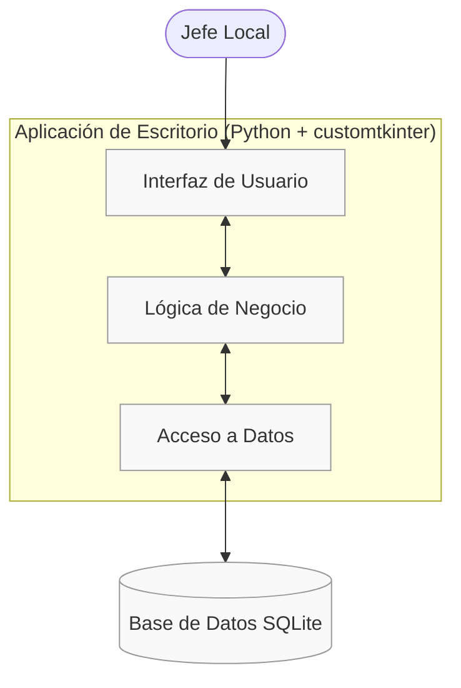
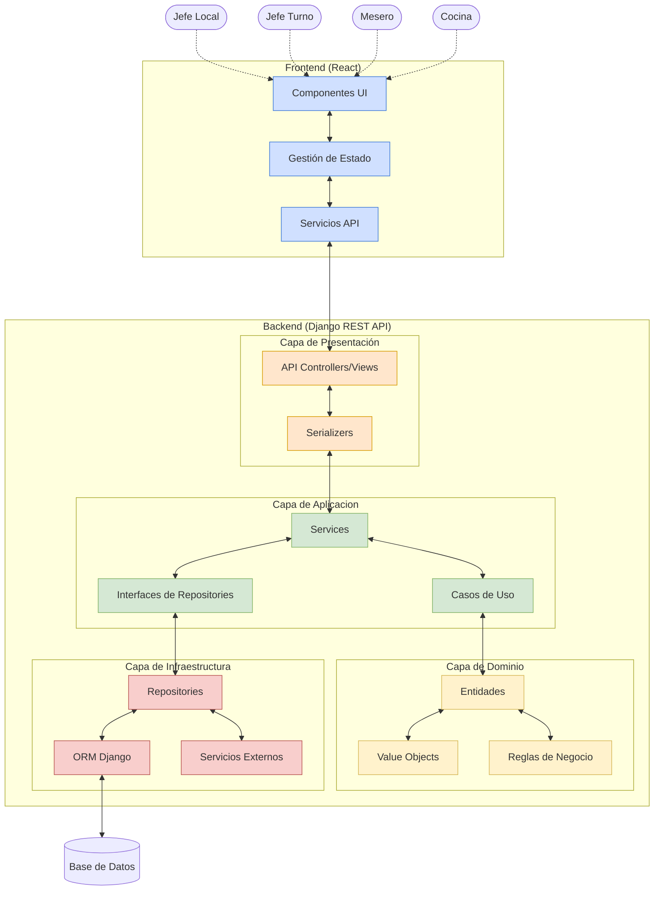

### Sistema Actual: Arquitectura Monolítica de Escritorio (DAA)

```mermaid
flowchart TD
    subgraph "Aplicación de Escritorio (Python + customtkinter)"
        UI[Interfaz de Usuario]
        LN[Lógica de Negocio]
        DA[Acceso a Datos]
    end
    
    UI <--> LN
    LN <--> DA
    DA <--> BD[(Base de Datos SQLite)]
    
    JL([Jefe Local]) --> UI
    
    classDef current fill:#f9f9f9,stroke:#999,stroke-width:1px
    class UI,LN,DA,BD current
```

### Sistema Refactorizado: Arquitectura de Aplicación Web Distribuida (DAR)

```mermaid
flowchart TD
    subgraph "Frontend (React)"
        UI[Componentes UI]
        GE[Gestión de Estado]
        SA[Servicios API]
    end
    
    subgraph "Backend (Django REST API)"
        subgraph "Capa de Presentación"
            AP[API Controllers/Views]
            SZ[Serializers]
        end
        
        subgraph "Capa de Aplicacion"
            SV[Services]
            CU[Casos de Uso]
            IR[Interfaces de Repositories]
        end
        
        subgraph "Capa de Dominio"
            ENT[Entidades]
            VO[Value Objects]
            RN[Reglas de Negocio]
        end
        
        subgraph "Capa de Infraestructura"
            RP[Repositories]
            ORM[ORM Django]
            SE[Servicios Externos]
        end
    end
    
    BD[(Base de Datos)]
    
    UI <--> GE
    GE <--> SA
    SA <---> AP
    AP <--> SZ
    SZ <--> SV
    SV <--> CU
    SV <--> IR
    CU <--> ENT
    IR <--> RP
    ENT <--> VO
    ENT <--> RN
    RP <--> ORM
    RP <--> SE
    ORM <--> BD
    
    JL([Jefe Local]) -.-> UI
    JT([Jefe Turno]) -.-> UI
    M([Mesero]) -.-> UI
    C([Cocina]) -.-> UI
    
    classDef frontend fill:#d0e0ff,stroke:#3c78d8,stroke-width:1px
    classDef presentation fill:#ffe6cc,stroke:#d79b00,stroke-width:1px
    classDef usecase fill:#d5e8d4,stroke:#82b366,stroke-width:1px
    classDef domain fill:#fff2cc,stroke:#d6b656,stroke-width:1px
    classDef infra fill:#f8cecc,stroke:#b85450,stroke-width:1px
    
    class UI,GE,SA frontend
    class AP,SZ presentation
    class SV,CU,IR usecase
    class ENT,VO,RN domain
    class RP,ORM,SE infra
```