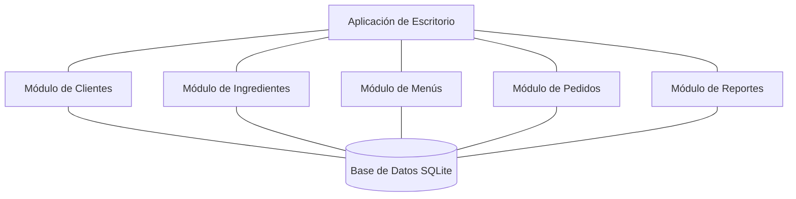
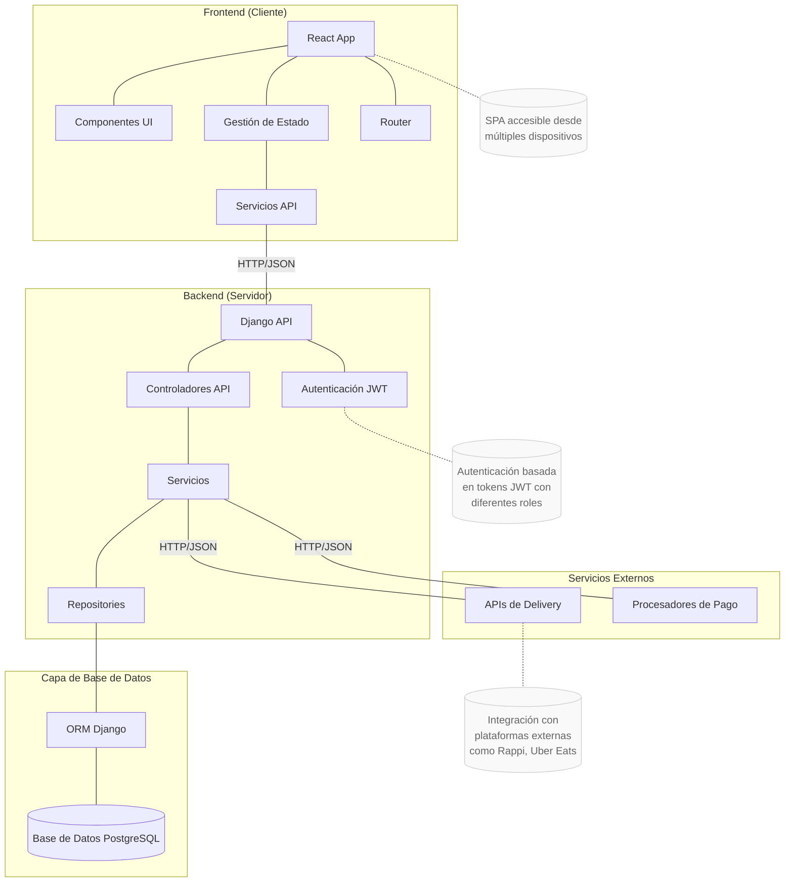

### Sistema Actual: Componentes Básicos (DCOA)

```mermaid
flowchart TD
    App["Aplicación de Escritorio"]
    Clientes["Módulo de Clientes"]
    Ingredientes["Módulo de Ingredientes"]
    Menus["Módulo de Menús"]
    Pedidos["Módulo de Pedidos"]
    Reportes["Módulo de Reportes"]
    DB[(Base de Datos SQLite)]
    
    App --- Clientes
    App --- Ingredientes
    App --- Menus
    App --- Pedidos
    App --- Reportes
    
    Clientes --- DB
    Ingredientes --- DB
    Menus --- DB
    Pedidos --- DB
    Reportes --- DB
```

### Sistema Refactorizado: Componentes Distribuidos (DCOR)

```mermaid
flowchart TD
    subgraph "Frontend (Cliente)"
        ReactApp["React App"]
        UI["Componentes UI"]
        Estado["Gestión de Estado"]
        ApiClient["Servicios API"]
        Router["Router"]
    end
    
    subgraph "Backend (Servidor)"
        DjangoAPI["Django API"]
        Auth["Autenticación JWT"]
        ApiControllers["Controladores API"]
        Services["Servicios"]
        Repos["Repositories"]
    end
    
    subgraph "Capa de Base de Datos"
        ORM["ORM Django"]
        DB[(Base de Datos PostgreSQL)]
    end
    
    subgraph "Servicios Externos"
        DeliveryAPI["APIs de Delivery"]
        PaymentProcessors["Procesadores de Pago"]
    end
    
    ReactApp --- UI
    ReactApp --- Estado
    ReactApp --- Router
    Estado --- ApiClient
    
    ApiClient ---|"HTTP/JSON"| DjangoAPI
    
    DjangoAPI --- Auth
    DjangoAPI --- ApiControllers
    ApiControllers --- Services
    Services --- Repos
    
    Repos --- ORM
    ORM --- DB
    
    Services ---|"HTTP/JSON"| DeliveryAPI
    Services ---|"HTTP/JSON"| PaymentProcessors
    
    ReactApp -.- ReactNote[("SPA accesible desde<br>múltiples dispositivos")]
    Auth -.- AuthNote[("Autenticación basada<br>en tokens JWT con<br>diferentes roles")]
    DeliveryAPI -.- DeliveryNote[("Integración con<br>plataformas externas<br>como Rappi, Uber Eats")]
    
    classDef note fill:#f9f9f9,stroke:#ccc,stroke-width:1px,color:#666
    class ReactNote,AuthNote,DeliveryNote note
```