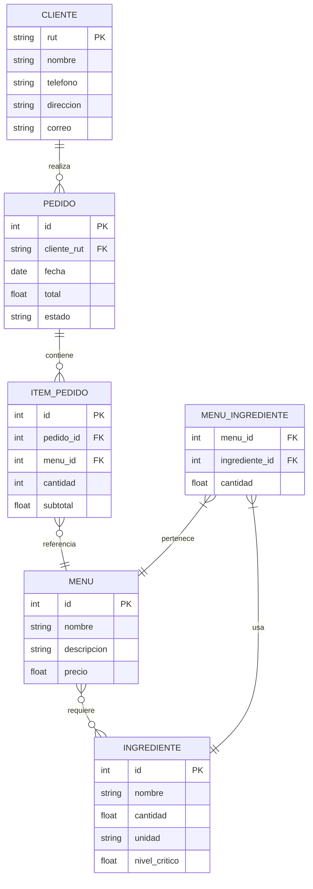
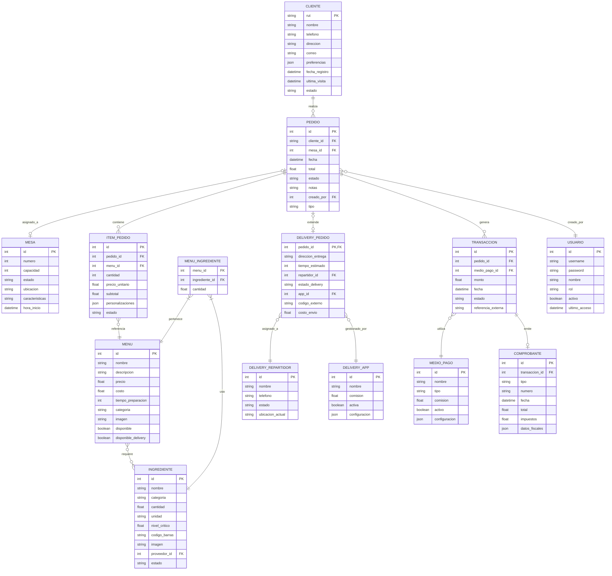

### Sistema Actual: Modelo Entidad-Relación Básico (MERA)

```mermaid
erDiagram
    CLIENTE {
        string rut PK
        string nombre
        string telefono
        string direccion
        string correo
    }
    
    PEDIDO {
        int id PK
        string cliente_rut FK
        date fecha
        float total
        string estado
    }
    
    MENU {
        int id PK
        string nombre
        string descripcion
        float precio
    }
    
    ITEM_PEDIDO {
        int id PK
        int pedido_id FK
        int menu_id FK
        int cantidad
        float subtotal
    }
    
    INGREDIENTE {
        int id PK
        string nombre
        float cantidad
        string unidad
        float nivel_critico
    }
    
    MENU_INGREDIENTE {
        int menu_id FK
        int ingrediente_id FK
        float cantidad
    }
    
    CLIENTE ||--o{ PEDIDO : realiza
    PEDIDO ||--o{ ITEM_PEDIDO : contiene
    ITEM_PEDIDO }o--|| MENU : referencia
    MENU }o--o{ INGREDIENTE : requiere
    MENU_INGREDIENTE }|--|| MENU : pertenece
    MENU_INGREDIENTE }|--|| INGREDIENTE : usa
```

### Sistema Refactorizado: Modelo Entidad-Relación Completo (MERR)

```mermaid
erDiagram
    CLIENTE {
        string rut PK
        string nombre
        string telefono
        string direccion
        string correo
        json preferencias
        datetime fecha_registro
        datetime ultima_visita
        string estado
    }
    
    PEDIDO {
        int id PK
        string cliente_id FK
        int mesa_id FK
        datetime fecha
        float total
        string estado
        string notas
        int creado_por FK
        string tipo
    }
    
    MESA {
        int id PK
        int numero
        int capacidad
        string estado
        string ubicacion
        string caracteristicas
        datetime hora_inicio
    }
    
    MENU {
        int id PK
        string nombre
        string descripcion
        float precio
        float costo
        int tiempo_preparacion
        string categoria
        string imagen
        boolean disponible
        boolean disponible_delivery
    }
    
    ITEM_PEDIDO {
        int id PK
        int pedido_id FK
        int menu_id FK
        int cantidad
        float precio_unitario
        float subtotal
        json personalizaciones
        string estado
    }
    
    INGREDIENTE {
        int id PK
        string nombre
        string categoria
        float cantidad
        string unidad
        float nivel_critico
        string codigo_barras
        string imagen
        int proveedor_id FK
        string estado
    }
    
    MENU_INGREDIENTE {
        int menu_id FK
        int ingrediente_id FK
        float cantidad
    }
    
    DELIVERY_PEDIDO {
        int pedido_id PK,FK
        string direccion_entrega
        int tiempo_estimado
        int repartidor_id FK
        string estado_delivery
        int app_id FK
        string codigo_externo
        float costo_envio
    }
    
    DELIVERY_REPARTIDOR {
        int id PK
        string nombre
        string telefono
        string estado
        string ubicacion_actual
    }
    
    DELIVERY_APP {
        int id PK
        string nombre
        float comision
        boolean activa
        json configuracion
    }
    
    MEDIO_PAGO {
        int id PK
        string nombre
        string tipo
        float comision
        boolean activo
        json configuracion
    }
    
    TRANSACCION {
        int id PK
        int pedido_id FK
        int medio_pago_id FK
        float monto
        datetime fecha
        string estado
        string referencia_externa
    }
    
    COMPROBANTE {
        int id PK
        int transaccion_id FK
        string tipo
        string numero
        datetime fecha
        float total
        float impuestos
        json datos_fiscales
    }
    
    USUARIO {
        int id PK
        string username
        string password
        string nombre
        string rol
        boolean activo
        datetime ultimo_acceso
    }
    
    CLIENTE ||--o{ PEDIDO : realiza
    PEDIDO |o--o| MESA : asignado_a
    PEDIDO ||--o{ ITEM_PEDIDO : contiene
    ITEM_PEDIDO }o--|| MENU : referencia
    MENU }o--o{ INGREDIENTE : requiere
    MENU_INGREDIENTE }|--|| MENU : pertenece
    MENU_INGREDIENTE }|--|| INGREDIENTE : usa
    PEDIDO |o--o| DELIVERY_PEDIDO : extiende
    DELIVERY_PEDIDO }o--|| DELIVERY_REPARTIDOR : asignado_a
    DELIVERY_PEDIDO }o--|| DELIVERY_APP : gestionado_por
    PEDIDO ||--o{ TRANSACCION : genera
    TRANSACCION }o--|| MEDIO_PAGO : utiliza
    TRANSACCION ||--o| COMPROBANTE : emite
    PEDIDO }o--|| USUARIO : creado_por
```