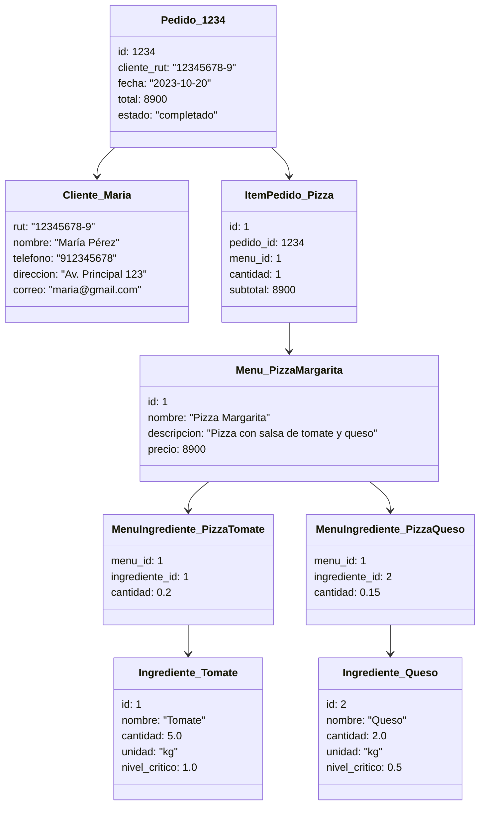
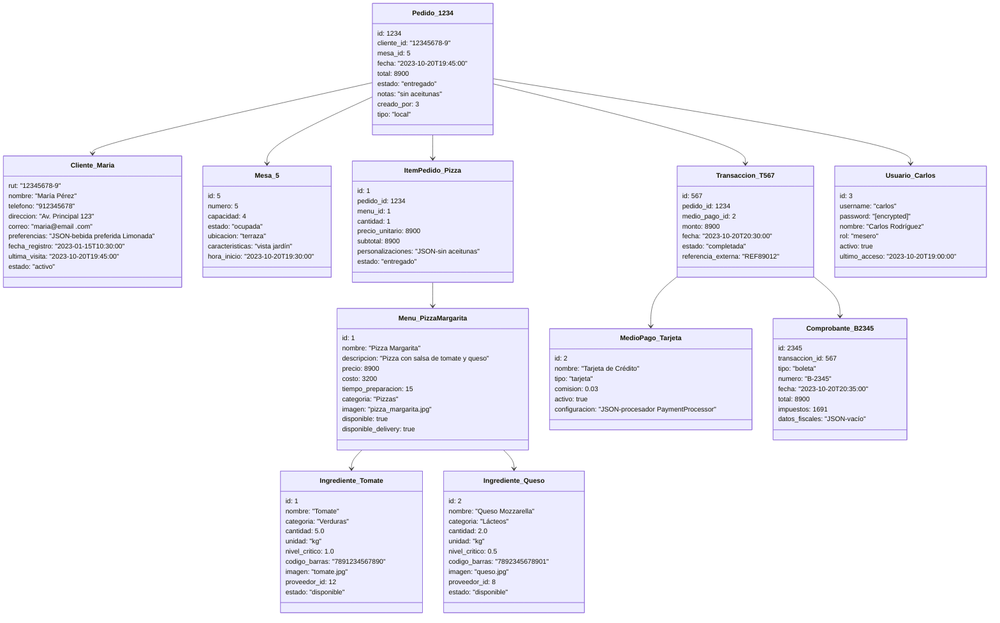

### Sistema Actual: Instancias Básicas (DOA)

```mermaid
classDiagram
    class Cliente_Maria {
        rut: "12345678-9"
        nombre: "María Pérez"
        telefono: "912345678"
        direccion: "Av. Principal 123"
        correo: "maria@gmail.com"
    }
    
    class Ingrediente_Tomate {
        id: 1
        nombre: "Tomate"
        cantidad: 5.0
        unidad: "kg"
        nivel_critico: 1.0
    }
    
    class Ingrediente_Queso {
        id: 2
        nombre: "Queso"
        cantidad: 2.0
        unidad: "kg"
        nivel_critico: 0.5
    }
    
    class Menu_PizzaMargarita {
        id: 1
        nombre: "Pizza Margarita"
        descripcion: "Pizza con salsa de tomate y queso"
        precio: 8900
    }
    
    class MenuIngrediente_PizzaTomate {
        menu_id: 1
        ingrediente_id: 1
        cantidad: 0.2
    }
    
    class MenuIngrediente_PizzaQueso {
        menu_id: 1
        ingrediente_id: 2
        cantidad: 0.15
    }
    
    class Pedido_1234 {
        id: 1234
        cliente_rut: "12345678-9"
        fecha: "2023-10-20"
        total: 8900
        estado: "completado"
    }
    
    class ItemPedido_Pizza {
        id: 1
        pedido_id: 1234
        menu_id: 1
        cantidad: 1
        subtotal: 8900
    }
    
    Pedido_1234 --> Cliente_Maria
    Pedido_1234 --> ItemPedido_Pizza
    ItemPedido_Pizza --> Menu_PizzaMargarita
    Menu_PizzaMargarita --> MenuIngrediente_PizzaTomate
    Menu_PizzaMargarita --> MenuIngrediente_PizzaQueso
    MenuIngrediente_PizzaTomate --> Ingrediente_Tomate
    MenuIngrediente_PizzaQueso --> Ingrediente_Queso
```

### Sistema Refactorizado: Instancias Avanzadas (DOR)

```mermaid
classDiagram
    class Cliente_Maria {
        rut: "12345678-9"
        nombre: "María Pérez"
        telefono: "912345678"
        direccion: "Av. Principal 123"
        correo: "maria@email .com"
        preferencias: "JSON-bebida preferida Limonada"
        fecha_registro: "2023-01-15T10:30:00"
        ultima_visita: "2023-10-20T19:45:00"
        estado: "activo"
    }
    
    class Ingrediente_Tomate {
        id: 1
        nombre: "Tomate"
        categoria: "Verduras"
        cantidad: 5.0
        unidad: "kg"
        nivel_critico: 1.0
        codigo_barras: "7891234567890"
        imagen: "tomate.jpg"
        proveedor_id: 12
        estado: "disponible"
    }
    
    class Ingrediente_Queso {
        id: 2
        nombre: "Queso Mozzarella"
        categoria: "Lácteos"
        cantidad: 2.0
        unidad: "kg"
        nivel_critico: 0.5
        codigo_barras: "7892345678901"
        imagen: "queso.jpg"
        proveedor_id: 8
        estado: "disponible"
    }
    
    class Menu_PizzaMargarita {
        id: 1
        nombre: "Pizza Margarita"
        descripcion: "Pizza con salsa de tomate y queso"
        precio: 8900
        costo: 3200
        tiempo_preparacion: 15
        categoria: "Pizzas"
        imagen: "pizza_margarita.jpg"
        disponible: true
        disponible_delivery: true
    }
    
    class Mesa_5 {
        id: 5
        numero: 5
        capacidad: 4
        estado: "ocupada"
        ubicacion: "terraza"
        caracteristicas: "vista jardín"
        hora_inicio: "2023-10-20T19:30:00"
    }
    
    class Pedido_1234 {
        id: 1234
        cliente_id: "12345678-9"
        mesa_id: 5
        fecha: "2023-10-20T19:45:00"
        total: 8900
        estado: "entregado"
        notas: "sin aceitunas"
        creado_por: 3
        tipo: "local"
    }
    
    class ItemPedido_Pizza {
        id: 1
        pedido_id: 1234
        menu_id: 1
        cantidad: 1
        precio_unitario: 8900
        subtotal: 8900
        personalizaciones: "JSON-sin aceitunas"
        estado: "entregado"
    }
    
    class Transaccion_T567 {
        id: 567
        pedido_id: 1234
        medio_pago_id: 2
        monto: 8900
        fecha: "2023-10-20T20:30:00"
        estado: "completada"
        referencia_externa: "REF89012"
    }
    
    class MedioPago_Tarjeta {
        id: 2
        nombre: "Tarjeta de Crédito"
        tipo: "tarjeta"
        comision: 0.03
        activo: true
        configuracion: "JSON-procesador PaymentProcessor"
    }
    
    class Comprobante_B2345 {
        id: 2345
        transaccion_id: 567
        tipo: "boleta"
        numero: "B-2345"
        fecha: "2023-10-20T20:35:00"
        total: 8900
        impuestos: 1691
        datos_fiscales: "JSON-vacío"
    }
    
    class Usuario_Carlos {
        id: 3
        username: "carlos"
        password: "[encrypted]"
        nombre: "Carlos Rodríguez"
        rol: "mesero"
        activo: true
        ultimo_acceso: "2023-10-20T19:00:00"
    }
    
    Pedido_1234 --> Cliente_Maria
    Pedido_1234 --> Mesa_5
    Pedido_1234 --> ItemPedido_Pizza
    ItemPedido_Pizza --> Menu_PizzaMargarita
    Menu_PizzaMargarita --> Ingrediente_Tomate
    Menu_PizzaMargarita --> Ingrediente_Queso
    Pedido_1234 --> Transaccion_T567
    Transaccion_T567 --> MedioPago_Tarjeta
    Transaccion_T567 --> Comprobante_B2345
    Pedido_1234 --> Usuario_Carlos
```
