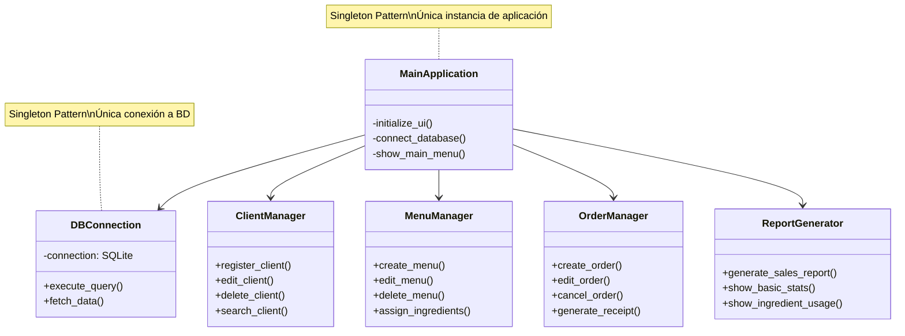

### Sistema Actual: Patrones Limitados (DPA)

```mermaid
classDiagram
    class MainApplication {
        -initialize_ui()
        -connect_database()
        -show_main_menu()
    }
    
    class DBConnection {
        -connection: SQLite
        +execute_query()
        +fetch_data()
    }
    
    class ClientManager {
        +register_client()
        +edit_client()
        +delete_client()
        +search_client()
    }
    
    class MenuManager {
        +create_menu()
        +edit_menu()
        +delete_menu()
        +assign_ingredients()
    }
    
    class OrderManager {
        +create_order()
        +edit_order()
        +cancel_order()
        +generate_receipt()
    }
    
    class ReportGenerator {
        +generate_sales_report()
        +show_basic_stats()
        +show_ingredient_usage()
    }
    
    MainApplication --> DBConnection
    MainApplication --> ClientManager
    MainApplication --> MenuManager
    MainApplication --> OrderManager
    MainApplication --> ReportGenerator
    
    note for MainApplication "Singleton Pattern\nÚnica instancia de aplicación"
    note for DBConnection "Singleton Pattern\nÚnica conexión a BD"
```

### Sistema Refactorizado: Implementación de Múltiples Patrones (DPR)

```mermaid
classDiagram
    class IRepository~T~ {
        <<interface>>
        +get(id) T
        +getAll() List~T~
        +add(entity) void
        +update(entity) void
        +delete(id) void
    }
    
    class ClientRepository {
        +get(id) Cliente
        +getAll() List~Cliente~
        +add(cliente) void
        +update(cliente) void
        +delete(id) void
        +findByName(name) List~Cliente~
        +findByRut(rut) Cliente
    }
    
    class MenuRepository {
        +get(id) Menu
        +getAll() List~Menu~
        +add(menu) void
        +update(menu) void
        +delete(id) void
        +findByCategory(category) List~Menu~
        +checkAvailability(id) boolean
    }
    
    class ClientService {
        -clientRepository: IRepository~Cliente~
        +registerClient(clientData)
        +updateClient(clientData)
        +deleteClient(id)
        +getClientHistory(id)
    }
    
    class MenuService {
        -menuRepository: IRepository~Menu~
        -ingredientRepository: IRepository~Ingrediente~
        +createMenu(menuData)
        +updateMenu(menuData)
        +deleteMenu(id)
        +checkIngredientAvailability()
    }
    
    class OrderFactory {
        +createLocalOrder() Order
        +createDeliveryOrder() DeliveryOrder
    }
    
    class NotificationObserver {
        +update(subject)
    }
    
    class Order {
        -state: OrderState
        +changeState(newState)
        +notifyObservers()
    }
    
    class OrderState {
        <<interface>>
        +nextState()
        +getStatusInfo()
    }
    
    class ReceivedState {
        +nextState()
        +getStatusInfo()
    }
    
    class PreparingState {
        +nextState()
        +getStatusInfo()
    }
    
    class ReadyState {
        +nextState()
        +getStatusInfo()
    }
    
    class DeliveredState {
        +nextState()
        +getStatusInfo()
    }

    %% Patrón Strategy para diferentes lógicas de procesamiento
    class PriceStrategy {
        <<interface>>
        +calculatePrice(order)
    }
    class TaxStrategy {
        <<interface>>
        +calculateTax(order)
    }
    class StandardPriceStrategy {
        +calculatePrice(order)
    }
    class DiscountPriceStrategy {
        +calculatePrice(order)
    }
    class StandardTaxStrategy {
        +calculateTax(order)
    }
    class ReducedTaxStrategy {
        +calculateTax(order)
    }

    %% Patrón Template Method para reportes
    class ReportGenerator {
        +generateReport()
        #fetchData()
        #formatData()
        #export()
    }
    class SalesReportGenerator {
        +generateReport()
        #fetchData()
        #formatData()
        #export()
    }
    class InventoryReportGenerator {
        +generateReport()
        #fetchData()
        #formatData()
        #export()
    }

    class DashboardFacade {
        -salesAnalyzer
        -inventoryAnalyzer
        -customerAnalyzer
        +getSalesSummary()
        +getPopularMenus()
        +getInventoryStatus()
        +getCustomerStatistics()
    }

    IRepository <|-- ClientRepository
    IRepository <|-- MenuRepository
    ClientService o-- IRepository : <<Dependency Injection>>
    MenuService o-- IRepository : <<Dependency Injection>>
    OrderState <|-- ReceivedState
    OrderState <|-- PreparingState
    OrderState <|-- ReadyState
    OrderState <|-- DeliveredState
    Order o-- OrderState
    Order --> NotificationObserver

    %% Relaciones para Strategy
    Order o-- PriceStrategy
    Order o-- TaxStrategy
    PriceStrategy <|.. StandardPriceStrategy
    PriceStrategy <|.. DiscountPriceStrategy
    TaxStrategy <|.. StandardTaxStrategy
    TaxStrategy <|.. ReducedTaxStrategy

    %% Relaciones para Template Method
    ReportGenerator <|-- SalesReportGenerator
    ReportGenerator <|-- InventoryReportGenerator

    note for IRepository "Repository Pattern\nAbstracción de acceso a datos"
    note for ClientService "Dependency Injection\nRepositorios inyectados en servicios"
    note for OrderFactory "Factory Pattern\nCreación de diferentes tipos de pedidos"
    note for Order "Observer Pattern\nNotificación de cambios de estado"
    note for OrderState "State Pattern\nDistintos comportamientos según estado"
    note for DashboardFacade "Facade Pattern\nInterface simplificada para análisis"
    note for PriceStrategy "Strategy Pattern\nAlgoritmos intercambiables para precios/impuestos"
    note for ReportGenerator "Template Method Pattern\nEstructura estándar para reportes"
```