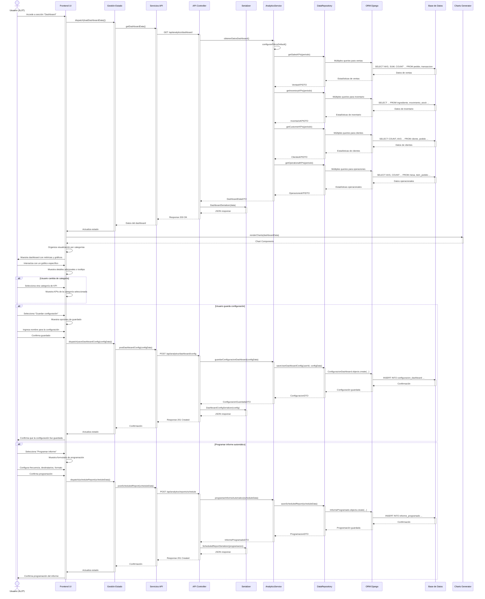
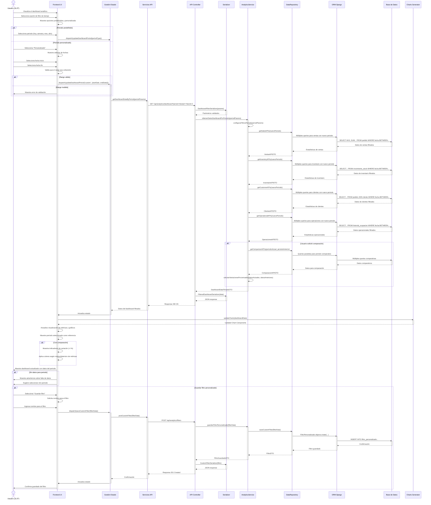
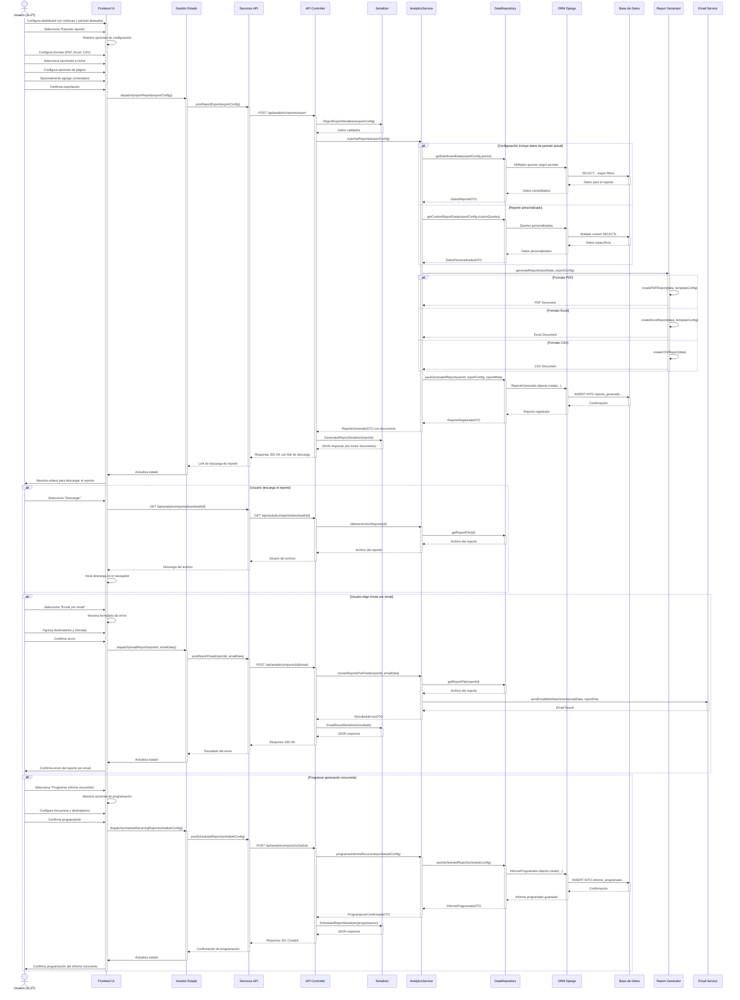

#### CU-R31: Visualizar KPIs

```mermaid
sequenceDiagram
    actor Usuario as Usuario (JL/JT)
    participant UI as Frontend UI
    participant GE as Gestión Estado
    participant SA as Servicios API
    participant AC as API Controller
    participant SZ as Serializer
    participant AS as AnalyticsService
    participant DR as DataRepository
    participant ORM as ORM Django
    participant BD as Base de Datos
    participant CH as Charts Generator

    Usuario->>UI: Accede a sección "Dashboard"
    activate UI
    
    UI->>GE: dispatch(loadDashboardData())
    activate GE
    GE->>SA: getDashboardData()
    activate SA
    SA->>AC: GET /api/analytics/dashboard
    activate AC
    AC->>AS: obtenerDatosDashboard()
    activate AS
    
    AS->>AS: configurarFiltrosDefault()
    
    AS->>DR: getSalesKPIs(periodo)
    activate DR
    DR->>ORM: Múltiples queries para ventas
    activate ORM
    ORM->>BD: SELECT AVG, SUM, COUNT ... FROM pedido, transaccion
    activate BD
    BD-->>ORM: Datos de ventas
    deactivate BD
    ORM-->>DR: Estadísticas de ventas
    deactivate ORM
    DR-->>AS: VentasKPIDTO
    deactivate DR
    
    AS->>DR: getInventoryKPIs(periodo)
    activate DR
    DR->>ORM: Múltiples queries para inventario
    activate ORM
    ORM->>BD: SELECT ... FROM ingrediente, movimiento_stock ...
    activate BD
    BD-->>ORM: Datos de inventario
    deactivate BD
    ORM-->>DR: Estadísticas de inventario
    deactivate ORM
    DR-->>AS: InventarioKPIDTO
    deactivate DR
    
    AS->>DR: getCustomerKPIs(periodo)
    activate DR
    DR->>ORM: Múltiples queries para clientes
    activate ORM
    ORM->>BD: SELECT COUNT, AVG ... FROM cliente, pedido ...
    activate BD
    BD-->>ORM: Datos de clientes
    deactivate BD
    ORM-->>DR: Estadísticas de clientes
    deactivate ORM
    DR-->>AS: ClientesKPIDTO
    deactivate DR
    
    AS->>DR: getOperationalKPIs(periodo)
    activate DR
    DR->>ORM: Múltiples queries para operaciones
    activate ORM
    ORM->>BD: SELECT AVG, COUNT ... FROM mesa, item_pedido ...
    activate BD
    BD-->>ORM: Datos operacionales
    deactivate BD
    ORM-->>DR: Estadísticas operacionales
    deactivate ORM
    DR-->>AS: OperacionesKPIDTO
    deactivate DR
    
    AS-->>AC: DashboardDataDTO
    deactivate AS
    
    AC->>SZ: DashboardSerializer(data)
    activate SZ
    SZ-->>AC: JSON response
    deactivate SZ
    AC-->>SA: Response 200 OK
    deactivate AC
    SA-->>GE: Datos del dashboard
    deactivate SA
    GE->>UI: Actualiza estado
    deactivate GE
    
    UI->>CH: renderCharts(dashboardData)
    activate CH
    CH-->>UI: Chart Components
    deactivate CH
    
    UI->>UI: Organiza visualización por categorías
    UI->>Usuario: Muestra dashboard con métricas y gráficos
    
    Usuario->>UI: Interactúa con un gráfico específico
    UI->>UI: Muestra detalles adicionales o tooltips
    
    alt Usuario cambia de categoría
        Usuario->>UI: Selecciona otra categoría de KPI
        UI->>UI: Muestra KPIs de la categoría seleccionada
    end
    
    alt Usuario guarda configuración
        Usuario->>UI: Selecciona "Guardar configuración"
        UI->>UI: Muestra opciones de guardado
        Usuario->>UI: Ingresa nombre para la configuración
        Usuario->>UI: Confirma guardado
        
        UI->>GE: dispatch(saveDashboardConfig(configData))
        activate GE
        GE->>SA: postDashboardConfig(configData)
        activate SA
        SA->>AC: POST /api/analytics/dashboard/config
        activate AC
        AC->>AS: guardarConfiguracionDashboard(configData)
        activate AS
        AS->>DR: saveUserDashboardConfig(userId, configData)
        activate DR
        DR->>ORM: ConfiguracionDashboard.objects.create(...)
        activate ORM
        ORM->>BD: INSERT INTO configuracion_dashboard ...
        activate BD
        BD-->>ORM: Confirmación
        deactivate BD
        ORM-->>DR: Configuración guardada
        deactivate ORM
        DR-->>AS: ConfiguracionDTO
        deactivate DR
        AS-->>AC: ConfiguracionGuardadaDTO
        deactivate AS
        
        AC->>SZ: DashboardConfigSerializer(config)
        activate SZ
        SZ-->>AC: JSON response
        deactivate SZ
        AC-->>SA: Response 201 Created
        deactivate AC
        SA-->>GE: Confirmación
        deactivate SA
        GE->>UI: Actualiza estado
        deactivate GE
        
        UI->>Usuario: Confirma que la configuración fue guardada
    end
    
    alt Programar informe automático
        Usuario->>UI: Selecciona "Programar informe"
        UI->>UI: Muestra formulario de programación
        Usuario->>UI: Configura frecuencia, destinatarios, formato
        Usuario->>UI: Confirma programación
        
        UI->>GE: dispatch(scheduleReport(scheduleData))
        activate GE
        GE->>SA: postScheduledReport(scheduleData)
        activate SA
        SA->>AC: POST /api/analytics/reports/schedule
        activate AC
        AC->>AS: programarInformeAutomatico(scheduleData)
        activate AS
        AS->>DR: saveScheduledReport(scheduleData)
        activate DR
        DR->>ORM: InformeProgramado.objects.create(...)
        activate ORM
        ORM->>BD: INSERT INTO informe_programado ...
        activate BD
        BD-->>ORM: Confirmación
        deactivate BD
        ORM-->>DR: Programación guardada
        deactivate ORM
        DR-->>AS: ProgramacionDTO
        deactivate DR
        AS-->>AC: InformeProgramadoDTO
        deactivate AS
        
        AC->>SZ: ScheduledReportSerializer(programacion)
        activate SZ
        SZ-->>AC: JSON response
        deactivate SZ
        AC-->>SA: Response 201 Created
        deactivate AC
        SA-->>GE: Confirmación
        deactivate SA
        GE->>UI: Actualiza estado
        deactivate GE
        
        UI->>Usuario: Confirma programación del informe
    end
    
    deactivate UI
```

#### CU-R32: Filtrar por Periodo

```mermaid
sequenceDiagram
    actor Usuario as Usuario (JL/JT)
    participant UI as Frontend UI
    participant GE as Gestión Estado
    participant SA as Servicios API
    participant AC as API Controller
    participant SZ as Serializer
    participant AS as AnalyticsService
    participant DR as DataRepository
    participant ORM as ORM Django
    participant BD as Base de Datos
    participant CH as Charts Generator

    Usuario->>UI: Visualiza el dashboard analítico
    activate UI
    
    Usuario->>UI: Selecciona opción de filtro de tiempo
    UI->>UI: Muestra opciones predefinidas y personalizada
    
    alt Periodo predefinido
        Usuario->>UI: Selecciona periodo (hoy, semana, mes, año)
        UI->>GE: dispatch(updateDashboardPeriod(periodType))
        activate GE
    else Periodo personalizado
        Usuario->>UI: Selecciona "Personalizado"
        UI->>UI: Muestra selector de fechas
        Usuario->>UI: Selecciona fecha inicio
        Usuario->>UI: Selecciona fecha fin
        UI->>UI: Valida que el rango sea coherente
        alt Rango válido
            UI->>GE: dispatch(updateDashboardPeriod('custom', {startDate, endDate}))
            activate GE
        else Rango inválido
            UI->>Usuario: Muestra error de validación
        end
    end
    
    GE->>SA: getDashboardDataByPeriod(periodParams)
    activate SA
    SA->>AC: GET /api/analytics/dashboard?period=X&start=Y&end=Z
    activate AC
    AC->>SZ: DashboardFilterSerializer(params)
    activate SZ
    SZ-->>AC: Parámetros validados
    deactivate SZ
    
    AC->>AS: obtenerDatosDashboardPorPeriodo(periodParams)
    activate AS
    AS->>AS: configurarFiltrosPeriodo(periodParams)
    
    AS->>DR: getSalesKPIs(nuevoPeriodo)
    activate DR
    DR->>ORM: Múltiples queries para ventas con nuevo periodo
    activate ORM
    ORM->>BD: SELECT AVG, SUM... FROM pedido WHERE fecha BETWEEN...
    activate BD
    BD-->>ORM: Datos de ventas filtrados
    deactivate BD
    ORM-->>DR: Estadísticas de ventas
    deactivate ORM
    DR-->>AS: VentasKPIDTO
    deactivate DR
    
    AS->>DR: getInventoryKPIs(nuevoPeriodo)
    activate DR
    DR->>ORM: Múltiples queries para inventario con nuevo periodo
    activate ORM
    ORM->>BD: SELECT... FROM movimiento_stock WHERE fecha BETWEEN...
    activate BD
    BD-->>ORM: Datos de inventario filtrados
    deactivate BD
    ORM-->>DR: Estadísticas de inventario
    deactivate ORM
    DR-->>AS: InventarioKPIDTO
    deactivate DR
    
    AS->>DR: getCustomerKPIs(nuevoPeriodo)
    activate DR
    DR->>ORM: Múltiples queries para clientes con nuevo periodo
    activate ORM
    ORM->>BD: SELECT... FROM pedido JOIN cliente WHERE fecha BETWEEN...
    activate BD
    BD-->>ORM: Datos de clientes filtrados
    deactivate BD
    ORM-->>DR: Estadísticas de clientes
    deactivate ORM
    DR-->>AS: ClientesKPIDTO
    deactivate DR
    
    AS->>DR: getOperationalKPIs(nuevoPeriodo)
    activate DR
    DR->>ORM: Múltiples queries para operaciones con nuevo periodo
    activate ORM
    ORM->>BD: SELECT... FROM historial_ocupacion WHERE fecha BETWEEN...
    activate BD
    BD-->>ORM: Datos operacionales filtrados
    deactivate BD
    ORM-->>DR: Estadísticas operacionales
    deactivate ORM
    DR-->>AS: OperacionesKPIDTO
    deactivate DR
    
    alt Usuario solicitó comparación
        AS->>DR: getComparisonKPIs(periodoActual, periodoAnterior)
        activate DR
        DR->>ORM: Queries paralelas para periodo comparativo
        activate ORM
        ORM->>BD: Múltiples queries comparativas
        activate BD
        BD-->>ORM: Datos comparativos
        deactivate BD
        ORM-->>DR: Datos para comparación
        deactivate ORM
        DR-->>AS: ComparacionKPIDTO
        deactivate DR
        
        AS->>AS: calcularVariacionesPorcentuales(datosActuales, datosAnteriores)
    end
    
    AS-->>AC: DashboardDataFiltradoDTO
    deactivate AS
    
    AC->>SZ: FilteredDashboardSerializer(data)
    activate SZ
    SZ-->>AC: JSON response
    deactivate SZ
    AC-->>SA: Response 200 OK
    deactivate AC
    SA-->>GE: Datos del dashboard filtrados
    deactivate SA
    GE->>UI: Actualiza estado
    deactivate GE
    
    UI->>CH: updateCharts(dashboardData)
    activate CH
    CH-->>UI: Updated Chart Components
    deactivate CH
    
    UI->>UI: Actualiza visualización de métricas y gráficos
    UI->>UI: Muestra periodo seleccionado como referencia
    
    alt Con comparación
        UI->>UI: Muestra indicadores de variación (+/-%)
        UI->>UI: Aplica colores según mejora/deterioro de métricas
    end
    
    UI->>Usuario: Muestra dashboard actualizado con datos del periodo
    
    alt Sin datos para periodo
        UI->>Usuario: Muestra advertencia sobre falta de datos
        UI->>Usuario: Sugiere seleccionar otro periodo
    end
    
    alt Guardar filtro personalizado
        Usuario->>UI: Selecciona "Guardar filtro"
        UI->>UI: Solicita nombre para el filtro
        Usuario->>UI: Ingresa nombre para el filtro
        UI->>GE: dispatch(saveCustomFilter(filterData))
        activate GE
        GE->>SA: postCustomFilter(filterData)
        activate SA
        SA->>AC: POST /api/analytics/filters
        activate AC
        AC->>AS: guardarFiltroPersonalizado(filterData)
        activate AS
        AS->>DR: saveCustomFilter(filterData)
        activate DR
        DR->>ORM: FiltroPersonalizado.objects.create(...)
        activate ORM
        ORM->>BD: INSERT INTO filtro_personalizado...
        activate BD
        BD-->>ORM: Confirmación
        deactivate BD
        ORM-->>DR: Filtro guardado
        deactivate ORM
        DR-->>AS: FiltroDTO
        deactivate DR
        AS-->>AC: FiltroGuardadoDTO
        deactivate AS
        
        AC->>SZ: CustomFilterSerializer(filtro)
        activate SZ
        SZ-->>AC: JSON response
        deactivate SZ
        AC-->>SA: Response 201 Created
        deactivate AC
        SA-->>GE: Confirmación
        deactivate SA
        GE->>UI: Actualiza estado
        deactivate GE
        
        UI->>Usuario: Confirma guardado del filtro
    end
    
    deactivate UI
```

#### CU-R33: Exportar Reportes PDF

```mermaid
sequenceDiagram
    actor Usuario as Usuario (JL/JT)
    participant UI as Frontend UI
    participant GE as Gestión Estado
    participant SA as Servicios API
    participant AC as API Controller
    participant SZ as Serializer
    participant AS as AnalyticsService
    participant DR as DataRepository
    participant ORM as ORM Django
    participant BD as Base de Datos
    participant RG as Report Generator
    participant EM as Email Service

    Usuario->>UI: Configura dashboard con métricas y periodo deseados
    activate UI
    
    Usuario->>UI: Selecciona "Exportar reporte"
    UI->>UI: Muestra opciones de configuración
    
    Usuario->>UI: Configura formato (PDF, Excel, CSV)
    Usuario->>UI: Selecciona secciones a incluir
    Usuario->>UI: Configura opciones de página
    Usuario->>UI: Opcionalmente agrega comentarios
    
    Usuario->>UI: Confirma exportación
    
    UI->>GE: dispatch(exportReport(exportConfig))
    activate GE
    GE->>SA: postReportExport(exportConfig)
    activate SA
    SA->>AC: POST /api/analytics/reports/export
    activate AC
    AC->>SZ: ReportExportSerializer(exportConfig)
    activate SZ
    SZ-->>AC: Datos validados
    deactivate SZ
    
    AC->>AS: exportarReporte(exportConfig)
    activate AS
    
    alt Configuración incluye datos de periodo actual
        AS->>DR: getDashboardData(exportConfig.period)
        activate DR
        DR->>ORM: Múltiples queries según periodo
        activate ORM
        ORM->>BD: SELECT... según filtros
        activate BD
        BD-->>ORM: Datos para el reporte
        deactivate BD
        ORM-->>DR: Datos consolidados
        deactivate ORM
        DR-->>AS: DatosReporteDTO
        deactivate DR
    else Reporte personalizado
        AS->>DR: getCustomReportData(exportConfig.customQueries)
        activate DR
        DR->>ORM: Queries personalizadas
        activate ORM
        ORM->>BD: Multiple custom SELECTs
        activate BD
        BD-->>ORM: Datos específicos
        deactivate BD
        ORM-->>DR: Datos personalizados
        deactivate ORM
        DR-->>AS: DatosPersonalizadosDTO
        deactivate DR
    end
    
    AS->>RG: generateReport(reportData, exportConfig)
    activate RG
    
    alt Formato PDF
        RG->>RG: createPDFReport(data, templateConfig)
        RG-->>AS: PDF Document
    else Formato Excel
        RG->>RG: createExcelReport(data, templateConfig)
        RG-->>AS: Excel Document
    else Formato CSV
        RG->>RG: createCSVReport(data)
        RG-->>AS: CSV Document
    end
    
    deactivate RG
    
    AS->>DR: saveGeneratedReport(userId, reportConfig, reportMeta)
    activate DR
    DR->>ORM: ReporteGenerado.objects.create(...)
    activate ORM
    ORM->>BD: INSERT INTO reporte_generado...
    activate BD
    BD-->>ORM: Confirmación
    deactivate BD
    ORM-->>DR: Reporte registrado
    deactivate ORM
    DR-->>AS: ReporteRegistradoDTO
    deactivate DR
    
    AS-->>AC: ReporteGeneradoDTO con documento
    deactivate AS
    
    AC->>SZ: GeneratedReportSerializer(reporte)
    activate SZ
    SZ-->>AC: JSON response (sin incluir documento)
    deactivate SZ
    AC-->>SA: Response 200 OK con link de descarga
    deactivate AC
    SA-->>GE: Link de descarga de reporte
    deactivate SA
    GE->>UI: Actualiza estado
    deactivate GE
    
    UI->>Usuario: Muestra enlace para descargar el reporte
    
    alt Usuario descarga el reporte
        Usuario->>UI: Selecciona "Descargar"
        UI->>SA: GET /api/analytics/reports/download/{id}
        activate SA
        SA->>AC: GET /api/analytics/reports/download/{id}
        activate AC
        AC->>AS: obtenerArchivoReporte(id)
        activate AS
        AS->>DR: getReportFile(id)
        activate DR
        DR-->>AS: Archivo del reporte
        deactivate DR
        AS-->>AC: Archivo del reporte
        deactivate AS
        AC-->>SA: Stream del archivo
        deactivate AC
        SA-->>UI: Descarga del archivo
        deactivate SA
        UI->>UI: Inicia descarga en el navegador
    end
    
    alt Usuario elige enviar por email
        Usuario->>UI: Selecciona "Enviar por email"
        UI->>UI: Muestra formulario de envío
        Usuario->>UI: Ingresa destinatarios y mensaje
        Usuario->>UI: Confirma envío
        
        UI->>GE: dispatch(emailReport(reportId, emailData))
        activate GE
        GE->>SA: postReportEmail(reportId, emailData)
        activate SA
        SA->>AC: POST /api/analytics/reports/{id}/email
        activate AC
        AC->>AS: enviarReportePorEmail(reportId, emailData)
        activate AS
        AS->>DR: getReportFile(reportId)
        activate DR
        DR-->>AS: Archivo del reporte
        deactivate DR
        
        AS->>EM: sendEmailWithAttachment(emailData, reportFile)
        activate EM
        EM-->>AS: Email Result
        deactivate EM
        AS-->>AC: ResultadoEnvioDTO
        deactivate AS
        
        AC->>SZ: EmailResultSerializer(resultado)
        activate SZ
        SZ-->>AC: JSON response
        deactivate SZ
        AC-->>SA: Response 200 OK
        deactivate AC
        SA-->>GE: Resultado del envío
        deactivate SA
        GE->>UI: Actualiza estado
        deactivate GE
        
        UI->>Usuario: Confirma envío del reporte por email
    end
    
    alt Programar generación recurrente
        Usuario->>UI: Selecciona "Programar informe recurrente"
        UI->>UI: Muestra opciones de programación
        Usuario->>UI: Configura frecuencia y destinatarios
        Usuario->>UI: Confirma programación
        
        UI->>GE: dispatch(scheduleRecurringReport(scheduleConfig))
        activate GE
        GE->>SA: postScheduledReport(scheduleConfig)
        activate SA
        SA->>AC: POST /api/analytics/reports/schedule
        activate AC
        AC->>AS: programarInformeRecurrente(scheduleConfig)
        activate AS
        AS->>DR: saveScheduledReport(scheduleConfig)
        activate DR
        DR->>ORM: InformeProgramado.objects.create(...)
        activate ORM
        ORM->>BD: INSERT INTO informe_programado...
        activate BD
        BD-->>ORM: Confirmación
        deactivate BD
        ORM-->>DR: Informe programado guardado
        deactivate ORM
        DR-->>AS: InformeProgramadoDTO
        deactivate DR
        AS-->>AC: ProgramacionConfirmadaDTO
        deactivate AS
        
        AC->>SZ: ScheduledReportSerializer(programacion)
        activate SZ
        SZ-->>AC: JSON response
        deactivate SZ
        AC-->>SA: Response 201 Created
        deactivate AC
        SA-->>GE: Confirmación de programación
        deactivate SA
        GE->>UI: Actualiza estado
        deactivate GE
        
        UI->>Usuario: Confirma programación del informe recurrente
    end
    
    deactivate UI
```