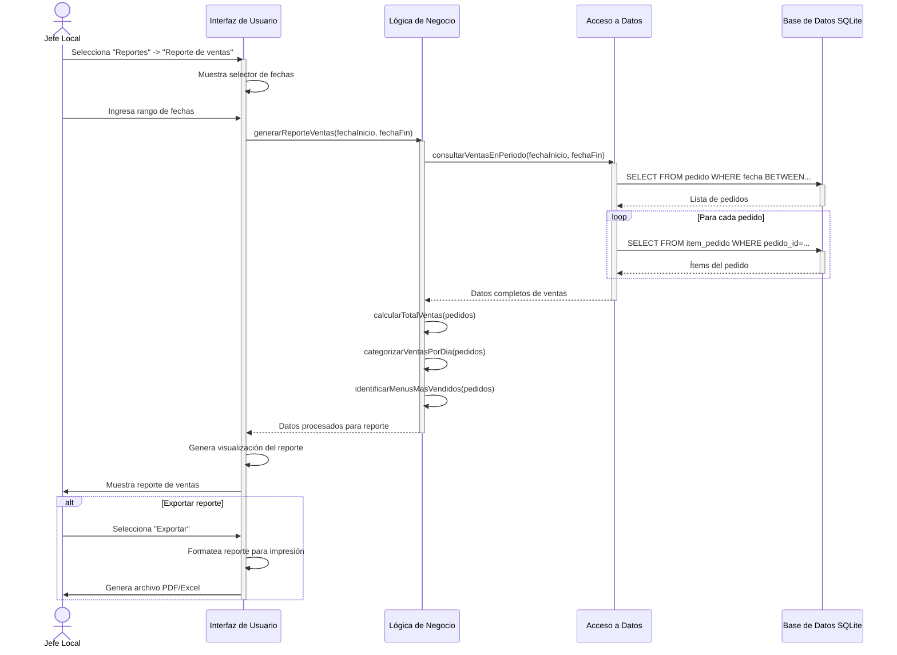
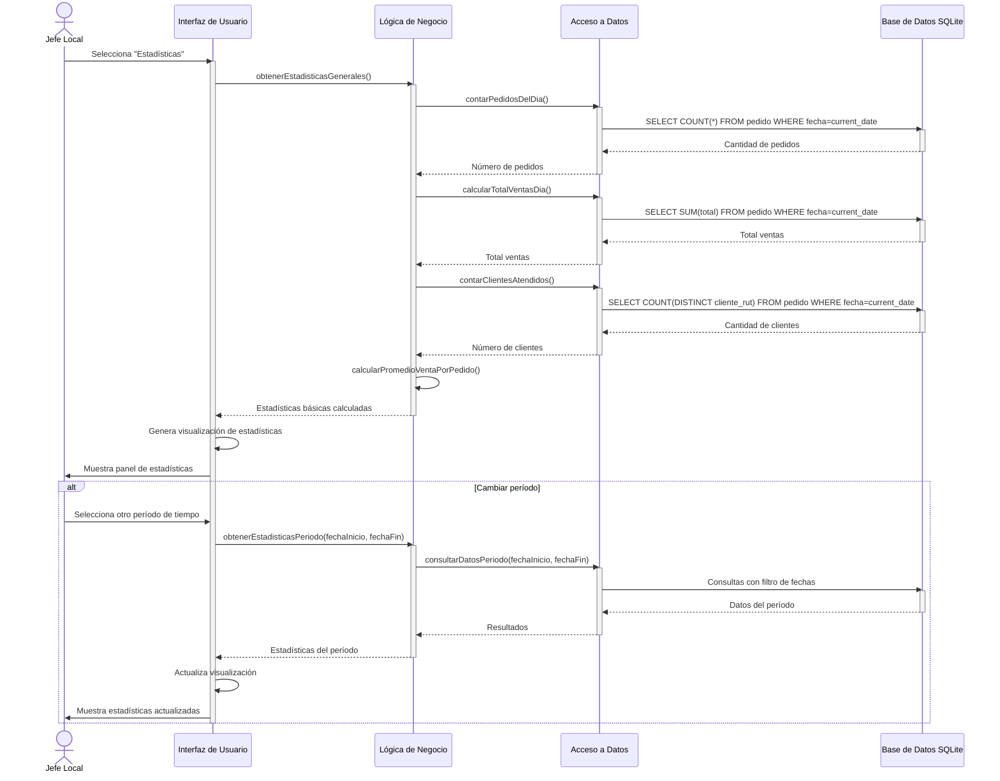
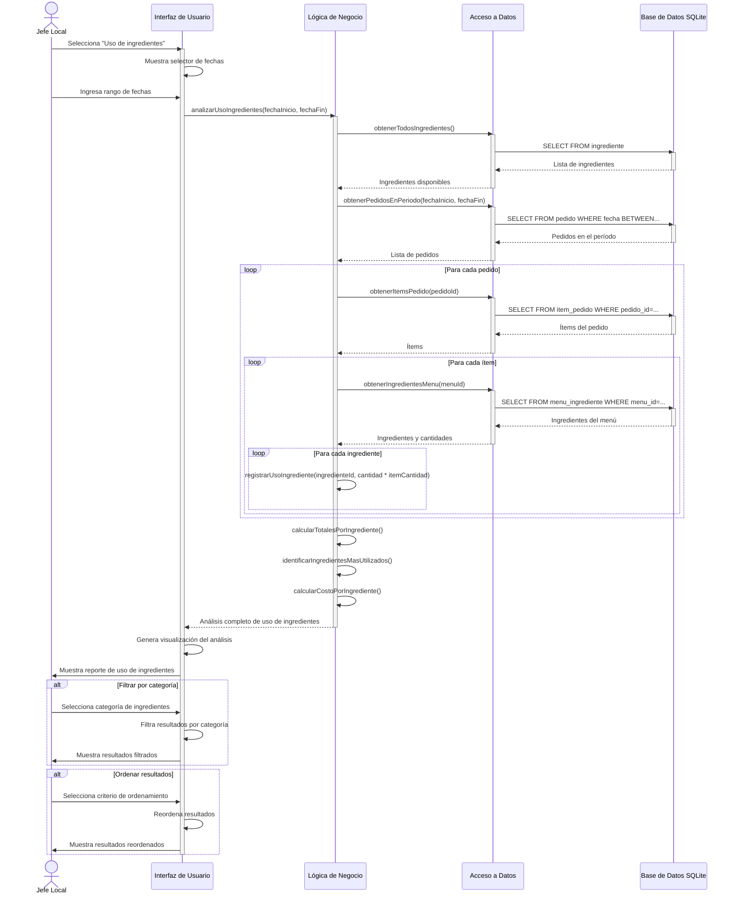

#### CU-A22: Generar Reporte de Ventas

```mermaid
sequenceDiagram
    actor JL as Jefe Local
    participant UI as Interfaz de Usuario
    participant LN as Lógica de Negocio
    participant DA as Acceso a Datos
    participant DB as Base de Datos SQLite
    
    JL->>UI: Selecciona "Reportes" -> "Reporte de ventas"
    activate UI
    UI->>UI: Muestra selector de fechas
    JL->>UI: Ingresa rango de fechas
    
    UI->>LN: generarReporteVentas(fechaInicio, fechaFin)
    activate LN
    LN->>DA: consultarVentasEnPeriodo(fechaInicio, fechaFin)
    activate DA
    DA->>DB: SELECT FROM pedido WHERE fecha BETWEEN...
    activate DB
    DB-->>DA: Lista de pedidos
    deactivate DB
    
    loop Para cada pedido
        DA->>DB: SELECT FROM item_pedido WHERE pedido_id=...
        activate DB
        DB-->>DA: Ítems del pedido
        deactivate DB
    end
    
    DA-->>LN: Datos completos de ventas
    deactivate DA
    
    LN->>LN: calcularTotalVentas(pedidos)
    LN->>LN: categorizarVentasPorDia(pedidos)
    LN->>LN: identificarMenusMasVendidos(pedidos)
    
    LN-->>UI: Datos procesados para reporte
    deactivate LN
    
    UI->>UI: Genera visualización del reporte
    UI->>JL: Muestra reporte de ventas
    
    alt Exportar reporte
        JL->>UI: Selecciona "Exportar"
        UI->>UI: Formatea reporte para impresión
        UI->>JL: Genera archivo PDF/Excel
    end
    deactivate UI
```

#### CU-A23: Ver Estadísticas Básicas

```mermaid
sequenceDiagram
    actor JL as Jefe Local
    participant UI as Interfaz de Usuario
    participant LN as Lógica de Negocio
    participant DA as Acceso a Datos
    participant DB as Base de Datos SQLite
    
    JL->>UI: Selecciona "Estadísticas"
    activate UI
    
    UI->>LN: obtenerEstadisticasGenerales()
    activate LN
    
    LN->>DA: contarPedidosDelDia()
    activate DA
    DA->>DB: SELECT COUNT(*) FROM pedido WHERE fecha=current_date
    activate DB
    DB-->>DA: Cantidad de pedidos
    deactivate DB
    DA-->>LN: Número de pedidos
    deactivate DA
    
    LN->>DA: calcularTotalVentasDia()
    activate DA
    DA->>DB: SELECT SUM(total) FROM pedido WHERE fecha=current_date
    activate DB
    DB-->>DA: Total ventas
    deactivate DB
    DA-->>LN: Total ventas
    deactivate DA
    
    LN->>DA: contarClientesAtendidos()
    activate DA
    DA->>DB: SELECT COUNT(DISTINCT cliente_rut) FROM pedido WHERE fecha=current_date
    activate DB
    DB-->>DA: Cantidad de clientes
    deactivate DB
    DA-->>LN: Número de clientes
    deactivate DA
    
    LN->>LN: calcularPromedioVentaPorPedido()
    
    LN-->>UI: Estadísticas básicas calculadas
    deactivate LN
    
    UI->>UI: Genera visualización de estadísticas
    UI->>JL: Muestra panel de estadísticas
    
    alt Cambiar período
        JL->>UI: Selecciona otro período de tiempo
        UI->>LN: obtenerEstadisticasPeriodo(fechaInicio, fechaFin)
        activate LN
        LN->>DA: consultarDatosPeriodo(fechaInicio, fechaFin)
        activate DA
        DA->>DB: Consultas con filtro de fechas
        activate DB
        DB-->>DA: Datos del período
        deactivate DB
        DA-->>LN: Resultados
        deactivate DA
        LN-->>UI: Estadísticas del período
        deactivate LN
        UI->>UI: Actualiza visualización
        UI->>JL: Muestra estadísticas actualizadas
    end
    deactivate UI
```

#### CU-24: Ver Uso de Ingredientes

```mermaid
sequenceDiagram
    actor JL as Jefe Local
    participant UI as Interfaz de Usuario
    participant LN as Lógica de Negocio
    participant DA as Acceso a Datos
    participant DB as Base de Datos SQLite
    
    JL->>UI: Selecciona "Uso de ingredientes"
    activate UI
    UI->>UI: Muestra selector de fechas
    JL->>UI: Ingresa rango de fechas
    
    UI->>LN: analizarUsoIngredientes(fechaInicio, fechaFin)
    activate LN
    
    LN->>DA: obtenerTodosIngredientes()
    activate DA
    DA->>DB: SELECT FROM ingrediente
    activate DB
    DB-->>DA: Lista de ingredientes
    deactivate DB
    DA-->>LN: Ingredientes disponibles
    deactivate DA
    
    LN->>DA: obtenerPedidosEnPeriodo(fechaInicio, fechaFin)
    activate DA
    DA->>DB: SELECT FROM pedido WHERE fecha BETWEEN...
    activate DB
    DB-->>DA: Pedidos en el período
    deactivate DB
    DA-->>LN: Lista de pedidos
    deactivate DA
    
    loop Para cada pedido
        LN->>DA: obtenerItemsPedido(pedidoId)
        activate DA
        DA->>DB: SELECT FROM item_pedido WHERE pedido_id=...
        activate DB
        DB-->>DA: Ítems del pedido
        deactivate DB
        DA-->>LN: Ítems
        deactivate DA
        
        loop Para cada ítem
            LN->>DA: obtenerIngredientesMenu(menuId)
            activate DA
            DA->>DB: SELECT FROM menu_ingrediente WHERE menu_id=...
            activate DB
            DB-->>DA: Ingredientes del menú
            deactivate DB
            DA-->>LN: Ingredientes y cantidades
            deactivate DA
            
            loop Para cada ingrediente
                LN->>LN: registrarUsoIngrediente(ingredienteId, cantidad * itemCantidad)
            end
        end
    end
    
    LN->>LN: calcularTotalesPorIngrediente()
    LN->>LN: identificarIngredientesMasUtilizados()
    LN->>LN: calcularCostoPorIngrediente()
    
    LN-->>UI: Análisis completo de uso de ingredientes
    deactivate LN
    
    UI->>UI: Genera visualización del análisis
    UI->>JL: Muestra reporte de uso de ingredientes
    
    alt Filtrar por categoría
        JL->>UI: Selecciona categoría de ingredientes
        UI->>UI: Filtra resultados por categoría
        UI->>JL: Muestra resultados filtrados
    end
    
    alt Ordenar resultados
        JL->>UI: Selecciona criterio de ordenamiento
        UI->>UI: Reordena resultados
        UI->>JL: Muestra resultados reordenados
    end
    deactivate UI
```