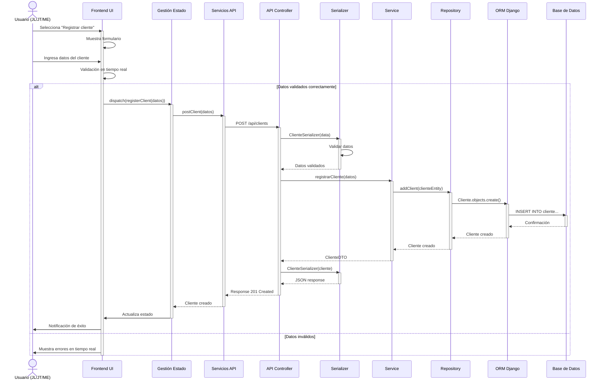
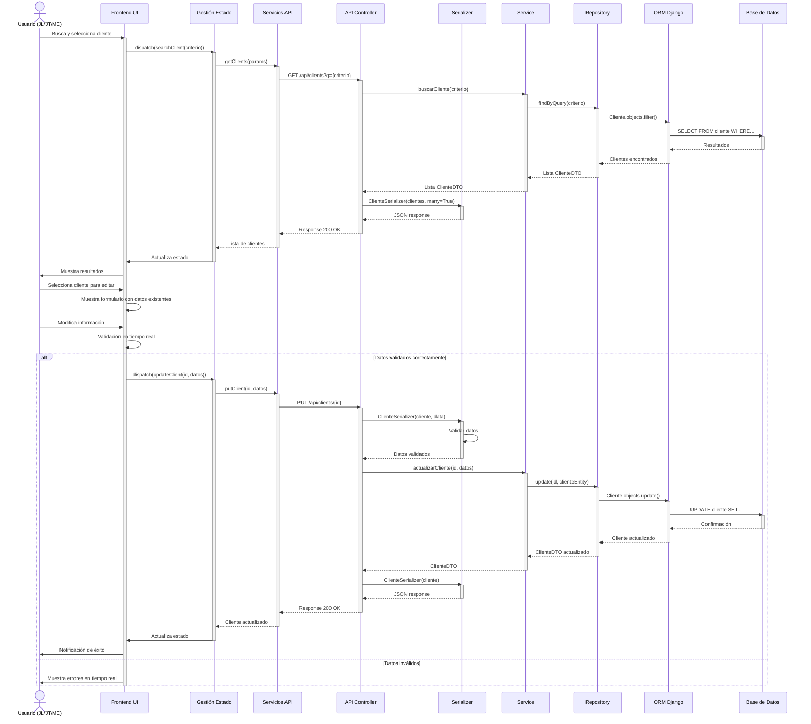
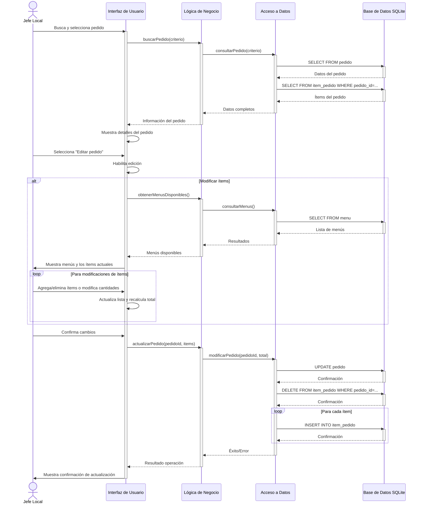
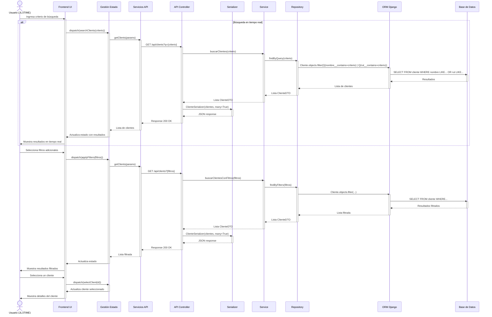
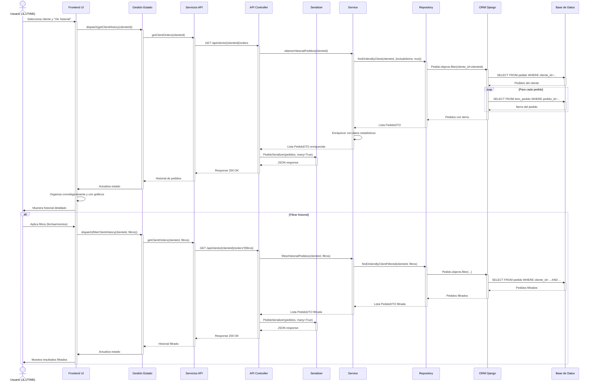

#### CU-R01: Registrar Cliente

```mermaid
sequenceDiagram
    actor Usuario as Usuario (JL/JT/ME)
    participant UI as Frontend UI
    participant GE as Gestión Estado
    participant SA as Servicios API
    participant AC as API Controller
    participant SZ as Serializer
    participant SV as Service
    participant RP as Repository
    participant ORM as ORM Django
    participant BD as Base de Datos

    Usuario->>UI: Selecciona "Registrar cliente"
    activate UI
    UI->>UI: Muestra formulario
    Usuario->>UI: Ingresa datos del cliente
    UI->>UI: Validación en tiempo real

    alt Datos validados correctamente
        UI->>GE: dispatch(registerClient(datos))
        activate GE
        GE->>SA: postClient(datos)
        activate SA
        SA->>AC: POST /api/clients
        activate AC
        AC->>SZ: ClienteSerializer(data)
        activate SZ
        SZ->>SZ: Validar datos
        SZ-->>AC: Datos validados
        deactivate SZ
        
        AC->>SV: registrarCliente(datos)
        activate SV
        SV->>RP: addClient(clienteEntity)
        activate RP
        RP->>ORM: Cliente.objects.create()
        activate ORM
        ORM->>BD: INSERT INTO cliente...
        activate BD
        BD-->>ORM: Confirmación
        deactivate BD
        ORM-->>RP: Cliente creado
        deactivate ORM
        RP-->>SV: Cliente creado
        deactivate RP
        SV-->>AC: ClienteDTO
        deactivate SV
        
        AC->>SZ: ClienteSerializer(cliente)
        activate SZ
        SZ-->>AC: JSON response
        deactivate SZ
        AC-->>SA: Response 201 Created
        deactivate AC
        SA-->>GE: Cliente creado
        deactivate SA
        GE->>UI: Actualiza estado
        deactivate GE
        UI->>Usuario: Notificación de éxito
    else Datos inválidos
        UI->>Usuario: Muestra errores en tiempo real
    end
    deactivate UI
```

#### CU-R02: Editar Cliente

```mermaid
sequenceDiagram
    actor Usuario as Usuario (JL/JT/ME)
    participant UI as Frontend UI
    participant GE as Gestión Estado
    participant SA as Servicios API
    participant AC as API Controller
    participant SZ as Serializer
    participant SV as Service
    participant RP as Repository
    participant ORM as ORM Django
    participant BD as Base de Datos

    Usuario->>UI: Busca y selecciona cliente
    activate UI
    UI->>GE: dispatch(searchClient(criterio))
    activate GE
    GE->>SA: getClients(params)
    activate SA
    SA->>AC: GET /api/clients?q={criterio}
    activate AC
    AC->>SV: buscarCliente(criterio)
    activate SV
    SV->>RP: findByQuery(criterio)
    activate RP
    RP->>ORM: Cliente.objects.filter()
    activate ORM
    ORM->>BD: SELECT FROM cliente WHERE...
    activate BD
    BD-->>ORM: Resultados
    deactivate BD
    ORM-->>RP: Clientes encontrados
    deactivate ORM
    RP-->>SV: Lista ClienteDTO
    deactivate RP
    SV-->>AC: Lista ClienteDTO
    deactivate SV
    
    AC->>SZ: ClienteSerializer(clientes, many=True)
    activate SZ
    SZ-->>AC: JSON response
    deactivate SZ
    AC-->>SA: Response 200 OK
    deactivate AC
    SA-->>GE: Lista de clientes
    deactivate SA
    GE->>UI: Actualiza estado
    deactivate GE

    UI->>Usuario: Muestra resultados
    Usuario->>UI: Selecciona cliente para editar
    UI->>UI: Muestra formulario con datos existentes
    Usuario->>UI: Modifica información
    UI->>UI: Validación en tiempo real

    alt Datos validados correctamente
        UI->>GE: dispatch(updateClient(id, datos))
        activate GE
        GE->>SA: putClient(id, datos)
        activate SA
        SA->>AC: PUT /api/clients/{id}
        activate AC
        AC->>SZ: ClienteSerializer(cliente, data)
        activate SZ
        SZ->>SZ: Validar datos
        SZ-->>AC: Datos validados
        deactivate SZ
        
        AC->>SV: actualizarCliente(id, datos)
        activate SV
        SV->>RP: update(id, clienteEntity)
        activate RP
        RP->>ORM: Cliente.objects.update()
        activate ORM
        ORM->>BD: UPDATE cliente SET...
        activate BD
        BD-->>ORM: Confirmación
        deactivate BD
        ORM-->>RP: Cliente actualizado
        deactivate ORM
        RP-->>SV: ClienteDTO actualizado
        deactivate RP
        SV-->>AC: ClienteDTO
        deactivate SV
        
        AC->>SZ: ClienteSerializer(cliente)
        activate SZ
        SZ-->>AC: JSON response
        deactivate SZ
        AC-->>SA: Response 200 OK
        deactivate AC
        SA-->>GE: Cliente actualizado
        deactivate SA
        GE->>UI: Actualiza estado
        deactivate GE
        UI->>Usuario: Notificación de éxito
    else Datos inválidos
        UI->>Usuario: Muestra errores en tiempo real
    end
    deactivate UI
```

#### CU-R03: Eliminar Cliente

```mermaid
sequenceDiagram
    actor JL as Jefe Local
    participant UI as Interfaz de Usuario
    participant LN as Lógica de Negocio
    participant DA as Acceso a Datos
    participant DB as Base de Datos SQLite
    
    JL->>UI: Busca y selecciona pedido
    activate UI
    UI->>LN: buscarPedido(criterio)
    activate LN
    LN->>DA: consultarPedido(criterio)
    activate DA
    DA->>DB: SELECT FROM pedido
    activate DB
    DB-->>DA: Datos del pedido
    deactivate DB
    
    DA->>DB: SELECT FROM item_pedido WHERE pedido_id=...
    activate DB
    DB-->>DA: Ítems del pedido
    deactivate DB
    
    DA-->>LN: Datos completos
    deactivate DA
    LN-->>UI: Información del pedido
    deactivate LN
    
    UI->>UI: Muestra detalles del pedido
    JL->>UI: Selecciona "Editar pedido"
    UI->>UI: Habilita edición
    
    alt Modificar ítems
        UI->>LN: obtenerMenusDisponibles()
        activate LN
        LN->>DA: consultarMenus()
        activate DA
        DA->>DB: SELECT FROM menu
        activate DB
        DB-->>DA: Lista de menús
        deactivate DB
        DA-->>LN: Resultados
        deactivate DA
        LN-->>UI: Menús disponibles
        deactivate LN
        
        UI->>JL: Muestra menús y los ítems actuales
        
        loop Para modificaciones de ítems
            JL->>UI: Agrega/elimina ítems o modifica cantidades
            UI->>UI: Actualiza lista y recalcula total
        end
    end
    
    JL->>UI: Confirma cambios
    
    UI->>LN: actualizarPedido(pedidoId, items)
    activate LN
    LN->>DA: modificarPedido(pedidoId, total)
    activate DA
    DA->>DB: UPDATE pedido
    activate DB
    DB-->>DA: Confirmación
    deactivate DB
    
    DA->>DB: DELETE FROM item_pedido WHERE pedido_id=...
    activate DB
    DB-->>DA: Confirmación
    deactivate DB
    
    loop Para cada ítem
        DA->>DB: INSERT INTO item_pedido
        activate DB
        DB-->>DA: Confirmación
        deactivate DB
    end
    
    DA-->>LN: Éxito/Error
    deactivate DA
    LN-->>UI: Resultado operación
    deactivate LN
    
    UI->>JL: Muestra confirmación de actualización
    deactivate UI

```

#### CU-R04: Buscar Cliente

```mermaid
sequenceDiagram
    actor Usuario as Usuario (JL/JT/ME)
    participant UI as Frontend UI
    participant GE as Gestión Estado
    participant SA as Servicios API
    participant AC as API Controller
    participant SZ as Serializer
    participant SV as Service
    participant RP as Repository
    participant ORM as ORM Django
    participant BD as Base de Datos

    Usuario->>UI: Ingresa criterio de búsqueda
    activate UI
    
    alt Búsqueda en tiempo real
        UI->>GE: dispatch(searchClients(criterio))
        activate GE
        GE->>SA: getClients(params)
        activate SA
        SA->>AC: GET /api/clients?q={criterio}
        activate AC
        AC->>SV: buscarClientes(criterio)
        activate SV
        SV->>RP: findByQuery(criterio)
        activate RP
        RP->>ORM: Cliente.objects.filter(Q(nombre__contains=criterio) | Q(rut__contains=criterio))
        activate ORM
        ORM->>BD: SELECT FROM cliente WHERE nombre LIKE... OR rut LIKE...
        activate BD
        BD-->>ORM: Resultados
        deactivate BD
        ORM-->>RP: Lista de clientes
        deactivate ORM
        RP-->>SV: Lista ClienteDTO
        deactivate RP
        SV-->>AC: Lista ClienteDTO
        deactivate SV
        
        AC->>SZ: ClienteSerializer(clientes, many=True)
        activate SZ
        SZ-->>AC: JSON response
        deactivate SZ
        AC-->>SA: Response 200 OK
        deactivate AC
        SA-->>GE: Lista de clientes
        deactivate SA
        GE->>UI: Actualiza estado con resultados
        deactivate GE
        UI->>Usuario: Muestra resultados en tiempo real
    end
    
    Usuario->>UI: Selecciona filtros adicionales
    UI->>GE: dispatch(applyFilters(filtros))
    activate GE
    GE->>SA: getClients(params)
    activate SA
    SA->>AC: GET /api/clients?{filtros}
    activate AC
    AC->>SV: buscarClientesConFiltros(filtros)
    activate SV
    SV->>RP: findByFilters(filtros)
    activate RP
    RP->>ORM: Cliente.objects.filter(...)
    activate ORM
    ORM->>BD: SELECT FROM cliente WHERE...
    activate BD
    BD-->>ORM: Resultados filtrados
    deactivate BD
    ORM-->>RP: Lista filtrada
    deactivate ORM
    RP-->>SV: Lista ClienteDTO
    deactivate RP
    SV-->>AC: Lista ClienteDTO
    deactivate SV
    
    AC->>SZ: ClienteSerializer(clientes, many=True)
    activate SZ
    SZ-->>AC: JSON response
    deactivate SZ
    AC-->>SA: Response 200 OK
    deactivate AC
    SA-->>GE: Lista filtrada
    deactivate SA
    GE->>UI: Actualiza estado
    deactivate GE
    
    UI->>Usuario: Muestra resultados filtrados
    Usuario->>UI: Selecciona un cliente
    UI->>GE: dispatch(selectClient(id))
    activate GE
    GE->>UI: Actualiza cliente seleccionado
    deactivate GE
    UI->>Usuario: Muestra detalles del cliente
    deactivate UI
```

#### CU-R05: Ver Historial de Pedidos

```mermaid
sequenceDiagram
    actor Usuario as Usuario (JL/JT/ME)
    participant UI as Frontend UI
    participant GE as Gestión Estado
    participant SA as Servicios API
    participant AC as API Controller
    participant SZ as Serializer
    participant SV as Service
    participant RP as Repository
    participant ORM as ORM Django
    participant BD as Base de Datos

    Usuario->>UI: Selecciona cliente y "Ver historial"
    activate UI
    
    UI->>GE: dispatch(getClientHistory(clienteId))
    activate GE
    GE->>SA: getClientOrders(clienteId)
    activate SA
    SA->>AC: GET /api/clients/{clienteId}/orders
    activate AC
    AC->>SV: obtenerHistorialPedidos(clienteId)
    activate SV
    SV->>RP: findOrdersByClient(clienteId, {includeItems: true})
    activate RP
    RP->>ORM: Pedido.objects.filter(cliente_id=clienteId)
    activate ORM
    ORM->>BD: SELECT FROM pedido WHERE cliente_id=...
    activate BD
    BD-->>ORM: Pedidos del cliente
    deactivate BD
    
    loop Para cada pedido
        ORM->>BD: SELECT FROM item_pedido WHERE pedido_id=...
        activate BD
        BD-->>ORM: Ítems del pedido
        deactivate BD
    end
    
    ORM-->>RP: Pedidos con items
    deactivate ORM
    RP-->>SV: Lista PedidoDTO
    deactivate RP
    SV->>SV: Enriquecer con datos estadísticos
    SV-->>AC: Lista PedidoDTO enriquecida
    deactivate SV
    
    AC->>SZ: PedidoSerializer(pedidos, many=True)
    activate SZ
    SZ-->>AC: JSON response
    deactivate SZ
    AC-->>SA: Response 200 OK
    deactivate AC
    SA-->>GE: Historial de pedidos
    deactivate SA
    GE->>UI: Actualiza estado
    deactivate GE
    
    UI->>UI: Organiza cronológicamente y con gráficos
    UI->>Usuario: Muestra historial detallado
    
    alt Filtrar historial
        Usuario->>UI: Aplica filtros (fechas/montos)
        UI->>GE: dispatch(filterClientHistory(clienteId, filtros))
        activate GE
        GE->>SA: getClientOrders(clienteId, filtros)
        activate SA
        SA->>AC: GET /api/clients/{clienteId}/orders?{filtros}
        activate AC
        AC->>SV: filtrarHistorialPedidos(clienteId, filtros)
        activate SV
        SV->>RP: findOrdersByClientFiltered(clienteId, filtros)
        activate RP
        RP->>ORM: Pedido.objects.filter(...)
        activate ORM
        ORM->>BD: SELECT FROM pedido WHERE cliente_id=... AND ...
        activate BD
        BD-->>ORM: Pedidos filtrados
        deactivate BD
        ORM-->>RP: Pedidos filtrados
        deactivate ORM
        RP-->>SV: Lista PedidoDTO filtrada
        deactivate RP
        SV-->>AC: Lista PedidoDTO filtrada
        deactivate SV
        
        AC->>SZ: PedidoSerializer(pedidos, many=True)
        activate SZ
        SZ-->>AC: JSON response
        deactivate SZ
        AC-->>SA: Response 200 OK
        deactivate AC
        SA-->>GE: Historial filtrado
        deactivate SA
        GE->>UI: Actualiza estado
        deactivate GE
        UI->>Usuario: Muestra resultados filtrados
    end
    deactivate UI
```