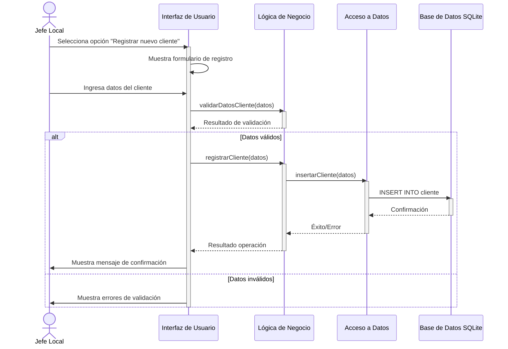
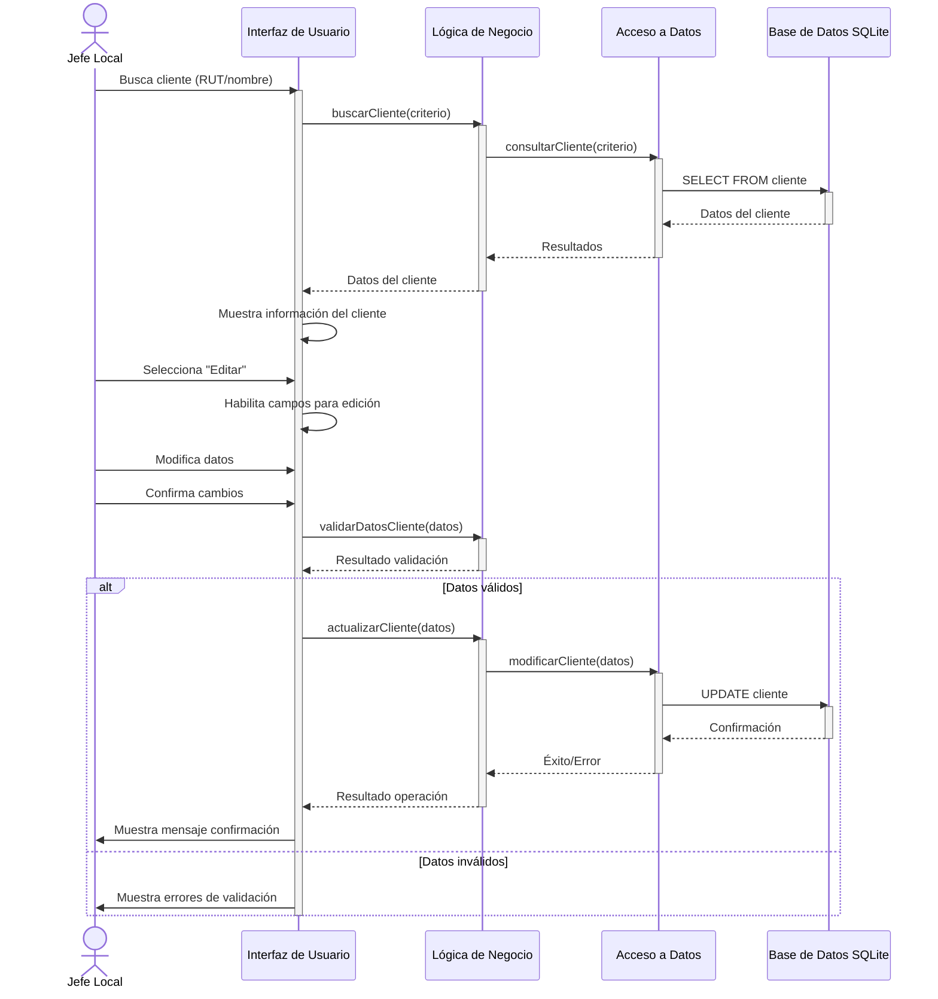
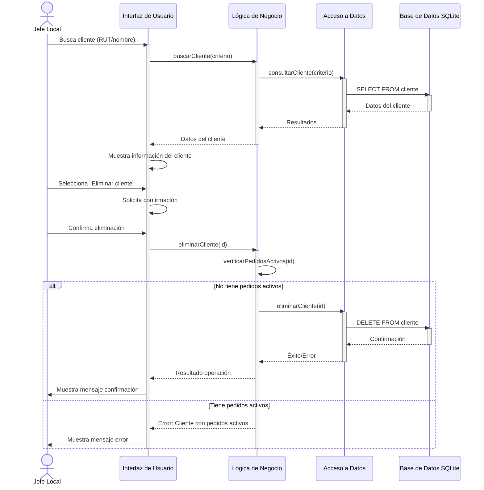
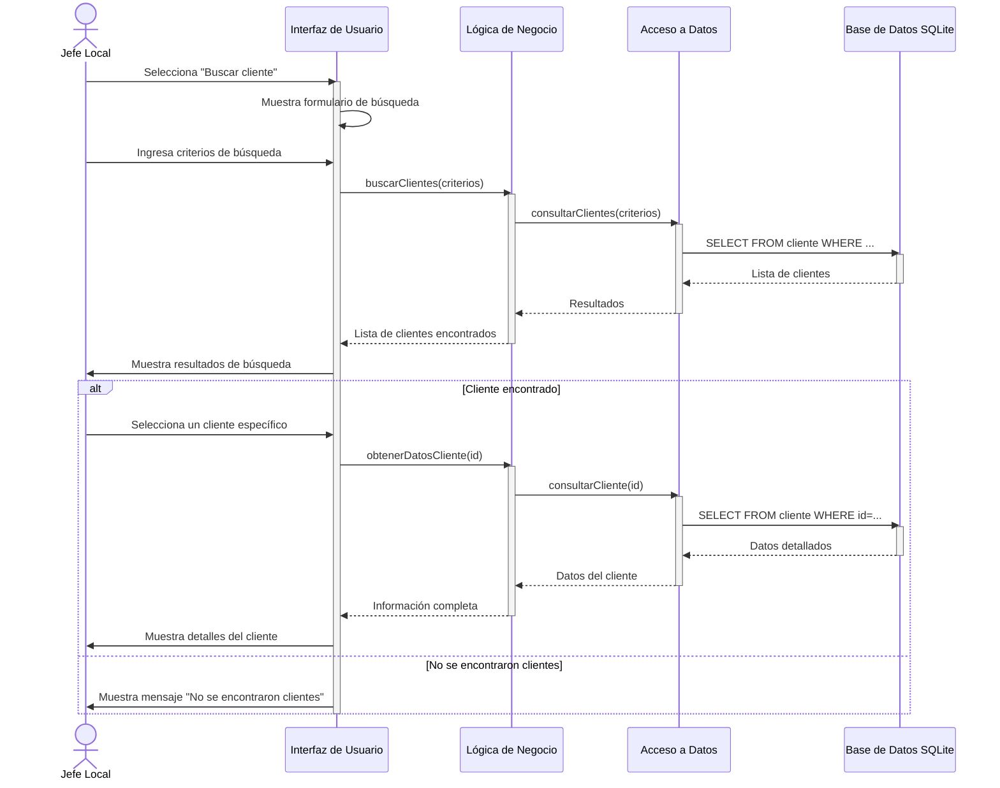
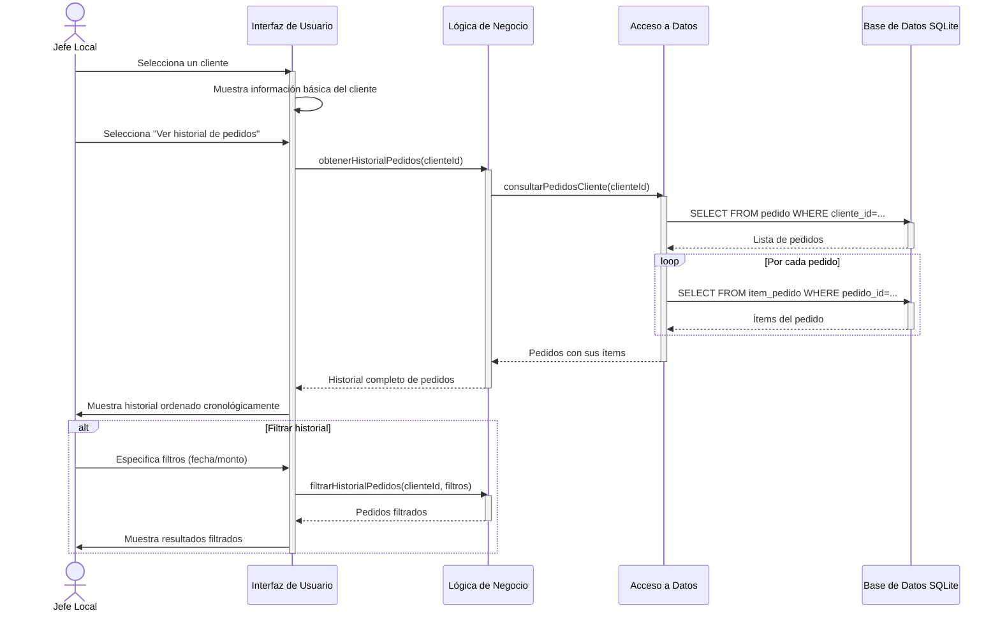

#### CU-A01: Registrar Cliente

```mermaid
sequenceDiagram
    actor JL as Jefe Local
    participant UI as Interfaz de Usuario
    participant LN as Lógica de Negocio
    participant DA as Acceso a Datos
    participant DB as Base de Datos SQLite
    
    JL->>UI: Selecciona opción "Registrar nuevo cliente"
    activate UI
    UI->>UI: Muestra formulario de registro
    JL->>UI: Ingresa datos del cliente
    UI->>LN: validarDatosCliente(datos)
    activate LN
    LN-->>UI: Resultado de validación
    deactivate LN
    
    alt Datos válidos
        UI->>LN: registrarCliente(datos)
        activate LN
        LN->>DA: insertarCliente(datos)
        activate DA
        DA->>DB: INSERT INTO cliente
        activate DB
        DB-->>DA: Confirmación
        deactivate DB
        DA-->>LN: Éxito/Error
        deactivate DA
        LN-->>UI: Resultado operación
        deactivate LN
        UI->>JL: Muestra mensaje de confirmación
    else Datos inválidos
        UI->>JL: Muestra errores de validación
    end
    deactivate UI
```

#### CU-A02: Editar Cliente

```mermaid
sequenceDiagram
    actor JL as Jefe Local
    participant UI as Interfaz de Usuario
    participant LN as Lógica de Negocio
    participant DA as Acceso a Datos
    participant DB as Base de Datos SQLite
    
    JL->>UI: Busca cliente (RUT/nombre)
    activate UI
    UI->>LN: buscarCliente(criterio)
    activate LN
    LN->>DA: consultarCliente(criterio)
    activate DA
    DA->>DB: SELECT FROM cliente
    activate DB
    DB-->>DA: Datos del cliente
    deactivate DB
    DA-->>LN: Resultados
    deactivate DA
    LN-->>UI: Datos del cliente
    deactivate LN
    
    UI->>UI: Muestra información del cliente
    JL->>UI: Selecciona "Editar"
    UI->>UI: Habilita campos para edición
    JL->>UI: Modifica datos
    JL->>UI: Confirma cambios
    
    UI->>LN: validarDatosCliente(datos)
    activate LN
    LN-->>UI: Resultado validación
    deactivate LN
    
    alt Datos válidos
        UI->>LN: actualizarCliente(datos)
        activate LN
        LN->>DA: modificarCliente(datos)
        activate DA
        DA->>DB: UPDATE cliente
        activate DB
        DB-->>DA: Confirmación
        deactivate DB
        DA-->>LN: Éxito/Error
        deactivate DA
        LN-->>UI: Resultado operación
        deactivate LN
        UI->>JL: Muestra mensaje confirmación
    else Datos inválidos
        UI->>JL: Muestra errores de validación
    end
    deactivate UI
```

#### CU-A03: Eliminar Cliente

```mermaid
sequenceDiagram
    actor JL as Jefe Local
    participant UI as Interfaz de Usuario
    participant LN as Lógica de Negocio
    participant DA as Acceso a Datos
    participant DB as Base de Datos SQLite
    
    JL->>UI: Busca cliente (RUT/nombre)
    activate UI
    UI->>LN: buscarCliente(criterio)
    activate LN
    LN->>DA: consultarCliente(criterio)
    activate DA
    DA->>DB: SELECT FROM cliente
    activate DB
    DB-->>DA: Datos del cliente
    deactivate DB
    DA-->>LN: Resultados
    deactivate DA
    LN-->>UI: Datos del cliente
    deactivate LN
    
    UI->>UI: Muestra información del cliente
    JL->>UI: Selecciona "Eliminar cliente"
    UI->>UI: Solicita confirmación
    JL->>UI: Confirma eliminación
    
    UI->>LN: eliminarCliente(id)
    activate LN
    LN->>LN: verificarPedidosActivos(id)
    
    alt No tiene pedidos activos
        LN->>DA: eliminarCliente(id)
        activate DA
        DA->>DB: DELETE FROM cliente
        activate DB
        DB-->>DA: Confirmación
        deactivate DB
        DA-->>LN: Éxito/Error
        deactivate DA
        LN-->>UI: Resultado operación
        UI->>JL: Muestra mensaje confirmación
    else Tiene pedidos activos
        LN-->>UI: Error: Cliente con pedidos activos
        UI->>JL: Muestra mensaje error
    end
    deactivate LN
    deactivate UI
```

#### CU-A04: Buscar Cliente

```mermaid
sequenceDiagram
    actor JL as Jefe Local
    participant UI as Interfaz de Usuario
    participant LN as Lógica de Negocio
    participant DA as Acceso a Datos
    participant DB as Base de Datos SQLite
    
    JL->>UI: Selecciona "Buscar cliente"
    activate UI
    UI->>UI: Muestra formulario de búsqueda
    JL->>UI: Ingresa criterios de búsqueda
    UI->>LN: buscarClientes(criterios)
    activate LN
    LN->>DA: consultarClientes(criterios)
    activate DA
    DA->>DB: SELECT FROM cliente WHERE ...
    activate DB
    DB-->>DA: Lista de clientes
    deactivate DB
    DA-->>LN: Resultados
    deactivate DA
    LN-->>UI: Lista de clientes encontrados
    deactivate LN
    
    UI->>JL: Muestra resultados de búsqueda
    
    alt Cliente encontrado
        JL->>UI: Selecciona un cliente específico
        UI->>LN: obtenerDatosCliente(id)
        activate LN
        LN->>DA: consultarCliente(id)
        activate DA
        DA->>DB: SELECT FROM cliente WHERE id=...
        activate DB
        DB-->>DA: Datos detallados
        deactivate DB
        DA-->>LN: Datos del cliente
        deactivate DA
        LN-->>UI: Información completa
        deactivate LN
        UI->>JL: Muestra detalles del cliente
    else No se encontraron clientes
        UI->>JL: Muestra mensaje "No se encontraron clientes"
    end
    deactivate UI
```

#### CU-A05: Ver Historial de Pedidos

```mermaid
sequenceDiagram
    actor JL as Jefe Local
    participant UI as Interfaz de Usuario
    participant LN as Lógica de Negocio
    participant DA as Acceso a Datos
    participant DB as Base de Datos SQLite
    
    JL->>UI: Selecciona un cliente
    activate UI
    UI->>UI: Muestra información básica del cliente
    JL->>UI: Selecciona "Ver historial de pedidos"
    
    UI->>LN: obtenerHistorialPedidos(clienteId)
    activate LN
    LN->>DA: consultarPedidosCliente(clienteId)
    activate DA
    DA->>DB: SELECT FROM pedido WHERE cliente_id=...
    activate DB
    DB-->>DA: Lista de pedidos
    deactivate DB
    
    loop Por cada pedido
        DA->>DB: SELECT FROM item_pedido WHERE pedido_id=...
        activate DB
        DB-->>DA: Ítems del pedido
        deactivate DB
    end
    
    DA-->>LN: Pedidos con sus ítems
    deactivate DA
    LN-->>UI: Historial completo de pedidos
    deactivate LN
    
    UI->>JL: Muestra historial ordenado cronológicamente
    
    alt Filtrar historial
        JL->>UI: Especifica filtros (fecha/monto)
        UI->>LN: filtrarHistorialPedidos(clienteId, filtros)
        activate LN
        LN-->>UI: Pedidos filtrados
        deactivate LN
        UI->>JL: Muestra resultados filtrados
    end
    deactivate UI
```