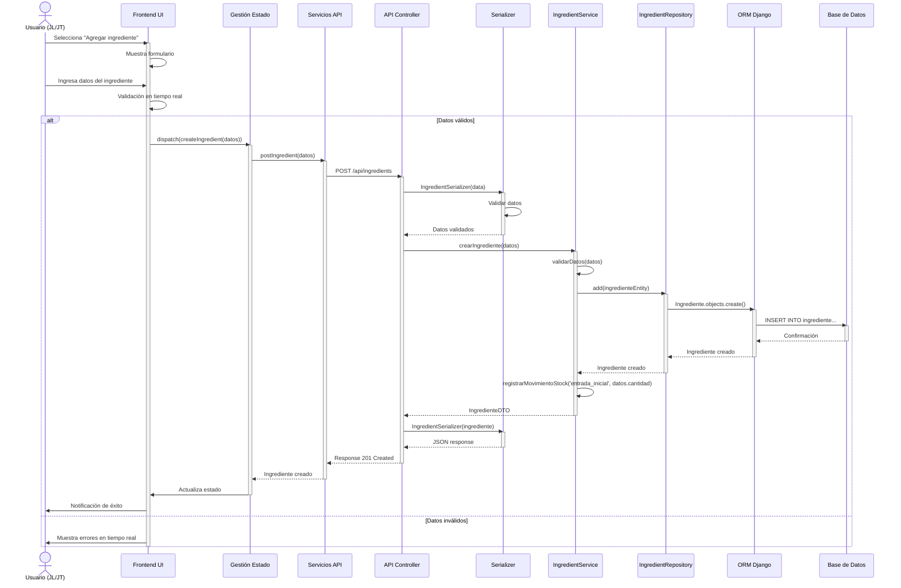
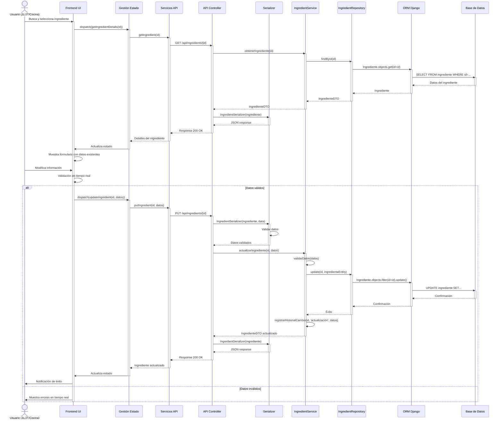
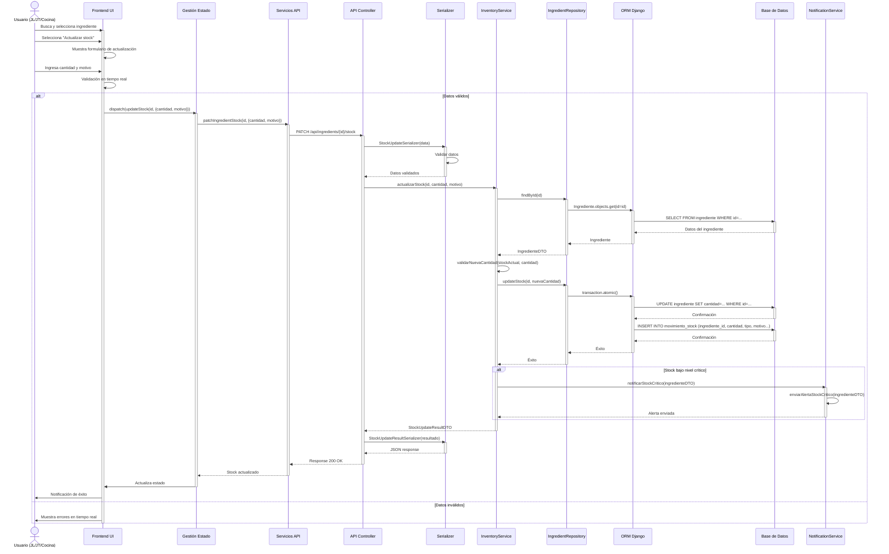
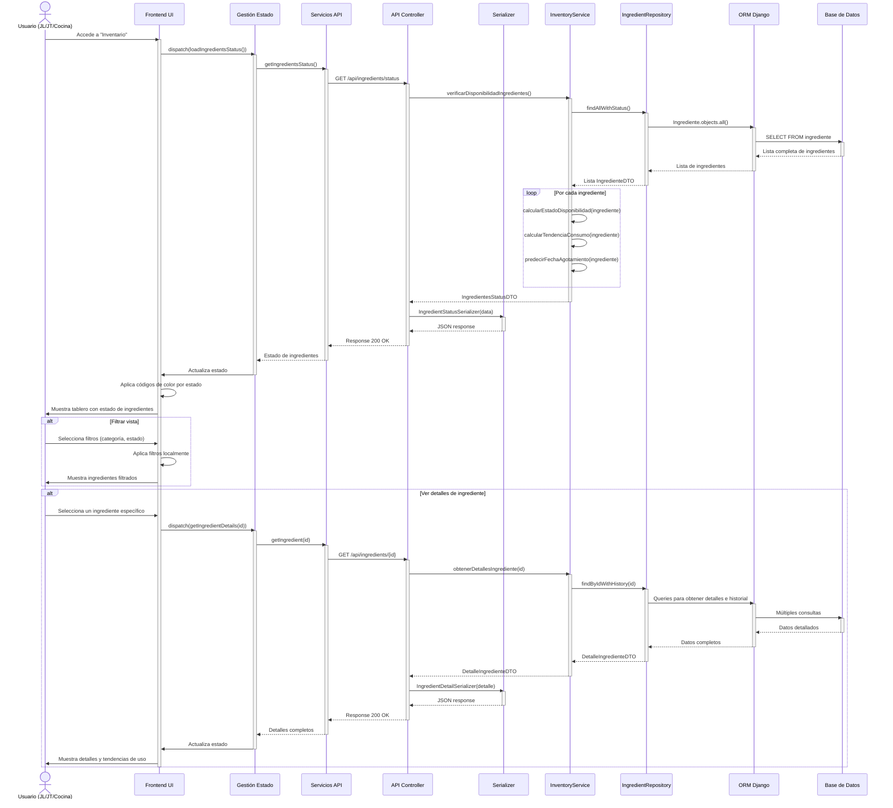

#### CU-R06: Agregar Ingrediente



#### CU-R07: Editar Ingrediente



#### CU-R08: Actualizar Stock



#### CU-R09: Eliminar Ingrediente

```mermaid
sequenceDiagram
    actor Usuario as Usuario (JL/JT)
    participant UI as Frontend UI
    participant GE as Gestión Estado
    participant SA as Servicios API
    participant AC as API Controller
    participant SV as IngredientService
    participant RP as IngredientRepository
    participant MR as MenuRepository
    participant ORM as ORM Django
    participant BD as Base de Datos
    
    Usuario->>UI: Selecciona ingrediente y "Eliminar"
    activate UI
    UI->>UI: Solicita confirmación
    Usuario->>UI: Confirma eliminación
    
    UI->>GE: dispatch(deleteIngredient(id))
    activate GE
    GE->>SA: deleteIngredient(id)
    activate SA
    SA->>AC: DELETE /api/ingredients/{id}
    activate AC
    
    AC->>SV: eliminarIngrediente(id)
    activate SV
    
    SV->>MR: findMenusUsingIngredient(id)
    activate MR
    MR->>ORM: MenuIngrediente.objects.filter(ingrediente_id=id).select_related('menu')
    activate ORM
    ORM->>BD: SELECT FROM menu_ingrediente JOIN menu... WHERE ingrediente_id=...
    activate BD
    BD-->>ORM: Menús asociados
    deactivate BD
    ORM-->>MR: Lista de menús
    deactivate ORM
    MR-->>SV: Lista de menús que usan el ingrediente
    deactivate MR
    
    alt Sin menús asociados o solo en menús inactivos
        SV->>RP: logicalDelete(id)
        activate RP
        RP->>ORM: Ingrediente.objects.filter(id=id).update(estado='eliminado')
        activate ORM
        ORM->>BD: UPDATE ingrediente SET estado='eliminado' WHERE id=...
        activate BD
        BD-->>ORM: Confirmación
        deactivate BD
        ORM-->>RP: Confirmación
        deactivate ORM
        RP-->>SV: Éxito
        deactivate RP
        
        SV->>SV: registrarHistorialCambio(id, 'eliminación')
        SV-->>AC: Éxito
        deactivate SV
        
        AC-->>SA: Response 204 No Content
        deactivate AC
        SA-->>GE: Ingrediente eliminado
        deactivate SA
        GE->>UI: Actualiza estado
        deactivate GE
        UI->>Usuario: Notificación de éxito
    else Con menús activos asociados
        SV-->>AC: Error: Ingrediente en uso en menús activos
        deactivate SV
        
        AC-->>SA: Response 400 Bad Request
        deactivate AC
        SA-->>GE: Error con detalles
        deactivate SA
        GE->>UI: Actualiza estado con error
        deactivate GE
        UI->>Usuario: Muestra error y lista de menús afectados
    end
    deactivate UI
```

#### CU-R10: Verificar Disponibilidad de Ingredientes

