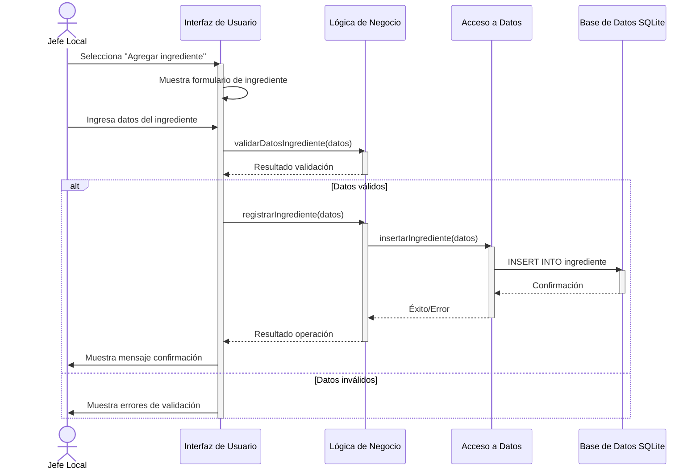
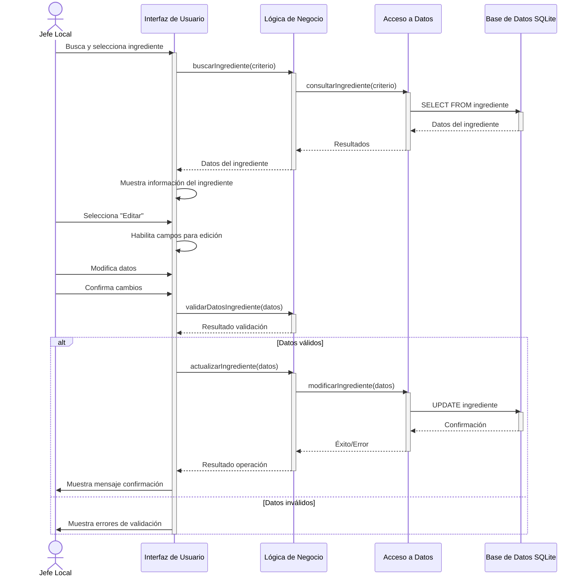
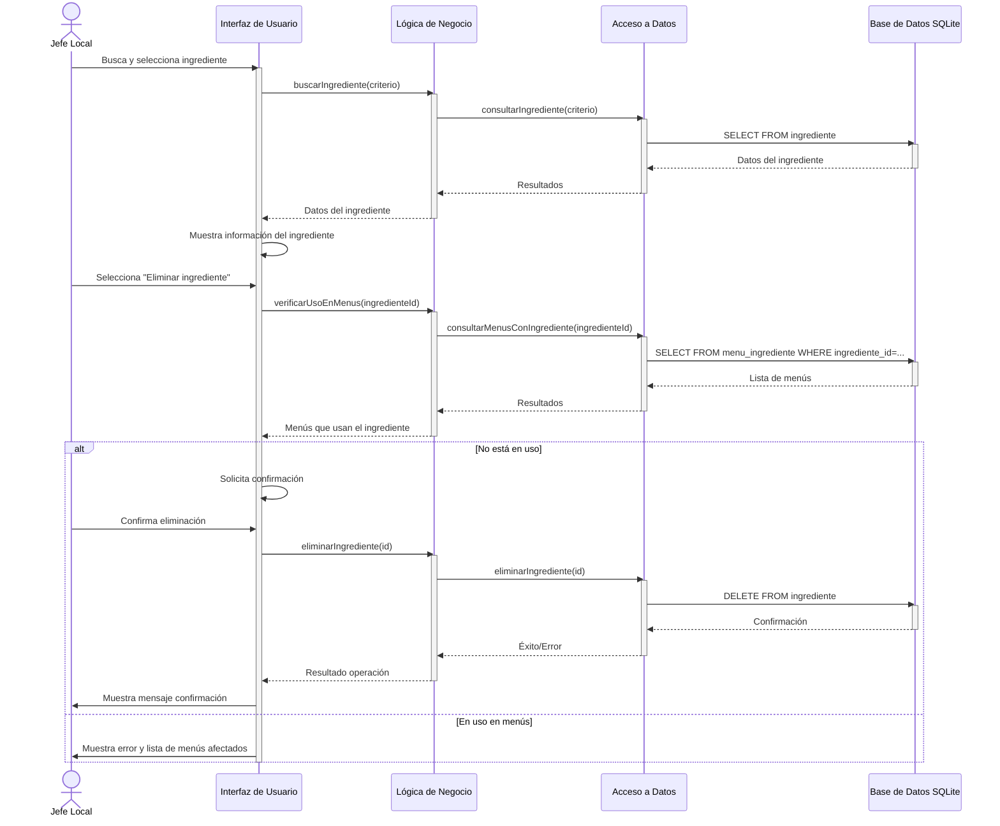
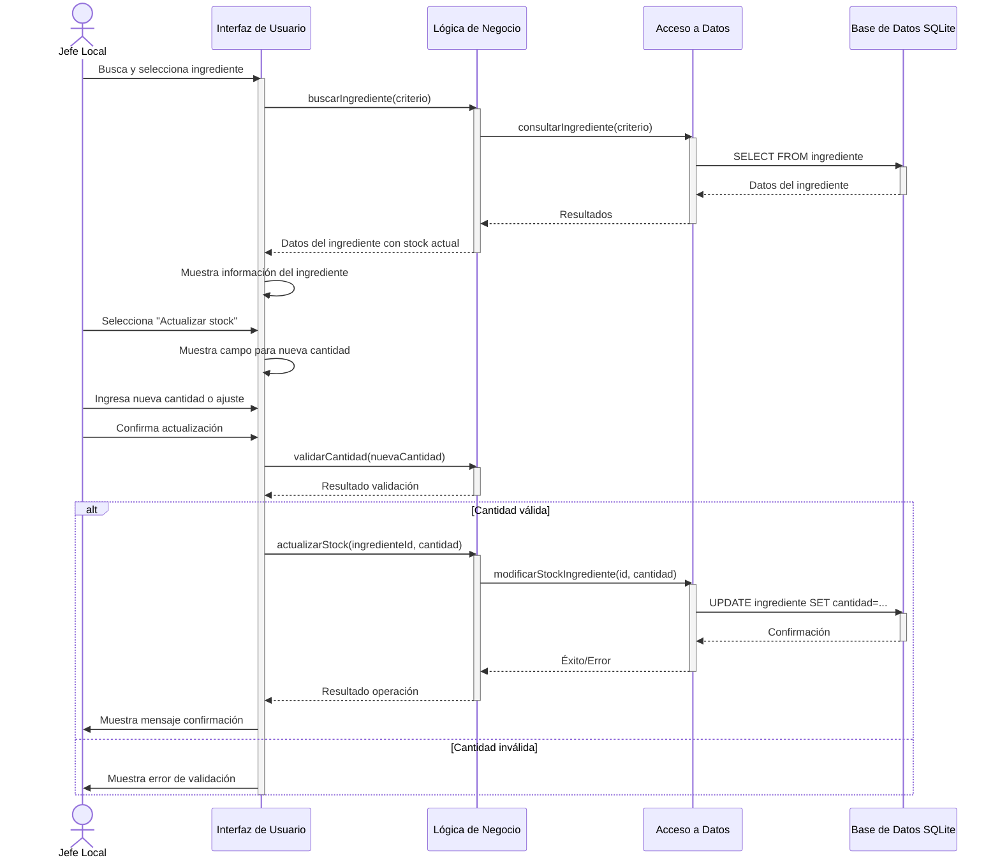
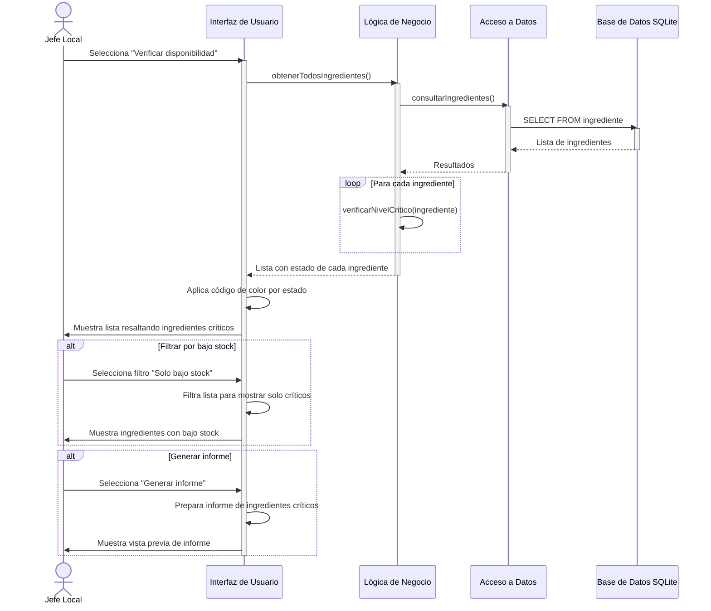

#### CU-A06: Agregar Ingrediente

```mermaid
sequenceDiagram
    actor JL as Jefe Local
    participant UI as Interfaz de Usuario
    participant LN as Lógica de Negocio
    participant DA as Acceso a Datos
    participant DB as Base de Datos SQLite
    
    JL->>UI: Selecciona "Agregar ingrediente"
    activate UI
    UI->>UI: Muestra formulario de ingrediente
    JL->>UI: Ingresa datos del ingrediente
    
    UI->>LN: validarDatosIngrediente(datos)
    activate LN
    LN-->>UI: Resultado validación
    deactivate LN
    
    alt Datos válidos
        UI->>LN: registrarIngrediente(datos)
        activate LN
        LN->>DA: insertarIngrediente(datos)
        activate DA
        DA->>DB: INSERT INTO ingrediente
        activate DB
        DB-->>DA: Confirmación
        deactivate DB
        DA-->>LN: Éxito/Error
        deactivate DA
        LN-->>UI: Resultado operación
        deactivate LN
        UI->>JL: Muestra mensaje confirmación
    else Datos inválidos
        UI->>JL: Muestra errores de validación
    end
    deactivate UI
```

#### CU-A07: Editar Ingrediente

```mermaid
sequenceDiagram
    actor JL as Jefe Local
    participant UI as Interfaz de Usuario
    participant LN as Lógica de Negocio
    participant DA as Acceso a Datos
    participant DB as Base de Datos SQLite
    
    JL->>UI: Busca y selecciona ingrediente
    activate UI
    UI->>LN: buscarIngrediente(criterio)
    activate LN
    LN->>DA: consultarIngrediente(criterio)
    activate DA
    DA->>DB: SELECT FROM ingrediente
    activate DB
    DB-->>DA: Datos del ingrediente
    deactivate DB
    DA-->>LN: Resultados
    deactivate DA
    LN-->>UI: Datos del ingrediente
    deactivate LN
    
    UI->>UI: Muestra información del ingrediente
    JL->>UI: Selecciona "Editar"
    UI->>UI: Habilita campos para edición
    JL->>UI: Modifica datos
    JL->>UI: Confirma cambios
    
    UI->>LN: validarDatosIngrediente(datos)
    activate LN
    LN-->>UI: Resultado validación
    deactivate LN
    
    alt Datos válidos
        UI->>LN: actualizarIngrediente(datos)
        activate LN
        LN->>DA: modificarIngrediente(datos)
        activate DA
        DA->>DB: UPDATE ingrediente
        activate DB
        DB-->>DA: Confirmación
        deactivate DB
        DA-->>LN: Éxito/Error
        deactivate DA
        LN-->>UI: Resultado operación
        deactivate LN
        UI->>JL: Muestra mensaje confirmación
    else Datos inválidos
        UI->>JL: Muestra errores de validación
    end
    deactivate UI
```

#### CU-A08: Eliminar Ingrediente

```mermaid
sequenceDiagram
    actor JL as Jefe Local
    participant UI as Interfaz de Usuario
    participant LN as Lógica de Negocio
    participant DA as Acceso a Datos
    participant DB as Base de Datos SQLite
    
    JL->>UI: Busca y selecciona ingrediente
    activate UI
    UI->>LN: buscarIngrediente(criterio)
    activate LN
    LN->>DA: consultarIngrediente(criterio)
    activate DA
    DA->>DB: SELECT FROM ingrediente
    activate DB
    DB-->>DA: Datos del ingrediente
    deactivate DB
    DA-->>LN: Resultados
    deactivate DA
    LN-->>UI: Datos del ingrediente
    deactivate LN
    
    UI->>UI: Muestra información del ingrediente
    JL->>UI: Selecciona "Eliminar ingrediente"
    
    UI->>LN: verificarUsoEnMenus(ingredienteId)
    activate LN
    LN->>DA: consultarMenusConIngrediente(ingredienteId)
    activate DA
    DA->>DB: SELECT FROM menu_ingrediente WHERE ingrediente_id=...
    activate DB
    DB-->>DA: Lista de menús
    deactivate DB
    DA-->>LN: Resultados
    deactivate DA
    LN-->>UI: Menús que usan el ingrediente
    deactivate LN
    
    alt No está en uso
        UI->>UI: Solicita confirmación
        JL->>UI: Confirma eliminación
        UI->>LN: eliminarIngrediente(id)
        activate LN
        LN->>DA: eliminarIngrediente(id)
        activate DA
        DA->>DB: DELETE FROM ingrediente
        activate DB
        DB-->>DA: Confirmación
        deactivate DB
        DA-->>LN: Éxito/Error
        deactivate DA
        LN-->>UI: Resultado operación
        deactivate LN
        UI->>JL: Muestra mensaje confirmación
    else En uso en menús
        UI->>JL: Muestra error y lista de menús afectados
    end
    deactivate UI
```

#### CU-A09: Actualizar Stock

```mermaid
sequenceDiagram
    actor JL as Jefe Local
    participant UI as Interfaz de Usuario
    participant LN as Lógica de Negocio
    participant DA as Acceso a Datos
    participant DB as Base de Datos SQLite
    
    JL->>UI: Busca y selecciona ingrediente
    activate UI
    UI->>LN: buscarIngrediente(criterio)
    activate LN
    LN->>DA: consultarIngrediente(criterio)
    activate DA
    DA->>DB: SELECT FROM ingrediente
    activate DB
    DB-->>DA: Datos del ingrediente
    deactivate DB
    DA-->>LN: Resultados
    deactivate DA
    LN-->>UI: Datos del ingrediente con stock actual
    deactivate LN
    
    UI->>UI: Muestra información del ingrediente
    JL->>UI: Selecciona "Actualizar stock"
    UI->>UI: Muestra campo para nueva cantidad
    JL->>UI: Ingresa nueva cantidad o ajuste
    JL->>UI: Confirma actualización
    
    UI->>LN: validarCantidad(nuevaCantidad)
    activate LN
    LN-->>UI: Resultado validación
    deactivate LN
    
    alt Cantidad válida
        UI->>LN: actualizarStock(ingredienteId, cantidad)
        activate LN
        LN->>DA: modificarStockIngrediente(id, cantidad)
        activate DA
        DA->>DB: UPDATE ingrediente SET cantidad=...
        activate DB
        DB-->>DA: Confirmación
        deactivate DB
        DA-->>LN: Éxito/Error
        deactivate DA
        LN-->>UI: Resultado operación
        deactivate LN
        UI->>JL: Muestra mensaje confirmación
    else Cantidad inválida
        UI->>JL: Muestra error de validación
    end
    deactivate UI
```

#### CU-A10: Verificar Disponibilidad de Ingredientes

```mermaid
sequenceDiagram
    actor JL as Jefe Local
    participant UI as Interfaz de Usuario
    participant LN as Lógica de Negocio
    participant DA as Acceso a Datos
    participant DB as Base de Datos SQLite
    
    JL->>UI: Selecciona "Verificar disponibilidad"
    activate UI
    
    UI->>LN: obtenerTodosIngredientes()
    activate LN
    LN->>DA: consultarIngredientes()
    activate DA
    DA->>DB: SELECT FROM ingrediente
    activate DB
    DB-->>DA: Lista de ingredientes
    deactivate DB
    DA-->>LN: Resultados
    deactivate DA
    
    loop Para cada ingrediente
        LN->>LN: verificarNivelCritico(ingrediente)
    end
    
    LN-->>UI: Lista con estado de cada ingrediente
    deactivate LN
    
    UI->>UI: Aplica código de color por estado
    UI->>JL: Muestra lista resaltando ingredientes críticos
    
    alt Filtrar por bajo stock
        JL->>UI: Selecciona filtro "Solo bajo stock"
        UI->>UI: Filtra lista para mostrar solo críticos
        UI->>JL: Muestra ingredientes con bajo stock
    end
    
    alt Generar informe
        JL->>UI: Selecciona "Generar informe"
        UI->>UI: Prepara informe de ingredientes críticos
        UI->>JL: Muestra vista previa de informe
    end
    deactivate UI
```