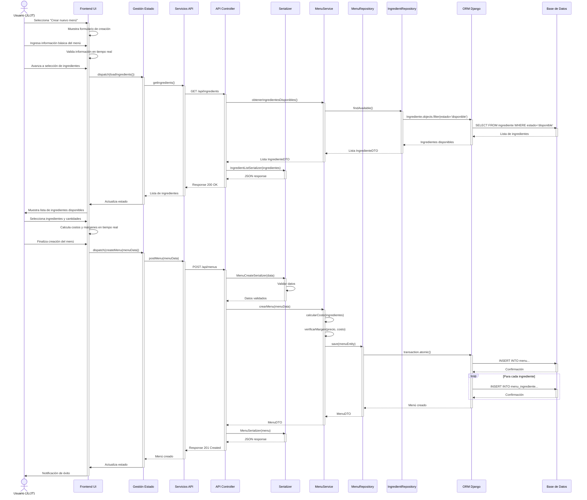
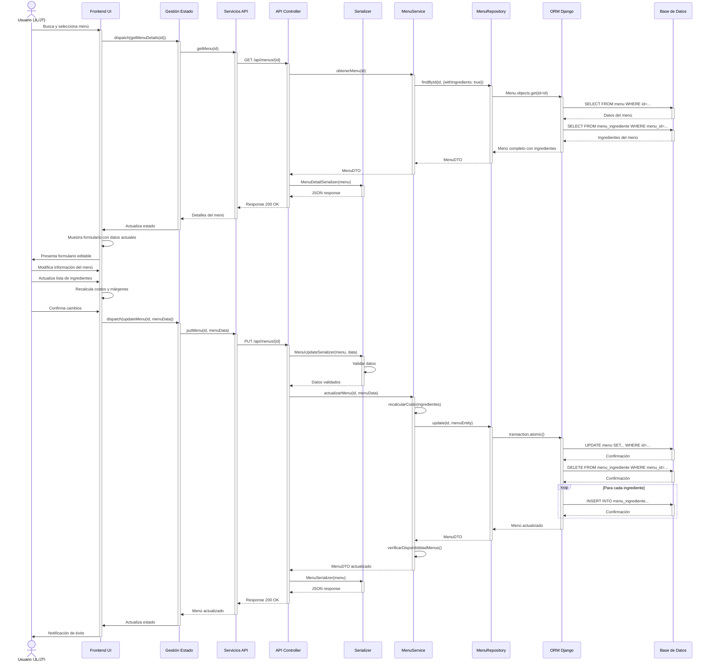
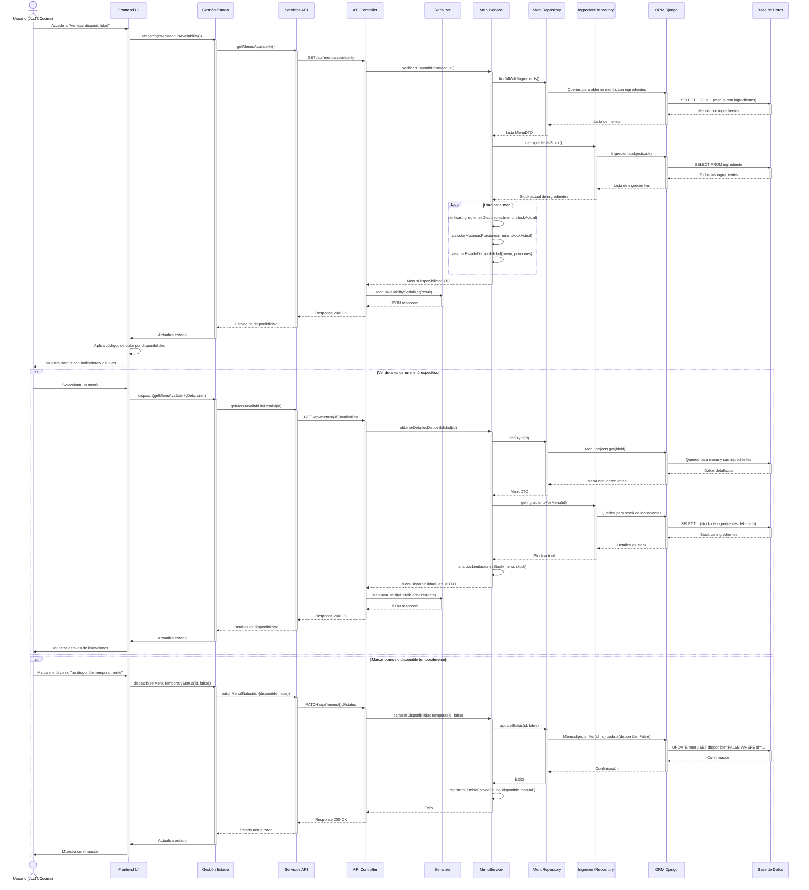
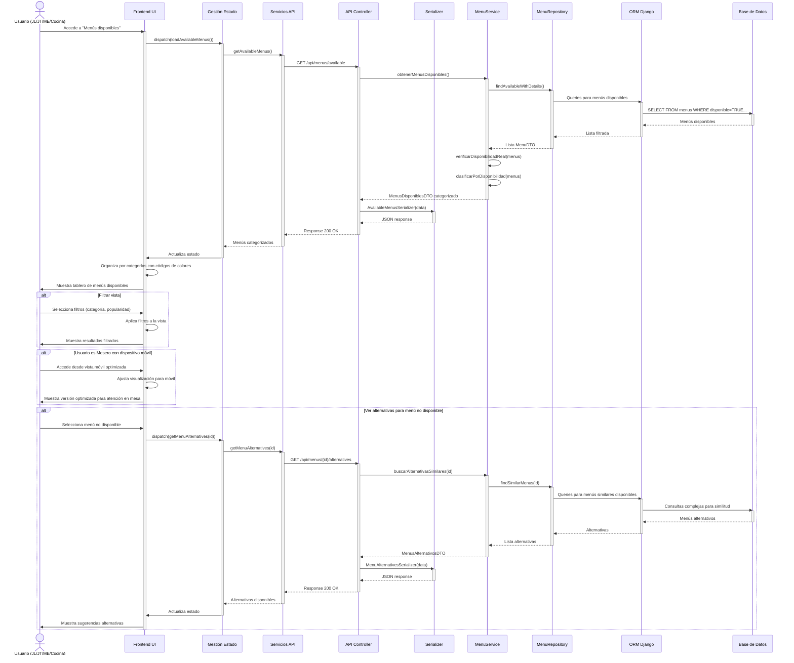

#### CU-R11: Crear Menú



#### CU-R12: Editar Menú



#### CU-R13: Eliminar Menú

```mermaid
sequenceDiagram
    actor Usuario as Usuario (JL/JT)
    participant UI as Frontend UI
    participant GE as Gestión Estado
    participant SA as Servicios API
    participant AC as API Controller
    participant SV as MenuService
    participant RP as MenuRepository
    participant PRP as PedidoRepository
    participant ORM as ORM Django
    participant BD as Base de Datos

    Usuario->>UI: Selecciona menú y elige "Eliminar"
    activate UI
    UI->>UI: Solicita confirmación
    Usuario->>UI: Confirma eliminación
    
    UI->>GE: dispatch(deleteMenu(id))
    activate GE
    GE->>SA: deleteMenu(id)
    activate SA
    SA->>AC: DELETE /api/menus/{id}
    activate AC
    
    AC->>SV: eliminarMenu(id)
    activate SV
    
    SV->>PRP: findPendingOrdersWithMenu(id)
    activate PRP
    PRP->>ORM: Queries para buscar pedidos activos con el menú
    activate ORM
    ORM->>BD: SELECT FROM pedido JOIN item_pedido ON... WHERE menu_id=... AND estado IN...
    activate BD
    BD-->>ORM: Pedidos activos
    deactivate BD
    ORM-->>PRP: Lista de pedidos
    deactivate ORM
    PRP-->>SV: PedidosDTO activos
    deactivate PRP
    
    alt Sin pedidos activos
        SV->>RP: logicalDelete(id)
        activate RP
        RP->>ORM: Menu.objects.filter(id=id).update(estado='eliminado')
        activate ORM
        ORM->>BD: UPDATE menu SET estado='eliminado' WHERE id=...
        activate BD
        BD-->>ORM: Confirmación
        deactivate BD
        ORM-->>RP: Confirmación
        deactivate ORM
        RP-->>SV: Éxito
        deactivate RP
        
        SV->>SV: registrarHistorialCambio(id, 'eliminación')
        SV-->>AC: Éxito
        deactivate SV
        
        AC-->>SA: Response 204 No Content
        deactivate AC
        SA-->>GE: Menú eliminado
        deactivate SA
        GE->>UI: Actualiza estado
        deactivate GE
        UI->>Usuario: Notificación de éxito
    else Con pedidos activos
        SV-->>AC: Error: Menú en uso en pedidos activos
        deactivate SV
        
        AC-->>SA: Response 400 Bad Request
        deactivate AC
        SA-->>GE: Error con detalles
        deactivate SA
        GE->>UI: Actualiza estado con error
        deactivate GE
        UI->>Usuario: Muestra error y lista de pedidos afectados
    end
    deactivate UI
```

#### CU-R14: Verificar Disponibilidad de Menú



#### CU-R15: Ver Menús Disponibles


