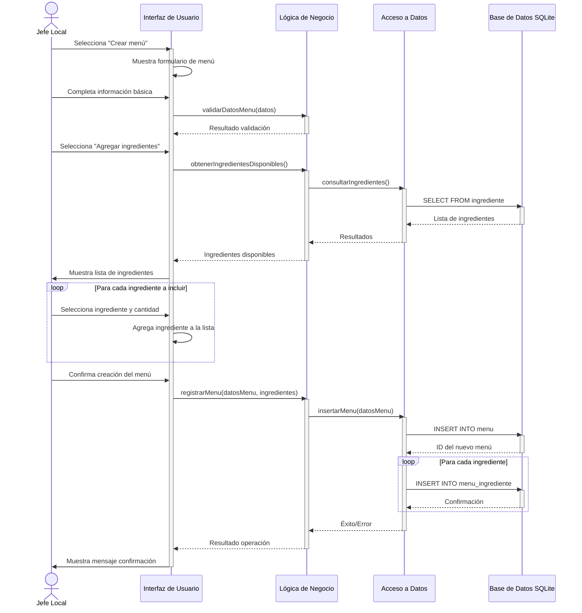
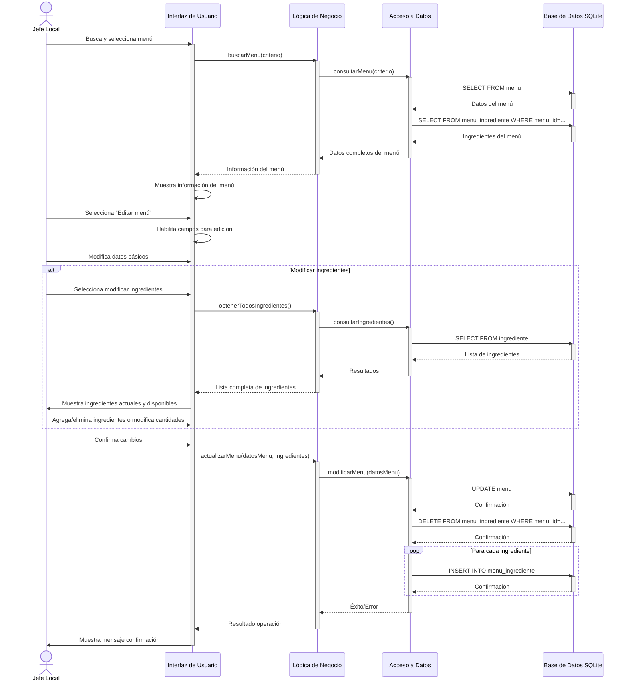
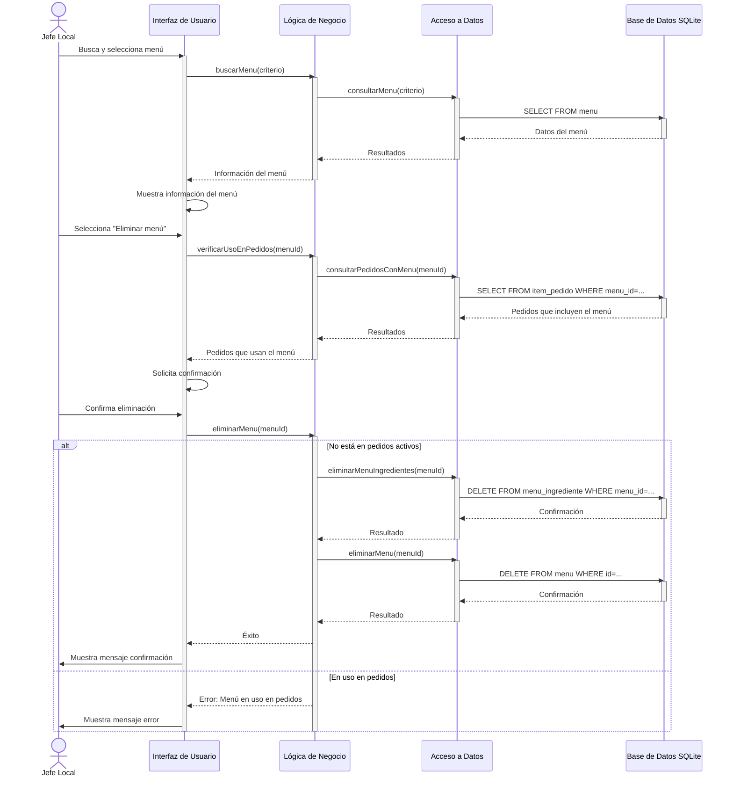
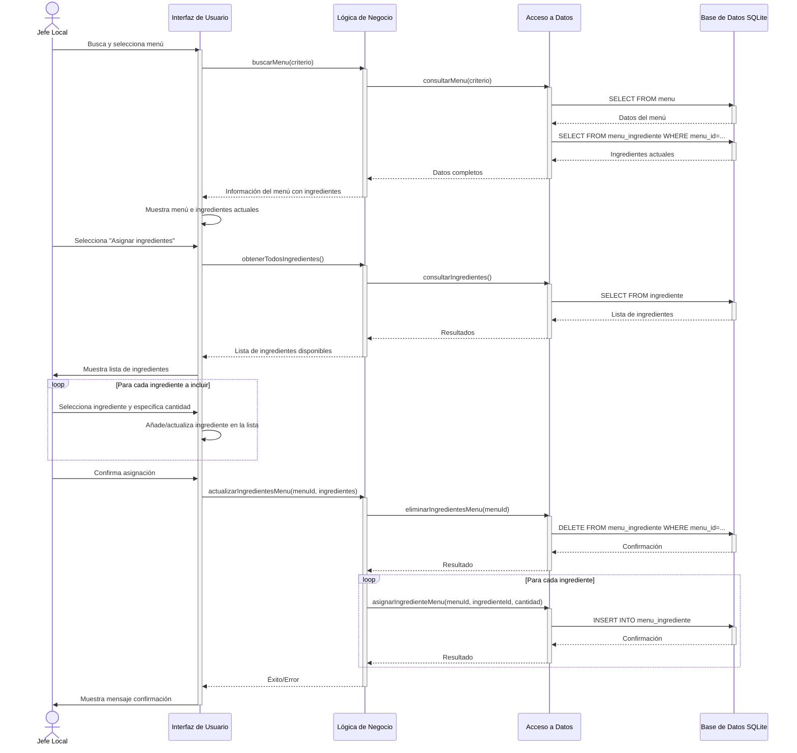
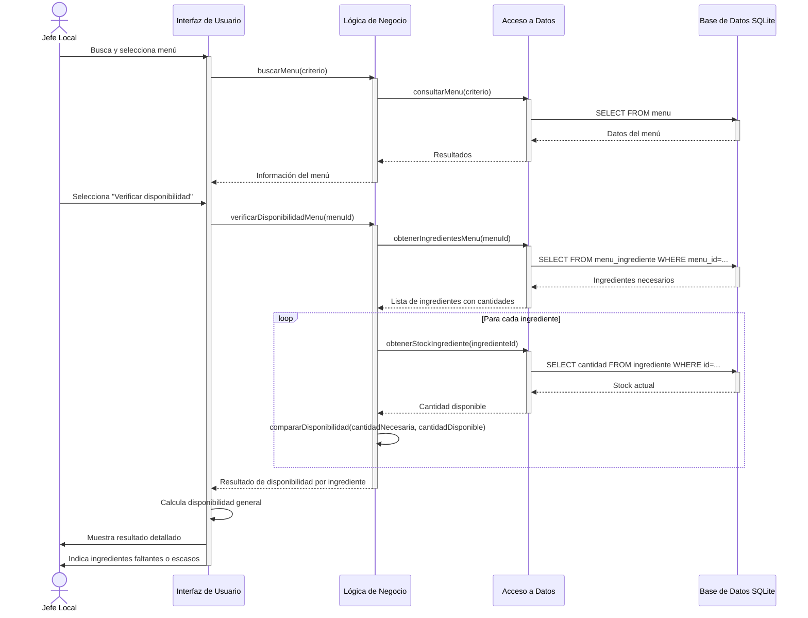

#### CU-A11: Crear Menú

```mermaid
sequenceDiagram
    actor JL as Jefe Local
    participant UI as Interfaz de Usuario
    participant LN as Lógica de Negocio
    participant DA as Acceso a Datos
    participant DB as Base de Datos SQLite
    
    JL->>UI: Selecciona "Crear menú"
    activate UI
    UI->>UI: Muestra formulario de menú
    JL->>UI: Completa información básica
    
    UI->>LN: validarDatosMenu(datos)
    activate LN
    LN-->>UI: Resultado validación
    deactivate LN
    
    JL->>UI: Selecciona "Agregar ingredientes"
    
    UI->>LN: obtenerIngredientesDisponibles()
    activate LN
    LN->>DA: consultarIngredientes()
    activate DA
    DA->>DB: SELECT FROM ingrediente
    activate DB
    DB-->>DA: Lista de ingredientes
    deactivate DB
    DA-->>LN: Resultados
    deactivate DA
    LN-->>UI: Ingredientes disponibles
    deactivate LN
    
    UI->>JL: Muestra lista de ingredientes
    
    loop Para cada ingrediente a incluir
        JL->>UI: Selecciona ingrediente y cantidad
        UI->>UI: Agrega ingrediente a la lista
    end
    
    JL->>UI: Confirma creación del menú
    
    UI->>LN: registrarMenu(datosMenu, ingredientes)
    activate LN
    LN->>DA: insertarMenu(datosMenu)
    activate DA
    DA->>DB: INSERT INTO menu
    activate DB
    DB-->>DA: ID del nuevo menú
    deactivate DB
    
    loop Para cada ingrediente
        DA->>DB: INSERT INTO menu_ingrediente
        activate DB
        DB-->>DA: Confirmación
        deactivate DB
    end
    
    DA-->>LN: Éxito/Error
    deactivate DA
    LN-->>UI: Resultado operación
    deactivate LN
    UI->>JL: Muestra mensaje confirmación
    deactivate UI
```

#### CU-A12: Editar Menú

```mermaid
sequenceDiagram
    actor JL as Jefe Local
    participant UI as Interfaz de Usuario
    participant LN as Lógica de Negocio
    participant DA as Acceso a Datos
    participant DB as Base de Datos SQLite
    
    JL->>UI: Busca y selecciona menú
    activate UI
    UI->>LN: buscarMenu(criterio)
    activate LN
    LN->>DA: consultarMenu(criterio)
    activate DA
    DA->>DB: SELECT FROM menu
    activate DB
    DB-->>DA: Datos del menú
    deactivate DB
    
    DA->>DB: SELECT FROM menu_ingrediente WHERE menu_id=...
    activate DB
    DB-->>DA: Ingredientes del menú
    deactivate DB
    
    DA-->>LN: Datos completos del menú
    deactivate DA
    LN-->>UI: Información del menú
    deactivate LN
    
    UI->>UI: Muestra información del menú
    JL->>UI: Selecciona "Editar menú"
    UI->>UI: Habilita campos para edición
    JL->>UI: Modifica datos básicos
    
    alt Modificar ingredientes
        JL->>UI: Selecciona modificar ingredientes
        UI->>LN: obtenerTodosIngredientes()
        activate LN
        LN->>DA: consultarIngredientes()
        activate DA
        DA->>DB: SELECT FROM ingrediente
        activate DB
        DB-->>DA: Lista de ingredientes
        deactivate DB
        DA-->>LN: Resultados
        deactivate DA
        LN-->>UI: Lista completa de ingredientes
        deactivate LN
        
        UI->>JL: Muestra ingredientes actuales y disponibles
        JL->>UI: Agrega/elimina ingredientes o modifica cantidades
    end
    
    JL->>UI: Confirma cambios
    
    UI->>LN: actualizarMenu(datosMenu, ingredientes)
    activate LN
    LN->>DA: modificarMenu(datosMenu)
    activate DA
    DA->>DB: UPDATE menu
    activate DB
    DB-->>DA: Confirmación
    deactivate DB
    
    DA->>DB: DELETE FROM menu_ingrediente WHERE menu_id=...
    activate DB
    DB-->>DA: Confirmación
    deactivate DB
    
    loop Para cada ingrediente
        DA->>DB: INSERT INTO menu_ingrediente
        activate DB
        DB-->>DA: Confirmación
        deactivate DB
    end
    
    DA-->>LN: Éxito/Error
    deactivate DA
    LN-->>UI: Resultado operación
    deactivate LN
    UI->>JL: Muestra mensaje confirmación
    deactivate UI
```

#### CU-A13: Eliminar Menú

```mermaid
sequenceDiagram
    actor JL as Jefe Local
    participant UI as Interfaz de Usuario
    participant LN as Lógica de Negocio
    participant DA as Acceso a Datos
    participant DB as Base de Datos SQLite
    
    JL->>UI: Busca y selecciona menú
    activate UI
    UI->>LN: buscarMenu(criterio)
    activate LN
    LN->>DA: consultarMenu(criterio)
    activate DA
    DA->>DB: SELECT FROM menu
    activate DB
    DB-->>DA: Datos del menú
    deactivate DB
    DA-->>LN: Resultados
    deactivate DA
    LN-->>UI: Información del menú
    deactivate LN
    
    UI->>UI: Muestra información del menú
    JL->>UI: Selecciona "Eliminar menú"
    
    UI->>LN: verificarUsoEnPedidos(menuId)
    activate LN
    LN->>DA: consultarPedidosConMenu(menuId)
    activate DA
    DA->>DB: SELECT FROM item_pedido WHERE menu_id=...
    activate DB
    DB-->>DA: Pedidos que incluyen el menú
    deactivate DB
    DA-->>LN: Resultados
    deactivate DA
    LN-->>UI: Pedidos que usan el menú
    deactivate LN
    
    UI->>UI: Solicita confirmación
    JL->>UI: Confirma eliminación
    
    UI->>LN: eliminarMenu(menuId)
    activate LN
    
    alt No está en pedidos activos
        LN->>DA: eliminarMenuIngredientes(menuId)
        activate DA
        DA->>DB: DELETE FROM menu_ingrediente WHERE menu_id=...
        activate DB
        DB-->>DA: Confirmación
        deactivate DB
        DA-->>LN: Resultado
        deactivate DA
        
        LN->>DA: eliminarMenu(menuId)
        activate DA
        DA->>DB: DELETE FROM menu WHERE id=...
        activate DB
        DB-->>DA: Confirmación
        deactivate DB
        DA-->>LN: Resultado
        deactivate DA
        
        LN-->>UI: Éxito
        UI->>JL: Muestra mensaje confirmación
    else En uso en pedidos
        LN-->>UI: Error: Menú en uso en pedidos
        UI->>JL: Muestra mensaje error
    end
    deactivate LN
    deactivate UI
```

#### CU-A14: Asignar Ingredientes a Menú

```mermaid
sequenceDiagram
    actor JL as Jefe Local
    participant UI as Interfaz de Usuario
    participant LN as Lógica de Negocio
    participant DA as Acceso a Datos
    participant DB as Base de Datos SQLite
    
    JL->>UI: Busca y selecciona menú
    activate UI
    UI->>LN: buscarMenu(criterio)
    activate LN
    LN->>DA: consultarMenu(criterio)
    activate DA
    DA->>DB: SELECT FROM menu
    activate DB
    DB-->>DA: Datos del menú
    deactivate DB
    
    DA->>DB: SELECT FROM menu_ingrediente WHERE menu_id=...
    activate DB
    DB-->>DA: Ingredientes actuales
    deactivate DB
    
    DA-->>LN: Datos completos
    deactivate DA
    LN-->>UI: Información del menú con ingredientes
    deactivate LN
    
    UI->>UI: Muestra menú e ingredientes actuales
    JL->>UI: Selecciona "Asignar ingredientes"
    
    UI->>LN: obtenerTodosIngredientes()
    activate LN
    LN->>DA: consultarIngredientes()
    activate DA
    DA->>DB: SELECT FROM ingrediente
    activate DB
    DB-->>DA: Lista de ingredientes
    deactivate DB
    DA-->>LN: Resultados
    deactivate DA
    LN-->>UI: Lista de ingredientes disponibles
    deactivate LN
    
    UI->>JL: Muestra lista de ingredientes
    
    loop Para cada ingrediente a incluir
        JL->>UI: Selecciona ingrediente y especifica cantidad
        UI->>UI: Añade/actualiza ingrediente en la lista
    end
    
    JL->>UI: Confirma asignación
    
    UI->>LN: actualizarIngredientesMenu(menuId, ingredientes)
    activate LN
    
    LN->>DA: eliminarIngredientesMenu(menuId)
    activate DA
    DA->>DB: DELETE FROM menu_ingrediente WHERE menu_id=...
    activate DB
    DB-->>DA: Confirmación
    deactivate DB
    DA-->>LN: Resultado
    deactivate DA
    
    loop Para cada ingrediente
        LN->>DA: asignarIngredienteMenu(menuId, ingredienteId, cantidad)
        activate DA
        DA->>DB: INSERT INTO menu_ingrediente
        activate DB
        DB-->>DA: Confirmación
        deactivate DB
        DA-->>LN: Resultado
        deactivate DA
    end
    
    LN-->>UI: Éxito/Error
    deactivate LN
    UI->>JL: Muestra mensaje confirmación
    deactivate UI
```

#### CU-A15: Verificar Disponibilidad de Menú

```mermaid
sequenceDiagram
    actor JL as Jefe Local
    participant UI as Interfaz de Usuario
    participant LN as Lógica de Negocio
    participant DA as Acceso a Datos
    participant DB as Base de Datos SQLite
    
    JL->>UI: Busca y selecciona menú
    activate UI
    UI->>LN: buscarMenu(criterio)
    activate LN
    LN->>DA: consultarMenu(criterio)
    activate DA
    DA->>DB: SELECT FROM menu
    activate DB
    DB-->>DA: Datos del menú
    deactivate DB
    DA-->>LN: Resultados
    deactivate DA
    LN-->>UI: Información del menú
    deactivate LN
    
    JL->>UI: Selecciona "Verificar disponibilidad"
    
    UI->>LN: verificarDisponibilidadMenu(menuId)
    activate LN
    
    LN->>DA: obtenerIngredientesMenu(menuId)
    activate DA
    DA->>DB: SELECT FROM menu_ingrediente WHERE menu_id=...
    activate DB
    DB-->>DA: Ingredientes necesarios
    deactivate DB
    DA-->>LN: Lista de ingredientes con cantidades
    deactivate DA
    
    loop Para cada ingrediente
        LN->>DA: obtenerStockIngrediente(ingredienteId)
        activate DA
        DA->>DB: SELECT cantidad FROM ingrediente WHERE id=...
        activate DB
        DB-->>DA: Stock actual
        deactivate DB
        DA-->>LN: Cantidad disponible
        deactivate DA
        LN->>LN: compararDisponibilidad(cantidadNecesaria, cantidadDisponible)
    end
    
    LN-->>UI: Resultado de disponibilidad por ingrediente
    deactivate LN
    
    UI->>UI: Calcula disponibilidad general
    UI->>JL: Muestra resultado detallado
    UI->>JL: Indica ingredientes faltantes o escasos
    deactivate UI
```