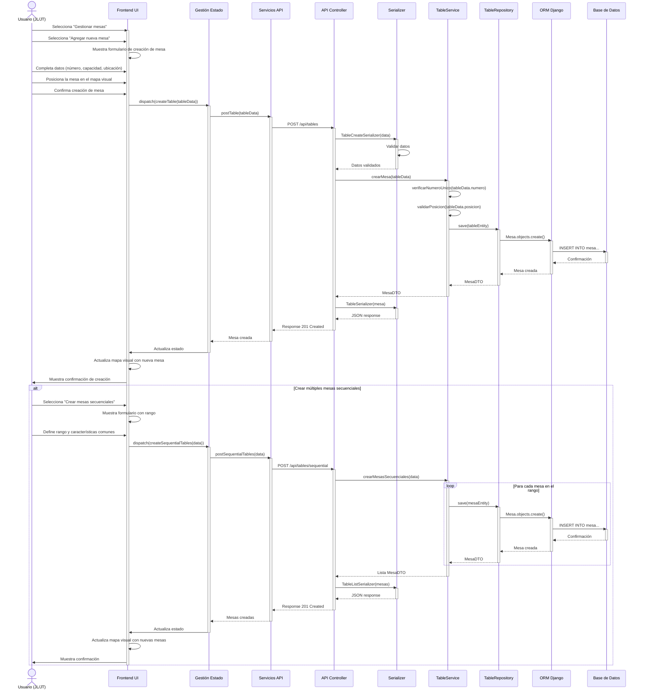
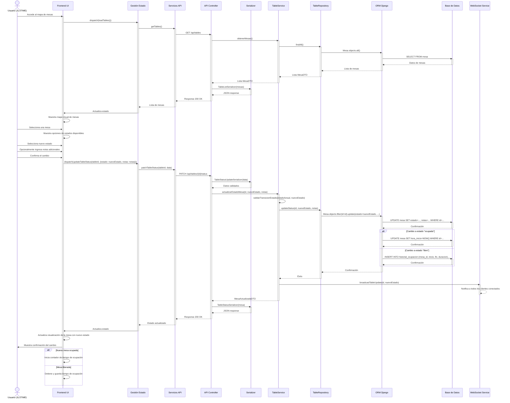
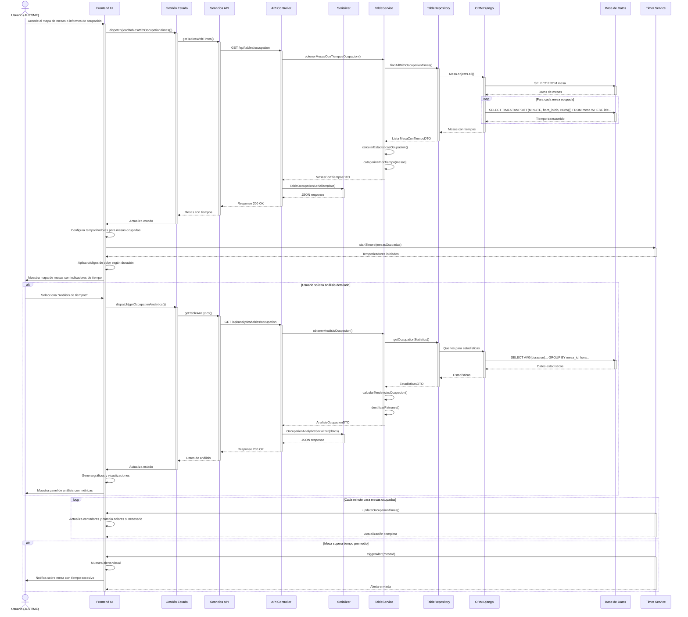
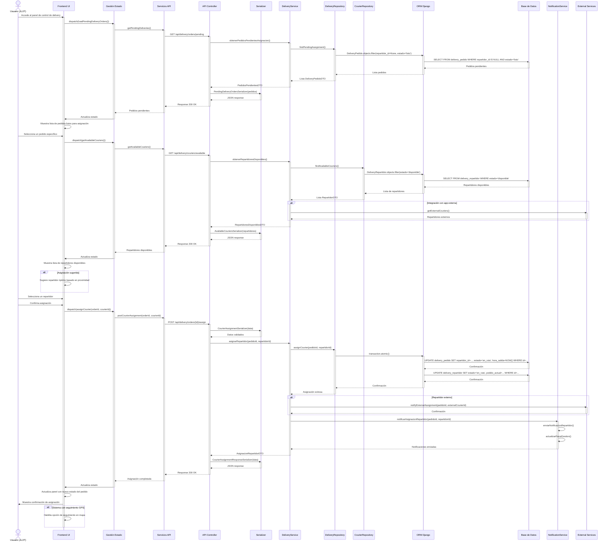

#### CU-R21: Registrar Mesa



#### CU-R22: Asignar Cliente a Mesa

```mermaid
sequenceDiagram
    actor Usuario as Usuario (JL/JT/ME)
    participant UI as Frontend UI
    participant GE as Gestión Estado
    participant SA as Servicios API
    participant AC as API Controller
    participant SZ as Serializer
    participant SV as TableService
    participant RP as TableRepository
    participant CR as ClientRepository
    participant ORM as ORM Django
    participant BD as Base de Datos
    participant WS as WebSocket Service

    Usuario->>UI: Accede al mapa visual de mesas
    activate UI
    
    UI->>GE: dispatch(loadTables())
    activate GE
    GE->>SA: getTables()
    activate SA
    SA->>AC: GET /api/tables
    activate AC
    AC->>SV: obtenerMesas()
    activate SV
    SV->>RP: findAll()
    activate RP
    RP->>ORM: Mesa.objects.all()
    activate ORM
    ORM->>BD: SELECT FROM mesa
    activate BD
    BD-->>ORM: Datos de mesas
    deactivate BD
    ORM-->>RP: Lista de mesas
    deactivate ORM
    RP-->>SV: Lista MesaDTO
    deactivate RP
    SV-->>AC: Lista MesaDTO
    deactivate SV
    
    AC->>SZ: TableListSerializer(mesas)
    activate SZ
    SZ-->>AC: JSON response
    deactivate SZ
    AC-->>SA: Response 200 OK
    deactivate AC
    SA-->>GE: Lista de mesas
    deactivate SA
    GE->>UI: Actualiza estado
    deactivate GE
    
    UI->>UI: Muestra mapa con estados de mesas
    
    Usuario->>UI: Selecciona una mesa disponible
    UI->>UI: Muestra opciones de asignación
    
    alt Cliente existente
        Usuario->>UI: Busca cliente por nombre/RUT
        UI->>GE: dispatch(searchClients(searchTerm))
        activate GE
        GE->>SA: getClients({search: searchTerm})
        activate SA
        SA->>AC: GET /api/clients?search=...
        activate AC
        AC->>SV: buscarClientes(criterio)
        activate SV
        SV->>CR: findBySearchTerm(criterio)
        activate CR
        CR->>ORM: Cliente.objects.filter(...)
        activate ORM
        ORM->>BD: SELECT FROM cliente WHERE...
        activate BD
        BD-->>ORM: Clientes encontrados
        deactivate BD
        ORM-->>CR: Lista de clientes
        deactivate ORM
        CR-->>SV: Lista ClienteDTO
        deactivate CR
        SV-->>AC: Lista ClienteDTO
        deactivate SV
        
        AC->>SZ: ClientSerializer(clientes)
        activate SZ
        SZ-->>AC: JSON response
        deactivate SZ
        AC-->>SA: Response 200 OK
        deactivate AC
        SA-->>GE: Clientes encontrados
        deactivate SA
        GE->>UI: Actualiza estado
        deactivate GE
        
        UI->>Usuario: Muestra resultados de búsqueda
        Usuario->>UI: Selecciona el cliente deseado
    else Nuevo cliente
        Usuario->>UI: Elige crear nuevo cliente
        UI->>UI: Muestra formulario de cliente
        Usuario->>UI: Ingresa datos del cliente
        UI->>GE: dispatch(createClient(clientData))
        activate GE
        GE->>SA: postClient(clientData)
        activate SA
        SA->>AC: POST /api/clients
        activate AC
        
        // Proceso de creación de cliente similar a CU-R01
        
        AC-->>SA: Response 201 Created
        deactivate AC
        SA-->>GE: Cliente creado
        deactivate SA
        GE->>UI: Actualiza estado con nuevo cliente
        deactivate GE
    end
    
    Usuario->>UI: Especifica número de personas
    Usuario->>UI: Confirma asignación
    
    UI->>GE: dispatch(assignClientToTable(tableId, {clientId, persons, info}))
    activate GE
    GE->>SA: postTableAssignment(tableId, data)
    activate SA
    SA->>AC: POST /api/tables/{id}/assign
    activate AC
    AC->>SZ: TableAssignmentSerializer(data)
    activate SZ
    SZ->>SZ: Validar datos
    SZ-->>AC: Datos validados
    deactivate SZ
    
    AC->>SV: asignarClienteAMesa(id, data)
    activate SV
    SV->>RP: findById(id)
    activate RP
    RP->>ORM: Mesa.objects.get(id=id)
    activate ORM
    ORM->>BD: SELECT FROM mesa WHERE id=...
    activate BD
    BD-->>ORM: Datos de la mesa
    deactivate BD
    ORM-->>RP: Mesa
    deactivate ORM
    RP-->>SV: MesaDTO
    deactivate RP
    
    SV->>SV: verificarDisponibilidad(mesa)
    SV->>RP: updateStatus(id, 'ocupada', data)
    activate RP
    RP->>ORM: Mesa.objects.filter(id=id).update(...)
    activate ORM
    ORM->>BD: UPDATE mesa SET estado='ocupada', cliente_id=..., ...
    activate BD
    BD-->>ORM: Confirmación
    deactivate BD
    ORM-->>RP: Confirmación
    deactivate ORM
    RP-->>SV: Éxito
    deactivate RP
    
    SV->>WS: broadcastTableUpdate(id, 'ocupada', data)
    activate WS
    WS-->>WS: Notifica a todos los clientes conectados
    deactivate WS
    
    SV-->>AC: MesaAsignadaDTO
    deactivate SV
    
    AC->>SZ: TableAssignmentResponseSerializer(data)
    activate SZ
    SZ-->>AC: JSON response
    deactivate SZ
    AC-->>SA: Response 200 OK
    deactivate AC
    SA-->>GE: Asignación completada
    deactivate SA
    GE->>UI: Actualiza estado
    deactivate GE
    
    UI->>UI: Actualiza mapa visual (mesa cambia a ocupada)
    UI->>UI: Inicia contador de tiempo de ocupación
    UI->>Usuario: Muestra confirmación
    deactivate UI
```

#### CU-R23: Cambiar Estado de Mesa



#### CU-R24: Calcular Tiempo de Ocupación



#### CU-R25: Registrar Pedido Delivery

```mermaid
sequenceDiagram
    actor Usuario as Usuario (JL/JT/ME)
    participant UI as Frontend UI
    participant GE as Gestión Estado
    participant SA as Servicios API
    participant AC as API Controller
    participant SZ as Serializer
    participant SV as DeliveryService
    participant OS as OrderService
    participant RP as DeliveryRepository
    participant OR as OrderRepository
    participant ORM as ORM Django
    participant BD as Base de Datos
    participant NS as NotificationService

    Usuario->>UI: Selecciona "Nuevo pedido delivery"
    activate UI
    
    UI->>GE: dispatch(loadDeliveryData())
    activate GE
    GE->>SA: getDeliveryData()
    activate SA
    SA->>AC: GET /api/delivery/setup
    activate AC
    AC->>SV: obtenerConfiguracionDelivery()
    activate SV
    SV->>RP: getDeliveryApps()
    activate RP
    RP->>ORM: DeliveryApp.objects.filter(activa=True)
    activate ORM
    ORM->>BD: SELECT FROM delivery_app WHERE activa=TRUE
    activate BD
    BD-->>ORM: Apps disponibles
    deactivate BD
    ORM-->>RP: Lista de apps
    deactivate ORM
    RP-->>SV: Lista DeliveryAppDTO
    deactivate RP
    SV-->>AC: ConfiguracionDeliveryDTO
    deactivate SV
    
    AC->>SZ: DeliveryConfigurationSerializer(config)
    activate SZ
    SZ-->>AC: JSON response
    deactivate SZ
    AC-->>SA: Response 200 OK
    deactivate AC
    SA-->>GE: Datos de configuración
    deactivate SA
    GE->>UI: Actualiza estado
    deactivate GE
    
    UI->>GE: dispatch(loadAvailableMenus())
    activate GE
    // ... (similar a CU-R16 para cargar menús) ...
    GE->>UI: Actualiza estado con menús disponibles
    deactivate GE
    
    UI->>UI: Muestra formulario específico para delivery
    UI->>Usuario: Solicita selección de tipo de delivery
    
    Usuario->>UI: Selecciona directo o app externa
    
    alt Pedido por app externa
        Usuario->>UI: Selecciona plataforma (Rappi, Uber Eats, etc.)
        Usuario->>UI: Ingresa código pedido externo
    else Pedido directo
        Usuario->>UI: Busca o crea cliente
        Usuario->>UI: Ingresa dirección de entrega
        UI->>UI: Calcula costo de envío basado en distancia
    end
    
    Usuario->>UI: Selecciona menús para el pedido
    Usuario->>UI: Ajusta cantidades y opciones
    UI->>UI: Calcula subtotales y total
    
    Usuario->>UI: Confirma creación del pedido
    UI->>GE: dispatch(createDeliveryOrder(deliveryData))
    activate GE
    GE->>SA: postDeliveryOrder(deliveryData)
    activate SA
    SA->>AC: POST /api/delivery/orders
    activate AC
    AC->>SZ: DeliveryOrderCreateSerializer(data)
    activate SZ
    SZ-->>AC: Datos validados
    deactivate SZ
    
    AC->>SV: crearPedidoDelivery(deliveryData)
    activate SV
    SV->>OS: crearPedidoBase(datos)
    activate OS
    OS->>OR: save(pedidoEntity)
    activate OR
    OR->>ORM: transaction.atomic()
    activate ORM
    ORM->>BD: INSERT INTO pedido...
    activate BD
    BD-->>ORM: Confirmación
    deactivate BD
    
    loop Para cada ítem
        ORM->>BD: INSERT INTO item_pedido...
        activate BD
        BD-->>ORM: Confirmación
        deactivate BD
    end
    
    ORM-->>OR: Pedido base creado
    deactivate ORM
    OR-->>OS: PedidoDTO
    deactivate OR
    OS-->>SV: PedidoDTO
    deactivate OS
    
    SV->>RP: saveDeliveryInfo(pedidoId, deliveryData)
    activate RP
    RP->>ORM: DeliveryPedido.objects.create(...)
    activate ORM
    ORM->>BD: INSERT INTO delivery_pedido...
    activate BD
    BD-->>ORM: Confirmación
    deactivate BD
    ORM-->>RP: Confirmación
    deactivate ORM
    RP-->>SV: DeliveryPedidoDTO
    deactivate RP
    
    SV->>NS: notificarNuevoPedidoDelivery(pedidoDTO)
    activate NS
    NS->>NS: enviarNotificacionGestorDelivery()
    NS-->>SV: Notificación enviada
    deactivate NS
    
    SV-->>AC: PedidoDeliveryDTO
    deactivate SV
    
    AC->>SZ: DeliveryOrderSerializer(pedido)
    activate SZ
    SZ-->>AC: JSON response
    deactivate SZ
    AC-->>SA: Response 201 Created
    deactivate AC
    SA-->>GE: Pedido delivery creado
    deactivate SA
    GE->>UI: Actualiza estado
    deactivate GE
    
    UI->>Usuario: Muestra confirmación y detalles del pedido
    deactivate UI
```

#### CU-R26: Asignar Repartidor



#### CU-R27: Seguir Estado de Entrega

```mermaid
sequenceDiagram
    actor Usuario as Usuario (JL/JT/ME)
    participant UI as Frontend UI
    participant GE as Gestión Estado
    participant SA as Servicios API
    participant AC as API Controller
    participant SZ as Serializer
    participant SV as DeliveryService
    participant RP as DeliveryRepository
    participant ORM as ORM Django
    participant BD as Base de Datos
    participant WS as WebSocket Service
    participant ES as External Services
    participant MS as Map Service

    Usuario->>UI: Accede a "Seguimiento de Delivery"
    activate UI
    
    UI->>GE: dispatch(loadActiveDeliveries())
    activate GE
    GE->>SA: getActiveDeliveries()
    activate SA
    SA->>AC: GET /api/delivery/orders/active
    activate AC
    AC->>SV: obtenerPedidosDeliveryActivos()
    activate SV
    SV->>RP: findActiveDeliveries()
    activate RP
    RP->>ORM: DeliveryPedido.objects.filter(estado__in=['preparacion', 'listo', 'en_ruta'])
    activate ORM
    ORM->>BD: SELECT FROM delivery_pedido WHERE estado IN...
    activate BD
    BD-->>ORM: Pedidos activos
    deactivate BD
    ORM-->>RP: Lista de pedidos
    deactivate ORM
    RP-->>SV: Lista DeliveryPedidoDTO
    deactivate RP
    
    alt Integración con apps externas
        SV->>ES: getExternalOrdersStatus()
        activate ES
        ES-->>SV: Estados actualizados
        deactivate ES
    end
    
    SV-->>AC: PedidosActivosDTO
    deactivate SV
    
    AC->>SZ: ActiveDeliveryOrdersSerializer(pedidos)
    activate SZ
    SZ-->>AC: JSON response
    deactivate SZ
    AC-->>SA: Response 200 OK
    deactivate AC
    SA-->>GE: Pedidos activos
    deactivate SA
    GE->>UI: Actualiza estado
    deactivate GE
    
    UI->>UI: Conecta a WebSocket para actualizaciones en tiempo real
    UI->>WS: connect()
    activate WS
    WS-->>UI: Conexión establecida
    deactivate WS
    
    UI->>UI: Inicializa mapa para seguimiento
    UI->>MS: initMap()
    activate MS
    MS-->>UI: Mapa inicializado
    deactivate MS
    
    UI->>UI: Organiza pedidos por estados y tiempos
    UI->>Usuario: Muestra panel de seguimiento con pedidos activos
    
    alt Usuario selecciona pedido específico
        Usuario->>UI: Selecciona un pedido para detalles
        UI->>GE: dispatch(getDeliveryDetails(id))
        activate GE
        GE->>SA: getDeliveryDetails(id)
        activate SA
        SA->>AC: GET /api/delivery/orders/{id}
        activate AC
        AC->>SV: obtenerDetallesPedidoDelivery(id)
        activate SV
        SV->>RP: findDetailedById(id)
        activate RP
        RP->>ORM: Queries para obtener detalles completos
        activate ORM
        ORM->>BD: Múltiples consultas JOIN
        activate BD
        BD-->>ORM: Datos detallados
        deactivate BD
        ORM-->>RP: Pedido con detalles
        deactivate ORM
        RP-->>SV: DeliveryPedidoDetalladoDTO
        deactivate RP
        SV-->>AC: DetallesPedidoDTO
        deactivate SV
        
        AC->>SZ: DeliveryOrderDetailSerializer(pedido)
        activate SZ
        SZ-->>AC: JSON response
        deactivate SZ
        AC-->>SA: Response 200 OK
        deactivate AC
        SA-->>GE: Detalles del pedido
        deactivate SA
        GE->>UI: Actualiza estado
        deactivate GE
        
        UI->>MS: centerMapOn(coordinates)
        activate MS
        MS-->>UI: Mapa centrado
        deactivate MS
        
        UI->>Usuario: Muestra detalles completos y ruta en mapa
    end
    
    alt Usuario contacta al repartidor
        Usuario->>UI: Selecciona "Contactar repartidor"
        UI->>NS: sendCourierMessage(courierId, message)
        activate NS
        NS-->>UI: Mensaje enviado
        deactivate NS
    end
    
    alt Actualización automática (WebSocket)
        WS->>UI: event('delivery_status_update', data)
        activate WS
        UI->>UI: Actualiza estado del pedido
        UI->>MS: updateCourierPosition(coordinates)
        activate MS
        MS-->>UI: Posición actualizada en mapa
        deactivate MS
        UI->>UI: Actualiza tiempo estimado y distancia
        UI->>Usuario: Muestra actualización visual
        deactivate WS
    end
    
    alt Pedido entregado (WebSocket)
        WS->>UI: event('delivery_completed', data)
        activate WS
        UI->>UI: Marca pedido como entregado
        UI->>UI: Muestra tiempo total de entrega
        UI->>Usuario: Muestra confirmación de entrega
        deactivate WS
    end
    
    alt Problema de entrega
        WS->>UI: event('delivery_issue', data)
        activate WS
        UI->>UI: Muestra alerta de problema
        UI->>Usuario: Notifica sobre incidencia con detalles
        deactivate WS
        
        Usuario->>UI: Toma acción (contactar cliente, reasignar, etc.)
        UI->>GE: dispatch(resolveDeliveryIssue(id, resolution))
        activate GE
        // ... (lógica de resolución de problemas) ...
        GE->>UI: Actualiza estado
        deactivate GE
    end
    
    deactivate UI
```