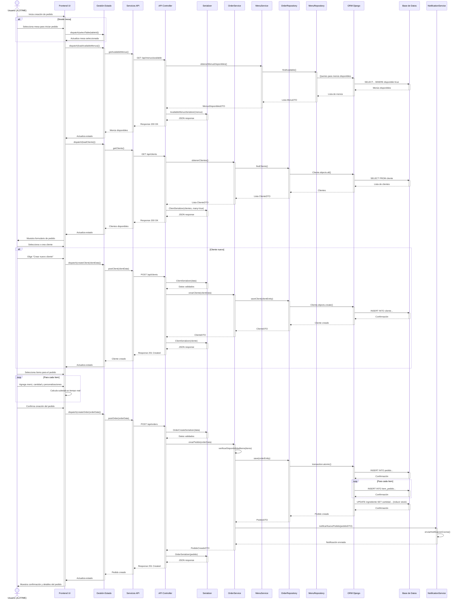
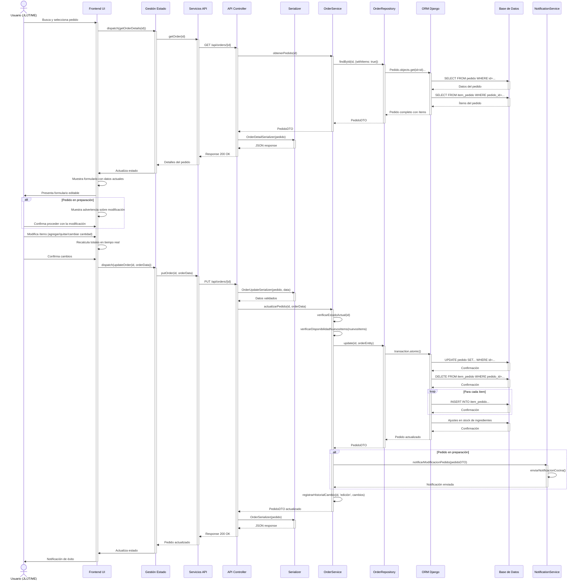
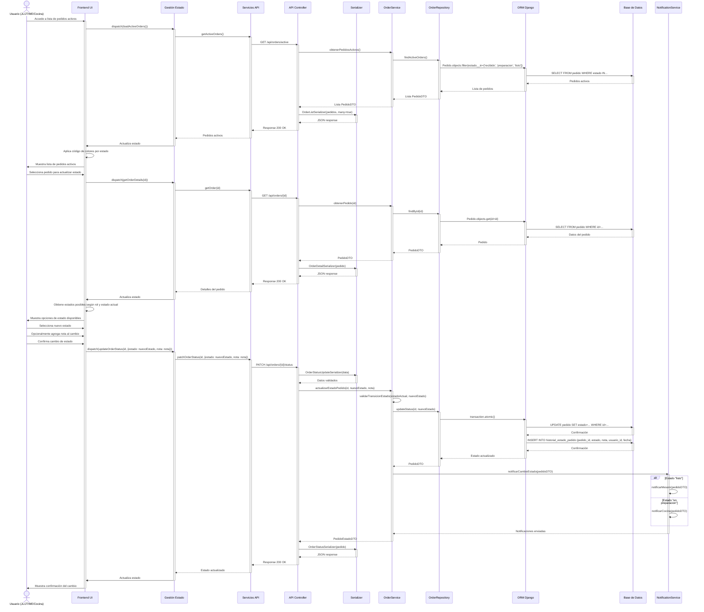
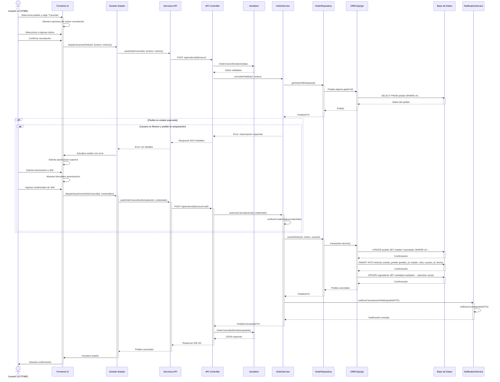
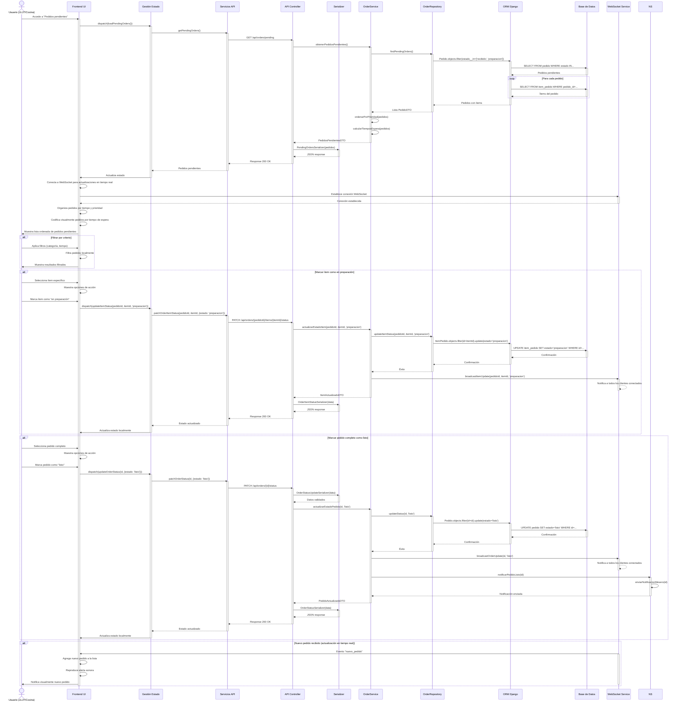

#### CU-R16: Crear Pedido

```mermaid
sequenceDiagram
    actor Usuario as Usuario (JL/JT/ME)
    participant UI as Frontend UI
    participant GE as Gestión Estado
    participant SA as Servicios API
    participant AC as API Controller
    participant SZ as Serializer
    participant SV as OrderService
    participant MV as MenuService
    participant RP as OrderRepository
    participant MRP as MenuRepository
    participant ORM as ORM Django
    participant BD as Base de Datos
    participant NS as NotificationService

    Usuario->>UI: Inicia creación de pedido
    activate UI
    
    alt Desde mesa
        Usuario->>UI: Selecciona mesa para iniciar pedido
        UI->>GE: dispatch(selectTable(tableId))
        activate GE
        GE->>UI: Actualiza mesa seleccionada
        deactivate GE
    end
    
    UI->>GE: dispatch(loadAvailableMenus())
    activate GE
    GE->>SA: getAvailableMenus()
    activate SA
    SA->>AC: GET /api/menus/available
    activate AC
    AC->>MV: obtenerMenusDisponibles()
    activate MV
    MV->>MRP: findAvailable()
    activate MRP
    MRP->>ORM: Queries para menús disponibles
    activate ORM
    ORM->>BD: SELECT... WHERE disponible=true
    activate BD
    BD-->>ORM: Menús disponibles
    deactivate BD
    ORM-->>MRP: Lista de menús
    deactivate ORM
    MRP-->>MV: Lista MenuDTO
    deactivate MRP
    MV-->>AC: MenusDisponiblesDTO
    deactivate MV
    
    AC->>SZ: AvailableMenusSerializer(menus)
    activate SZ
    SZ-->>AC: JSON response
    deactivate SZ
    AC-->>SA: Response 200 OK
    deactivate AC
    SA-->>GE: Menús disponibles
    deactivate SA
    GE->>UI: Actualiza estado
    deactivate GE
    
    UI->>GE: dispatch(loadClients())
    activate GE
    GE->>SA: getClients()
    activate SA
    SA->>AC: GET /api/clients
    activate AC
    AC->>SV: obtenerClientes()
    activate SV
    SV->>RP: findClients()
    activate RP
    RP->>ORM: Cliente.objects.all()
    activate ORM
    ORM->>BD: SELECT FROM cliente
    activate BD
    BD-->>ORM: Lista de clientes
    deactivate BD
    ORM-->>RP: Clientes
    deactivate ORM
    RP-->>SV: Lista ClienteDTO
    deactivate RP
    SV-->>AC: Lista ClienteDTO
    deactivate SV
    
    AC->>SZ: ClientSerializer(clientes, many=true)
    activate SZ
    SZ-->>AC: JSON response
    deactivate SZ
    AC-->>SA: Response 200 OK
    deactivate AC
    SA-->>GE: Clientes disponibles
    deactivate SA
    GE->>UI: Actualiza estado
    deactivate GE
    
    UI->>Usuario: Muestra formulario de pedido
    
    Usuario->>UI: Selecciona o crea cliente
    
    alt Cliente nuevo
        Usuario->>UI: Elige "Crear nuevo cliente"
        UI->>GE: dispatch(createClient(clientData))
        activate GE
        GE->>SA: postClient(clientData)
        activate SA
        SA->>AC: POST /api/clients
        activate AC
        AC->>SZ: ClientSerializer(data)
        activate SZ
        SZ-->>AC: Datos validados
        deactivate SZ
        AC->>SV: crearCliente(clientData)
        activate SV
        SV->>RP: saveClient(clientEntity)
        activate RP
        RP->>ORM: Cliente.objects.create()
        activate ORM
        ORM->>BD: INSERT INTO cliente...
        activate BD
        BD-->>ORM: Confirmación
        deactivate BD
        ORM-->>RP: Cliente creado
        deactivate ORM
        RP-->>SV: ClienteDTO
        deactivate RP
        SV-->>AC: ClienteDTO
        deactivate SV
        AC->>SZ: ClientSerializer(cliente)
        activate SZ
        SZ-->>AC: JSON response
        deactivate SZ
        AC-->>SA: Response 201 Created
        deactivate AC
        SA-->>GE: Cliente creado
        deactivate SA
        GE->>UI: Actualiza estado
        deactivate GE
    end
    
    Usuario->>UI: Selecciona ítems para el pedido
    
    loop Para cada ítem
        Usuario->>UI: Agrega menú, cantidad y personalizaciones
        UI->>UI: Calcula subtotal en tiempo real
    end
    
    Usuario->>UI: Confirma creación del pedido
    UI->>GE: dispatch(createOrder(orderData))
    activate GE
    GE->>SA: postOrder(orderData)
    activate SA
    SA->>AC: POST /api/orders
    activate AC
    AC->>SZ: OrderCreateSerializer(data)
    activate SZ
    SZ-->>AC: Datos validados
    deactivate SZ
    
    AC->>SV: crearPedido(orderData)
    activate SV
    SV->>SV: verificarDisponibilidadItems(items)
    SV->>RP: save(orderEntity)
    activate RP
    RP->>ORM: transaction.atomic()
    activate ORM
    ORM->>BD: INSERT INTO pedido...
    activate BD
    BD-->>ORM: Confirmación
    deactivate BD
    
    loop Para cada ítem
        ORM->>BD: INSERT INTO item_pedido...
        activate BD
        BD-->>ORM: Confirmación
        deactivate BD
    end
    
    ORM->>BD: UPDATE ingrediente SET cantidad... (reducir stock)
    activate BD
    BD-->>ORM: Confirmación
    deactivate BD
    
    ORM-->>RP: Pedido creado
    deactivate ORM
    RP-->>SV: PedidoDTO
    deactivate RP
    
    SV->>NS: notificarNuevoPedido(pedidoDTO)
    activate NS
    NS->>NS: enviarNotificacionCocina()
    NS-->>SV: Notificación enviada
    deactivate NS
    
    SV-->>AC: PedidoCreadoDTO
    deactivate SV
    
    AC->>SZ: OrderSerializer(pedido)
    activate SZ
    SZ-->>AC: JSON response
    deactivate SZ
    AC-->>SA: Response 201 Created
    deactivate AC
    SA-->>GE: Pedido creado
    deactivate SA
    GE->>UI: Actualiza estado
    deactivate GE
    UI->>Usuario: Muestra confirmación y detalles del pedido
    deactivate UI
```

#### CU-R17: Editar Pedido

```mermaid
sequenceDiagram
    actor Usuario as Usuario (JL/JT/ME)
    participant UI as Frontend UI
    participant GE as Gestión Estado
    participant SA as Servicios API
    participant AC as API Controller
    participant SZ as Serializer
    participant SV as OrderService
    participant RP as OrderRepository
    participant ORM as ORM Django
    participant BD as Base de Datos
    participant NS as NotificationService

    Usuario->>UI: Busca y selecciona pedido
    activate UI
    UI->>GE: dispatch(getOrderDetails(id))
    activate GE
    GE->>SA: getOrder(id)
    activate SA
    SA->>AC: GET /api/orders/{id}
    activate AC
    AC->>SV: obtenerPedido(id)
    activate SV
    SV->>RP: findById(id, {withItems: true})
    activate RP
    RP->>ORM: Pedido.objects.get(id=id)...
    activate ORM
    ORM->>BD: SELECT FROM pedido WHERE id=...
    activate BD
    BD-->>ORM: Datos del pedido
    deactivate BD
    
    ORM->>BD: SELECT FROM item_pedido WHERE pedido_id=...
    activate BD
    BD-->>ORM: Ítems del pedido
    deactivate BD
    ORM-->>RP: Pedido completo con ítems
    deactivate ORM
    RP-->>SV: PedidoDTO
    deactivate RP
    SV-->>AC: PedidoDTO
    deactivate SV
    
    AC->>SZ: OrderDetailSerializer(pedido)
    activate SZ
    SZ-->>AC: JSON response
    deactivate SZ
    AC-->>SA: Response 200 OK
    deactivate AC
    SA-->>GE: Detalles del pedido
    deactivate SA
    GE->>UI: Actualiza estado
    deactivate GE
    
    UI->>UI: Muestra formulario con datos actuales
    UI->>Usuario: Presenta formulario editable
    
    alt Pedido en preparación
        UI->>UI: Muestra advertencia sobre modificación
        Usuario->>UI: Confirma proceder con la modificación
    end
    
    Usuario->>UI: Modifica ítems (agregar/quitar/cambiar cantidad)
    UI->>UI: Recalcula totales en tiempo real
    
    Usuario->>UI: Confirma cambios
    UI->>GE: dispatch(updateOrder(id, orderData))
    activate GE
    GE->>SA: putOrder(id, orderData)
    activate SA
    SA->>AC: PUT /api/orders/{id}
    activate AC
    AC->>SZ: OrderUpdateSerializer(pedido, data)
    activate SZ
    SZ-->>AC: Datos validados
    deactivate SZ
    
    AC->>SV: actualizarPedido(id, orderData)
    activate SV
    SV->>SV: verificarEstadoActual(id)
    SV->>SV: verificarDisponibilidadNuevosItems(nuevosItems)
    
    SV->>RP: update(id, orderEntity)
    activate RP
    RP->>ORM: transaction.atomic()
    activate ORM
    ORM->>BD: UPDATE pedido SET... WHERE id=...
    activate BD
    BD-->>ORM: Confirmación
    deactivate BD
    
    ORM->>BD: DELETE FROM item_pedido WHERE pedido_id=...
    activate BD
    BD-->>ORM: Confirmación
    deactivate BD
    
    loop Para cada ítem
        ORM->>BD: INSERT INTO item_pedido...
        activate BD
        BD-->>ORM: Confirmación
        deactivate BD
    end
    
    ORM->>BD: Ajustes en stock de ingredientes
    activate BD
    BD-->>ORM: Confirmación
    deactivate BD
    
    ORM-->>RP: Pedido actualizado
    deactivate ORM
    RP-->>SV: PedidoDTO
    deactivate RP
    
    alt Pedido en preparación
        SV->>NS: notificarModificacionPedido(pedidoDTO)
        activate NS
        NS->>NS: enviarNotificacionCocina()
        NS-->>SV: Notificación enviada
        deactivate NS
    end
    
    SV->>SV: registrarHistorialCambio(id, 'edición', cambios)
    SV-->>AC: PedidoDTO actualizado
    deactivate SV
    
    AC->>SZ: OrderSerializer(pedido)
    activate SZ
    SZ-->>AC: JSON response
    deactivate SZ
    AC-->>SA: Response 200 OK
    deactivate AC
    SA-->>GE: Pedido actualizado
    deactivate SA
    GE->>UI: Actualiza estado
    deactivate GE
    UI->>Usuario: Notificación de éxito
    deactivate UI
```

#### CU-R18: Actualizar Estado de Pedido

```mermaid
sequenceDiagram
    actor Usuario as Usuario (JL/JT/ME/Cocina)
    participant UI as Frontend UI
    participant GE as Gestión Estado
    participant SA as Servicios API
    participant AC as API Controller
    participant SZ as Serializer
    participant SV as OrderService
    participant RP as OrderRepository
    participant ORM as ORM Django
    participant BD as Base de Datos
    participant NS as NotificationService

    Usuario->>UI: Accede a lista de pedidos activos
    activate UI
    
    UI->>GE: dispatch(loadActiveOrders())
    activate GE
    GE->>SA: getActiveOrders()
    activate SA
    SA->>AC: GET /api/orders/active
    activate AC
    AC->>SV: obtenerPedidosActivos()
    activate SV
    SV->>RP: findActiveOrders()
    activate RP
    RP->>ORM: Pedido.objects.filter(estado__in=['recibido', 'preparacion', 'listo'])
    activate ORM
    ORM->>BD: SELECT FROM pedido WHERE estado IN...
    activate BD
    BD-->>ORM: Pedidos activos
    deactivate BD
    ORM-->>RP: Lista de pedidos
    deactivate ORM
    RP-->>SV: Lista PedidoDTO
    deactivate RP
    SV-->>AC: Lista PedidoDTO
    deactivate SV
    
    AC->>SZ: OrderListSerializer(pedidos, many=true)
    activate SZ
    SZ-->>AC: JSON response
    deactivate SZ
    AC-->>SA: Response 200 OK
    deactivate AC
    SA-->>GE: Pedidos activos
    deactivate SA
    GE->>UI: Actualiza estado
    deactivate GE
    
    UI->>UI: Aplica código de colores por estado
    UI->>Usuario: Muestra lista de pedidos activos
    
    Usuario->>UI: Selecciona pedido para actualizar estado
    UI->>GE: dispatch(getOrderDetails(id))
    activate GE
    GE->>SA: getOrder(id)
    activate SA
    SA->>AC: GET /api/orders/{id}
    activate AC
    AC->>SV: obtenerPedido(id)
    activate SV
    SV->>RP: findById(id)
    activate RP
    RP->>ORM: Pedido.objects.get(id=id)
    activate ORM
    ORM->>BD: SELECT FROM pedido WHERE id=...
    activate BD
    BD-->>ORM: Datos del pedido
    deactivate BD
    ORM-->>RP: Pedido
    deactivate ORM
    RP-->>SV: PedidoDTO
    deactivate RP
    SV-->>AC: PedidoDTO
    deactivate SV
    
    AC->>SZ: OrderDetailSerializer(pedido)
    activate SZ
    SZ-->>AC: JSON response
    deactivate SZ
    AC-->>SA: Response 200 OK
    deactivate AC
    SA-->>GE: Detalles del pedido
    deactivate SA
    GE->>UI: Actualiza estado
    deactivate GE
    
    UI->>UI: Obtiene estados posibles según rol y estado actual
    UI->>Usuario: Muestra opciones de estado disponibles
    
    Usuario->>UI: Selecciona nuevo estado
    Usuario->>UI: Opcionalmente agrega nota al cambio
    Usuario->>UI: Confirma cambio de estado
    
    UI->>GE: dispatch(updateOrderStatus(id, {estado: nuevoEstado, nota: nota}))
    activate GE
    GE->>SA: patchOrderStatus(id, {estado: nuevoEstado, nota: nota})
    activate SA
    SA->>AC: PATCH /api/orders/{id}/status
    activate AC
    AC->>SZ: OrderStatusUpdateSerializer(data)
    activate SZ
    SZ-->>AC: Datos validados
    deactivate SZ
    
    AC->>SV: actualizarEstadoPedido(id, nuevoEstado, nota)
    activate SV
    SV->>SV: validarTransicionEstado(estadoActual, nuevoEstado)
    SV->>RP: updateStatus(id, nuevoEstado)
    activate RP
    RP->>ORM: transaction.atomic()
    activate ORM
    ORM->>BD: UPDATE pedido SET estado=... WHERE id=...
    activate BD
    BD-->>ORM: Confirmación
    deactivate BD
    
    ORM->>BD: INSERT INTO historial_estado_pedido (pedido_id, estado, nota, usuario_id, fecha)
    activate BD
    BD-->>ORM: Confirmación
    deactivate BD
    ORM-->>RP: Estado actualizado
    deactivate ORM
    RP-->>SV: PedidoDTO
    deactivate RP
    
    SV->>NS: notificarCambioEstado(pedidoDTO)
    activate NS
    
    alt Estado "listo"
        NS->>NS: notificarMesero(pedidoDTO)
    else Estado "en preparacion"
        NS->>NS: notificarCocina(pedidoDTO)
    end
    
    NS-->>SV: Notificaciones enviadas
    deactivate NS
    
    SV-->>AC: PedidoEstadoDTO
    deactivate SV
    
    AC->>SZ: OrderStatusSerializer(pedido)
    activate SZ
    SZ-->>AC: JSON response
    deactivate SZ
    AC-->>SA: Response 200 OK
    deactivate AC
    SA-->>GE: Estado actualizado
    deactivate SA
    GE->>UI: Actualiza estado
    deactivate GE
    UI->>Usuario: Muestra confirmación del cambio
    deactivate UI
```

#### CU-R19: Cancelar Pedido

```mermaid
sequenceDiagram
    actor Usuario as Usuario (JL/JT/ME)
    participant UI as Frontend UI
    participant GE as Gestión Estado
    participant SA as Servicios API
    participant AC as API Controller
    participant SZ as Serializer
    participant SV as OrderService
    participant RP as OrderRepository
    participant ORM as ORM Django
    participant BD as Base de Datos
    participant NS as NotificationService

    Usuario->>UI: Selecciona pedido y elige "Cancelar"
    activate UI
    UI->>UI: Muestra opciones de motivo cancelación
    
    Usuario->>UI: Selecciona o ingresa motivo
    Usuario->>UI: Confirma cancelación
    
    UI->>GE: dispatch(cancelOrder(id, {motivo: motivo}))
    activate GE
    GE->>SA: postOrderCancel(id, {motivo: motivo})
    activate SA
    SA->>AC: POST /api/orders/{id}/cancel
    activate AC
    AC->>SZ: OrderCancelSerializer(data)
    activate SZ
    SZ-->>AC: Datos validados
    deactivate SZ
    
    AC->>SV: cancelarPedido(id, motivo)
    activate SV
    SV->>RP: getOrderWithStatus(id)
    activate RP
    RP->>ORM: Pedido.objects.get(id=id)
    activate ORM
    ORM->>BD: SELECT FROM pedido WHERE id=...
    activate BD
    BD-->>ORM: Datos del pedido
    deactivate BD
    ORM-->>RP: Pedido
    deactivate ORM
    RP-->>SV: PedidoDTO
    deactivate RP
    
    alt Pedido en estado avanzado
        alt Usuario es Mesero y pedido en preparación
            SV-->>AC: Error: Autorización requerida
            AC-->>SA: Response 403 Forbidden
            SA-->>GE: Error con detalles
            GE->>UI: Actualiza estado con error
            UI->>UI: Solicita autorización superior
            
            Usuario->>UI: Solicita autorización a Jefe
            UI->>UI: Muestra formulario autenticación
            Usuario->>UI: Ingresa credenciales de Jefe
            UI->>GE: dispatch(authorizeOrderCancel(id, credentials))
            activate GE
            GE->>SA: postOrderCancelAuthorization(id, credentials)
            activate SA
            SA->>AC: POST /api/orders/{id}/cancel-auth
            activate AC
            AC->>SV: autorizarCancelacion(id, credentials)
            activate SV
            SV->>SV: verificarCredenciales(credentials)
        end
    end
    
    SV->>RP: cancelOrder(id, motivo, usuario)
    activate RP
    RP->>ORM: transaction.atomic()
    activate ORM
    ORM->>BD: UPDATE pedido SET estado='cancelado' WHERE id=...
    activate BD
    BD-->>ORM: Confirmación
    deactivate BD
    
    ORM->>BD: INSERT INTO historial_estado_pedido (pedido_id, estado, nota, usuario_id, fecha)
    activate BD
    BD-->>ORM: Confirmación
    deactivate BD
    
    ORM->>BD: UPDATE ingrediente SET cantidad=cantidad+... (devolver stock)
    activate BD
    BD-->>ORM: Confirmación
    deactivate BD
    
    ORM-->>RP: Pedido cancelado
    deactivate ORM
    RP-->>SV: PedidoDTO
    deactivate RP
    
    SV->>NS: notificarCancelacionPedido(pedidoDTO)
    activate NS
    NS->>NS: notificarCocina(pedidoDTO)
    NS-->>SV: Notificación enviada
    deactivate NS
    
    SV-->>AC: PedidoCanceladoDTO
    deactivate SV
    
    AC->>SZ: OrderCancelledSerializer(pedido)
    activate SZ
    SZ-->>AC: JSON response
    deactivate SZ
    AC-->>SA: Response 200 OK
    deactivate AC
    SA-->>GE: Pedido cancelado
    deactivate SA
    GE->>UI: Actualiza estado
    deactivate GE
    UI->>Usuario: Muestra confirmación
    deactivate UI
```

#### CU-R20: Ver Pedidos Pendientes

```mermaid
sequenceDiagram
    actor Usuario as Usuario (JL/JT/Cocina)
    participant UI as Frontend UI
    participant GE as Gestión Estado
    participant SA as Servicios API
    participant AC as API Controller
    participant SZ as Serializer
    participant SV as OrderService
    participant RP as OrderRepository
    participant ORM as ORM Django
    participant BD as Base de Datos
    participant WS as WebSocket Service

    Usuario->>UI: Accede a "Pedidos pendientes"
    activate UI
    
    UI->>GE: dispatch(loadPendingOrders())
    activate GE
    GE->>SA: getPendingOrders()
    activate SA
    SA->>AC: GET /api/orders/pending
    activate AC
    AC->>SV: obtenerPedidosPendientes()
    activate SV
    SV->>RP: findPendingOrders()
    activate RP
    RP->>ORM: Pedido.objects.filter(estado__in=['recibido', 'preparacion'])
    activate ORM
    ORM->>BD: SELECT FROM pedido WHERE estado IN...
    activate BD
    BD-->>ORM: Pedidos pendientes
    deactivate BD
    
    loop Para cada pedido
        ORM->>BD: SELECT FROM item_pedido WHERE pedido_id=...
        activate BD
        BD-->>ORM: Ítems del pedido
        deactivate BD
    end
    
    ORM-->>RP: Pedidos con ítems
    deactivate ORM
    RP-->>SV: Lista PedidoDTO
    deactivate RP
    
    SV->>SV: ordenarPorPrioridad(pedidos)
    SV->>SV: calcularTiemposEspera(pedidos)
    SV-->>AC: PedidosPendientesDTO
    deactivate SV
    
    AC->>SZ: PendingOrdersSerializer(pedidos)
    activate SZ
    SZ-->>AC: JSON response
    deactivate SZ
    AC-->>SA: Response 200 OK
    deactivate AC
    SA-->>GE: Pedidos pendientes
    deactivate SA
    GE->>UI: Actualiza estado
    deactivate GE
    
    UI->>UI: Conecta a WebSocket para actualizaciones en tiempo real
    UI->>WS: Establece conexión WebSocket
    activate WS
    WS-->>UI: Conexión establecida
    deactivate WS
    
    UI->>UI: Organiza pedidos por tiempo y prioridad
    UI->>UI: Codifica visualmente pedidos por tiempo de espera
    UI->>Usuario: Muestra lista ordenada de pedidos pendientes
    
    alt Filtrar por criterio
        Usuario->>UI: Aplica filtros (categoría, tiempo)
        UI->>UI: Filtra pedidos localmente
        UI->>Usuario: Muestra resultados filtrados
    end
    
    alt Marcar ítem como en preparación
        Usuario->>UI: Selecciona ítem específico
        UI->>UI: Muestra opciones de acción
        Usuario->>UI: Marca ítem como "en preparación"
        
        UI->>GE: dispatch(updateItemStatus(pedidoId, itemId, 'preparacion'))
        activate GE
        GE->>SA: patchOrderItemStatus(pedidoId, itemId, {estado: 'preparacion'})
        activate SA
        SA->>AC: PATCH /api/orders/{pedidoId}/items/{itemId}/status
        activate AC
        AC->>SV: actualizarEstadoItem(pedidoId, itemId, 'preparacion')
        activate SV
        SV->>RP: updateItemStatus(pedidoId, itemId, 'preparacion')
        activate RP
        RP->>ORM: ItemPedido.objects.filter(id=itemId).update(estado='preparacion')
        activate ORM
        ORM->>BD: UPDATE item_pedido SET estado='preparacion' WHERE id=...
        activate BD
        BD-->>ORM: Confirmación
        deactivate BD
        ORM-->>RP: Confirmación
        deactivate ORM
        RP-->>SV: Éxito
        deactivate RP
        
        SV->>WS: broadcastItemUpdate(pedidoId, itemId, 'preparacion')
        activate WS
        WS-->>WS: Notifica a todos los clientes conectados
        deactivate WS
        
        SV-->>AC: ItemActualizadoDTO
        deactivate SV
        AC->>SZ: OrderItemStatusSerializer(data)
        activate SZ
        SZ-->>AC: JSON response
        deactivate SZ
        AC-->>SA: Response 200 OK
        deactivate AC
        SA-->>GE: Estado actualizado
        deactivate SA
        GE->>UI: Actualiza estado localmente
        deactivate GE
    end
    
    alt Marcar pedido completo como listo
        Usuario->>UI: Selecciona pedido completo
        UI->>UI: Muestra opciones de acción
        Usuario->>UI: Marca pedido como "listo"
        
        UI->>GE: dispatch(updateOrderStatus(id, {estado: 'listo'}))
        activate GE
        GE->>SA: patchOrderStatus(id, {estado: 'listo'})
        activate SA
        SA->>AC: PATCH /api/orders/{id}/status
        activate AC
        AC->>SZ: OrderStatusUpdateSerializer(data)
        activate SZ
        SZ-->>AC: Datos validados
        deactivate SZ
        
        AC->>SV: actualizarEstadoPedido(id, 'listo')
        activate SV
        SV->>RP: updateStatus(id, 'listo')
        activate RP
        RP->>ORM: Pedido.objects.filter(id=id).update(estado='listo')
        activate ORM
        ORM->>BD: UPDATE pedido SET estado='listo' WHERE id=...
        activate BD
        BD-->>ORM: Confirmación
        deactivate BD
        ORM-->>RP: Confirmación
        deactivate ORM
        RP-->>SV: Éxito
        deactivate RP
        
        SV->>WS: broadcastOrderUpdate(id, 'listo')
        activate WS
        WS-->>WS: Notifica a todos los clientes conectados
        deactivate WS
        
        SV->>NS: notificarPedidoListo(id)
        activate NS
        NS->>NS: enviarNotificacionMesero(id)
        NS-->>SV: Notificación enviada
        deactivate NS
        
        SV-->>AC: PedidoActualizadoDTO
        deactivate SV
        AC->>SZ: OrderStatusSerializer(data)
        activate SZ
        SZ-->>AC: JSON response
        deactivate SZ
        AC-->>SA: Response 200 OK
        deactivate AC
        SA-->>GE: Estado actualizado
        deactivate SA
        GE->>UI: Actualiza estado localmente
        deactivate GE
    end
    
    alt Nuevo pedido recibido (actualización en tiempo real)
        WS->>UI: Evento "nuevo_pedido"
        activate WS
        UI->>UI: Agrega nuevo pedido a la lista
        UI->>UI: Reproduce alerta sonora
        UI->>Usuario: Notifica visualmente nuevo pedido
        deactivate WS
    end
    
    deactivate UI
```