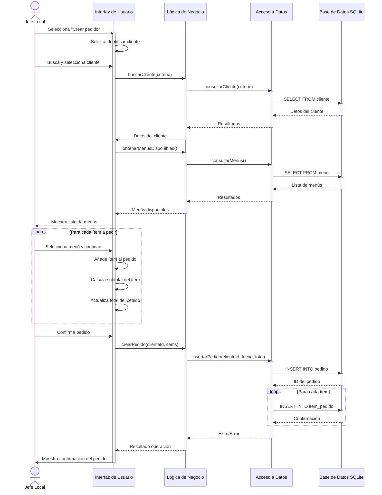
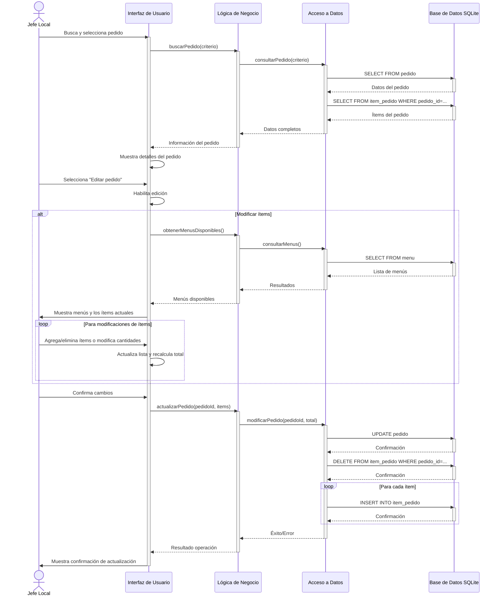
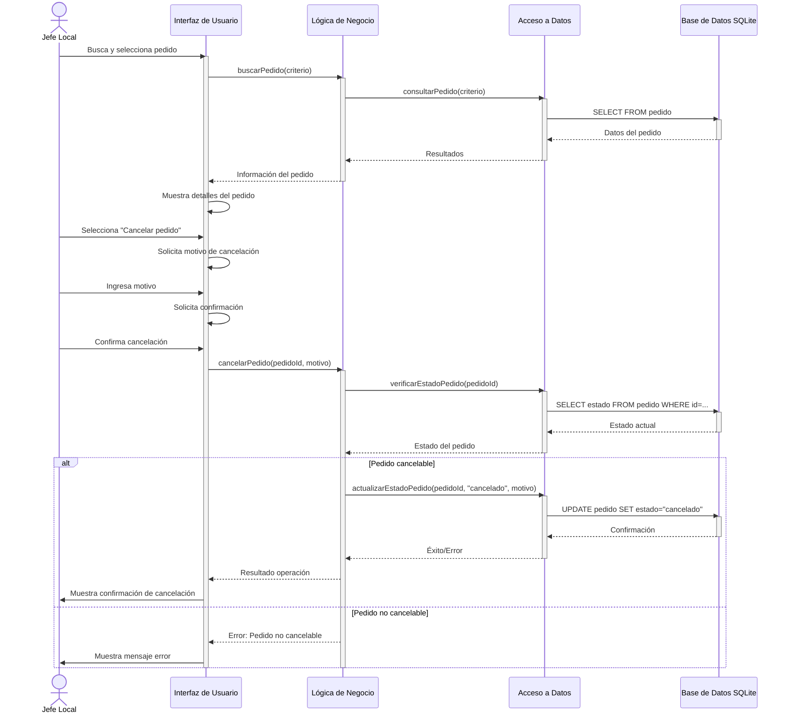
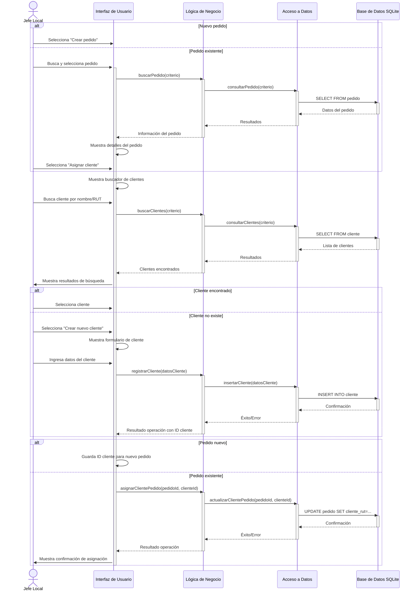
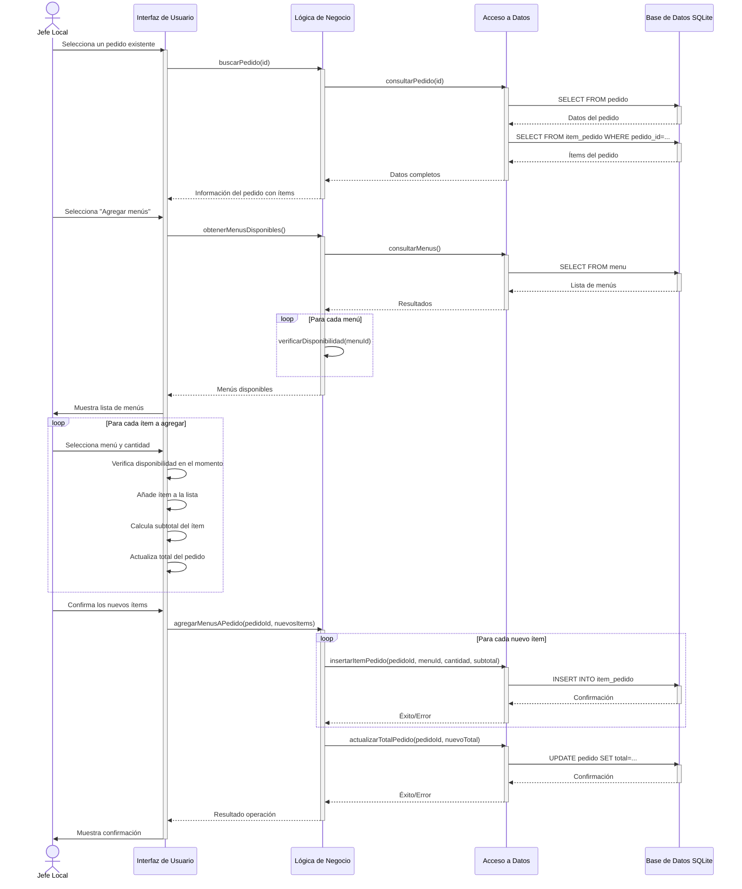
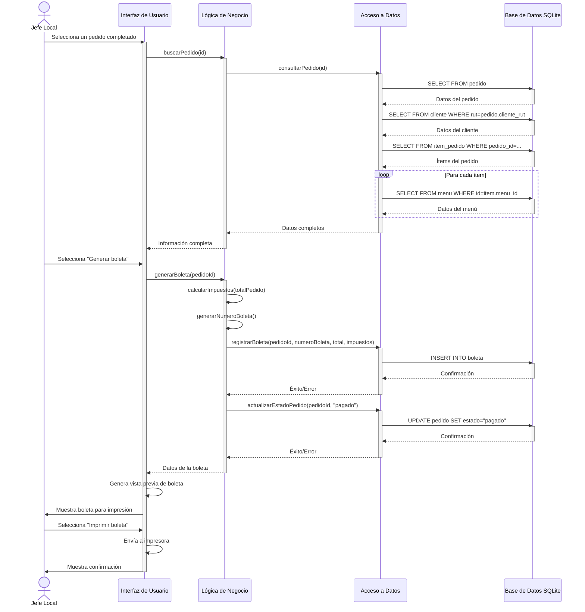

#### CU-A16: Crear Pedido

```mermaid
sequenceDiagram
    actor JL as Jefe Local
    participant UI as Interfaz de Usuario
    participant LN as Lógica de Negocio
    participant DA as Acceso a Datos
    participant DB as Base de Datos SQLite
    
    JL->>UI: Selecciona "Crear pedido"
    activate UI
    UI->>UI: Solicita identificar cliente
    
    JL->>UI: Busca y selecciona cliente
    UI->>LN: buscarCliente(criterio)
    activate LN
    LN->>DA: consultarCliente(criterio)
    activate DA
    DA->>DB: SELECT FROM cliente
    activate DB
    DB-->>DA: Datos del cliente
    deactivate DB
    DA-->>LN: Resultados
    deactivate DA
    LN-->>UI: Datos del cliente
    deactivate LN
    
    UI->>LN: obtenerMenusDisponibles()
    activate LN
    LN->>DA: consultarMenus()
    activate DA
    DA->>DB: SELECT FROM menu
    activate DB
    DB-->>DA: Lista de menús
    deactivate DB
    DA-->>LN: Resultados
    deactivate DA
    LN-->>UI: Menús disponibles
    deactivate LN
    
    UI->>JL: Muestra lista de menús
    
    loop Para cada ítem a pedir
        JL->>UI: Selecciona menú y cantidad
        UI->>UI: Añade ítem al pedido
        UI->>UI: Calcula subtotal del ítem
        UI->>UI: Actualiza total del pedido
    end
    
    JL->>UI: Confirma pedido
    
    UI->>LN: crearPedido(clienteId, items)
    activate LN
    LN->>DA: insertarPedido(clienteId, fecha, total)
    activate DA
    DA->>DB: INSERT INTO pedido
    activate DB
    DB-->>DA: ID del pedido
    deactivate DB
    
    loop Para cada ítem
        DA->>DB: INSERT INTO item_pedido
        activate DB
        DB-->>DA: Confirmación
        deactivate DB
    end
    
    DA-->>LN: Éxito/Error
    deactivate DA
    LN-->>UI: Resultado operación
    deactivate LN
    
    UI->>JL: Muestra confirmación del pedido
    deactivate UI
```

#### CU:A17: Editar Pedido

```mermaid
sequenceDiagram
    actor JL as Jefe Local
    participant UI as Interfaz de Usuario
    participant LN as Lógica de Negocio
    participant DA as Acceso a Datos
    participant DB as Base de Datos SQLite
    
    JL->>UI: Busca y selecciona pedido
    activate UI
    UI->>LN: buscarPedido(criterio)
    activate LN
    LN->>DA: consultarPedido(criterio)
    activate DA
    DA->>DB: SELECT FROM pedido
    activate DB
    DB-->>DA: Datos del pedido
    deactivate DB
    
    DA->>DB: SELECT FROM item_pedido WHERE pedido_id=...
    activate DB
    DB-->>DA: Ítems del pedido
    deactivate DB
    
    DA-->>LN: Datos completos
    deactivate DA
    LN-->>UI: Información del pedido
    deactivate LN
    
    UI->>UI: Muestra detalles del pedido
    JL->>UI: Selecciona "Editar pedido"
    UI->>UI: Habilita edición
    
    alt Modificar ítems
        UI->>LN: obtenerMenusDisponibles()
        activate LN
        LN->>DA: consultarMenus()
        activate DA
        DA->>DB: SELECT FROM menu
        activate DB
        DB-->>DA: Lista de menús
        deactivate DB
        DA-->>LN: Resultados
        deactivate DA
        LN-->>UI: Menús disponibles
        deactivate LN
        
        UI->>JL: Muestra menús y los ítems actuales
        
        loop Para modificaciones de ítems
            JL->>UI: Agrega/elimina ítems o modifica cantidades
            UI->>UI: Actualiza lista y recalcula total
        end
    end
    
    JL->>UI: Confirma cambios
    
    UI->>LN: actualizarPedido(pedidoId, items)
    activate LN
    LN->>DA: modificarPedido(pedidoId, total)
    activate DA
    DA->>DB: UPDATE pedido
    activate DB
    DB-->>DA: Confirmación
    deactivate DB
    
    DA->>DB: DELETE FROM item_pedido WHERE pedido_id=...
    activate DB
    DB-->>DA: Confirmación
    deactivate DB
    
    loop Para cada ítem
        DA->>DB: INSERT INTO item_pedido
        activate DB
        DB-->>DA: Confirmación
        deactivate DB
    end
    
    DA-->>LN: Éxito/Error
    deactivate DA
    LN-->>UI: Resultado operación
    deactivate LN
    
    UI->>JL: Muestra confirmación de actualización
    deactivate UI

```

#### CU-A18: Cancelar Pedido

```mermaid
sequenceDiagram
    actor JL as Jefe Local
    participant UI as Interfaz de Usuario
    participant LN as Lógica de Negocio
    participant DA as Acceso a Datos
    participant DB as Base de Datos SQLite
    
    JL->>UI: Busca y selecciona pedido
    activate UI
    UI->>LN: buscarPedido(criterio)
    activate LN
    LN->>DA: consultarPedido(criterio)
    activate DA
    DA->>DB: SELECT FROM pedido
    activate DB
    DB-->>DA: Datos del pedido
    deactivate DB
    DA-->>LN: Resultados
    deactivate DA
    LN-->>UI: Información del pedido
    deactivate LN
    
    UI->>UI: Muestra detalles del pedido
    JL->>UI: Selecciona "Cancelar pedido"
    UI->>UI: Solicita motivo de cancelación
    JL->>UI: Ingresa motivo
    UI->>UI: Solicita confirmación
    JL->>UI: Confirma cancelación
    
    UI->>LN: cancelarPedido(pedidoId, motivo)
    activate LN
    
    LN->>DA: verificarEstadoPedido(pedidoId)
    activate DA
    DA->>DB: SELECT estado FROM pedido WHERE id=...
    activate DB
    DB-->>DA: Estado actual
    deactivate DB
    DA-->>LN: Estado del pedido
    deactivate DA
    
    alt Pedido cancelable
        LN->>DA: actualizarEstadoPedido(pedidoId, "cancelado", motivo)
        activate DA
        DA->>DB: UPDATE pedido SET estado="cancelado"
        activate DB
        DB-->>DA: Confirmación
        deactivate DB
        DA-->>LN: Éxito/Error
        deactivate DA
        LN-->>UI: Resultado operación
        UI->>JL: Muestra confirmación de cancelación
    else Pedido no cancelable
        LN-->>UI: Error: Pedido no cancelable
        UI->>JL: Muestra mensaje error
    end
    deactivate LN
    deactivate UI
```

#### CU-A19: Asignar Cliente a Pedido

```mermaid
sequenceDiagram
    actor JL as Jefe Local
    participant UI as Interfaz de Usuario
    participant LN as Lógica de Negocio
    participant DA as Acceso a Datos
    participant DB as Base de Datos SQLite
    
    alt Nuevo pedido
        JL->>UI: Selecciona "Crear pedido"
        activate UI
    else Pedido existente
        JL->>UI: Busca y selecciona pedido
        activate UI
        UI->>LN: buscarPedido(criterio)
        activate LN
        LN->>DA: consultarPedido(criterio)
        activate DA
        DA->>DB: SELECT FROM pedido
        activate DB
        DB-->>DA: Datos del pedido
        deactivate DB
        DA-->>LN: Resultados
        deactivate DA
        LN-->>UI: Información del pedido
        deactivate LN
        UI->>UI: Muestra detalles del pedido
        JL->>UI: Selecciona "Asignar cliente"
    end
    
    UI->>UI: Muestra buscador de clientes
    JL->>UI: Busca cliente por nombre/RUT
    
    UI->>LN: buscarClientes(criterio)
    activate LN
    LN->>DA: consultarClientes(criterio)
    activate DA
    DA->>DB: SELECT FROM cliente
    activate DB
    DB-->>DA: Lista de clientes
    deactivate DB
    DA-->>LN: Resultados
    deactivate DA
    LN-->>UI: Clientes encontrados
    deactivate LN
    
    UI->>JL: Muestra resultados de búsqueda
    
    alt Cliente encontrado
        JL->>UI: Selecciona cliente
    else Cliente no existe
        JL->>UI: Selecciona "Crear nuevo cliente"
        UI->>UI: Muestra formulario de cliente
        JL->>UI: Ingresa datos del cliente
        UI->>LN: registrarCliente(datosCliente)
        activate LN
        LN->>DA: insertarCliente(datosCliente)
        activate DA
        DA->>DB: INSERT INTO cliente
        activate DB
        DB-->>DA: Confirmación
        deactivate DB
        DA-->>LN: Éxito/Error
        deactivate DA
        LN-->>UI: Resultado operación con ID cliente
        deactivate LN
    end
    
    alt Pedido nuevo
        UI->>UI: Guarda ID cliente para nuevo pedido
    else Pedido existente
        UI->>LN: asignarClientePedido(pedidoId, clienteId)
        activate LN
        LN->>DA: actualizarClientePedido(pedidoId, clienteId)
        activate DA
        DA->>DB: UPDATE pedido SET cliente_rut=...
        activate DB
        DB-->>DA: Confirmación
        deactivate DB
        DA-->>LN: Éxito/Error
        deactivate DA
        LN-->>UI: Resultado operación
        deactivate LN
        UI->>JL: Muestra confirmación de asignación
    end
    deactivate UI
```

#### CU-A20: Agregar Menús a Pedido

```mermaid
sequenceDiagram
    actor JL as Jefe Local
    participant UI as Interfaz de Usuario
    participant LN as Lógica de Negocio
    participant DA as Acceso a Datos
    participant DB as Base de Datos SQLite
    
    JL->>UI: Selecciona un pedido existente
    activate UI
    UI->>LN: buscarPedido(id)
    activate LN
    LN->>DA: consultarPedido(id)
    activate DA
    DA->>DB: SELECT FROM pedido
    activate DB
    DB-->>DA: Datos del pedido
    deactivate DB
    
    DA->>DB: SELECT FROM item_pedido WHERE pedido_id=...
    activate DB
    DB-->>DA: Ítems del pedido
    deactivate DB
    
    DA-->>LN: Datos completos
    deactivate DA
    LN-->>UI: Información del pedido con ítems
    deactivate LN
    
    JL->>UI: Selecciona "Agregar menús"
    
    UI->>LN: obtenerMenusDisponibles()
    activate LN
    LN->>DA: consultarMenus()
    activate DA
    DA->>DB: SELECT FROM menu
    activate DB
    DB-->>DA: Lista de menús
    deactivate DB
    DA-->>LN: Resultados
    deactivate DA
    
    loop Para cada menú
        LN->>LN: verificarDisponibilidad(menuId)
    end
    
    LN-->>UI: Menús disponibles
    deactivate LN
    
    UI->>JL: Muestra lista de menús
    
    loop Para cada ítem a agregar
        JL->>UI: Selecciona menú y cantidad
        UI->>UI: Verifica disponibilidad en el momento
        UI->>UI: Añade ítem a la lista
        UI->>UI: Calcula subtotal del ítem
        UI->>UI: Actualiza total del pedido
    end
    
    JL->>UI: Confirma los nuevos ítems
    
    UI->>LN: agregarMenusAPedido(pedidoId, nuevosItems)
    activate LN
    
    loop Para cada nuevo ítem
        LN->>DA: insertarItemPedido(pedidoId, menuId, cantidad, subtotal)
        activate DA
        DA->>DB: INSERT INTO item_pedido
        activate DB
        DB-->>DA: Confirmación
        deactivate DB
        DA-->>LN: Éxito/Error
        deactivate DA
    end
    
    LN->>DA: actualizarTotalPedido(pedidoId, nuevoTotal)
    activate DA
    DA->>DB: UPDATE pedido SET total=...
    activate DB
    DB-->>DA: Confirmación
    deactivate DB
    DA-->>LN: Éxito/Error
    deactivate DA
    
    LN-->>UI: Resultado operación
    deactivate LN
    UI->>JL: Muestra confirmación
    deactivate UI
```

#### CU-A21: Generar Boleta

```mermaid
sequenceDiagram
    actor JL as Jefe Local
    participant UI as Interfaz de Usuario
    participant LN as Lógica de Negocio
    participant DA as Acceso a Datos
    participant DB as Base de Datos SQLite
    
    JL->>UI: Selecciona un pedido completado
    activate UI
    UI->>LN: buscarPedido(id)
    activate LN
    LN->>DA: consultarPedido(id)
    activate DA
    DA->>DB: SELECT FROM pedido
    activate DB
    DB-->>DA: Datos del pedido
    deactivate DB
    
    DA->>DB: SELECT FROM cliente WHERE rut=pedido.cliente_rut
    activate DB
    DB-->>DA: Datos del cliente
    deactivate DB
    
    DA->>DB: SELECT FROM item_pedido WHERE pedido_id=...
    activate DB
    DB-->>DA: Ítems del pedido
    deactivate DB
    
    loop Para cada ítem
        DA->>DB: SELECT FROM menu WHERE id=item.menu_id
        activate DB
        DB-->>DA: Datos del menú
        deactivate DB
    end
    
    DA-->>LN: Datos completos
    deactivate DA
    LN-->>UI: Información completa
    deactivate LN
    
    JL->>UI: Selecciona "Generar boleta"
    
    UI->>LN: generarBoleta(pedidoId)
    activate LN
    LN->>LN: calcularImpuestos(totalPedido)
    LN->>LN: generarNumeroBoleta()
    
    LN->>DA: registrarBoleta(pedidoId, numeroBoleta, total, impuestos)
    activate DA
    DA->>DB: INSERT INTO boleta
    activate DB
    DB-->>DA: Confirmación
    deactivate DB
    DA-->>LN: Éxito/Error
    deactivate DA
    
    LN->>DA: actualizarEstadoPedido(pedidoId, "pagado")
    activate DA
    DA->>DB: UPDATE pedido SET estado="pagado"
    activate DB
    DB-->>DA: Confirmación
    deactivate DB
    DA-->>LN: Éxito/Error
    deactivate DA
    
    LN-->>UI: Datos de la boleta
    deactivate LN
    
    UI->>UI: Genera vista previa de boleta
    UI->>JL: Muestra boleta para impresión
    
    JL->>UI: Selecciona "Imprimir boleta"
    UI->>UI: Envía a impresora
    UI->>JL: Muestra confirmación
    deactivate UI
```