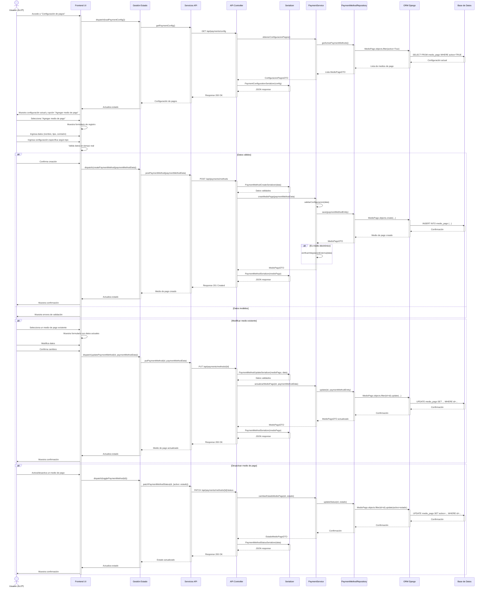

#### CU-R28: Registrar Medio de Pago



#### CU-R29: Procesar Pago

```mermaid
sequenceDiagram
    actor Usuario as Usuario (JL/JT/ME)
    participant UI as Frontend UI
    participant GE as Gestión Estado
    participant SA as Servicios API
    participant AC as API Controller
    participant SZ as Serializer
    participant SV as PaymentService
    participant PS as PaymentProcessor
    participant OS as OrderService
    participant TR as TransactionRepository
    participant OR as OrderRepository
    participant PR as PaymentMethodRepository
    participant ORM as ORM Django
    participant BD as Base de Datos
    participant EP as External Processor

    Usuario->>UI: Accede al pedido para pago
    activate UI
    
    UI->>GE: dispatch(getOrderDetails(id))
    activate GE
    GE->>SA: getOrder(id)
    activate SA
    SA->>AC: GET /api/orders/{id}
    activate AC
    AC->>OS: obtenerPedido(id)
    activate OS
    OS->>OR: findById(id)
    activate OR
    OR->>ORM: Pedido.objects.get(id=id)
    activate ORM
    ORM->>BD: SELECT FROM pedido WHERE id=...
    activate BD
    BD-->>ORM: Datos del pedido
    deactivate BD
    ORM-->>OR: Pedido
    deactivate ORM
    OR-->>OS: PedidoDTO
    deactivate OR
    OS-->>AC: PedidoDTO
    deactivate OS
    
    AC->>SZ: OrderDetailSerializer(pedido)
    activate SZ
    SZ-->>AC: JSON response
    deactivate SZ
    AC-->>SA: Response 200 OK
    deactivate AC
    SA-->>GE: Detalles del pedido
    deactivate SA
    GE->>UI: Actualiza estado
    deactivate GE
    
    UI->>GE: dispatch(getAvailablePaymentMethods())
    activate GE
    GE->>SA: getPaymentMethods()
    activate SA
    SA->>AC: GET /api/payments/methods
    activate AC
    AC->>SV: obtenerMediosPagoDisponibles()
    activate SV
    SV->>PR: findActive()
    activate PR
    PR->>ORM: MedioPago.objects.filter(activo=True)
    activate ORM
    ORM->>BD: SELECT FROM medio_pago WHERE activo=TRUE
    activate BD
    BD-->>ORM: Medios de pago
    deactivate BD
    ORM-->>PR: Lista de medios
    deactivate ORM
    PR-->>SV: Lista MedioPagoDTO
    deactivate PR
    SV-->>AC: MediosPagoDisponiblesDTO
    deactivate SV
    
    AC->>SZ: AvailablePaymentMethodsSerializer(medios)
    activate SZ
    SZ-->>AC: JSON response
    deactivate SZ
    AC-->>SA: Response 200 OK
    deactivate AC
    SA-->>GE: Medios de pago disponibles
    deactivate SA
    GE->>UI: Actualiza estado
    deactivate GE
    
    UI->>UI: Muestra total a pagar y medios disponibles
    UI->>Usuario: Presenta opciones de pago
    
    Usuario->>UI: Selecciona medio de pago
    alt Medio de pago requiere campos adicionales
        UI->>UI: Muestra campos específicos según tipo
        Usuario->>UI: Ingresa información adicional
    end
    
    Usuario->>UI: Confirma el pago
    
    UI->>GE: dispatch(processPayment(orderId, paymentData))
    activate GE
    GE->>SA: postPayment(orderId, paymentData)
    activate SA
    SA->>AC: POST /api/payments/process
    activate AC
    AC->>SZ: PaymentProcessSerializer(data)
    activate SZ
    SZ-->>AC: Datos validados
    deactivate SZ
    
    AC->>SV: procesarPago(orderId, paymentData)
    activate SV
    SV->>OS: verificarPedido(orderId)
    activate OS
    OS->>OR: checkOrderStatus(orderId)
    activate OR
    OR->>ORM: Pedido.objects.get(id=orderId)
    activate ORM
    ORM->>BD: SELECT FROM pedido WHERE id=...
    activate BD
    BD-->>ORM: Datos del pedido
    deactivate BD
    ORM-->>OR: Estado del pedido
    deactivate ORM
    OR-->>OS: PedidoVerificadoDTO
    deactivate OR
    OS-->>SV: Confirmación de pedido válido
    deactivate OS
    
    SV->>PR: findById(paymentData.medioPagoId)
    activate PR
    PR->>ORM: MedioPago.objects.get(id=...)
    activate ORM
    ORM->>BD: SELECT FROM medio_pago WHERE id=...
    activate BD
    BD-->>ORM: Datos del medio de pago
    deactivate BD
    ORM-->>PR: Medio de pago
    deactivate ORM
    PR-->>SV: MedioPagoDTO
    deactivate PR
    
    SV->>PS: createProcessor(medioPagoDTO)
    activate PS
    PS-->>SV: PaymentProcessorInstance
    deactivate PS
    
    alt Pago electrónico (tarjeta, transferencia)
        SV->>EP: processExternalPayment(paymentData)
        activate EP
        EP-->>SV: PaymentResponse
        deactivate EP
    end
    
    SV->>TR: save(transactionEntity)
    activate TR
    TR->>ORM: transaction.atomic()
    activate ORM
    ORM->>BD: INSERT INTO transaccion (...)
    activate BD
    BD-->>ORM: Confirmación
    deactivate BD
    
    ORM->>BD: UPDATE pedido SET estado='pagado' WHERE id=...
    activate BD
    BD-->>ORM: Confirmación
    deactivate BD
    ORM-->>TR: Transacción guardada
    deactivate ORM
    TR-->>SV: TransaccionDTO
    deactivate TR
    
    SV-->>AC: ResultadoPagoDTO
    deactivate SV
    
    AC->>SZ: PaymentResultSerializer(resultado)
    activate SZ
    SZ-->>AC: JSON response
    deactivate SZ
    AC-->>SA: Response 200 OK
    deactivate AC
    SA-->>GE: Resultado del pago
    deactivate SA
    GE->>UI: Actualiza estado
    deactivate GE
    
    alt Pago exitoso
        UI->>UI: Muestra confirmación y opciones de comprobante
        UI->>Usuario: Pregunta tipo de comprobante deseado
    else Pago fallido
        UI->>UI: Muestra error y opciones alternativas
        UI->>Usuario: Ofrece intentar con otro medio de pago
    end
    
    alt Pago dividido
        Usuario->>UI: Selecciona "Dividir pago"
        UI->>UI: Muestra formulario para múltiples pagos
        
        Usuario->>UI: Ingresa montos y medios para cada parte
        Usuario->>UI: Confirma división de pago
        
        loop Para cada parte del pago
            UI->>GE: dispatch(processPartialPayment(orderId, partialData))
            activate GE
            // ... (similar al proceso de pago completo)
            GE->>UI: Actualiza estado
            deactivate GE
        end
    end
    
    deactivate UI
```

#### CU-R30: Emitir Comprobante

```mermaid
sequenceDiagram
    actor Usuario as Usuario (JL/JT/ME)
    participant UI as Frontend UI
    participant GE as Gestión Estado
    participant SA as Servicios API
    participant AC as API Controller
    participant SZ as Serializer
    participant SV as ReceiptService
    participant TS as TransactionService
    participant RS as ReceiptRepository
    participant TR as TransactionRepository
    participant ORM as ORM Django
    participant BD as Base de Datos
    participant PDF as PDF Generator
    participant PT as Printer Service
    participant EM as Email Service

    alt Después del pago exitoso
        Usuario->>UI: Selecciona tipo de comprobante (boleta/factura)
        activate UI
    else Acceso desde historial
        Usuario->>UI: Accede al historial de transacciones
        activate UI
        Usuario->>UI: Selecciona una transacción
        Usuario->>UI: Elige "Generar comprobante"
    end
    
    alt Es factura
        UI->>UI: Solicita datos fiscales
        Usuario->>UI: Ingresa/selecciona datos fiscales
    end
    
    UI->>GE: dispatch(generateReceipt(transactionId, receiptData))
    activate GE
    GE->>SA: postReceipt(transactionId, receiptData)
    activate SA
    SA->>AC: POST /api/receipts
    activate AC
    AC->>SZ: ReceiptCreateSerializer(data)
    activate SZ
    SZ-->>AC: Datos validados
    deactivate SZ
    
    AC->>SV: generarComprobante(transactionId, receiptData)
    activate SV
    SV->>TS: obtenerTransaccion(transactionId)
    activate TS
    TS->>TR: findById(transactionId)
    activate TR
    TR->>ORM: Transaccion.objects.select_related('pedido').get(id=transactionId)
    activate ORM
    ORM->>BD: SELECT FROM transaccion JOIN pedido ... WHERE transaccion.id=...
    activate BD
    BD-->>ORM: Datos de transacción y pedido
    deactivate BD
    ORM-->>TR: Transacción con pedido
    deactivate ORM
    TR-->>TS: TransaccionDetalladaDTO
    deactivate TR
    TS-->>SV: TransaccionDetalladaDTO
    deactivate TS
    
    SV->>SV: configurarComprobante(transaccionDTO, receiptData)
    
    alt Es factura
        SV->>SV: validarDatosFiscales(receiptData.datosFiscales)
    end
    
    SV->>SV: generarNumeroUnico()
    
    SV->>RS: save(receiptEntity)
    activate RS
    RS->>ORM: transaction.atomic()
    activate ORM
    ORM->>BD: INSERT INTO comprobante (...)
    activate BD
    BD-->>ORM: Confirmación
    deactivate BD
    ORM-->>RS: Comprobante guardado
    deactivate ORM
    RS-->>SV: ComprobanteDTO
    deactivate RS
    
    SV->>PDF: generateReceiptDocument(comprobanteDTO)
    activate PDF
    PDF-->>SV: PDF Document
    deactivate PDF
    
    SV-->>AC: ComprobanteGeneradoDTO con PDF
    deactivate SV
    
    AC->>SZ: ReceiptGeneratedSerializer(comprobante)
    activate SZ
    SZ-->>AC: JSON response
    deactivate SZ
    AC-->>SA: Response 200 OK con PDF
    deactivate AC
    SA-->>GE: Comprobante generado
    deactivate SA
    GE->>UI: Actualiza estado
    deactivate GE
    
    UI->>UI: Muestra vista previa del comprobante
    UI->>Usuario: Solicita método de entrega
    
    Usuario->>UI: Selecciona método (impresión/email/mensaje)
    
    alt Impresión
        UI->>GE: dispatch(printReceipt(receiptId))
        activate GE
        GE->>SA: postReceiptPrint(receiptId)
        activate SA
        SA->>AC: POST /api/receipts/{id}/print
        activate AC
        AC->>SV: enviarAImpresora(receiptId)
        activate SV
        SV->>RS: findById(receiptId)
        activate RS
        RS->>ORM: Comprobante.objects.get(id=receiptId)
        activate ORM
        ORM->>BD: SELECT FROM comprobante WHERE id=...
        activate BD
        BD-->>ORM: Datos del comprobante
        deactivate BD
        ORM-->>RS: Comprobante
        deactivate ORM
        RS-->>SV: ComprobanteDTO
        deactivate RS
        
        SV->>PT: printDocument(comprobanteDTO)
        activate PT
        PT-->>SV: PrintResult
        deactivate PT
        SV-->>AC: ResultadoImpresionDTO
        deactivate SV
        
        AC->>SZ: PrintResultSerializer(resultado)
        activate SZ
        SZ-->>AC: JSON response
        deactivate SZ
        AC-->>SA: Response 200 OK
        deactivate AC
        SA-->>GE: Resultado de impresión
        deactivate SA
        GE->>UI: Actualiza estado
        deactivate GE
        
        UI->>Usuario: Confirma impresión
    else Email
        UI->>Usuario: Solicita correo electrónico
        Usuario->>UI: Ingresa o confirma email
        
        UI->>GE: dispatch(emailReceipt(receiptId, emailData))
        activate GE
        GE->>SA: postReceiptEmail(receiptId, emailData)
        activate SA
        SA->>AC: POST /api/receipts/{id}/email
        activate AC
        AC->>SV: enviarPorEmail(receiptId, emailData)
        activate SV
        SV->>RS: findById(receiptId)
        activate RS
        RS->>ORM: Comprobante.objects.get(id=receiptId)
        activate ORM
        ORM->>BD: SELECT FROM comprobante WHERE id=...
        activate BD
        BD-->>ORM: Datos del comprobante
        deactivate BD
        ORM-->>RS: Comprobante
        deactivate ORM
        RS-->>SV: ComprobanteDTO con PDF
        deactivate RS
        
        SV->>EM: sendReceiptEmail(emailData.address, comprobanteDTO)
        activate EM
        EM-->>SV: SendResult
        deactivate EM
        SV-->>AC: ResultadoEnvioDTO
        deactivate SV
        
        AC->>SZ: EmailResultSerializer(resultado)
        activate SZ
        SZ-->>AC: JSON response
        deactivate SZ
        AC-->>SA: Response 200 OK
        deactivate AC
        SA-->>GE: Resultado del envío
        deactivate SA
        GE->>UI: Actualiza estado
        deactivate GE
        
        UI->>Usuario: Confirma envío de email
    end
    
    UI->>Usuario: Ofrece opción de descargar PDF
    Usuario->>UI: Selecciona descargar
    UI->>UI: Inicia descarga del documento
    
    alt Comprobantes consolidados
        Usuario->>UI: Selecciona opción "Consolidar comprobantes"
        UI->>UI: Muestra interfaz para seleccionar múltiples pedidos
        Usuario->>UI: Selecciona pedidos a consolidar
        Usuario->>UI: Confirma consolidación
        
        UI->>GE: dispatch(generateConsolidatedReceipt(transactionIds, receiptData))
        activate GE
        // ... (similar al proceso normal pero procesando múltiples transacciones)
        GE->>UI: Actualiza estado
        deactivate GE
    end
    
    deactivate UI
```
