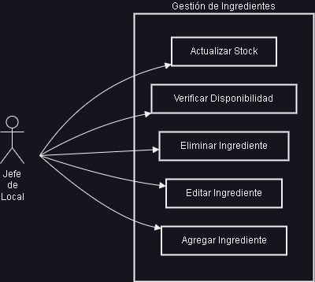

# Casos de Uso - Sistema de Gestión de Restaurante

En este documento se presentan los diagramas de casos de uso tanto para el sistema actual como para la versión refactorizada. Estos diagramas ilustran las interacciones entre los diferentes actores y las funcionalidades del sistema.

## Jerarquía de Actores

Antes de detallar los casos de uso, es importante comprender los diferentes actores que interactúan con el sistema:

* **Usuario del Sistema**: Generalización de todos los tipos de usuarios.
* **Jefe de Local** (antes Administrador): Máximo nivel de acceso, con control total sobre todas las funcionalidades del sistema.
* **Jefe de Turno** (antes Gerente): Hereda todas las capacidades del Jefe de Local, pero está enfocado principalmente en tareas administrativas diarias, reportes y análisis de datos.
* **Empleado**: Categoría general de personal operativo.
  * **Mesero**: Gestiona pedidos y atiende a los clientes.
  * **Cocina**: Prepara los pedidos y gestiona ingredientes.

## Sistema Actual

El sistema actual está centralizado principalmente en el rol del Jefe de Local (Administrador), quien tiene acceso a todas las funcionalidades sin una delegación clara de responsabilidades.

### Gestión de Clientes

Este módulo permite administrar la información de los clientes y ver su historial de compras.

**Nota**: En el sistema actual, todas las operaciones relacionadas con clientes solo pueden ser realizadas por el Jefe de Local, lo que crea un cuello de botella en la operación.

### Gestión de Ingredientes

Este módulo controla el inventario de ingredientes disponibles para la preparación de los platos.

**Nota**: La gestión de inventario está completamente centralizada, obligando al Jefe de Local a actualizar manualmente el stock sin participación del personal de cocina.

### Gestión de Menús

Este módulo permite crear y mantener el catálogo de platos ofrecidos en el restaurante.

**Nota**: La verificación de disponibilidad debe hacerse manualmente por el Jefe de Local, sin un sistema automático que relacione ingredientes y menús.

### Gestión de Pedidos

Este módulo maneja la creación y procesamiento de órdenes de los clientes.

**Nota**: Todo el proceso de pedidos recae en el Jefe de Local, desde la creación hasta la generación de boletas, sin intervención de los meseros que atienden directamente a los clientes.

### Generación de Reportes

Este módulo proporciona información estadística básica sobre la operación del restaurante.

**Nota**: Las capacidades analíticas están limitadas a reportes básicos sin opciones avanzadas de filtrado o visualización.

## Sistema Refactorizado

El sistema refactorizado distribuye responsabilidades entre diferentes roles, optimizando los flujos de trabajo y añadiendo nuevas funcionalidades.

### Gestión de Clientes (Refactorizado)

Este módulo ahora permite que tanto Jefes de Local como meseros gestionen información de clientes.

**Nota**: Se delegan responsabilidades a los meseros para registrar y consultar clientes, mejorando la eficiencia del servicio. La eliminación sigue siendo exclusiva del Jefe de Local por motivos de seguridad.

### Gestión de Ingredientes (Refactorizado)

Este módulo ahora incluye participación del personal de cocina para gestión de stock.

**Nota**: El personal de cocina ahora puede actualizar el stock y verificar disponibilidad en tiempo real, mientras que la gestión de catálogo sigue siendo responsabilidad administrativa.

### Gestión de Menús (Refactorizado)

Este módulo ahora permite que la cocina verifique disponibilidad de menús basados en ingredientes.

**Nota**: Se añade la funcionalidad para que la cocina vea los menús disponibles (marcado en naranja) y verifique disponibilidad según los ingredientes en stock.

### Gestión de Pedidos (Refactorizado)

Este módulo ahora distribuye la gestión de pedidos entre Jefes de Local, meseros y cocina.

**Nota**: Los meseros ahora tienen acceso completo a la gestión de pedidos, y se han añadido nuevas funcionalidades (marcadas en naranja) para que la cocina pueda ver pedidos pendientes y actualizar su estado.

### Gestión de Mesas (Nuevo)

Este módulo es completamente nuevo y permite administrar las mesas del restaurante.

.png)

**Nota**: Esta nueva funcionalidad (todos los casos de uso marcados en naranja) permite administrar el espacio físico del restaurante. Los meseros pueden cambiar estados, asignar clientes y monitorear tiempos (marcados en verde para compartido).

### Sistema de Delivery (Nuevo)

Este módulo es completamente nuevo y maneja pedidos para entrega a domicilio.

.png)

**Nota**: Este módulo completamente nuevo (todos los casos marcados en naranja) permite gestionar pedidos a domicilio, con algunas tareas compartidas con meseros (marcadas en verde).

### Sistema de Pagos (Nuevo)

Este módulo es completamente nuevo y gestiona las transacciones financieras.

.png)

**Nota**: Este nuevo módulo (todos los casos marcados en naranja) permite manejar múltiples formas de pago. Los meseros pueden procesar pagos y emitir comprobantes (marcados en verde), mientras que los Jefes de Turno acceden a estadísticas específicas.

### Dashboard Analítico (Mejorado)

Este módulo amplía significativamente las capacidades de reportes del sistema original.

**Nota**: Este módulo representa una mejora significativa sobre los reportes básicos (todos marcados en azul). Tanto Jefes de Local como Jefes de Turno tienen acceso completo a estas funcionalidades analíticas (todos compartidos, marcados en verde).

## Leyenda de los Diagramas

Para facilitar la comprensión visual de los cambios entre versiones:

* **Color Verde**: Casos de uso compartidos por múltiples actores
* **Color Naranja**: Casos de uso completamente nuevos
* **Color Azul**: Casos de uso significativamente mejorados
* **Sin color especial**: Casos de uso sin cambios o exclusivos de un rol

## Comparativa de Casos de Uso

| Funcionalidad | Sistema Actual | Sistema Refactorizado | Beneficios |
|---------------|---------------|------------------------|------------|
| **Gestión de Clientes** | Operaciones CRUD básicas (1 actor) | CRUD + múltiples roles de acceso (2 actores) | Mayor distribución de responsabilidades y acceso desde múltiples dispositivos |
| **Gestión de Ingredientes** | Control manual de stock (1 actor) | Stock automatizado + alertas + acceso desde cocina (2 actores) | Reducción de errores y actualización en tiempo real del inventario |
| **Gestión de Menús** | Manejo básico de menús (1 actor) | Verificación automática de disponibilidad + acceso desde cocina (2 actores) | Mejor control de disponibilidad y prevención de ofertas de platos no disponibles |
| **Gestión de Pedidos** | Creación manual y centralizada (1 actor) | Gestión distribuida + seguimiento de estados + notificaciones (3 actores) | Reducción de tiempos de espera y mejor comunicación entre áreas |
| **Reportes** | Estadísticas básicas (1 actor) | Dashboard completo con KPIs, filtros y exportación (2 actores) | Toma de decisiones basada en datos y análisis avanzado |
| **Gestión de Mesas** | No existe | Control visual + asignación + tiempos (2 actores) | Optimización del uso del espacio y mejora en la rotación de mesas |
| **Delivery** | No existe | Integración con apps + seguimiento de repartidores (2 actores) | Nuevos canales de venta y experiencia mejorada para clientes |
| **Sistema de Pagos** | No existe | Múltiples medios de pago + verificación de estados (3 actores) | Flexibilidad para los clientes y mejor control financiero |

## Análisis de Complejidad y Distribución

La siguiente tabla muestra cómo ha evolucionado la complejidad del sistema y la distribución de responsabilidades:

| Métrica | Sistema Actual | Sistema Refactorizado | Cambio |
|---------|---------------|------------------------|--------|
| **Total de casos de uso** | 18 | 41 | +128% |
| **Actores implicados** | 1 | 4 | +300% |
| **Módulos funcionales** | 5 | 8 | +60% |
| **Casos de uso por actor (promedio)** | 18 | 10.25 | -43% |
| **Casos de uso compartidos** | 0 | 22 | +∞ |

## Conclusión

La refactorización del sistema representa una mejora sustancial en la operación del restaurante, ofreciendo los siguientes beneficios principales:

1. **Descentralización del acceso**: El sistema actual concentra todas las operaciones en el rol de Jefe de Local (18 casos de uso), mientras que el sistema refactorizado distribuye responsabilidades entre diferentes roles (Jefe de Local: 41, mesero: 20, cocina: 7, Jefe de Turno: 6), permitiendo que múltiples usuarios interactúen simultáneamente con el sistema.

2. **Nuevas funcionalidades críticas**: La incorporación de gestión de mesas (6 casos de uso), sistema de delivery (5 casos de uso) y procesamiento de pagos (6 casos de uso) responde a necesidades fundamentales del negocio que no estaban cubiertas en el sistema original.

3. **Automatización de procesos**: La actualización automática de inventario, verificación de disponibilidad de menús y generación de alertas eliminan tareas manuales propensas a errores.

4. **Toma de decisiones basada en datos**: El dashboard analítico avanzado permite a los Jefes de Turno y Jefes de Local obtener insights valiosos sobre la operación del restaurante, facilitando decisiones estratégicas informadas.

5. **Experiencia mejorada para el cliente**: La reducción de errores en pedidos, la optimización de tiempos de servicio y la flexibilidad en métodos de pago y canales de venta (delivery) mejoran significativamente la experiencia del cliente.

6. **Escalabilidad**: La arquitectura refactorizada permite la incorporación futura de nuevas funcionalidades y la adaptación a un volumen creciente de operaciones.

En resumen, la migración de una aplicación de escritorio a una plataforma web con arquitectura orientada a objetos no sólo moderniza la infraestructura tecnológica, sino que transforma fundamentalmente la manera en que opera el restaurante, proporcionando herramientas para incrementar la eficiencia, reducir costos y mejorar la satisfacción del cliente.
