# Diagramas del Sistema de Gestión de Restaurante

Este documento contiene diagramas comparativos entre el sistema actual (Python con customtkinter) y el sistema refactorizado propuesto (aplicación web con React/Django). Los diagramas se presentan en pares para mostrar claramente el antes y después de la refactorización.

## 1. Arquitectura del Sistema

### Arquitectura Actual (Aplicación de Escritorio)

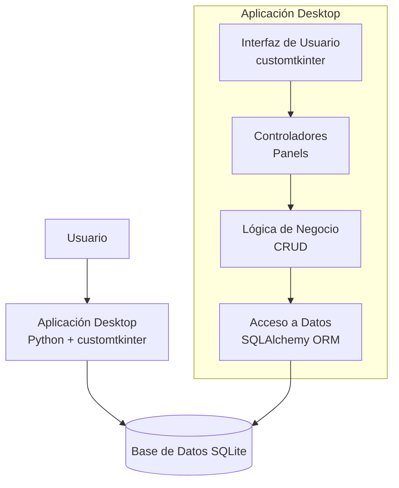

### Arquitectura Refactorizada (Aplicación Web)

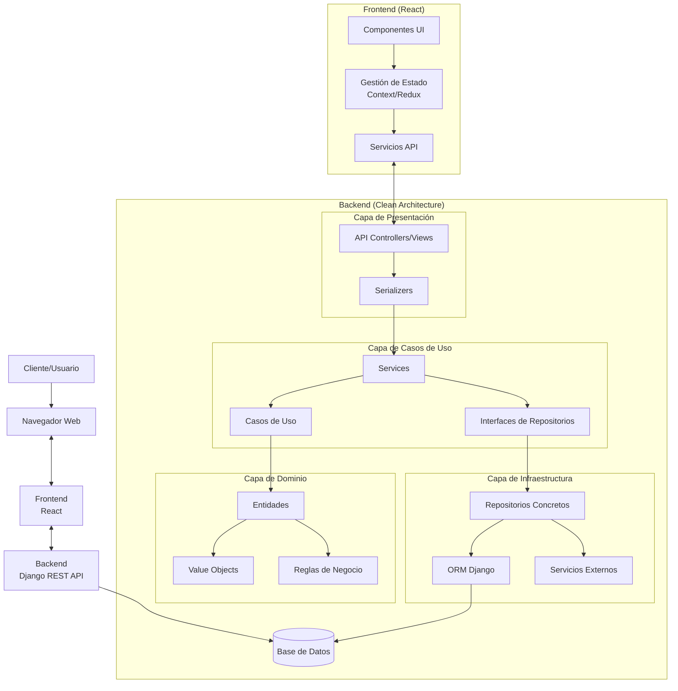

## 2. MER

### MER Actual

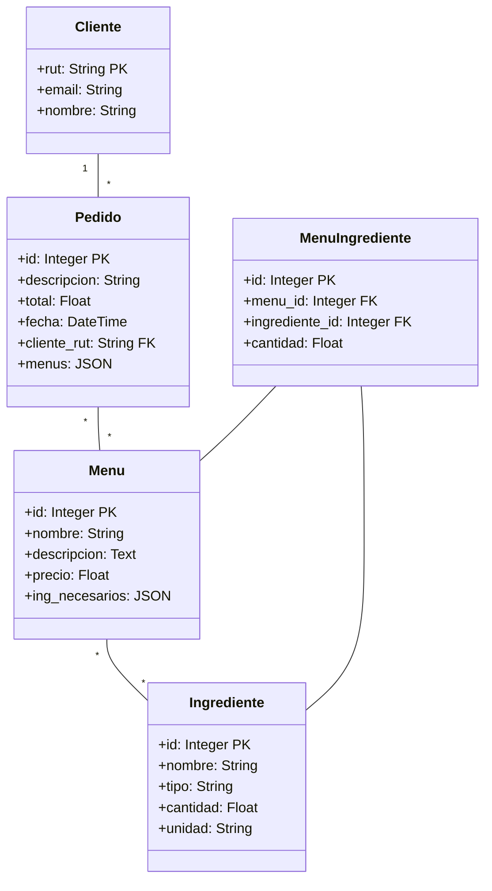

### MER Refactorizado

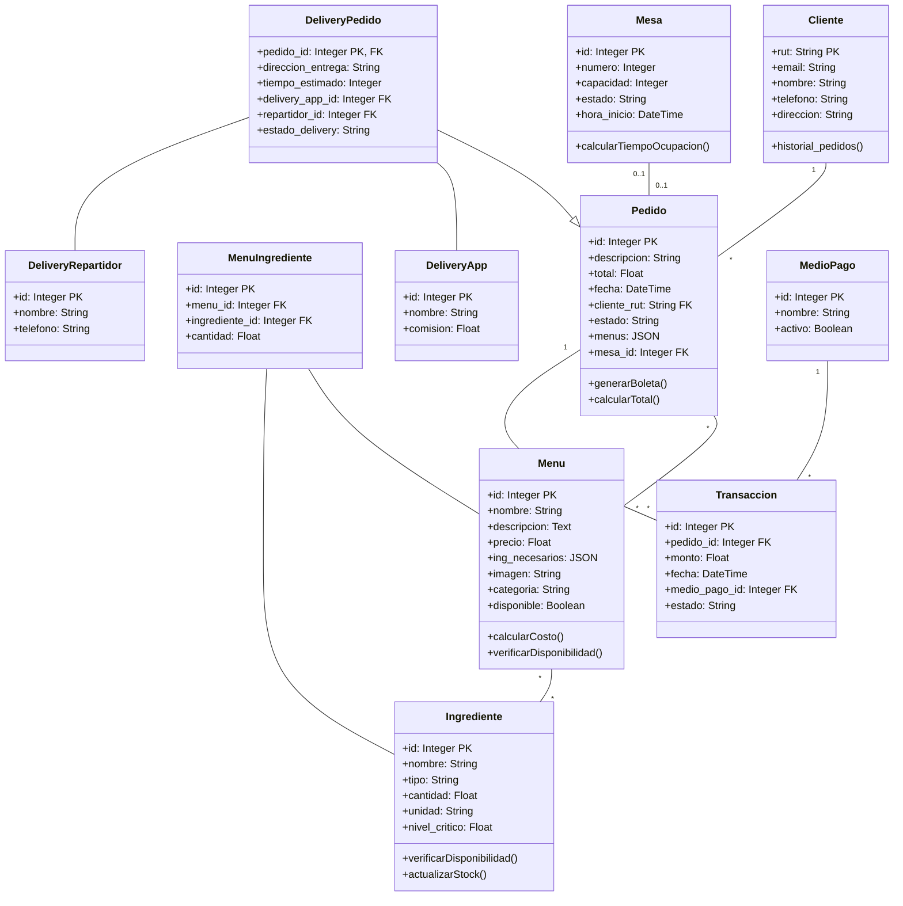

## 3. Patrones de Diseño

### Patrones de Diseño Actuales

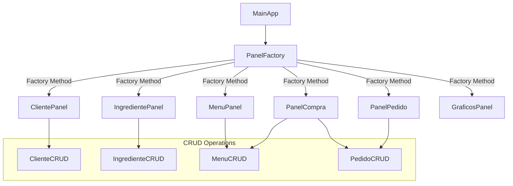

### Patrones de Diseño Refactorizados

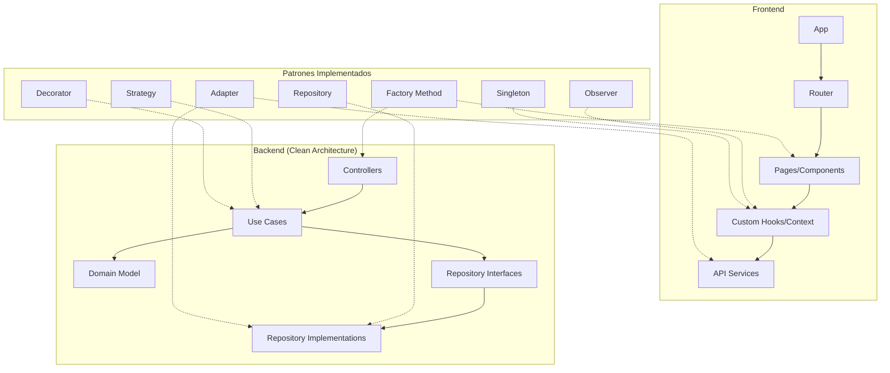

## 4. Flujo de Trabajo de Pedidos

### Flujo Actual

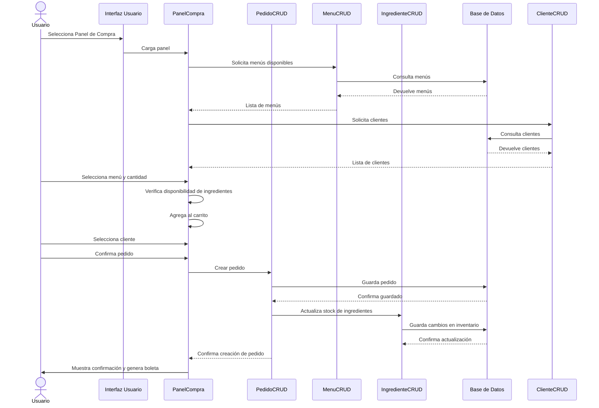

### Flujo Refactorizado

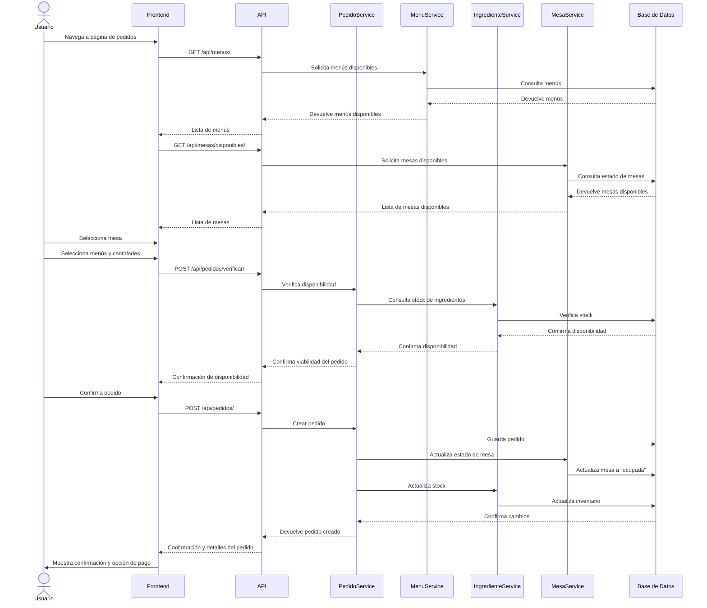

## 5. Diagrama de Componentes

### Componentes Actuales

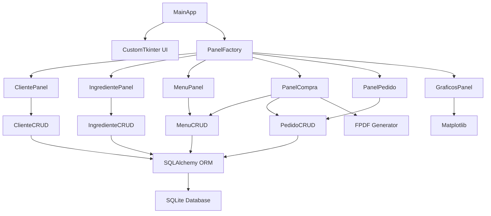

### Componentes Refactorizados

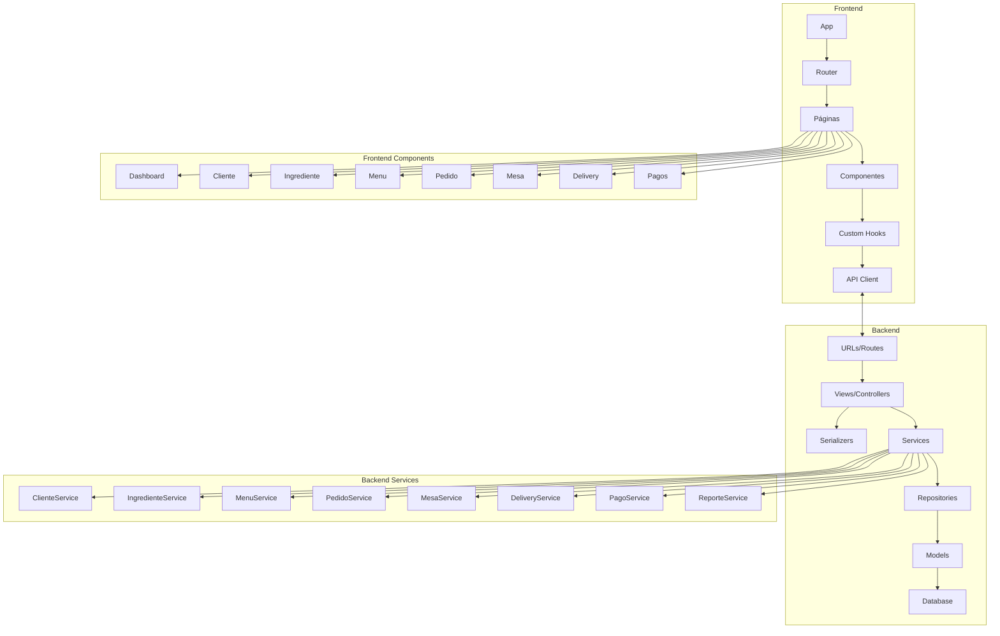

## 6. Diagrama de Despliegue

### Despliegue Actual

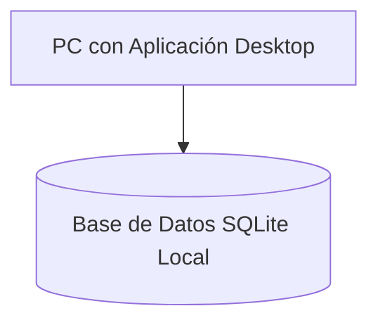

### Despliegue Refactorizado

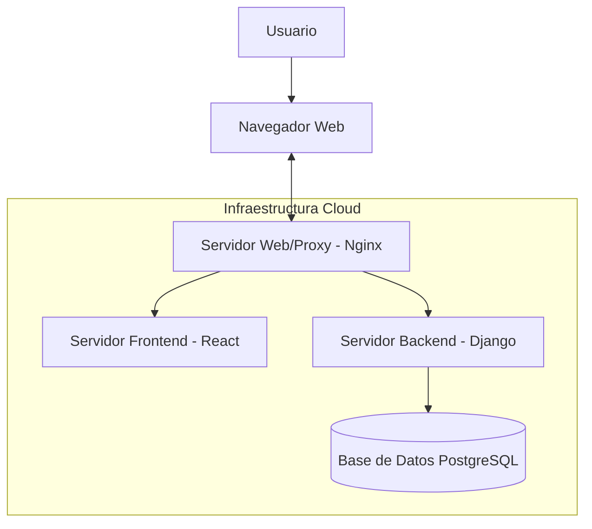

## 7. Comparación de Arquitecturas

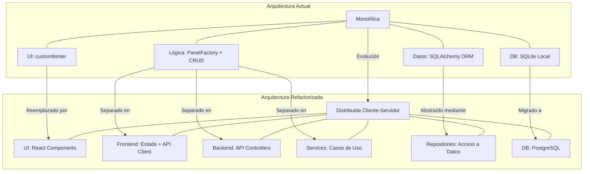

### Tabla Comparativa de Arquitecturas

| **Aspecto** | **Arquitectura Actual** | **Arquitectura Refactorizada** | **Beneficios del Cambio** |
|-------------|-------------------------|-------------------------------|---------------------------|
| **Tipo** | Monolítica de escritorio | Distribuida cliente-servidor | Acceso simultáneo desde múltiples dispositivos |
| **Interfaz de Usuario** | CustomTkinter (Python) | React Components (JavaScript) | UI responsive, moderna e interactiva |
| **Estructura de Capas** | 3 capas básicas integradas: - UI - Lógica de negocio - Acceso a datos | 6 capas claramente separadas: - Componentes UI - Gestión de estado - API Client - API Controllers - Services (casos de uso) - Repositories | Mejor separación de responsabilidades, código más mantenible |
| **Integración** | Directa entre capas | A través de interfaces y contratos | Menor acoplamiento, mayor facilidad para pruebas |
| **Base de Datos** | SQLite local | PostgreSQL | Mayor escalabilidad, concurrencia y herramientas avanzadas |
| **Despliegue** | Instalación en cada PC | Servidores centralizados | Actualizaciones inmediatas para todos los usuarios |
| **Concurrencia** | Un usuario a la vez | Múltiples usuarios simultáneos | Elimina cuellos de botella operativos |
| **Escalabilidad** | Limitada por hardware local | Alta, con posibilidad de escalar servicios individualmente | Puede crecer con las necesidades del negocio |

## 8. Comparación de Patrones de Diseño

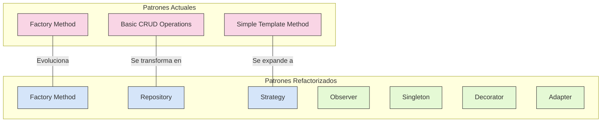

### Tabla Comparativa de Patrones de Diseño

| **Patrón** | **Implementación Actual** | **Implementación Refactorizada** | **Mejora** |
|------------|---------------------------|----------------------------------|------------|
| **Factory Method** | `PanelFactory` crea interfaces de usuario | Implementado tanto en frontend para crear componentes como en backend para crear servicios | Uso más sofisticado en ambas capas, permitiendo extensibilidad |
| **Repository** | No implementado claramente, operaciones CRUD básicas | Interfaces de repositorio para cada entidad con implementaciones concretas | Abstracción del acceso a datos, facilitando cambios en la fuente de datos y pruebas unitarias |
| **Strategy** | No implementado | Estrategias para diferentes lógicas de negocio (descuentos, pagos, etc.) | Flexibilidad para cambiar algoritmos en tiempo de ejecución |
| **Observer** | No implementado | En frontend para reaccionar a cambios de estado y en backend para eventos del sistema | Comunicación desacoplada entre componentes |
| **Singleton** | No implementado | Gestión de estado global en frontend y servicios compartidos en backend | Garantiza una única instancia para recursos compartidos |
| **Decorator** | No implementado | Añade funcionalidades como logging, caché o validación a los casos de uso | Extensión de comportamiento sin modificar clases existentes |
| **Adapter** | No implementado | Adaptar servicios externos (como API de delivery) a la interfaz del sistema | Integración con sistemas externos sin modificar código existente |

### Evolución de Implementaciones

1. **De Simple CRUD a Repository Pattern**:
   * **Antes**: Operaciones CRUD directamente en clases como `ClienteCRUD`
   * **Después**: Interfaces de repositorio (`IClienteRepository`) con implementaciones concretas

2. **De Panels a Components con Hooks**:
   * **Antes**: Paneles grandes con múltiples responsabilidades
   * **Después**: Componentes pequeños y reutilizables con hooks para lógica compartida

3. **De Acceso Directo a Datos a Services**:
   * **Antes**: Los paneles acceden directamente a las operaciones CRUD
   * **Después**: Capa de servicio intermedia que encapsula la lógica de negocio

4. **De Custom Widget a Componentes React**:
   * **Antes**: Widgets customizados de Tkinter
   * **Después**: Componentes React reutilizables y con estado propio
